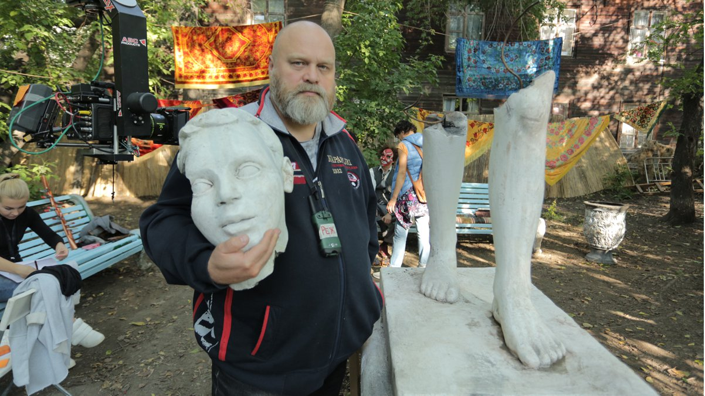

# «Всем творчеством Зощенко кричал: "Я свой!" А он не свой». Интервью с Алексеем Федорченко, режиссером фильма «Последняя "Милая Болгария"» — одной из лучших картин ММКФ

- **URL:** https://novayagazeta.ru/articles/2021/04/23/vsem-tvorchestvom-zoshchenko-krichal-ia-svoi-a-on-ne-svoi
- **Дата:** 2021-04-23
- **Автор:** Лариса Малюкова

## «Всем творчеством Зощенко кричал: "Я свой!" А он не свой»

## Интервью с Алексеем Федорченко, режиссером фильма «Последняя "Милая Болгария"» — одной из лучших картин ММКФ

Алексей Федорченко. Фото со съемок фильма «Последняя "Милая Болгария"»Одна из лучших на ММКФ картин — уникальная работа лауреата Венецианского фестиваля Алексея Федорченко. «Последняя "Милая Болгария"» — стимпанковое кино, соединившее романтику и хулиганство, историю и фантазию. К просмотру и пересмотру рекомендуется.О чем фильмПоэтическая вариация на тему обруганной и распятой повести Михаила Зощенко «Перед восходом солнца» задумана режиссером почти 30 лет назад. Помимо мотивов самой книги, в которой воспоминания становятся психологическим тренингом, авторы включают в нее оригинальную историю своего героя. Это селекционер Леонид Ец. Он должен вырастить и сберечь выведенный его отцом редчайший сорт яблок «Милая Болгария». Живет плодовод в комнате пропавшего писателя Семена Курочкина (один из псевдонимов Зощенко), оставившего на крючке плащ и шляпу — вещественные доказательства существования. Ец расследует его исчезновение, перечитывая оставленные тетради, в которых разум пытается победить страдания, старость, смерть, отыскать способ быть счастливым. Долг жизни писателя Курочкина — с помощью науки осмыслить то, что с ним происходит, и тем самым не только облегчить собственные страдания, но и помочь другим.Кадр из фильма Алексея Федорченко «Последняя "Милая Болгария"»В этом калейдоскопе событий cмыкаются фобии и реальные трагедии, самоубийство молодого сверстника, несчастная любовь, газовая атака, жертвы войны, тайна гибели отца… Проблески Серебряного века сквозь солнечные дни яблочного города Алма-Ата образца 1942 года.

Режиссер не боится театральности и декоративности. Легкие тюлевые полотна мечутся по зеленой траве, яблоневый цвет пьет сок новой жизни из старинной пробирки, по рынку идет верблюд, под окнами дома эвакуированных из столиц деятелей культуры замерла гипсовая скульптура, жизни которой угрожают опыты местных мальчишек. На полиэкране Маяковский остервенело трет руки, а Есенин впадает в высокоградусную меланхолию. Меланхолия — ключевое слово и настроение. Словно летящий Сатурн — звезда меланхоликов — сорвалась с гравюры Дюрера — и вогнала тело Земли в смертную тоску. И вывести из этой тоски не способны ни съемки будущего шедевра «Иван Грозный», ни театр марионеток, ни ностальгия «Грез» Шумана, воплотившаяся в образах юных дев Катеньки и Наденьки (одна уедет в Париж, другая останется жить в коммуналке с плешивым сморчком).

Федорченко экспериментирует с изображением, полиэкраном, в которых вселяются видения-сновидения. По киностудии бродят рыцари и дамы, немцы и матросики. Известный режиссер в костюме королевы Елизаветы (как Михаил Ромм на кинопробах у Эйзенштейна). Известная царевна в гробу с папироской (как Людмила Целиковская в перерыве между съемками). Из камышовых циновок строят декорации «Ивана Грозного». Все временно, ненадежно. Как сама жизнь. Экзальтированный режиссер с вздыбленным вихрем на голове (Эйзенштейн) репетирует сцену с Грозным. Требуя: «Выше! Выше голову!» Пока на стене не начинает плясать тень зловещего профиля с козлиной бородой. А вокруг хоровод из цитат любимого Эйзенштейном Басе, эротических рисунков режиссера, мексиканских эпизодов… Что остается людям? Только зернышки уцелевшего яблока. И тень дождя на стене комнаты стертого из жизни писателя.

«Последняя "Милая Болгария"» —поэма-витраж, собранная коллекционером и селекционером Федорченко из осколков исчезнувшей страны.

— Как ты решился снимать кино по мотивам этой сложнейшей книги?

— Я задумался об экранизации лет тридцать назад. И удивлялся, отчего никто из кинематографистов не занялся ее постановкой, видимо, пугала ее научность. Подступался несколько раз. Искал форму: как собрать все в одном фильме. Лишь несколько лет назад, когда мы с Лидой Канашовой придумали разделение героя на двух персонажей, все сложилось. Ец ведет расследование, анализирует найденный дневник в коленкоровых тетрадках. Зощенко забрал их с собой в эвакуацию.

— Известно, что он срывал их обложки, чтобы уменьшить вес. В кино эти тетрадки в алма-атинской ссылке хранятся в печке.

— Меня притягивал сгущенный мир Алма-Аты 1942 года. С одной стороны, идет война, с другой — киношники, режиссеры-лауреаты, ведь эвакуированы ведущие киностудии страны.

— В одном пространстве Эйзенштейн, Ромм, Васильевы, Трауберг…

— 80 процентов фильмов в те времена созданы в Алма-Ате. Фабрика грез в бандитском городе. Воры, криминальные авторитеты бежали на юг: в Ташкент, в Алма-Ату. Мне понравился этот киношный город яблок. Идея обрела плоть.

Со съемок фильма «Последняя "Милая Болгария"»— «Перед восходом солнца» — книга, равная жизни, и, по сути, стоившая автору жизни. Личная, почти интимная история и в то же время научный трактат, антропологическое, психологическое исследование, которое, кажется, невозможно перенести на экран. Но ты придумал какую-то жанровую эквилибристику.

— Я не специально. Получилось расследование или исследование чертогов мозга, психоаналитический детектив. Не знаю, бывает ли такой жанр.

— С высокой степенью театральности.

— Я бы сказал, декоративности. Все сложилось, когда прочитал воспоминания Эйзенштейна. Оказывается, декорации для «Ивана Грозного» строились из циновок камыша. И образ фильма сложился. Мне не хотелось снимать кино в Питере или Полтаве, буквально-вещественно воспроизводить «как это было». У нас это воспоминания не самого Зощенко, а воспроизведенные через призму воображения второго героя. А он мог представить себе что угодно. И раз уж мы оказались в камышовом мире из декораций «Ивана Грозного»,

я решил, что и мир Зощенко можно создать в этом стиле. И мы купили весь урожай камыша в России в том году.

— Кажется весь мир — легковоспламеняющиеся осоковые декорации. В окружении горящей войны. Острое ощущение шаткости жизни. Таких символов в фильме множество. Один из главных — яблоко, плод добра и зла, и познания, разумеется. Селекционер хочет сохранить редчайший сорт яблок «Маленькая Болгария». На казахском «Алма» — «яблоко», «Ата» — «Отец». И тотальное ощущение хрупкости передается в страхе за эти яблочные зернышки, из которых может пробиться новая жизнь. Откуда сквозная история с саженцами?

— Всю историю Алма-Аты мы придумали, хотя предварительно много читали про жизнь и быт военной киностолицы СССР. Так сочинился отец героя, плодовод, появлялись другие персонажи, втаскивая в сюжет друг друга.

— Ты же дотошный коллекционер: собираешь редкие книги, вещицы, картинки. Наверное, и фильм строился по крупицам?

— Каждый фильм, который делаем, предваряется большой изыскательской работой, историческим поиском. Мы читали много дневников, воспоминаний знаменитых и малоизвестных людей, живших во времена Зощенко. В какой-то момент возникло ощущение, что все они написаны одним человеком.

И Эйзенштейн, и Прокофьев, и Зощенко, и вся творческая интеллигенция были погружены в депрессию, состояние меланхолии. Такое время душевного упадка.

Со съемок фильма «Последняя "Милая Болгария"»— Но это состояние душевного кризиса, непреходящее ощущение тревоги связано не только с войной.

— Ну да, это было и до войны, и после войны. Меланхолией проникнуты все воспоминания. Поэтому мы соединили текст Зощенко с фрагментами из дневников, например, Эйзенштейна. Весь этот сюр съемочной площадки произведен практически дословно.

— Я тоже вспомнила сюжет на съемках «Грозного», когда Эйзенштейн заставляет Черкасова выше задирать голову, чтобы на стене ожила паучья тень со зловещей клинообразной бородой. Это увлечение режиссера тенями «разоблачил» и Жданов на проработке Эйзенштейна у Сталина.

— У нас в кадре диалог дословный. И возмущение актера: «Я не саксаул! Я не могу находиться в таком состоянии!» Или когда наш герой — писатель Семен Курочкин — в истерике заливается хохотом, увидев мертвую маму с монетами на глазах. «Она в очках!» Это история Эйзенштейна. Но когда человек вспоминает, даже самый честный невольно что-то скрывает о себе. В дневниках он — другой. Хотелось посмотреть на героя объемно. Увидеть его не только таким светлым, как в книге. Увидеть глазами близких. Сцена, где жена дарит ему абрикосовое варенье, а он ведет себя деспотично — из воспоминаний жены Зощенко. Вот и возникает вдруг несколько утрированный критический взгляд снаружи.

Поддержите нашу работу!

1000 500 300 Нажимая кнопку «Стать соучастником», я принимаю условия и подтверждаю свое гражданство РФ

Если у вас есть вопросы, пишите [email protected] или звоните:+7 (929) 612-03-68

— Книга сама, как сеанс психоанализа. И фильм — не только трагифарсовая история персонажей, но и сеанс психоанализа со зрителем.

— Это же не экранизация. Мы же знаем, что с Зощенко произошло после издания первых глав. Может, ты и права, потому что неожиданно время нас догнало. Кажется, что вокруг начинают происходить те же события, те же кампании,

многое становится похожим на то, что происходило в стране 70 лет назад. Имею в виду и состояние мозгов интеллигенции, ощущение общей депрессии.

Алексея Федорченко на съемках фильма «Последняя "Милая Болгария"»— В России вообще «вперед» — «назад» очень условные понятия. Но что возможно делать в ситуации этого неостанавливаемого кружения? Фиксировать его?

— В игровом кино я никогда не занимался фиксацией происходящего. Должно проходить какое-то время, чтобы можно было оценить события. Даже мой док «Кино эпохи перемен», криминальную комедию-реквием о судьбе Свердловской киностудии, я снимал спустя 20 лет после ее клинической смерти, чтобы оценить масштаб утраты. И как ни странно, фильм послужил ментальным толчком. Минкульт занялся киностудией, сменили директора, есть шанс, что она выйдет из комы.

— У меня ощущение, что «Последняя "Милая Болгария"», рассказывающая о событиях сороковых, будто про сегодня. Да и архитектура ретрофильма очень современная.

— Рад, что так вышло… непреднамеренно.

— По сути, Зощенко создавал трактат о счастье, пытался научиться управлять собой, научить других быть счастливыми. А в итоге книга оказалась приговором, не подлежащим обжалованию, причиной его трагического одиночества.

— Это все меня и притягивало. Вывод, к которому пришел Зощенко, — он полагал, что нашел причину своей меланхолии, безрадостного состояния — был ошибочным. Он понял это, когда книга вышла, начались гонения, его просто стирали из литературы, из реальности.

— Под ошибочным выводом что именно ты имеешь в виду?

— Он же хотел влиться вот в это все. Думал, что размышления о революции, о России окажутся востребованными. Описывая старый мир, хотел от него избавиться. Всем творчеством кричал: «Я свой!» А он не свой. Офицер Первой мировой с пятью орденами изначально был чужим для этой страны.

— Но он же был уверен, что писал антифашистскую книгу, и она действительно антифашистская. Если фашизм, подпитанный страхом, — поражение в борьбе со зверством, то наука и сосредоточенность на индивидуальных переживаниях человека полны надеждой на будущее.

— Он думал, что честным разговором с самим собой, подробным внутренним разбором можно и с фашизмом побороться. Он же вроде бы нашел «ключи счастья», а оказалось дело в другом.

— Почему, по-твоему, годами мучительно уничтожали книгу, грубо обвиняли и оскорбляли писателя, именуя«пошляком и подонком литературы»? В чем причина этой злобной ненависти дирижера многолетней травли — Сталина?

— Они же назвали причину ненависти — «гнилая безыдейность», то есть, концентрация на личном.

Государство создавало муравейник, единство общности, и любое отклонение, зона интимного воспринимались как атака на государственность, на вертикаль власти. Да ничего особенно не меняется.

Любое размышление, анализ взаимодействия человека и действительности воспринимаются как фронда, как попытка разрушить единство. Единство, однородность — то, что необходимо государству.

Кадр из фильма Алексея Федорченко «Последняя "Милая Болгария"»— Когда ты сказал про муравейник, я вспомнила эпизод, в котором муравьи растаскивают зернышки единственного раритетного сорта яблок. Большая часть действия рассыпана на фрагментах полиэкрана. Ты играешь с изображением, какие-то экраны переворачиваешь вверх тормашками, возникает контрапункт. Почему выбрал такую визуальную форму?

— Я попытался увидеть, как думает человек. Он может параллельно думать о разных вещах. Как проникнуть в тайны мозга другого? Полиэкран используют нередко в кино, но в таком виде, кажется, нет. С его помощью можно показать многовариантность психоаналитических размышлений о человеке. Мы снимали с нескольких камер сразу. Каждый экран — это самостоятельное изображение, отдельные дубли. Иногда действие в главном экране отличается от добавочных экранов. Хотелось показать, что человек не фотографически воспроизводит/восстанавливает в памяти информацию. Каждый раз другое представление о событии. История — все-таки субъективное восприятие прошлого, поэтому может быть разной.

— Иногда экраны спорят друг с другом, давая возможность толкования снов и воспоминаний, интерпретаций текстов Зощенко. «Разум побеждает смерть», «разум побеждает старость»… Вы задаетесь вопросом, насколько ошибочны доводы и вывод писателя?

— Зощенко был адептом Павлова, буквально воспринимал его учение, хотя и фрейдизму отдавал должное. Он преклонялся перед наукой. Его попыткам загнать свой разум в рамки научной теории, понять его посвящены повести, трилогии «Возвращенная молодость», «Голубая книга», «Перед восходом солнца». Но мир показал, что он сложнее и мрачнее самых тревожных догадок. То, что произошло с ним после публикации, сломало его теории. Но это не значит, что он или Павлов были не правы. Мне кажется, начинать надо с научных изысканий, но предполагать, что возможна бесконечная многовариантность развития событий.

— Почему ты переименовал фильм и первоначальное название повести «Ключи счастья» превратилось в «Последнюю «Милую Болгарию»?

— Это же не лобовая экранизация повести, а размышление на тему. Не хотелось пригвождать к повести фильм привычным названием. Этим я говорю, что это другое произведение. Оригинальная история внутри картины — это история сохранения живого ростка. И финал фильма дает надежду, а в истории Зощенко надежды нет.

Кадр из фильма Алексея Федорченко «Последняя "Милая Болгария"»— Социальная депрессия вместе со страхом снова разлиты в воздухе. Как быть: что снимать, что сажать…

— Снимать, сажать. Заниматься своим делом, стараться.

У меня не случалось, что мне кто-то запрещал, заставлял делать то, что не хочу.

— Может быть, потому что ты работаешь в поле иносказания, не впрямую называя вещи и проблемы, используя образы, аллегории, метафоры.

— Я же кино занимаюсь. Такая профессия. Это не репортаж. Не боюсь символизма — в моих фильмах много аллегорий. Нет желания снимать острую публицистику. Мне кажется, что реальности и так много. Надо анализировать, рефлексировать. Чем и стараюсь заниматься. К тому же, кроме кино, есть и множество других дел.

— Кстати, у Зощенко было с десяток профессий. Ты тоже разносторонняя личность.

— Если считать мои профессии, их не меньше, чем у Зощенко. Одних рабочих специальностей штук десять. Я был и токарем-фрезеровщиком, и машинистом бетономешалки, и кровельщиком… Сейчас днем я снимаю, вечер занят собиранием книг репрессированных авторов. Их надо классифицировать, систематизировать. Ночь — для литературы. Мы с моим соавтором Лидой Канашовой, анализируя книги, пытаемся осмыслять судьбы людей, которые пришли из этих книг. Каждая из них могла бы стать самостоятельным сценарием. В основном это жертвы сталинских репрессий, но есть и послесталинские. Есть уникальные книги, которых не найти и в Ленинской библиотеке.

— Ты не думал о создании музея книг?

— Я боюсь музея книг.

Когда держу в руках одну книгу, знаю историю автора, что с ним произошло — мороз по коже. Когда таких книг десять — это полка исторического материала, 50 шкафов — уже статистика. И это чудовищно.

Когда коммунисты вопят: «Да у вас там не 7 миллионов расстреляли, а всего лишь два!» Они считают нули, а не человеческие уникальные жизни, неизлечимые раны близких! Статистика обесточивает боль, ужас от мучений и преступлений. Должен быть музей одной книги. Или музей современный по технологии: каждый день — новая книга, биография, судьба. Но не полка же.

— Желаю, чтобы твоя коллекция репрессированных авторов не прирастала современными изданиями.

Поддержите нашу работу!

1000 500 300 Нажимая кнопку «Стать соучастником», я принимаю условия и подтверждаю свое гражданство РФ

Если у вас есть вопросы, пишите [email protected] или звоните:+7 (929) 612-03-68
