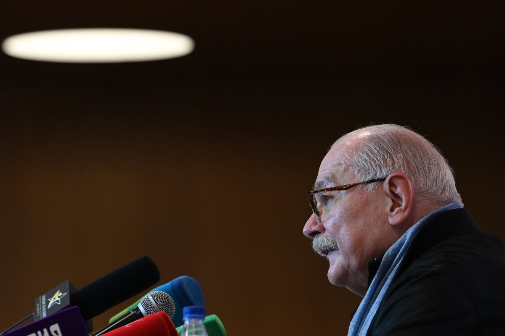

# Герои, геи и воины. Репертуар Московского кинофестиваля разнообразится скандалами, хотя и без них достаточно любопытного

- **URL:** https://novayagazeta.ru/articles/2021/04/24/geroi-gei-i-voiny
- **Дата:** 2021-04-24
- **Автор:** Лариса Малюкова

## Герои, геи и воины

## Репертуар Московского кинофестиваля разнообразится скандалами, хотя и без них достаточно любопытного

Никита Михалков. Фото: РИА НовостиВ отличие от других больших международных фестивалей, которые отменяются или проводятся в онлайн-режиме, Московский чувствует себя неплохо. И финансирование стабильное. И фестиваль набирает обороты. При ограничениях в рассадке идут показы в разных кинотеатрах. И в разнообразных секциях много всего любопытного даже на самый предвзятый вкус.

Однако сначала главное внимание привлек осмотрительный президент фестиваля.

На традиционный брифинг с Никитой Михалковым пускали столь же строго, как на встречу с Путиным.

Журналисты должны были предъявить фото/скан сертификата о прохождении вакцинации от COVID-19, либо результаты теста на антитела, либо отрицательные результаты ПЦР-теста на коронавирус. Подобных мер не видело ни одно мероприятие ни в Минкульте, ни в Фонде кино.

И все-таки ковид оставил свой след на фестивале. Глава жюри, филиппинский режиссер Брийанте Мендоса, в Москву приехать не смог — у него обнаружили коронавирус. Мендоса смотрит кино и обсуждает его дистанционно.

А 23 апреля внимание к киносмотру подогрел скандал. Организаторы фестиваля внезапно убрали из секции короткого метра (в показах российской программы) фильм Севы Галкина «Фанаты». 25-минутная лента основана на реальных событиях и рассказывает о скинхедах, убивавших геев. За сутки до премьеры представители фестиваля сообщили режиссеру, что показа не будет.

Судя по всему, причиной запрета картины оказалось само «место действия». Российские программы показываются в Доме кино — штаб-квартире Союза кинематографистов, руководимом Никитой Михалковым. И в этих святых стенах следует показывать кино исключительно благонравное, соответствующее традиционным ценностям.

Кадр из фильма «Фанаты»Фестиваль был вынужден снять фильм с показа и извиниться перед режиссером. В общем, как поется в «Антиформалистическом райке»: «Смотри туда, смотри сюда и выкорчевывай врага!»

Поддержите нашу работу!

1000 500 300 Нажимая кнопку «Стать соучастником», я принимаю условия и подтверждаю свое гражданство РФ

Если у вас есть вопросы, пишите [email protected] или звоните:+7 (929) 612-03-68

А начиналось все интересно и мирно. Открыл фестиваль «Девятаев» Тимура Бекмамбетова и Сергея Трофимова. Фильм основан на реальной истории летчика-истребителя, Героя Советского Союза Михаила Девятаева.

В июле 1944-го Девятаев (Павел Прилучный), сбивший в воздушном бою на 1-м Украинском фронте несколько вражеских самолетов, оказывается подбитым, попадает в немецкий плен. Отстреливается до последнего патрона… Приходит в себя на фашистской авиабазе, где завербованных пленных летчиков обучает казанский друг и однокашник Девятаева Коля Ларин (Павел Чинарев). Но Девятаев не предаст Родину и любимый город Казань, даже несмотря на нечеловеческий приказ № 270, объявивший всех сдавшихся в плен изменниками Родины. Девятаев будет думать только об одном — о побеге. Дерзкий побег с секретной нацистской базы на острове Узедом, угон самолета с важнейшими документами об оружии, разработку которого Третий рейх хранил в такой тайне, что даже увидеть их непосвященным — из области фантастики. Сама эта легендарная история просто предназначена для экранизации.

«Девятаев» — блокбастер, ловко скроенный по голливудским лекалам и российским законам нового времени. Бекмамбетов — умный режиссер и профи высшего сорта. Его кино пытается соответствовать сразу многим задачам, и многое удается.

Во-первых, героика. «Девятаев» воспевает подвиг, не впадая в безудержный ура-патриотизм, которым преисполнено российское «военное кино» (ни разу, к примеру, не прозвучит имя Сталина). А ностальгические воспоминания героя о казанском первомайском параде с красными стягами, хоровым пением в автобусе — лишь дань времени.

Во-вторых, авторы стараются, насколько это возможно в игровом кино, следовать реальным событиям, описанным в мемуарах летчика. Консультантом фильма стал сын Девятаева.

В-третьих, авторы опираются в стилистике и даже в цитатах на военную киноклассику: «Истребители» и «Два бойца» с Марком Бернесом, «Чкалов» (в фильме есть даже знаменитый пролет под мостом). А эмоциональным и смысловым лейтмотивом становится задушевная песня Богословского «Любимый город может спать спокойно».

Но это, так сказать, для пап, мам и киночиновников. А для молодого поколения приготовлен воздушный аттракцион: сцены боев воссозданы с помощью технологии видеоигр, виртуальной реальности и игрового движка боевого онлайн-симулятора War Thunder. Зритель вместе с Девятаевым оказывается в тесной кабине, и его начинает кружить, трясти, он падает, взлетает, едва уворачивается от пулеметных очередей. И последней виньеткой, нарядно связывающей геройскую лирику прошлого с настоящим, становится кавер песни о любимом городе в исполнении лидера Rammstein Линдеманна.

Судя по всему, расчет Бекмамбетова оправдается: фильм будут смотреть и на экране, и по телику.

Хотя, как это часто случается в нашем кино, сценарий с нестыковками вызывает множество вопросов. Или, к примеру, темпоритм. История то мчится бешеной скороговоркой, то засыпает на ходу (за исключением самого побега — здесь умопомрачительный драйв и сопереживание). Про Девятаева и его сподвижников по безумному полету на свободу мы практически ничего не узнаем. Центральным конфликтом окажется история нежных взаимоотношений «двух бойцов»: героя Девятаева и предателя Ларина. Более чем братских. Более чем дружеских. Любовь-ненависть-ревность. В любовном треугольнике должен быть третий — любимый город, который «другу улыбнется», и пока вчерашние друзья воюют, он будет ждать и «видеть сны, и зеленеть среди весны».

Отрезавший себе путь домой Ларин готов идти на таран против несдающегося товарища, уводящего бесценный бомбардировщик. В какой-то момент кажется, что это битва героя с самим собой, это его трудный выбор: уйти или вернуться. Но все это дано таким пунктиром, что зритель волен додумывать сюжетные намеки/загадки. В синей дымке тает и будущее героя Девятаева. Впроброс говорится, что 12 лет он ходил на допросы… А фильм, как и положено, заканчивается праздником, салютом Победы.

Очень хороши оба актера. И Чинарев, и особенно Прилучный.

Говорят, для этой роли он похудел почти на 12 кг. Впрочем, остался довольно упитанным для узника концлагеря юношей (в реальности в момент побега Девятаев весил 36 кг). Трудно поверить, что этот экранный крепыш не в силах потянуть на себя руль Хенкеля. Для открытия фестиваля, некогда провозглашавшего гуманизм и дружбу между народами, выбор военной картины — не самое очевидное решение. Но какие времена, такие и «открытия».

…В конкурсе документального кино — захватывающий триллер о человеке-легенде: создателе сайтов «ВКонтакте» и Telegram. «Дуров» Родиона Чепеля — история визионера, лидера нового поколения, попытавшегося существовать отдельно от государства. Героя, который, как Годо, так и не появится в кадре — только в хронике. Вымышленный и реальный, объемный, вовсе не идеальный портрет, созданный с разных точек зрения — ближним кругом и оппонентами. Талант? Несомненно. Но еще бешеные амбиции, спортивный азарт, увлеченность бизнесом. И редкая способность держать удар, с какой бы стороны он ни прилетал. И невозможное сегодня — мощь «одного в поле воина». А еще такое искреннее, почти детское желание увернуться от политики. Но политика сама придет к нему в дом с обыском. У нас не может быть отдельных от государства воинов. Это биография человека, который обещал и действительно пытался охранять нашу приватность, но сумел отстоять только свою.

### P.S.

Поддержите нашу работу!

1000 500 300 Нажимая кнопку «Стать соучастником», я принимаю условия и подтверждаю свое гражданство РФ

Если у вас есть вопросы, пишите [email protected] или звоните:+7 (929) 612-03-68
