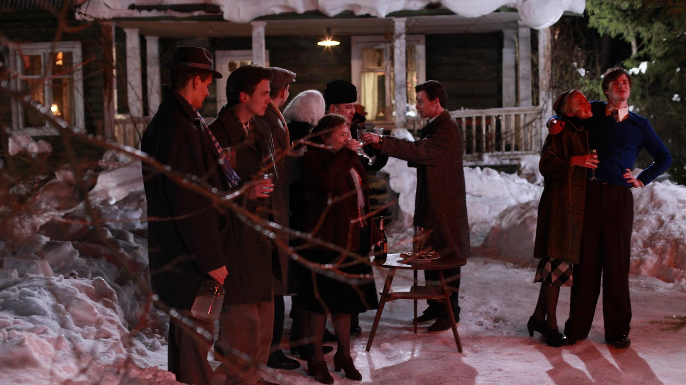

# Откуда берется вольница? Премия «Ника» за лучший игровой фильм вручена Андрею Смирнову за фильм «Француз»

- **URL:** https://novayagazeta.ru/articles/2021/04/25/otkuda-beretsia-volnitsa
- **Дата:** 2021-04-25
- **Автор:** Лариса Малюкова

## Откуда берется вольница?

## Премия «Ника» за лучший игровой фильм вручена Андрею Смирнову за фильм «Француз»

Кадр из фильмаКартина про конец 50-х — самое актуальное высказывание о нашей сегодняшней реальности с кипящими от негодования улицами и шеренгами полицейских в бронежилетах. Откуда берутся люди с необузданной внутренней свободой среди заасфальтированной действительности — один из важнейших вопросов фильма.Фильм. «Француз» — темпераментное, честное художественное высказывание о стране, ее людях, ее травмах. Москва конца 50-х.

В Москву приезжает выпускник французского университета Ecole normale Пьер Дюран (Антон Риваль). Он будет стажироваться в МГУ, изучать творчество Петипа в Большом театре, но прежде всего — отыскивать следы исчезнувшего репрессированного родственника своей русской матери-эмигрантки. А еще — потеряет голову от любви. Что скажешь: настоящий француз. Так начинается одиссея Пьера по дорогам незнакомой родной страны. Встречи с соотечественниками, в той или иной степени закабаленными системой.

Это не ретрокино. Режиссер и оператор Юрий Шайгарданов рассматривают дальнее время, будто оно никуда не утекло. Приоткрыли дверь, и вот она — робко расцветающая и тут же подмерзающая оттепель. Короткий вдох свободы. Только что прошел ХХ съезд, и обухом по голове — венгерские события. Здесь нет любования эпохой, хотя Смирнов знает-чувствует ее кожей, подмечает сотню неслучайных подробностей. Авторы стягивают, прессуют историю ХХ века в один 1957 год, когда состоялся масштабный «праздник непослушания» — фестиваль молодежи и студентов. …И уже возвращаются из ссылки политзаключенные. …И уже подавлено с помощью советских танков восстание в Венгрии.

«Француз» — кинороман про короткий вдох свободы в несвободной стране. Про роскошь думать и говорить правду даже тогда, когда она опасна для жизни. Про поколение, поверившее в утопию и заплатившее за это.

Режиссер. Андрей Смирнов на протяжении многих лет пишет пейзаж русского ХХ века. Снимает «Белорусский вокзал» — о поколении, травмированном войной, не прижившемся в мире, ставшем чужим. Погружается во тьму самоистребления, которой предался народ, вступивший в темные воды гражданской войны в «Ангеле». Размышляет о трагической судьбе крестьянства в эпосе «Жила-была одна баба». О чем бы он ни снимал — в его фильмах, помимо горечи, всегда есть любовь к России… Любовь как синоним боли.

Режиссер Андрей Смирнов (справа). Фото предоставлено съемочной группой**Андрей Смирнов.** _Толчком к написанию сценария послужила история французских славистов, приехавших в конце 50-х в Москву. Первыми были Мишель Окутюрье, замечательный историк, знаток русской литературы, недавно умерший, и Луи Мартинес, который перевел «Евгения Онегина». Французы начали стажировку в МГУ после молодежного фестиваля. Среди них был Жорж Нива, собиравшийся жениться на Ирине Емельяновой, дочери Ольги Ивинской. Его скрутили, выслали из России, и с горя он пошел добровольцем воевать в Алжир, после тяжелого ранения чудом остался жив. Люди выдающиеся. Я расспрашивал их, как они здесь жили. В фильме есть рассказанные ими подробности. Например, француз в студенческом общежитии вырывает из стены неумолкающий динамик, за которым пряталась подслушка. Это сделал Луи Мартинес — скандал был чудовищный. Или заметка в стенгазете про «свинское поведение» французов. Я нашел ее в архиве университета. И все же прежде всего мой фильм о становлении поколения шестидесятников, в которое я влился на правах младшего._ _Они не могли выиграть, потому что инструментов воздействия на массовую аудиторию у них не было. Хотя была надежда в начале 90-х. Помню, я в Америке в гостинице переключаю каналы и с невероятной радостью думаю: «А наше телевидение сегодня лучше». Во времена «Взгляда», «Рингов» наше телевидение было самым свободным в мире. Эти 20 лет в жизни моего поколения — ощущение свободы, огромных возможностей. И все это ушло._Читайте также

Андрей Смирнов: «В национальном масштабе побеждает победобесие»

Знаменитый режиссер — о юбилее фильма «Белорусский вокзал», войне, исторической памяти и времени

Герои. СССР конца 50-х похож на слоеный пирог империи. Сосуществование разных стран, строев, эпох. Еще живы обломки царской империи. Мы видим «бывших» в щедрых, маслом выписанных портретах аристократок старух Обрезковых, испивших в ГУЛАГе всю полноту страданий (Наталья Тенякова и Нина Дробышева). Не спешит разрушаться сталинская модель социализма. Ее представитель — лоснящийся от самодовольства сановный «совпис» Николай Кузьмич, живущий в высотке с подлинниками Айвазовского и Шишкина, прислугой и водкой в графинчике (Роман Мадянов). Есть и гэбэшник со стертым лицом (Сергей Уманов). И темпераментный отщепенец, сын попа — ныне преподаватель марксизма-ленинизма (Михаил Ефремов).

А совсем рядом запрещенный, бурлящий мир, выплескивающийся из закупоренной бутылки тоталитаризма, бьющий через край железного занавеса. Яркий, наглый, новый. С любовью к умопомрачительному Чарли Паркеру, Хемингуэю и блюзу «Сен-Луи» — любимой песенке стиляг. С поэзией Чудакова и Бродского, с подпольными выставками, с ветром свободы… из форточки. Как и нынешние студенты, айтишники, художники, они хотели заниматься любимым делом, не собирались идти в политику, их просто вынуждали.

Заглянет Пьер и в колодец архипелага ГУЛАГ. Увидит людей, по которым, ломая ребра, катком прокатился Молох. Раздавленных, потерявших близких и самих себя, и… сохранивших достоинство. Смирнову удалось уговорить сняться в роли завхоза Дома культуры Веру Лашкову, ту самую Веру, которая перепечатывала «Синтаксис», «Белую книгу» (материалы дела Синявского и Даниэля), год провела в Лефортово. И все эти России соединяются в сложноподчиненную страну.

Поддержите нашу работу!

1000 500 300 Нажимая кнопку «Стать соучастником», я принимаю условия и подтверждаю свое гражданство РФ

Если у вас есть вопросы, пишите [email protected] или звоните:+7 (929) 612-03-68

В фильме 180 персонажей. Среди них — молодые врачи, студенты МГУ, консерватории, ВГИКа, для которых первые глотки свободы, даже под надзором бдительных органов, были равны возможности дышать, чувствовать, жить. Бесчинно упиваться джазом, который уже не запрещен, но еще не разрешен. Пить за здоровье нонконформиста Оскара (его прототип — Оскар Рабин, который благословил картину, но, увы, не дожил до ее премьеры) на его выставке в бараке. Вместо героизма метростроевцев Оскар прославляет «водку и селедку», работая электриком на железной дороге. Рядом с Пьером — балерина Большого Кира (ее сыграла балерина Евгения Образцова) и фотокорреспондент Валера (Евгений Ткачук), на свой страх и риск распространяющий самиздатовский альманах «Грамотей». Так в фильме называется «Синтаксис», который издавал Александр Гинзбург.

Кадр из фильмаКартина завершается посвящением Александру Гинзбургу, составителю самиздатского альманаха «Синтаксис».

Читайте также

«Француз» Смирнова и «Дорогие товарищи!» Кончаловского получили премию «Ника» за лучшие игровые фильмы

«Синтаксис». Самиздатский машинописный поэтический альманах, выпускавшийся в 1959–1960 гг. Александром Гинзбургом. Первый получивший широкую известность издательский литературный проект, ориентированный непосредственно и исключительно на самиздат. Всего вышло три номера «Синтаксиса», готовился четвертый. Тираж достигал 300 экз. Альманах состоял почти исключительно из стихов московских (№№ 1, 2) и ленинградских (№ 3) поэтов, публикация которых встречала препятствия со стороны цензуры. Каждый номер «Синтаксиса» включал десять поэтов, каждый поэт был представлен пятью стихотворениями. Среди авторов: А. Аронов, Б. Ахмадулина, Д. Бобышев, И. Бродский, Н. Глазков, А. Кушнер, Б. Окуджава, Е. Рейн, Г. Сапгир, В. Уфлянд, И. Холин, С. Чудаков. Альтернативность «Синтаксиса» как подцензурным, так и «подпольным» способам публикации литературных текстов усиливалась демонстративной открытостью издания: на титульном листе указывались не только имя, но даже адрес составителя. Номер выпуска, также проставленный на обложке, указывал на периодический характер издания. После «Синтаксиса» самиздат начал восприниматься не только как продолжение старой российской традиции хождения запретной литературы в списках, но еще и как независимый общественный институт. Выпуск «Синтаксиса» прекратился после ареста издателя летом 1960 года…

Поддержите нашу работу!

1000 500 300 Нажимая кнопку «Стать соучастником», я принимаю условия и подтверждаю свое гражданство РФ

Если у вас есть вопросы, пишите [email protected] или звоните:+7 (929) 612-03-68
