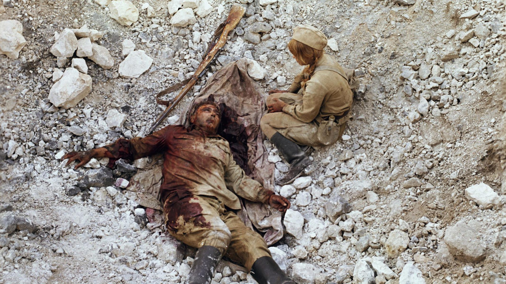

# Больше, чем люди. Мы решили вспомнить, как наше кино рассказывало о врачевателях, служивших и погибавших на равных с бойцами Великой Отечественной

- **URL:** https://novayagazeta.ru/articles/2021/05/09/bolshe-chem-liudi
- **Дата:** 2021-05-09
- **Автор:** Лариса Малюкова

## Больше, чем люди

## Мы решили вспомнить, как наше кино рассказывало о врачевателях, служивших и погибавших на равных с бойцами Великой Отечественной

«Они сражались за Родину». Фото: РИА НовостиПосвящается тем, кто спасает мир и страну от пандемииКартины о медиках начали выходить уже в разгар войны — как созданная в 1942-м «Актриса» Леонида Трауберга. Зоя, опереточная певица, устраивается нянечкой в госпиталь. Потому что «плясать и распевать не время». В фильме с чудесными диалогами (недаром сценарий писали гении Эрдман и Вольпин) есть поразительный эпизод. Артист Михаил Жаров в госпитале читает уморительный монолог для раненых: как ему однажды кровь перелили некоей Клеопатры Ивановны Басеврюк. А донор — гремучая змея, родная тетка Клёпа из Пензы. А слушают Жарова и статисты, и раненые бойцы. В фильме Трауберга искусство и искусство врачевания уравнены в правах как жизненно важное и необходимое человеку. И когда няня Зоя (Галина Сергеева) гладит по голове ослепшего раненого майора (Борис Бабочкин), он чувствует тебя столь же счастливым, как… в оперетте с примадонной Зоей в роли Сильвы.

Чеховская формулировка «Профессия врача — это подвиг, она требует самоотвержения, чистоты души и чистоты помыслов» — в военные годы особенно актуальна. А образ военного медика в кино, в зависимости от климата в обществе, обретает разные значения.

В конце сороковых-пятидесятых, когда фильмы снимали очевидцы и участники войны, медики на экране должны были вернуть боевой дух раненому бойцу. При этом в их характерах непременно промелькивало нечто чеховское. Как в докторе Василии Васильевиче из «Повести о настоящем человеке» Александра Столпера (1948). Рассказывают, что выдающийся актер Алексей Дикий в этой роли точно воспроизвел образ профессора Николая Наумовича Теребинского, реального спасателя Маресьева, одного из пионеров экспериментальных операций на открытом сердце. Хотя в чеховском пенсне, со своими дореволюционными повадками он скорее напоминает Дымова, Дорна или Чебутыкина. Говорит без обиняков, в отличие от прозаических чеховских докторов, предпочитает романтику, в духе времени — возвышенные тона. «Таких, душа моя, как ты, — не обманывают. Резать! Жить надо долго! Назло жить! Безусловно, будешь летать!» Василий Васильевич не просто ставит Маресьева на ноги, но буквально вместе с ним делает первые шаги. Как священник (или парторг) настраивает на жизнь. И в момент душевного апогея — целует его. Как тут не полететь!

В оттепельном кино на экран возвращается сложный образ человека в белом халате, самой профессией призванного принимать самостоятельные решение. Существующий вопреки «мнению» коллектива, милитаризму и тотальной ненависти (о стихотворении Симонова «Убей его» писали, что оно убило больше немцев, чем любой снайпер). Гуманист доктор Устименко Алексея Баталова («Дорогой мой человек» Хейфица) несдержан, совершает ошибки, но верен себе, делу, любви, несмотря на обстоятельства. Гиперболизированная поэтизация героя-доктора компенсируется подчеркнуто реалистичной, почти бытовой игрой Баталова (эта роль была и написана Юрием Германом для актера). Но когда его лицо закрыто марлевой маской, мы видим глаза, которые красноречивей любых слов. Антагонист Устименко — мелкий карьерист Степанов. Блистательный Юрий Медведев играет процветающий ныне тип «успех любой ценой», включая жизнь и здоровье людей. (Кстати, этот конфликт бескомпромиссного доктора и карьериста воспроизвели Хлебников и Мещанинова в недавней «Аритмии».)

«Дорогой мой человек». Фото: РИА НовостиХейфиц, как и многие режиссеры, снимающие «кино про врачей», огромное значение придает деталям. Походный госпиталь, в котором оперирует Устименко, воссоздан с документальной дотошностью. Во время операции пыхтит, словно чайник, неровно вспыхивая, электрический генератор, «усиленный» свечами. В лоток, не глядя, хирург бросает извлеченные пули. Мокрый лоб вытирает о спину медсестры.

Настоящим памятником медикам становятся характеры двух седых подружек, прошедших огонь и воду: военных врачей Ашхен Аганян (Цецилия Мансурова) и Зиночки Бакуниной (Валентина Журавская). Их гибель под бомбой решена с театральным акцентом — Ашхен укрывает подругу плащом, и, обнявшись, они замирают в фотографии на могиле. А слова опытного хирурга Ашхен: «Деточка, мы с вами здесь не имеем права бояться и звать на помощь», — могла бы произнести и фронтовой врач Фаины Раневской в «Александре Матросове», которая своим домашним басистым голосом словно усмиряет беззаконие войны: «Ночью в гости к больным не ходят. Это хулиганство, молодой человек». Рядом на столе лежит ее недописанное письмо мужу.

Потерявшая себя и своего Бориса героиня Татьяны Самойловой («Летят журавли») в госпитале проходит «личную реабилитацию». Делает любую работу: пишет письмо раненого солдата домой, приносит «утки», ставит градусники. Помогая выживать другим, пытается выжить сама. А рядом с ними, днюющими и ночующими в госпитале, с колоритным хирургом Федором Ивановичем (Василий Меркульев) и медсестрой Ириной — вальяжные подлецы, торгующие бронью.

«Дорогой мой человек». Фото: РИА НовостиПоддержите нашу работу!

1000 500 300 Нажимая кнопку «Стать соучастником», я принимаю условия и подтверждаю свое гражданство РФ

Если у вас есть вопросы, пишите [email protected] или звоните:+7 (929) 612-03-68

В «Офицерах» линия доктора Алины Покровской дана вроде бы отдельными разрозненными штрихами, которые срастаются в человеческую историю. Милая, тихая жена «при муже» с неслучайным именем Любовь (фильм вообще задумывался военным начальством как ода жене офицера) превращается в объемный характер сильной женщины. Милосердной — вспомните ее проход по вагонам поезда, забитого ранеными, и неумолимо решительной — сухим приказом она останавливает панику начальника станции: «Грузите вначале тяжелых!»

Они владели материалом. Режиссер «Офицеров» Владимир Роговой — из семьи врачей (папа — терапевт, мама — педиатр, брат — травматолог), писатель и сценарист Борис Васильев в 17 ушел на фронт, был тяжело ранен, врачи Костромского военного госпиталя вернули его к жизни. Поэтому так точны эпизоды в военно-санитарном поезде, озвученные стуком колес и музыкой Блантера в аранжировке Хозака; и неразбериха с погрузкой раненых под бомбежкой; и бухгалтерия войны — списки умерших; горе матери, узнавшей на фото погибшего танкиста — сына.

«Поездами, спасающими жизнь» называли санитарные эшелоны в годы Великой Отечественной. Появились и особенные роуд-муви, истории спасительного ковчега на колесах среди смертоносной войны. У «Спутников» Веры Пановой было две экранизации.

В «Поезде милосердия» Искандера Хамраева возникал микрокосм с противоречивыми отношениями очень разных людей. Доктора и медсестры в этом тесном пространстве действуют не по приказу, не по инструкции, но руководствуясь исключительно законами человечности.

А в четырехсерийной версии «На всю оставшуюся жизнь» тончайшая деликатная режиссура Петра Фоменко словно приближает к нам «нестерпимо близко» героев фильма, главных и эпизодических. Крупный план, отвергающий однозначность характеров, становится ключевым решением. Поэтому в финале мы вместе с теми, кто четыре года трясся в душных кригеровских вагонах, оперировал, грузил, перевязывал, кормил, утешал, терял, учимся дышать в незнакомом мире, который вдруг остановился и замер на станции «Без войны».

В книге была отчетливая мысль — без милосердия не одолеть страдания. Но и страдание, как показывает Фоменко, делает этих людей милосердными. Начальству фильм не понравился, он шел вразрез с известным постановлением ЦК: праздновать День Победы без лишних слез и стонов, жизнерадостно и оптимистично. Совсем как сегодня. А тут «сплошные страдания и жертвенность». Непатриотично.

В недавней военной драме «Битва за Севастополь» Сергея Мокрицкого есть трагикомический персонаж — военврач Борис Чопак (Никита Тарасов). Смешной очкарик, одесский любитель оперы и рыбы-фиш, безответно влюбленный в девушку-снайпера. Маленький человек — не конкурент ее закаленным в боях богатырям-спутникам. Но именно рыжий Борис со своей неуместной интеллигентностью оказывается драматическим центром фильма. Он отдает свой эвакуационный талон, остается в госпитале до последнего больного, остается в расстрельном Севастополе один на один с войной и своей несбывшейся любовью.

Люди в белых (а в военных условиях не таких уж белых) халатах в эпицентре раскола цивилизаций — «одни в поле не воины». Они и есть «малое стадо» избранных в библейском значении, живущих вопреки обстоятельствам «по соображениям совести» (так называется замечательный фильм Гибсона о Дезмонде Доссе, отказавшемся стрелять во время войны, ставшем медбратом и вытащившем из пекла битвы за Лейте 75 раненых). Их верность библейскому проекту не столько в способности возлюбить ближнего. Но прежде всего, в глубоком понимании жизни как нормы. А не убийства, пусть во имя праведных целей. Человечности в нечеловеческих обстоятельствах. Спасают, оперируют, лечат своих и врагов, потому что предназначение лекаря исцелять, не важно, кто твой пациент: рядовой или генерал, русский или немец.

Обидно бывает, когда важные темы затрагивают не самые удачные работы, как фильм «Я сделал все, что мог» Дмитрия Салынского. Хирург (Андрей Болтнев), буквально со скальпелем в руках оказавшийся в плену, после освобождения рассказывает о необыкновенном трикстере. Аптекарь Жилин (как всегда яркий Александр Филиппенко) по прозвищу Мюнхгаузен открывает за проволокой госпиталь для тяжелораненых красноармейцев. Выздоравливающих отправляли в партизаны, под их фамилиями появлялись новые окруженцы. Эту спасительную игру со смертью в реальности вел хирург Георгий Синяко, спасший в концлагере в Кюстрине тысячи пленных.

«Клятва»Жаль, слаба по режиссуре и «Клятва» Романа Нестеренко. Наум Балабан, выдающийся ученый-психиатр, профессор с мировым именем, во время оккупации Симферополя остался с пациентами психиатрической клиники, спасал их, оформляя фиктивные выписки. Питерский актер и режиссер Александр Баргман играет сложный, мощный характер. Балабан человек модернистского толка, способен найти выход в безвыходных ситуациях. Модернистское мышление предполагает будущее даже тогда, когда личного будущего нет. Подобные конфликты старого и нового становятся основополагающими во многих картинах о врачах. Сама профессия требует внутренней свободы и раскрепощенности.

Скажем непременно и об экранных милосердных сестрах, санитарках, которые, как и в реальности, спасали, тащили, выкапывали из воронок раненых солдат, под обстрелом закрывали своими телами.

У медсестры Татьяны Божок в эпопее «Они сражались за Родину» и имени-то в сценарии не было. А не забыть ее заплаканного, с по-детски искривленными губами, обиженного лица. Словно Наташа Ростова вместо бала попала в ад. Вот она, ребенок в веснушках, в пилотке между косичек тянет грузное, плавающее в крови тело Звягинцева (Сергей Бондарчук). И не справляется. Камера снимает ее снизу, за ней облака. Чисто ангел. «Откуда ты взялась?» — спрашивает Звягинцев. И прям — с неба. Тащит и плачет. По сантиметру — километр. Чтобы потом хирург Иннокентия Смоктуновского делал без наркоза этому продырявленному насквозь рядовому операцию. А камера замирает на лице медсестры Ирины Скобцевой в ракурсе микеланджеловской «Ватиканской Пьете». Мадонна в марлевой маске.

Или медсестра Людмилы Крыловой в «Живых и мертвых» и в изрезанном цензурой «Возмездии». Ее «маленький доктор» Таня Овсянникова на кромке смерти и жизни. Закрывает глаза погибшему. Едва спасается сама. А потом стесняется попросить контрамарку в театр. Как и другим солдатам, в мире им места нет.

Экранные «люди в белом» оказались воплощением мечты. О мире. О жизни. О любви. Как образ фронтовой королевы — медсестры Любы (Наталья Андрейченко») в фильме Петра Тодоровского «Военно-полевой роман». Ее смех ночью перед наступлением, как и мотив «вертящегося танго» «Рио-Рита», для новобранца Саши Нетужилина (Николай Бурляев) — камертон счастья, близкого и ускользающего.

Сохраняя себя, «люди в белом» выпадают из официальных иерархий. Но и среди грома орудий слышится этот одинокий голос человека. И в кинематографе нового времени становится очевидно, как самому этому человеку сложно сохранить себя в измененном, уродливом мире, как травмирован врачующий других.

«Дылда»В «Дылде» Кантемира Балагова две фронтовички, вернувшиеся к разбитому корыту мира, словно загипнотизированы войной: пытаются реанимировать себя. А получается с трудом. Дылда Ия — в прошлом зенитчица, после войны медсестра в госпитале. Лечит раны других, собственные залечить не умеет. И в их обожженном восприятии реальности можно угадать — сквозь какую страшную мясорубку ненависти их прокрутило.

Отношение общества и его детища кинематографа к профессии врачевателей — лакмус морального здоровья самого общества. Или социального безумия, когда общество начинает истреблять тех, кто его лечит, устраивая кампанию разоблачения «убийц в белых халатах». Отчасти об этом безумии и фильм Германа «Хрусталев, машину!», в центре которого генерал медицинский службы Кленский, назначенный очередной мишенью в «деле врачей».

Когда-нибудь снимут игровой фильм и про медиков вязкой эпохи пандемии, задыхающихся в своих скафандрах в «красной зоне», заражающихся, погибающих ради нас, беспечных. Чтобы помнили.

Поддержите нашу работу!

1000 500 300 Нажимая кнопку «Стать соучастником», я принимаю условия и подтверждаю свое гражданство РФ

Если у вас есть вопросы, пишите [email protected] или звоните:+7 (929) 612-03-68
