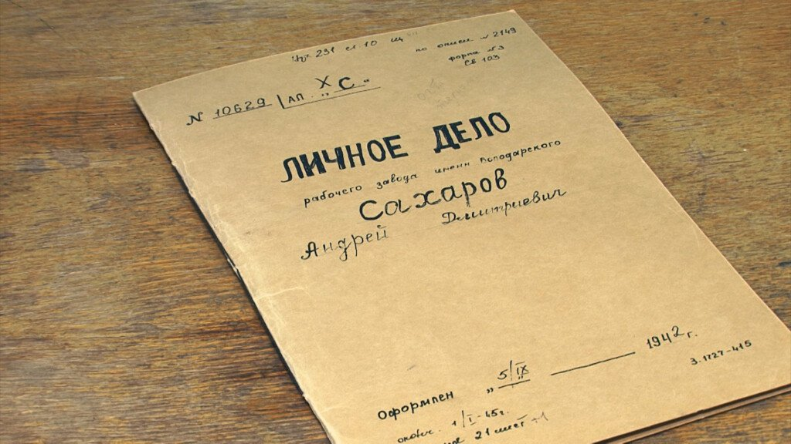

# Большой взрыв в сердце нобелевского лауреата. В день столетия в «цельнометаллической оболочке» Первого канала возникнет просвет — премьера документального фильма Елены Якович «Дело Сахарова»

- **URL:** https://novayagazeta.ru/articles/2021/05/20/bolshoi-vzryv-v-serdtse-nobelevskogo-laureata
- **Дата:** 2021-05-20
- **Автор:** Лариса Малюкова

## Большой взрыв в сердце нобелевского лауреата

## В день столетия в «цельнометаллической оболочке» Первого канала возникнет просвет — премьера документального фильма Елены Якович «Дело Сахарова»

Кадр из фильмаНазвание многозначно. Да, с какого-то момента «компетентные органы» накрыли куполом филерской опеки ученого и его семью, обвинив во всех смертных грехах, дело неуправляемого «подрывателя устоев» в Пятом управлении КГБ множилось томами. Но делом жизни Андрея Дмитриевича Сахарова оказывается битва с ветряными мельницами войны, со смертоносным оружием, которое он же и создал, с превращением человека в безликую песчинку на дне котлована системы.

О Сахарове снято немало. В эти же дни на платформе KION выходит экстравагантный игровой док Романа Супера «Сахаров. Две жизни», в котором академик ведет диалог со своей совестью, в роли Совести — Чулпан Хаматова. Параллельно снимается документально-анимационный фильм «Андрей Сахаров. По ту сторону окна…» Дмитрия Завильгельского и Светланы Быченко, в котором оживают рисунки ученого.

Елена Якович выбирает вроде бы очевидный академизм — портрет, собранный из разговоров с близкими. Ее задача — с помощью тех, кто знал, любил Андрея Дмитриевича (многие из собеседников впервые согласились дать интервью), приблизить его к нам сегодняшним. Почувствовать кожей громадность потери, беды, которая обрушилась на страну в день его внезапной смерти от инфаркта.

Эта боль — в песне Градского: «Когда от пророка ни толка, ни прока, / То Господом Богом забыта страна», а в кадре — гигантская безутешная очередь.

Портрет на фоне страны. Прямая речь. Дочь Любовь Сахарова, двоюродная сестра Мария Сахарова, внучка Марина Сахарова-Либерман, дети Елены Боннэр Татьяна Янкелевич и Алексей Семенов, ее невестка Елизавета Семенова… Юрий Рост, Наталья Солженицына, правозащитник Сергей Ковалев, академик Роальд Сагдеев, старейший сотрудник ФИАНа Борис Болотовский… Они были рядом в самые сложные минуты. Очевидцы, сподвижники, свидетели большой истории, колесо которой раскручивалось во многом благодаря усилиям этого сутулого, стесняющегося человека.

История Сахарова и страны предстает в уникальных кадрах и документах. Во всех своих работах Елена Якович с тщанием исследует неизвестные или малоизвестные страницы легендарных судеб: Бродского, Довлатова, Казакова, Берггольц, Ахматовой.

В новой картине — уникальная съемка академика Харитона. Ему разрешалось любительской камерой снимать в секретнейшем Арзамасе-16. В поблекшем цвете 60-х проявляются редкие кадры: Сахаров со своим учителем Таммом и главными лицами советского атомного проекта в Жуковке, Сахаров со своими детьми в поезде. Еще одна поразительная съемка: Сахаровы в Горьком, она сделана скрытой камерой КГБ для демонстрации Западу «ссылки-курорта»: ученый ухаживает за кустами в палисаде, Елена Боннэр идет в магазин. А рядом — вспышки советских и американских испытаний атомного и термоядерного оружия, рассекреченные документы, воспоминания детей.

Он сам был секретным объектом, развернувшим исследования и разработку ядерного оружия в арзамасской лаборатории. Был секретным — стал поднадзорным. Для того чтобы арестовать в 1980-м непокорного академика, ехавшего на семинар в ФИАН, перекрыли все движение. Через два часа их с Еленой Георгиевной отправили в ссылку.

Читайте также

Наш Сахаров

Все забудем. Не потому, что память дурная, а потому, что умная

Мы узнаем о его предках: дворянах, трех поколениях священников и прапрадеде протоирее, ученых, военных. О родовом гнезде и атмосфере дома. О детстве. «Маленький принц» Адя, любимец матери, получающий домашнее образование, в школу пошел только с седьмого класса. Об арестах родственников. О том, что значит быть коренным интеллигентом.

Вот начинающий ученый на лесозаготовках, на патронном заводе в Ульяновске. Здесь закаляют сердечники пуль: каждую следует внимательно осматривать — нет ли трещин, брака. Сахаров изобретает автомат по контролю бронебойных сердечников. Потом очень гордится своим изобретением.

А после атомной бомбардировки Хиросимы начнется ядерная эпоха. Красной лампочкой мигает главный вопрос, в том числе и нынешней эпохи: может ли ядерное оружие отодвинуть возможность войны? Тогда он в это верил.

Они жили в изолированном мире, под контролем КГБ делали свои открытия, создавали водородную бомбу, исследовали и пытались управлять термоядерной реакцией — источником жизни на земле и угрозой гибели всего живого. 18 лет в закрытом городе Сарове в условиях сверхсекретности.

А потом произошел поворот. Большой взрыв, открывший новую вселенную внутри отдельного человека. Как напишет сам Сахаров: «Осуществление термоядерных испытаний сопровождалось все более острым осознанием порожденных этим моральных проблем. С конца 50-х годов я стал активно выступать за прекращение или ограничение испытаний ядерного оружия». В 1961 году у него возникает конфликт с Хрущевым. Потом с Брежневым, Андроповым, неоднозначные отношения с Горбачевым.

Трижды Герой Соцтруда, обласканный привилегиями молодой академик превратится в головную боль системы. Вольномыслящий восстает против полуправды, становится правозащитником. Сахаров инициирует договор о запрещении испытаний в трех средах (в атмосфере, в воде и в космосе), пишет обращения в защиту репрессированных, политзаключенных. Наконец, появляется программная статья «Размышления о прогрессе, мирном сосуществовании и интеллектуальной свободе». Спустя годы он скажет, что многие важные повороты мировой и даже советской политики лежат в русле этих мыслей.

Поддержите нашу работу!

1000 500 300 Нажимая кнопку «Стать соучастником», я принимаю условия и подтверждаю свое гражданство РФ

Если у вас есть вопросы, пишите [email protected] или звоните:+7 (929) 612-03-68

Читайте также

«Так кто ж мы такие, и в чем наша сила, что наши мессии уходят от нас?»

ТВ отмечает юбилеи Галины Старовойтовой и Андрея Сахарова

Автора фильма интересуют прежде всего не факты био, а эволюция от великого ученого к праведнику, переживающему чужие страдания, как свои. Незащищенный, он хотел защитить нас.

Ему указывают на недопустимость контактов с западной прессой. В ответ он устраивает пресс-конференцию. Против — вся мощь государства, организуется газетная травля. Публикуется письмо 40 возмущенных академиков. А он формулирует свою доктрину, концепцию нерасторжимости и зависимости прав человека и международной безопасности.

Снова смотрим фрагменты того самого съезда, который захлопывал Сахарова, отключал ему микрофон. И знакомые кадры обретают символическое значение. Вот, сгорбившись, словно под грузом ответственности, он идет к трибуне. Один против всех. Говорит тихо, неслышно. Да и не хотят его слушать. Топают, кричат, хлопают…

А он продолжает говорить. Так нужно, так важно сегодня его расслышать.

Андрей Дмитриевич размышляет перед камерой: «Нам, может быть, досталось больше потерь. Но мы остались живым и настоящим народом». Очень хочется ему верить: что живым. Что настоящим».

Удивительно: фильм Елены Якович об ученом-правдоискателе показывают по главному — «самому Первому» — бронебойному госканалу. Более того, как рассказывает автор, фильм принят без единой поправки. Вольные и невольные рифмы с сегодняшним днем складываются во время просмотра. Ну хотя бы факт Нобелевской речи Боннэр, огласившей на весь мир 50 фамилий политических сидельцев. Сколько бы времени потребовалось ей сегодня? Или голодовка «изолированного» оппозиционера как последний инструмент борьбы и защиты с полицейским произволом. Или команда сверху академикам подписывать подметные коллективные письма.

«Человечество держит экзамен на то, чтобы выжить», — говорит Андрей Дмитриевич Сахаров. Человечеству не выжить без одиночек, бесстрашно следующих внутреннему голосу правды. Без этой наивной гуманитарной ответственности, оставляющей нас людьми. Без вселенной отдельного человека, осмелившегося быть равным своему выбору: «Я лишь старался быть достойным своей судьбы».

Поддержите нашу работу!

1000 500 300 Нажимая кнопку «Стать соучастником», я принимаю условия и подтверждаю свое гражданство РФ

Если у вас есть вопросы, пишите [email protected] или звоните:+7 (929) 612-03-68
