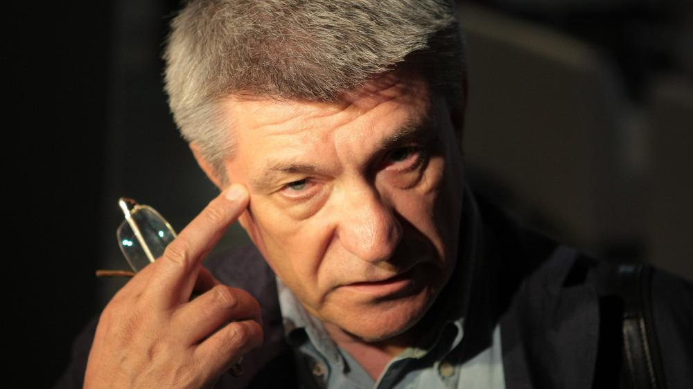

# Александр Сокуров: «Остается только перестрелять таких, как я». Неюбилейное интервью выдающегося режиссера — о времени, кино и об удушающей силе немощного авторитаризма

- **URL:** https://novayagazeta.ru/articles/2021/06/11/aleksandr-sokurov-ostaetsia-tolko-perestreliat-takikh-kak-ia
- **Дата:** 2021-06-11
- **Автор:** Лариса Малюкова

## Александр Сокуров: «Остается только перестрелять таких, как я»

## Неюбилейное интервью выдающегося режиссера — о времени, кино и об удушающей силе немощного авторитаризма

Фото: РИА НовостиРежиссер, создатель эпохальной тетралогии («Молох», «Телец», «Солнце», «Фауст»), русский европеец, метафизик, поэт и романтик, завороженный общечеловеческими ценностями и недостижимой идеей гармонии в уродливом мире. Едва ли не единственный, осмеливающийся говорить с властью о том, что волнует всех. Переживающий, что его не хотят слышать. Но, кажется, нет ничего важнее, чем расслышать в нынешнем скрежете ржавого милитаризма этот «одинокий голос человека».— На классический вопрос «Легко ли быть молодым?» в России сегодня ответ может быть только один. Трудно. Очень.

— Молодым трудно всегда и везде. Каждый человек проходит через опаснейший период своей жизни — подростковый. Подростки самые опасные люди для любого общества и государства. Неуправляемые. Мятежные — в морали, в политике, в отношениях с культурой, по отношению к самим себе. Подростки иногда с воодушевлением, с радостью убивают себя. Смерть и молодость — две стороны одной медали.

— Не уверена, что и сейчас перестали существовать «группы смерти».

— Да и без групп, «кураторов» подростки и сами думают о смерти. Они самоотверженны в максималистских взаимоотношениях и с жизнью. Жестоки к родителям бесконечно: и девочки, и мальчики. Если бы не было в обществе миллионов молодых людей, социализированных, живущих в большом городе (в первую очередь), если бы у них не было этого страшного мятежного периода, многие бы жизнь проживали по-другому. В подростковом возрасте они до конца не успевают изжить свои боли, трагедии, не получают ответа ни на один из важнейших для них вопросов. Но сегодня в молодую среду внедряется и циничная политическая жизнь государства. За исключением, может быть, случаев, когда молодые попадают в школы, где есть уникальные учителя. Но это исключительные обстоятельства, когда появляются настоящие кормчие. Во всех остальных случаях это социополитическая буря, тяжелая, иногда трагичная — она истязает душу молодого человека. Самый травматичный период жизни он проживает неудовлетворенным, без успокоения души, и эти мытарства переползают в другой возраст — юношеский, молодой. В возраст действий.

Мне всегда нравились люди из рабочей молодежи. У них многое по-другому. Люблю эту среду. И сейчас, когда бываю на больших промышленных предприятиях, мне кажется, понимаю, как себя чувствуют эти люди. Очень сожалею, что мы потеряли то, что называется русский «рабочий класс». Оставшиеся постепенно неизбежно становятся пролетариатом. А с пролетариатом уже не пошутишь.

— Или с люмпеном?

— Или с люмпеном. Да, жалею, что мы утратили важное качество — достоинство молодого рабочего человека. В России предприниматели, «хозяева» разгромили профсоюзы, которые могли бы активно помогать молодым рабочим. Столько же остры мои переживания по поводу «Ленфильма», который мы теряем как опорный большой организм, внутри которого многие из моего поколения произрастали. Это тоже к вопросу о молодых. Я же на студии молодым оказался, и многим моим сверстникам повезло в юности оказаться в больших творческих коллективах — объединениях на «Ленфильме», «Мосфильме», на Свердловской студии, на Одесской…

— Ну и тогда молодым было трудно… Вам же пришлось негатив вашего первого фильма «Одинокий голос человека» выкрадывать, спасать. Вас третировали нещадно.

— Да, и так было… Но тогда я был «на фронте» — советская власть. Эта черта «фронтовая» была четко обозначена: свои и враги. Было, действительно, сложно. И первые серьезные конфликтные отношения с КГБ не миновали меня в советский период, я долгое время был под их контролем: допросы, прослушка. Только появление Горбачева спасло меня от сыктывкарских лагерей, попросту говоря.

— Поразительно. За искусство? За тончайшую, выразительную, конгениальную экранизацию Платонова? Вы же не были диссидентом…

— Разве могло быть иначе? Разве офицеры КГБ разбирались в формах, эстетике, своеобразии киноязыка? Считалось, что я диссидент, потому что делаю фильмы, и документальные, и игровые, которые не принимает государство. У меня были близкие отношения с Тарковским: переписка, звонки, продолжавшиеся, и когда он уехал. А это уже, как вы понимаете, сверх головы грехов. Но при той «линии фронта» я понимал: где чужие, враги, а где свои. Эту четкую линию я видел на «Ленфильме», она шла и по быту, и по всей жизни. По всем поколениям.

Сейчас этой линии нет. Молодой человек, да и любой вообще, может ожидать удара с любой стороны — справа, слева, сверху, со спины. Особенно часто бьют со спины. Вспомните выстрелы в спину Немцову… Ясная разграниченность поведения, позиций, нравственного самоопределения исчезла. Сегодня человек, с которым общаешься, работаешь, может «внезапно» оказаться на враждебной тебе стороне, написать донос. Любой, с которым ты встречаешься, разговариваешь, доверительно общаешься, может, уже написал на тебя донос. И любой из этих доносов с распростертыми объятиями примут офицеры КГБ. Поэтому мне сегодня гораздо тяжелее жить. Возможно, потому, что я устал, устал от жизни на такой Родине, во «фронтовом режиме».

Мне плохо от того, что ничего не меняется в моей жизни: по-прежнему запрещены мои фильмы, по-прежнему я нахожусь в разработке ФСБ, по-прежнему существует неснятое решение суда о прослушивании моих телефонов и т.д.

Те же жуткие взаимоотношения с Министерством культуры, как с Госкино когда-то в советский период. Я со страхом отношусь к государству, которое издевается надо мной столько времени, и в то же время понимаю, что без России я не могу. У меня один паспорт, я русский человек, без России мне не жить. Я много имел возможностей и гражданство сменить, и жить и работать за пределами России… Но, но… Но…

Но возвращаясь к молодым: мне приходилось бывать и в европейских вузах, и в американских, латиноамериканских, японских. И везде в разговорах с молодыми людьми видел их тревогу за свое будущее. Отсутствие ответов на важные вопросы: социальные, политические, «капитализм — социализм», на проблемы национального самоопределения, развития национальной культуры. Последняя тема, к сожалению, особенно болезненна для Европы. Там почти невозможно говорить о национальной культуре. Не только в Германии, где и эти размышления под запретом… А молодой человек должен осознавать прелесть своего рода, своей национальной культуры…

— Новая этика и толерантность пересматривают многие устоявшиеся понятия.

— Кажется, да… Но во все вмешивается тупая политика. В результате нельзя даже обсуждать подобные проблемы и в Италии, и во Франции. Теперь и в России. Нельзя говорить о развитии собственной культуры, христианских традиций. Поэтому так сложно молодым людям, которые уже набрали силу в крыльях, поднялись, уже «парят»… смотрят вниз и не понимают, где «та альпийская долина», которую они ищут.

Отсутствие ответов на простые, но в конечном счете главные вопросы современного развития — и есть проблема для молодых людей. Рты затыкаются политическими кляпами.

— А что вы скажете по поводу отсутствия у нас социальных лифтов?

— Ну вот, считайте, что я — социальный лифт, набрал мастерскую — я их защищаю, прикрываю. Но прежде всего мы занимаемся профессией. За «социальный лифт» в первую очередь отвечает сам молодой человек, принуждая самого себя честно, качественно учиться. Главный в этом смысле для молодого человека призыв (если я смею так сказать) это — «стань мастером», хотя бы настоящим ремесленником. Будешь владеть своим профессиональным инструментом — любую художественную форму, любой орешек разобьешь, любой художественный замысел сможешь сделать произведением.

— Ну хорошо, много ли у нас Сокуровых? А между тем идет мощный отрицательный отбор во всех сферах. Например, недавно замминистра образования назначили экс-специалиста по мясорубкам, Бузова готовит во МХАТе роль.

— Знаете, мы готовились к фильму «Франкофония» со съемками в Лувре, и когда приступали к съемочному периоду, во Франции прошли выборы: президентом стал Олланд. Что сделал в первых указах этот государственный муж? Уволил блистательного специалиста — директора Лувра Анри Луаретта, расширившего коллекции Орсе и Лувра. А министром культуры новый президент назначил знакомую учительницу математики. У нас значительно усложнились обстоятельства съемок. Отношение к гуманитарной сфере во всем мире становится не просто прагматичным, а идиотским, по-другому не назвать.

«Франкофония»Также страшненьким отношением к развитию культуры отличаемся и мы. Когда формировалось правительство господина Мишустина, мы были крайне взволнованы: кого назначат министром культуры Великой России…

Какова же была наша оторопь, когда узнали, что назначена товарищ Любимова… Просто рядовой продюсер с Первого канала… Как так? Федеральный министр, многонациональная страна, уйма конфессий, назревающий экономический и политический кризис… и назначается человек без соответствующего профессионального, государственного опыта, без соответствующей экономической, социальной практики такого масштаба. Неужели по этому же принципу отбираются кандидатуры на посты и в других ведомствах? Приношу извинения О.Б. Любимовой, возможно, мои слова слишком резки. Извините меня.

Меня успокаивали: сиди, молчи. Культура не интересует ни премьера, ни парламент страны. Культура отдана на откуп Михалкову… Он из своих деревень, гостиниц, декораций всем руководит. Если это так, то что это? Как это? Ведь культура России это в значительной части судьбы молодых… Попробуйте разубедить меня. Если ошибаюсь — признаю свою неправоту.

Я все последние годы не скрывал своего несогласия с работой Минкульта России, считая, что это несчастное ведомство давно не выполняет госзадания — «развития отрасли». Если нет развития, может, такое ведомство уже и не нужно России?

Я в этой отрасли, в этой профессии живу целую жизнь. И со мной трудно по проблемам культуры моего народа спорить. Остается только перестрелять таких, как я, или просто уморить. Но моя жизнь завершается, и я уже не опасен. К сожалению.

Приходится повторять: гуманитарная сфера — главная для жизни любого цивилизованного государства.

Цель существования российского государства — культура. Другой цели нет. Не армия, не экономика, не политика.

Все это может следовать только за общим возрастающим разнообразным уровнем культуры разных слоев, групп народа.

Вынужден напомнить об историческом предупреждении: и армия может проиграть, и государство может обрушиться, но на руинах всей этой «красоты» с народом, с его традициями — останется Культура. Ей возрождать нас из ПРАХА…

— А не кажется ли вам, что некоторые политики это осознают и сознательно направляют культуру в два русла: с одной стороны, интертейнмент, с другой — идеологическая прямолинейная пропаганда?

— Возможно и так. Но не усложняете ли вы? Деградация в области политики — отсутствие крупных политических фигур, которые обязаны были бы осмыслять современное время. Это «качества» не только чудовищной современной российской бюрократической машины, но и европейской. Мне В.В. Путину случалось говорить, что победить бюрократию не получается. Бюрократия побеждает. Ни Романовы, ни Сталин не победили бюрократическую машину. А в отношении президента Путина бюрократия всех уровней, включая силовую, ведет себя издевательски. Погибает чрезвычайно полезная, необходимая нашему государству оппозиция. Ведь это аксиома: не может демократическое государство жить без разнообразной оппозиции.

Читайте также

«В атмосфере полной секретности под покровом ночи»

Мосгорсуд признал все структуры Алексея Навального «экстремистскими»

— Да оппозиции никакой уже практически не осталось. За тот год, когда вы произнесли схожие слова, все кардинально изменилось. Она выслана, арестована, уничтожена — нет оппозиции.

— Но я сейчас о другом. Бюрократия России, ставшая вполне классом — посмотрите, как в марксизме определяется понятие «класс», — демонстративно не следует указам, распоряжениям государства. Лизоблюдство, ложь, лукавство. Они сегодня уверены, что переживут президента страны. Конечно, переживут.

Но часто разницы в том, что критически видит глава государства и оппозиционные силы, почти нет. К сожалению, у оппозиционных сил нет устремленности в сторону анализа гуманитарной атмосферы, гуманитарной проблемы. Ни на «Эхо Москвы», ни у вас, ни на «Дожде»… Я перечислил эти три последних коллектива, за которые многие «цепляются». Нигде нет мощной целевой программы гуманитарного развития. Через раз «Новая газета» могла бы выходить с первополосной культурной, гуманитарной темой. К сожалению, сегодня это не так. Нельзя бороться за политическую проясненность, политическую цель, не учитывая, что жизнь народа — это жизнь, как в «траве». А там целый мир: гнезда, цветы, могилы. Что говорить, это же так просто.

Уход от гуманитарных позиций — не для населения, для народа моего — большая беда.

Раньше эту работу проводили большие писатели, композиторы. Вспомните, каким событием было любое появление, например, Шостаковича, его нового творения. Сегодня фундаментальная большая тема не появляется, потому что «больших кораблей» литературы мы лишены. А на таких кораблях мы могли сплавать в будущее, посмотреть, как там, вернуться и не поступать так, как поступаем сегодня. Я знаю о встречах Путина, например, с Граниным, и сам Гранин, с которым у меня в последние годы были близкие отношения, мне рассказывал, что он говорит президенту все, что думает о происходящем в стране. И то, что он говорил президенту, я никогда ни в каких публичных выступлениях самых жестких критиков нынешнего политического курса не слышал. Но это один человек. А должно быть таких много. И у них должна быть трибуна.

Фото: РИА Новости— Я смотрела запись, когда вы говорите президенту: «Раз молодые вышли на улицы, значит, что-то не так… Но государство перевело возможный диалог в уголовную геометрию». Вы говорили вроде бы очевидные вещи, а мне было не по себе. Собственно, на такую честность решились лишь вы и Сванидзе. Другие в основном что-то быстро писали, не поднимая глаз. Почему?

— Идея создания советов по культуре, по правам человека, по науке — сама по себе блестящая, в мире нет подобного. Но ее подмяли под политическую задачу, скрутили в рог, набирая в состав советов каждой твари по паре. В совет попадают не люди, которые имеют авторитет в стране, а случайные политические птенцы из тех, что должны вырасти в агрессивных грифов, оберегающих властные гнезда.

— Да для них это лишь карьерный рост.

— Часто так. В Совете по правам человека недостаточно правозащитников, значительное число дремлющих, затаившихся.

Временами пребываю в полном отчаянии. Что там происходит? Когда необходимо заговорить о политике — страх. Увязли. Забуксовали. Видимо, есть и те, кто действует в интересах определенных «структур». Все это разрушает последние возможности консолидированных ответственных формулировок и высказываний. Поэтому прийти к какой-то общей формуле поведения редко удается. Задачи, «поставленные президентом» перед Советом по правам человека, такой состав не выполнит. Необходимо переформировать этот состав, дать Совету новые полномочия. Встречи с президентом у этого Совета должны быть не менее трех раз в год. Учитывая обстановку в стране.

— С одной стороны, сверху чиновничий натиск и диктат, с другой — плоды дегуманизации, превращающей население в апатичное сообщество. Вы же все время говорите о том, что происходит с социально-исторической культурой населения. И кажется, это ужесточение, с одной стороны, и одичание — с другой, в какой-то точке «Ч» встречаются.

— Да, встречаются на огромном пространстве России, которое многие русские философы определяли как русское проклятие. Нет концентрации культуры, нет опоры на какое-то национальное качество, ничего этого нет.

У нас есть Российская Федерация, у нас нет России. У нас есть президент Российской Федерации, но мне нужен президент России, который будет думать об Архангельской губернии, о Мурманской, Ярославской, о Поволжье, о том же Урале… Дальневосточном регионе. Человека, который был бы озабочен развитием жизни народа-кормильца, что кормит, прямо скажем, разношерстную братию Федерации. Я обращался к президенту: обратите внимание на то, как мучительно живет Архангельская область, посмотрите на обеспечение там медицинскими учреждениями, посмотрите, там не хватает роддомов, специальных клиник для женщин, не хватает дорог, не хватает, не хватает… Бедность, бедность. Хотя бы примите во внимание, что когда-то в Архангельскую область из блокадного Ленинграда перевозили тысячи и тысячи людей для спасения от голода. А в Архангельской области во время Великой Отечественной войны (об этом вообще никто не говорит) умирали так же, как в Ленинграде, и от того же: не было блокады, но был голод, страшный мороз. Снега до подбородка: архангелогородцы мёрли тысячами. Хотя бы отдайте долг Ленинграда — архангелогородцам, вологжанам. Им же сейчас так нужна помощь! Но нет.

Читайте также

«Мы сами по себе, Россия сама по себе»

В Архангельской области не осталось ни одного малого аэропорта. Репортаж из Поморья, где у людей отнимают небо

Не знаю, выживу ли я после этого интервью, но опять возвращаюсь к трагичной теме. Колоссальная моральная проблема «чеченского сектора», которая является экономической, социальной и военно-политической проблемой России, Кавказа. Милитаризация этого региона безмерна. Насколько я знаю, количество оружия, которое там на единицу населения, — самое большое в мире, причем современного оружия. Не осмыслена ни одна из причин чеченских войн. Осталось затаенное ожидание. Сотни тысяч этнических чеченцев бежали в Европу и в современный чеченский сектор возвращаться не хотят.

— Как вам кажется, почему и кому нужна интенсивная истеричная идеология войны, вражды со всем миром, жестокосердия, которое воспитывается политиками и телевизором? Отменены антимилитаристские идеи, некогда бывшие на знамени идеологии большой страны: Брежнев жал руку Никсону, лозунги разрядки, саммиты, посвященные разоружению. Даже когда люди в это играют, они уже в это верят. Почему направленность на войну?

— Полагаю, нет понимания реальных экономических ресурсов России. Мне кажется, у многих правящих людей в нашей стране острое чувство экономического тупика, абсолютное непонимание, как развивать государственный механизм дальше — и так называемый федерализм. Что это за государство? На что опираться, на какую хотя бы теоретическую базу? Ведь население Российской Федерации так и не приняло окончательного решения по поводу государственного устройства России. Об этом, кстати, однажды говорил и сам Путин: «Подождите, если в стране что-то будет неблагополучно, не думайте, что это от нерешительности властей. Само население начнет указывать, куда надо идти». Вот оно и показывает сегодня, куда надо. Большая часть населения не готова принять решение о демократическом устройстве, потому что это трудно. Потому что в каждой семье должна быть идея демократического усилия, идея маниакального участия в выборах, противодействие подтасовкам на выборах. Необходимо жесткое соблюдение конституционных основ. Но Конституция в моей стране стала «ведомственной официанткой».

— Дефицит ответственности за свой выбор?

— Конечно. Но, конечно, это про народ, у которого низкая социальная, политическая культура…

— Однажды вы сказали, что такой народ может превратиться в диктатора, который сформулирует и просуфлирует своего правителя.

— Да-да, как американское кино, которое когда-то в эпоху тяжких экономических проблем поднимало свой народ. А теперь американский народ диктует кинематографистам, что им, кинематографистам, делать… «Снимайте то, что нам надо. Что нам всем нравится». Поэтому американское кино, являвшее огромные художественные потенции, превратилось в фабрику по производству товара. Хорошего, зрелищного, качественного. Но товара.

— За исключением талантливых современных режиссеров, которые идут вопреки общему потоку.

— Я говорю об отсутствии понимания, что делать. Мне люди, занимающие высокие посты, говорили, что не знают, куда двигаться, как работать в нашем государстве. Несколько лет назад я говорил и с Медведевым, и им было сказано: «Федерализм? Какой федерализм? Разве он есть? Мы понимаем, что его нет. И мы понимаем, что в этих экономических, политических условиях Федерация почила в бозе».

Я спрашивал у нашего президента: что делать со структурой страны, с таким ее построением сегодня? Как известно из интернета, в России появился падишах Кадыров, официально титулованный. На самом деле, это не глупо и не смешно. Ведь это один из шагов к отделению, демонстрация силы и особых взаимоотношений с Россией. Ну хорошо, чеченский народ сам разбирается с падишахом, со своей жизнью. Но нам-то нужно определяться, какая у нашего государства экономическая и социально-политическая конструкция. И могут ли люди, у которых огромные деньги, которые ратуют за развитие сырьевого сектора, определять собственно политику в стране? А может, стоит посмотреть, что в Норвегии сделали со своим сырьевым сектором? Может, есть и другие варианты? Кто-нибудь в нашей стране думает об этом? Когда мне говорят — никто, я начинаю бояться за мою Россию. Не стоит забывать: мы по-прежнему живем в государстве, основанном в 20-х годах прошлого века, когда Ленин и Сталин придумали эту федеративную конструкцию.

Нас, граждан России, давно волнуют «паузы» Конституционного суда. Мы предполагаем, что в составе Конституционного суда собраны выдающиеся профессионалы права, государственники. Как хорошо было бы, если бы столь высокая наша вера в мастерство юристов-судей распространялась бы и на их нравственную ответственность перед народом, перед Россией…

Поддержите нашу работу!

1000 500 300 Нажимая кнопку «Стать соучастником», я принимаю условия и подтверждаю свое гражданство РФ

Если у вас есть вопросы, пишите [email protected] или звоните:+7 (929) 612-03-68

«Телец»— Вот про прокручивающиеся колеса. Как вам кажется, почему после трагедий, которые пережила страна, после колоссальных потерь в войне, в сталинском геноциде — не накапливается коллективный опыт? Как в 60-е терзали Бродского, в 70-е Сахарова с Ростроповичем… «и вновь продолжается бой»…

— Не знаю, могу ли отвечать на такие сложные вопросы. Мне видится, что в нашем государстве соединяются несоединимые элементы: национальные и религиозные. Мы слишком разные, и у нас здесь много несовпадающих позиций. У нас исторически сложились разные внутренние отношения, которые сегодня могут существовать или порознь, или на дистанции.

— Тут можно спорить до скончания века. Вы же сейчас работаете над фильмом, герои которого те, кто вверг мир во Вторую мировую войну. Муссолини, Гитлер, Черчилль, Сталин… Кажется, фильм скоро должен выйти.

— В декабре месяце, надеюсь. Наш молодой коллектив работает упорно.

— Так вот, в контексте нынешних «исторических представлений» Гитлера и Муссолини также можно назвать «эффективными менеджерами». Гитлер дал работу людям, построил дороги и т.п. Будем размышлять о пользе тоталитаризма?

— С тоталитаризмом все много сложнее. Наш фильм — историческая сказка, фантазия. Мне кажется, у меня есть вариант ответа на вопрос — почему могла начаться Вторая мировая война. Я много лет занимаюсь историческими темами, я совсем немолодой человек, историческое образование. Как-то все сошлось. Пришла пора сделать этот шаг — фильм-сказку.

— А отчего власть, даже относительно вегетарианская, ненавидит крупные личности — Солженицыных, Сахаровых, Ростроповичей…

— Это не так. Тоталитарная власть нуждается в гениальных людях, и именно в условиях тоталитаризма — наибольшее число великих людей. Демократическому режиму нужно более усредненное, то, что принимается средним избирателем. Демократические режимы усредняют развитие искусства, но любят науку. Тоталитарное государство с наибольшим успехом развивается и приобретает свои страшные формы, опираясь именно на феноменальных граждан. В первую очередь — на «художников».

— Система же гнобит этих людей.

— Да. Но людей с наибольшими достижениями, как, например, Прокофьев, Шостакович, Эйзенштейн, они готовы долго терпеть.

— Это как воспринимать слово «терпеть», хорошо, если не убивают, вот Сахарова едва не убили «принудительным питанием».

— Ну Сахаров сам чуть не убил многих, так же как и его великие коллеги. Если бы не его внутренний переворот… На другой стороне этих весов — готовность американцев (во время развития корейского кризиса) ударить ядерным оружием по Сибири. Конечно, так называемое сдерживание должно было сработать. Но все равно интеллектуалы со всех сторон участвовали в создании этого кошмара. Все это говорит о причинах более сложных. О том, что нет внутри интеллектуальной элиты тормозов. Это и позволяет государствам играть с обществом в кошки-мышки.

— Интеллектуальные элиты и сегодня разобщены, что крайне опасно.

— Современные «элиты» — в подавляющем большинстве — без мировоззрения, без системы ценностей, снедаемы эгоизмом и приобщены к благополучию. Многие из них патологически трусливы. Они не годятся на роль Кормчих. «Простым людям» остается самим себе создавать свое будущее. Элиты предлагают найти выход за пределами Солнечной системы, а здесь, внутри, у нас воз и маленькая тележка проблем, к которым даже не приблизились. Некому остановить тех, кто развивает эти неограниченные космические и военные фантазии. Правительство на днях заявило о том, что надо построить для России еще три авианосца. При нашей-то бедности. Современным оружием уничтожить эти плавающие дворцы ничего не стоит: две-три тысячи парней сразу уйдут на дно. Политика — самая дорогая игрушка.

Фото: Ian Gavan/Getty Images— Когда-то академик Петровский показал на конференции чертеж новой подводной лодки, потом отчертил ее хвостовую часть и сказал: «Вот это — решение проблемы рака».

— Потому что ответ на вопросы должен быть гуманитарным. Вы спрашивали меня, почему везде происходит деградация политической среды. Отвечу: деградация идеи партийности. С помощью этих головешек-партий руководить жизнью людей, осуществлять внутреннюю и международную политику сегодня невозможно. Притом что существуют четко сформулированные основные идеи гуманитарности.

— Идеи гуманитарности — долгий неочевидный путь, люди власти настроены на короткий, быстро монетизируемый хайп.

— Мы же этот путь давно прошли, понимаем, где у нас появляются наиболее страшные так называемые «раковые политические, социальные опухоли». Но мы в России, мне кажется, до сих пор не можем создать цивилизованное стабильное государство.

— Видимо, из-за неспособности использовать опыт прошлого. А история, как сказал Ключевский, надзирательница, которая наказывает за незнание уроков.

— Хорошие школы, плохие ученики. Смотрите, именно Старый свет, Европа, первой показывает тупиковые пути. Например, попытка принять огромное количество беженцев из Африки и т.д. Новый колониализм. Но сейчас это выгодно «колонизируемым», а не «колонизаторам». Вместо того чтобы погасить войны там и заставить этих людей самих заниматься проблемами своих народов, своей культурой, государственным устройством, их привозят в другую часть мира, гробя европейскую цивилизацию, которая и так переживает сложные моменты. У современных политиков, настроенных на партийные регистры, нет, может быть, ответственности за цивилизацию.

— Во власти — «маленькие люди», не справляющиеся с вызовами современности? В вашей же тетралогии о власти (как и у Чаплина в «Великом диктаторе») показано, что происходит, когда эйфория гериархии охватывает маленького человека.

— Просто власть, в которой заложено только слово «власть», только энергия силы, порочна изначально, не только потому, что разрушает самого властителя, но и формирует самые скверные, низменные качества у огромного числа людей. Когда Гитлер провозгласил свою доктрину, мы знаем, что со стороны Коммунистической партии Германии была попытка противодействовать нацистам. На улицах многих городов Германии погибали люди в битвах со штурмовиками. А значительное число немцев Гитлера поддержало. Мужчины из немецкой Компартии, из сил сопротивления были забиты, расстреляны на улицах Германии. Мы забыли о том, что там происходило. Странно, что один может инфицировать многих, но многие не властны над одиночкой.

— Ну да, представляем себе монолитный Третий рейх с поднятой правой рукой. Кстати, есть фото, на котором среди тьмы рабочих верфи лишь единственный не салютует — Август Ландмессер.

— Антифашистов было мало, а поддержавших много. Сегодня говорим о том, что для нас неприемлема деградация социальной и гуманитарной культуры населения России, разбросанного в бесконечном пространстве. Кому-то кажется, с бесконечными ресурсами. А если нацизм русский, выжидая сегодня, начнет опираться на бедное, разобщенное общество…

— Политика всегда насилие. Правда, сегодня политика насилия обретает крайние, жесточайшие черты, я бы сказала, расправы. И расправляются с людьми, которые хотят, чтобы жизнь стала честнее, спокойней, интересней. Еще год назад молодые люди могли выйти на улицу, сформулировать вопросы власти…

— Наверное, сегодня количество преступивших во власти велико. Власть в России численно превосходит народ. Ведь что происходит на улицах сегодня? Ровесники бьются с ровесниками. Вернее, так: ровесники бьют ровесников.

Государство дает полномочия насилия молодым людям над другой молодой частью населения страны. Но это до поры до времени…

— Уточним: молодым людям в скафандрах с дубинками и электрошокерами.

— Это не просто развращает, но означает, что перспектива — дорога с односторонним движением. Вот есть силовая организация, которая парадоксально для русской традиции называется «Росгвардией»… Вообще «гвардия», по рассказам моего отца, — звание, которое надо было в бою добыть: гвардейская дивизия, гвардейский полк. Сейчас силы подавления народа называются «Росгвардия». И кроме того, посмотрите внимательно, кто служит в этих формированиях… Когда я публично говорю об этом парадоксе, многие опускают головы, никто не может ответить на этот вопрос, в том числе Владимир Владимирович Путин.

— Вы говорили президенту, что государство не смотрит в лица молодых людей, не видит, что хорошие лица, хорошие ребята и девушки… за решетками.

— Когда я говорю вам, что мне трудно сейчас жить на Родине, я прежде всего имею в виду и вот что. С чем бы я ни обращался к власти, будь то здесь, в Петербурге, в наших градозащитных движениях или в Совете по правам человека, — я не встречаю отклика.

— Не задавать вопрос «почему»?

— Наверное, потому, что я ничтожно маленький человек, у которого почему-то навязчивая идея идиота, что я отвечаю за происходящее: за город, за свою страну, за свое время. Сейчас, передавая мою страну молодым людям, честно им говорю: «Мне стыдно, что передаю свою страну в состоянии такого раздрая, противоречий, внутренней резни. Мне стыдно. Что я могу сделать?» Вот сейчас закрыли у нас фильм для показа «Доазув. Граница». Режиссер — моя ученица Марьяна Калмыкова.

— Я посмотрела картину, которая без надрыва рассказывает о трагическом для ингушей соглашении, передаче части ингушских земель Чечне и массовых протестах в Магасе, результатом которых стали уголовные дела на участников митингов. Кино о людях и их беде.

— Я искренне сочувствую моим ингушским согражданам.

За происходящее в Ингушетии мне стыдно. За преследование ингушских граждан — стыдно. За пошлую политизацию, по сути, простой ситуации — стыдно. Циничность поглощает, душит мою страну.

«Граница» прекрасный фильм, почему-то обвиненный в экстремизме. Оспорить запрет — безнадежная задача. Никакого смысла обращаться в российский суд — все равно проиграем. Дважды я писал письма в Совет по правам человека, говорил с главой СПЧ Фадеевым. Никто из членов Совета не стал помогать, никто не хочет ввязываться в эту историю.

Я себе представляю: а как вообще происходил этот запрет? Перестраховались непрофессионалы в Минкульте, эти дамы московские всего боятся? Впрочем, и там уже существует представитель ФСБ. Видимо, он так решил?

— Увы, сейчас именно силовики все решают.

— С какой стати? Почему офицер ФСБ знает про кино больше, чем я? Я только на одной киностудии «Ленфильм» больше 45 лет. Генералы, полковники с легкостью бросают в политическое корыто абсолютно чистые произведения. В эти корыта бросают молодых людей, их мысли, мечты и стремления, их произведения, их убеждения… Вот в это корыто с политическим пойлом. Поставили на колени и «культурную столицу».

— А государству нужна молодежь вообще? Зачем ему молодежь? Кроме Росгвардии и новых комсомольцев, разумеется?

— Вы задаете вопрос правильный, но стоящий в стороне от государства. Во главе государства пожилые люди, я сейчас имею в виду не столько возраст, президент страны энергетически сильнее многих тех, кто водит его за нос, просто врет ему. Вся эта братия-бюрократия с утра до вечера только тем и занимается, что врет публично. Нагло. С воодушевлением.

Для властных временщиков страна не живет в режиме будущих свершений. Им нужен только сегодняшний лакомый кусочек жизни. А представление о каком-то будущем является лишь там, где они своих детей рассаживают по должностным местам. В России или европейских, американских столицах… И понятно, что им наплевать, что происходит с культурой. Даже монстр Сталин был гораздо больше заинтересован в корневом развитии культуры.

— Но сегодня все чаще происходит подмена культуры мифологизацией и прошлого, и настоящего.

— Красиво сказали.

— Да нет, миф — важная составляющая в современной доктрине. Мифологией факт не подменяется — немного сдвигается в нужную сторону.

— Миф — это кристально чистое явление, как большая поэзия. Жертвенное, страшное, но кристально чистое. Вот это действительно миф.

— А миф как идеологическое оружие…

— А миф как идеологическое оружие — убийца народной и национальной нравственности.

«Молох»— Один из ваших любимых учеников, Александр Золотухин, снял о Первой мировой войне мощную антимилитаристскую картину «Мальчик русский». У его героя, почти ребенка, в непомерно большой военной форме — мирные глаза в середине бойни. Еще там есть оркестр, состоящий из сегодняшних молодых людей, потому что это кино про них. Для них. И в «Дылде» вашего ученика Балагова есть эта мощная гуманитарная, человеческая тема. У фильма Киры Коваленко, который пригласили в Канны, знаковое название «Разжимая кулаки». В общем, снимаю шляпу — наверное, вы им объяснили что-то важное.

— Боюсь, что от этой гуманитарной сверхзадачи некоторые из моих учеников скоро будут убегать. Слава и деньги. Кстати, Саша Золотухин сейчас завершает, на мой взгляд, особенный, лирический фильм. Его персонажи — современные курсанты военного училища. Продюсер Андрей Сигле. Великолепный фильм.

— Так вот, Саша говорит, что вы их учили смотреть не столько на эффектность внешней истории, сколько на поиск внутренних причин поведения человека. Вот самое, может быть, сегодня важное, нужное. Получается, что сегодня для вас этика важнее эстетики?

— Вне всякого сомнения. Эстетика была для меня важна в свое время, но только в приложении к историческим событиям. Когда возникла возможность снимать «Скорбное бесчувствие» по мотивам «Дома, где разбиваются сердца» Шоу, то я, конечно, ставил перед собой задачу не только драматическую…

— Такая изысканная кинофантазия о неизлечимой утрате способности переживать и сопереживать…

— Мне хотелось понять, что такое стиль модерн в разных слоях жизни. Модерн в эпоху Первой мировой войны, определяющий эстетический — этический стиль, который проник в философию, архитектуру, в настроения военных, политиков, в настроения разных культурных группировок, слоев. Для меня это было эстетическим интересом.

Сейчас меня это мало интересует. Этическая сторона в наше время кажется мне такой сложной, драматической… Я сталкивался с таким количеством ситуаций, за которые себя виню, неправильно решал этические проблемы…

Мне кажется, мы в жизни наибольшее число ошибок совершаем именно в этической тени: в отношениях с близкими, с друзьями, с любящими нас, с людьми незнакомыми, и даже в отношении Родины своей.

— И со зрителями.

— Со временем и со зрителями, да. Это, мне кажется, очень-очень тяжелая проблема. Нам не хватает нового взгляда, большого писательского замаха. Нам не хватает сегодня литературы с огромными темами: что такое этнос, что такое не этнос, что такое черное и белое, насколько много в человечестве несоединимого, как важно уметь и постепенно приучать себя к мысли о разъединении народов, о готовности умереть, принять смерть других. Мы, как этнические группы, должны быть и деликатнее, и стремиться к дистанцированию друг от друга.

— Не подчинять, не поглощать другой этнос, вот это имеется в виду?

— И это тоже. Ни религиозно, ни технологически, никак не довлеть. Например, исламский мир прекрасно может существовать отделенно, как исламский мир, со всеми особенностями, проблемами. Но исламский мир также может проявить некую Новую мудрость. Необходимо быть более органичным и неформально основываться на исламской «идеологии», на природной какой-то инфраструктуре, психологической, физической, ментальной. Отвергать насилие.

Важно уважать достижения Христиан­ской цивилизации, законы и правила Старого Света. Но это больше относится, кстати, к исламской молодежи.

— Ну вот мы говорили про молодых. Моральный выбор всегда чудовищно тяжелый, но сегодня — особенно; и у ваших учеников, и у моих детей… кажется, невозможный выбор. Опасно говорить или писать то, о чем думаешь, опасно выходить на улицу и предъявлять свои идеи, видение будущего. Буквально опасно для жизни: тебя арестуют завтра же. Хорошо, если не искалечат.

— Опасно для совести молодого человека, для его судьбы, когда человек себе говорит: «Мне страшно, и я в выборе между истиной, правдой и т.д. выбираю свободу свою личную, индивидуальную». Но мы же знаем, что среди молодых людей много и тех, кто, несмотря на все риски, ведет себя демонстративно и открыто проявляет гражданское мужество. Наша задача защитить их.

— Как говорил Сахаров, когда нет выбора, остается выбор — моральный. Вы начали список заключенных читать Путину, и я вспомнила про список пятидесяти заключенных из нобелевской речи, которую зачитывала Боннэр. Сейчас такое количество молодых людей — их больше и больше — арестовывают за пост, за выловленное камерой наблюдения лицо в толпе.

— Это грандиозная ошибка государства, если не сказать преступление современной политической элиты. Свидетельство, что в стране нет профессиональной чистой, честной партийной работы. Реально нет ни одной партии. Если бы в стране действительно была партия правящая, как ее называют, «Единая Россия», то она должна была погибать в дискуссиях и разговорах с другими политическими направлениями, в том числе и среди молодежи. Эта партия должна была бы устраивать непрерывные дискуссии. Если они чувствуют, что они правы, — непрерывное общение должно быть. Идет демонстрация, например, по призыву сторонников Навального, так если вы правящая партия, отвечаете за страну и уверены в том, что нынешняя политическая деятельность единственно верная, а Навальный заблуждается, идите туда, будьте внутри демонстрации, разговаривайте, беседуйте с людьми, убеждайте, слушайте, что они говорят. Сегодня в России принято политическое насилие прикрывать силовыми структурами. Не беседовать, не разговаривать — а бить.

За все время моей жизни в Ленинграде, а я с 1979 года здесь, в разговорах со всеми губернаторами (от Валентины Ивановны Матвиенко до сегодняшнего) я спрашивал: «Вы знаете, какая молодежь живет в городе? Вы соберите их на огромном стадионе, сядьте на поле, просто на попу сядьте, на траву, и до одури разговаривайте с ними». Нет. То же самое я говорил Георгию Полтавченко: «Ну пойдите же вы к ним. У вас же дети есть, вы же разговариваете с ними, как-то окормляете их. Идите к чужим детям — и разговаривайте».

— Ох, боюсь представить этот их «разговор» со своими детьми.

— Все время, что я живу в городе, я умолял их сделать это. У нас было много всякой активности до того, как мы начали работать нашей градозащитной группой в 2007 году. Тогда мы предложили В.И. Матвиенко выйти из окопов и начать совместно работать, чтобы остановить разрушение города. У нас же были митинги постоянные. Однажды я предложил: «Приведите на этот митинг своих вице-губернаторов, да и вы сами приходите, поговорите с людьми. Чего вы боитесь?» Валентины Ивановны не было, но она прислала двух вице-губернаторов. Ну этих ребят освистали, и они быстро-быстро ретировались. Не умеют разговаривать, не могут понять позиции городской общины. Современная власть не признает в городе право на существование городской общины. Эта Община — мы, мы все разные. Мы все равные.

— Община — в городе, общество — в государстве. Но узок круг страшно далекой власти.

— Главный признак отсутствия правящей партии в политическом процессе — отсутствие диалога. Нет более значимой задачи у любой партийной структуры, кроме диалога. Коммунисты совершили тотальные ошибки, но структурно уже при зарождении своем опирались на фактический диалог хотя бы с определенной частью общества. Сейчас мы существуем в условиях, когда в России нет партийной структуры. Парламент — это слезы лить горькие — никакой другой реакции на то, что там происходит, уже нет.

— Они вводят законы, запрещающие их критиковать, потому что чувствуют себя неуверенно.

— Горько, обидно, стыдно, стыдно — как гражданину. Я все это уже видел, я прожил длинную жизнь в советской системе, прожил переходный период, сейчас вижу этот разворот в никуда. Боюсь, что при таком «развитии» событий, кроме чрезвычайно мощного общенационального политического конфликта, ожидать нечего. И в первую очередь будет виноват наш парламент.

Фото: РИА Новости— Прочитала в СМИ и удивилась, написано, что известный режиссер Александр Сокуров и его ученики примут участие в восстановлении студии «Ленфильм».

— Это фантазии. К сожалению, я даже не знаю по-настоящему, что происходит на киностудии «Ленфильм». У меня действительно был недавно разговор с Федором Бондарчуком и с директором Федором Щербаковым. Наш разговор закончился как-то торопливо, потому что мои коллеги очень спешили на какое-то мероприятие. Встали и быстро ушли. На большую часть моих вопросов о том, что происходит со студией, ответа я не получил. Но вижу, что студия скукоживается, теряет территории, здания. Совет директоров обеспечивает движение в эту сторону? Или я ошибаюсь? Пока не понимаю, какова цель нынешних действий. Не понимаю, для чего «Ленфильм» нужен и кому.

Я много лет повторяю, что «Ленфильм» должен быть федеральной студией для молодого кино: короткого метра, полного метра, дипломных работ — большой студией, где есть мастера, у которых еще можно чему-то подучиться, потому что никакой вуз не дает окончательного профессионального навыка.

— Об этой идее я слышала. И вроде же получается?

— Пока все невнятно. Был шанс, но, к моему большому сожалению, семья Германов, видимо, отстаивая интересы своего сына, разрушили шансы такого варианта развития «Ленфильма». Боюсь, что это предопределило будущее студии.

— Мне трудно поверить в разрушительность действий Алексея Юрьевича. Но ведь ваши ученики здесь запускаются?

— Наш фонд (Некоммерческий фонд поддержки кинематографа «Пример интонации»), созданный для производства дебютных фильмов начинающих режиссеров, подписал со студией Соглашение о долгосрочном сотрудничестве в 2013 году. С тех пор мы выпустили несколько полнометражных фильмов, среди которых есть и первые фильмы выпускников моей Мастерской в Кабардино-Балкарском государственном университете. Нынешние мои ученики еще делают курсовые работы. Дирекция «Ленфильма» по возможности поддерживает работы моих студентов, их съемки своими ресурсами: реквизит, костюмы… Мы благодарны студии.

Мои студенты учатся в очень бедном вузе: Санкт-Петербургский государственный институт кино и телевидения получает от государства субсидий в сто раз меньше, чем ВГИК! Вы подумайте, в сто раз. Я сейчас имею в виду все: и экономическое оснащение, технологии… Хотя этот институт заслуживает соответствующей поддержки. Можете представить себе, что значит молодому человеку сегодня снять курсовую и дипломную работу? Нужны техника и деньги. Подрабатывают где-то как могут. Существенной финансовой поддержки учебных работ институт оказать не может.

— Тем более что и само обучение недешевое. Но вот ваши ученики из университета в Нальчике стали интересными самостоятельными режиссерами: и Балагов, и Битоков, и Коваленко.

— Они хорошо были обучены и попали в объятия богатого человека, продюсера Александра Роднянского. Спасибо ему.

— Уже хорошо.

— Конечно. Но главное, чтобы они понимали, что такое хорошо, а что — плохо.

— Вы имеете в виду головокружение от успехов?

— Есть и что-то важнее: когда произошли злоключения с фильмом их сокурсницы Марьяны Калмыковой, с гнусными обвинениями, запретом фильма, никто из моих венценосных молодых кавказских джигитов не встал на ее защиту. Они сделали вид, что этого просто нет. Почему это произошло? Ты работаешь с успешным продюсером, а вдруг ему это не понравится, Минкульту не понравится? И режиссеры сидят тихо-тихо. Возможно, это отражает вообще настроения внутри кавказской молодежной среды, они люди индивидуальные, отдельно существующие. Каждый сам за себя.

— А они с вами не продолжают общаться, советоваться?

— Нет. Это же не вкусовой разговор, профессиональный. Опасный. Сегодня они существуют уже исходя из своих внутренних мотивировок и мнения нового Наставника.

— А кто ваши сегодняшние ученики из питерской мастерской? Вот эти 19 взрослых человек с высшим образованием?

— Я считаю, что среди них есть люди с выдающимися дарованиями. Конечно, надо жизнь прожить, устоять надо. Они разные: это и военные бывшие, и медики, и журналисты, преподаватели… Когда набирал их, сказал себе, что буду выбирать сердцем, а не головой — тех, которые по душе. 19 человек много, конечно. Но в кино не все будут работать, так жизнь сложится, я знаю. Сейчас, конечно, понимаю, что по душе выбирать нельзя.

— Сердце обманывает?

— Не обманывает, но ошибается. Потому что кино все же это мужество, настойчивость, жертвенность. Есть ли у меня право склонять их к этому…

— Талант, профессия?

— Высокие слова. Есть более простые — мужество, настойчивость, трудолюбие и вот — Порядочность. Я так много видел всякой непорядочности в кино, глупости, стыдобы всякой, что мне захотелось, чтобы пришли хорошие люди. Чтобы и в профессии они оставались «хорошими людьми»…

— Неактуальная для современного кино позиция.

— Неактуальная, да. Но вот сегодня этого хочется. Идеально, когда способности и человеческие качества совпадают. У нас в мастерской есть такие молодые люди. Хотя я ворчу, после каждого занятия по мастерству испытываю страшное разочарование. Мне 70, они вдвое-втрое моложе меня, но я в сто раз моложе их, в сто раз энергичнее. И боюсь, что тот запас энергии и самоотверженности, и… не знаю даже, какие слова тут выбрать, который им потребуется, чтобы сделать что-то стоящее… Даем, что можем. Стараюсь… Но ведь надо еще уметь взять, понимаете. Вот, скажем, Кантемир Балагов имел такую способность. Учился он трудно, обижался, но в его жизнь, может быть, я был послан вовремя, чтобы помочь ему…

— У него редкая природа — чувство киногении.

— Я был порой с ним резок, но считаю, обязан был это делать: он обижался — как всякий «джигит». Вот способность, желание, страсть, умение взять свое, ценное для себя, развиваться — у него были. Не ведаю, что с ним сейчас.

— Пригласили снимать пилот сериала для HBO. Вы запрещали ученикам свое кино смотреть, но не поэтому же они разные.

— Потому что таких отбирал. И когда они учились, и сейчас, кстати, «благословляю» эту разность, все время говорю: «Вы свободные люди, не бойтесь никого — ни продюсера, ни политиков, ни силовиков. Бойтесь только Бога, вашу душу, вашу совесть. Это самое важное — никогда никого не бойтесь».

Что получится, не знаю. Но вообще наша ответственность перед ними — дать им мастерство, умение. Я переживаю, когда я вижу что-то непрофессиональное в том, что они делают. И кавказский курс недоучен, конечно. Надо бы еще год для того, чтобы подробно разбирать сделанное и четче поставить руку… То же будет и с этим курсом. Нужна практика.

Читайте также

Один из нас снимет для них

Кантемир Балагов выбран режиссером пилотного эпизода сериала HBO The Last of Us

— Там было пять лет, здесь вообще три. Что их ждет дальше?

— Ленинградский курс с первых недель занятий снимал кино. Упущенного времени не должно быть. Зрелости и сложности тем у «ленинградцев» больше, чем у моих учеников из кавказского курса. Ленинградцы — сложнее, без всякого сомнения. Некоторые уже сейчас делают то, что я в их возрасте сделать бы не смог.

— Значит, будем ждать…

— Я действительно не показываю свои работы в кино, не обсуждаю с ними.

— Безусловно, магнит мастера, его поле — облучает.

— Они ценят, любят, смотрят других режиссеров. Они должны быть свободны — от меня в первую очередь. Это я их люблю. Они любят других.

— Наверное, вас ученики спрашивают: вот такая ситуация, живем в обстановке настолько сложной, на что нам надеяться, на что опираться?

— Спрашивают, да, на эту тему мы говорим нередко, да и после каждых массовых выступлений в городе. Интересуюсь, были или нет, на что обратили внимание, как они вообще это воспринимают? Я никогда не говорю — идите или не идите — никогда. Хотя сам всегда бываю, и они меня видят. Что я им говорю? «Очень прошу вас, будьте осторожны сейчас. Учитесь. Но позже вернитесь и сделайте то, что вы должны сделать, со своим новым знанием, пониманием происходящих процессов. Предъявлением обществу и людям вашей картины мира, поможете разобраться сверстникам. Станьте мастерами, не берите в руки оружия влияния, пока вы им не владеете».

— Помочь разобраться другим и, быть может, надежду дать?

— Надежду — да. И потом, в социальном процессе (я не говорю о политическом, потому что ненавижу политику) непременно должна быть любовь к жизни. Ты должен протестовать или что-то делать в гражданском пространстве, потому что ты ЗА жизнь. Это наша Родина, нам надо учиться понимать…

— Где живое, а где мертвечина…

— Да. Ты — за жизнь. Православным или мусульманином можно быть хоть на Северном полюсе, а Россия — у тебя здесь, одна. И твой народ здесь, не на Марсе и не на Луне.

Поддержите нашу работу!

1000 500 300 Нажимая кнопку «Стать соучастником», я принимаю условия и подтверждаю свое гражданство РФ

Если у вас есть вопросы, пишите [email protected] или звоните:+7 (929) 612-03-68
