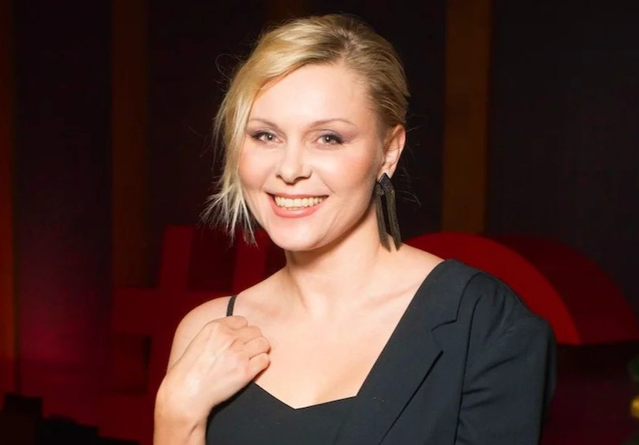

# Яна Троянова: «Рабы — они, мы — свободные люди». Как народная актриса училась жить — путь от инфантилизма к ответственности за себя и страну

- **URL:** https://novayagazeta.ru/articles/2021/06/14/iana-troianova-raby-oni-my-svobodnye-liudi
- **Дата:** 2021-06-14
- **Автор:** Лариса Малюкова

## Яна Троянова: «Рабы — они, мы — свободные люди»

## Как народная актриса училась жить — путь от инфантилизма к ответственности за себя и страну

Яна Троянова. Фото: kino-teatr.ruТроянова — сама страна ОЗ. Артхаусная и народная. Элли и Кабирия, Мордюкова и Шарлиз Терон в одном лице. Сначала ее знали критики и синефилы, потом пришла Ольга — как море полноводная. Тетка из спального района — родня миллионам, из последних сил пытающаяся залатывать треснувшую гармонию окружающего мира. Не залатывается.

Взрывная волна «нового натурализма». Мать в сверлящем сердце «Волчке», «обмякшая от слез» неформалка Гришка с чипсами, динамит Вика из Ебурга, вламывающаяся в чужую жизнь, ангелоподобная Панночка. Если нужно, ведьма и царица, Солоха и простодушная Снегурочка Шабадинова из Малой Ляли, ищущая счастье на улице Трофорезов в пожаре новогодних фейерверков. Актриса «без дна без покрышки».

Незадолго до нашего разговора она прилетела с очередных съемок «Последнего героя» из Африки, с корабля — на бал: начались съемки комедийного сериала по сценарию Василия Сигарева. Поначалу отказалась режиссировать, хотя ее короткометражка «Рядом» получала фестивальные награды.

— Я взвешенно решила не быть режиссером. Но Сигарев снимать отказался. Понимаю его: наше кинопроизводство ужасающе бесправное, сложное. При самых прекрасных замыслах — крошечный бюджет, в итоге невозможность осуществить задуманное. Хочешь заработать — идешь в стыдном кино сниматься. Редкая вещь — гармония коммерции и творчества. А тут отличный сценарий. Вася предлагает снимать мне: «Ты чувствуешь и знаешь мою драматургию». В итоге согласилась, несмотря на отсутствие амбиций, которых, кстати, у меня давно и в актерской профессии нет… Наивернейшая позиция: в неспокойное время легко относиться к своей жизни, потому что в любой момент может все…

— Оборваться… Про что кино?

— Вася, как обычно, пишет про женщину. Даже трогательно, что продолжает думать и писать про женщин.

— А писал, как всегда, на тебя?

— Была для меня роль второго плана. В главных — четыре девчонки. Но есть там алкоголичка. Мне, может, больше всего хотелось сыграть ее, чем режиссировать. Но так карта легла. Мы честно сделали пробы. Я себя проверила. Но снимая себя, можешь потерять контроль над площадкой. Мне однажды сказал Серебренников: «Понимаешь, ты же шаровая молния, тебя надо в коридоры загонять».

— Жаль, что вы с Кириллом ничего не сделали.

— Собирались… Приглашал в спектакль «Кому жить на Руси…». Не получилось по срокам.

«Последний герой». Фото: Лера Звездочкина— Кажется, в твоей жизни многое проистекает из исковерканного детства в поселке под Свердловском, из общения с мамой, женщиной непредсказуемой, в графе «отец» записавшей «Александр Сергеевич» в честь Пушкина, да и фамилию Троянова она выдумала из уважения к Троянскому коню. Где это все сейчас? Важно и дорого или бесследно ушло?

— Это прошлое, которое не хочу забывать, мои корни, моя жизнь. Но оно меня больше не держит.

— Москва меняет?

— Да. Ощущаю себя наконец-то абсолютно взрослым человеком. И мое пристальное внимание к происходящему в стране — тоже взросление. Думаю, мы слишком инфантильны, мы страна подростков, которым нужен строгий воспитатель. Поэтому важно взрослеть, меняться. Вот, к примеру, Сигарев написал сценарий «Медея», который сам не собирался снимать. Была договоренность с продюсером Ромой Борисевичем, что режиссер другой. Но меня не спросили, готова ли я сниматься в материале, который уже пережила, ставшем частью прошлого…

— Мощный материал: мистика, трагедия… Читала сценарий, представляла, что ты Медея.

— Возможно, но я не могу повторяться. Хотя прошлое — да, мое богатство, и многое из него мы перенесли в наше с Васей кино.

— «Волчок» откровенно биографичен. Это твоя мама, твоя история…

— «Волчок» оказался для меня началом моего спуска в личный апокалипсис. И я туда дошла, скажу тебе откровенно. Восхождение из ада дорогого стоило.

Потому так ценю сегодня свою новую жизнь. Трезвую — добавлю. Потому что алкоголь и спасал, и крушил меня.

— Не знаю вообще, у кого хватило бы сил пережить смерть сына…

— Ты понимаешь, в «Волчке» девочка умирает. Мой сын в тот день приходит на съемку… вот он сидит на обочине и смотрит на эту гибель. Это был единственный раз, когда он на площадке появился. И сцена была жирнее, чем в фильме. Я убивалась над погибшей дочерью. Снимали сложно: краны, специальный свет, вырубали и включали светофоры с помощью Главэнерго. Рядом «Уралмаш», народ улюлюкал… В общем, кошмар. А эпизод, по мнению Сигарева, оказывается лишним. Он же наблюдал за моими взаимоотношениями с мамой и говорит: «Нет, горбатого могила не исправит», — и убирает этот финал с плачем, раскаянием героини, отрезает наш самый дорогой съемочный день. Хотя на самом деле в «Волчке» я играла не маму и даже не историю моего детства — Вася ее трансформировал, сделал своей. Скорее так: я играла себя — будущую. Вот парадокс.

Кадр из фильма «Волчок». Режиссер: Василий Сигарев— Но ты же не такая, как она.

— Я тоже прошла этот путь, спустилась в темень. Ведь мать в «Волчке» — адище на двух ножках. Кто она? Черт с рогами.

— Да, с этим разбитым кувшином молока, разбитой детской любовью.

— Разбитой и своей жизнью, пронеслась она мимо всего. Вот и я пронеслась. Мимо сына, мимо каких-то главных вещей, опустилась на дно, чтобы потом подняться.

— Где точки опоры, где взять силы, чтобы из черного болота выкарабкаться?

— Понять, что и не таких сносило. Высоцких, Балабановых… Но гигант ты или муравей, нужно подниматься.

— Про дистанцию с героиней интересно думать. Многие сравнивали тебя с твоей Викой в «Кококо» Авдотьи Смирновой, лихой периферийной маленькой разбойницей, встретившейся с библиотечной интеллигенткой.

— Кстати, я так ее и не поняла окончательно. Просто делала то, что хочет Дуня — по максимуму. И Вику полюбили.

— А многие эту ее манеру — запойное панибратство — узнали… Хотя не такая уж Вика однозначная — не варвар, просто другая. И фильм про столкновение двух миров.

— Ну да, интеллигенции и народа. Но Вика от меня далеко.

— Вот она-то точно осталась подростком.

— И я долго изживала внутреннее тинейджерство. Дуня со своим чутьем это почувствовала. Я ей говорю: «Настоящий инфантил — это я. А что? Девка с Урала, на что рассчитываю? Вечно в приключениях». Она отвечает: «Ну нет, ты не безответственный человек, значит, не инфантил». А я тогда поняла, что я безответственная. Мое падение и означало: «Все, дорогая. Отныне будешь нести ответственность исключительно за свою жизнь». Ни за кого другого отвечать не могу. Ни за то, что происходит в стране, ни за то, что делают мои близкие — только за свою жизнь. Это стало отправной точкой.

Кадр из фильма «Кококо». Режиссер: Авдотья Смирнова— Но ты снимаешь сериал, значит, отвечаешь за людей, которые с тобой работают?

— Люди назначили свой гонорар и должны выполнять работу. Моя задача — правильный кастинг, подбор команды. Вот зона моей ответственности. И я способна расставаться с людьми, не выполняющими свои обязанности.

— А если представить, что возьмешь ребенка в детдоме, ты же об этом думала?

— До определенного возраста, да. А сейчас, видишь, много людей, зная мою историю, об этом думают. Советуют. Мне даже сердобольные дамы из соцсетей присылали фотографии мальчиков… Я им пишу: «Это игрушка, что ли?» Зато я обнаружила, что, оказывается, могу быть полезна большему количеству людей. Искупать все, что наворотила, придется до конца жизни.

— Я была изумлена, прочитав, что у тебя философское образование. Впрочем, ты всегда от него отнекиваешься… хотя написала диплом по психоанализу…

— Скучно это все было, зато страшно любопытно было слушать современных философов, представляющих пусть спорные, но яркие исследования проблем сознания, мышления. Например, Керимова Тапдыга Хафизовича с его учением о социальной гетерологии и генеалогии. Что ты! Каждая лекция — событие. Сидели, раскрыв рот. Потом спорили. Конец 90-х, непонятно, какие профессии получать, иностранное слово «менеджмент» только входит в обиход. Что это? Нас же честно предупредили на факультете: «Мы ничему вас не обучаем. Пытайтесь думать сами. Вы сюда пришли учиться жить». Меня вот это цепануло: учиться жить.

А университет просто дисциплинировал. В школе меня тянули — учиться не любила, все казалась мерзким: система обучения, учителя. У мамы была коллекция мирового джаза, на котором я выросла. За эту запрещенку нас буквально терзали. Вечно куда-то вызывали маму, писали анонимки, приходили с проверками. Мама неплохо разбиралась в политике и объясняла уже тогда, как сохранить себя, почему не надо встраиваться в систему, которая унижает, не дает развиваться.

Университет — запах свободы. Я же не сразу после школы поступила, я родила, ребенком занималась. Потом пришлось развестись. Первые признаки моего внутреннего роста мелькнули тогда, на философском, но я их растеряла. Училась учиться и рассчитывать на себя. Филфак — моя тайная гордость, не более. Я не философ, даже не преподаватель философских дисциплин, хотя есть диплом. Просто каждый этап жизни — сама жизнь. Я же параллельно еще потом в театральный поступила …

Кадр из фильма «Страна ОЗ». Режиссер Василий Сигарев— И ушла оттуда в Малый драмтеатр «Театрон». А потом на таком градусе с сигаревским «Волчком» влетела в кино… Как забыть тот ваш фурор на «Кинотавре». После того как «Волчок» получил три главные награды (режиссура, фильм, лучшая актриса), устроители поменяли регламент: не может один фильм забрать весь призовой фонд.

— Я все ваше жюри тоже помню: и Бодрова, и Сельянова, и Смирнову, и Маковецкого, и тебя…

— Вы еще там ночью на пляже в драку ввязались. Вроде бы Сигарев стал за тебя заступаться, если я правильно помню.

— Ну, не драку, недоразумение дурацкое…

Поддержите нашу работу!

1000 500 300 Нажимая кнопку «Стать соучастником», я принимаю условия и подтверждаю свое гражданство РФ

Если у вас есть вопросы, пишите [email protected] или звоните:+7 (929) 612-03-68

— Всем запомнилась эта диковатая парочка с Урала, предъявившая кино новой непреодолимой силы. И твоя харизматичная провинциальная мамаша: рыжая, безрассудная — разрушительная взрывная сила. Молоко с кровью. Ты вошла в тихое кино нулевых на таком градусе трагедии, казалось — край. А вы его перешагнули, развернув еще более страшную сказку про темноту — «Жить». Я думала: почему они идут путем таких жутких признаний, откровений. Почему?

— Отвечать могу только за себя. Не думаю, что тогда я осознавала, что происходит… Что параллельно экранной течет-растекается моя трагическая жизнь, которую я тут же, в режиме онлайн, транслирую в нашем кино.

— Или, наоборот, кинематограф притягивает беду? Говорят же суеверные актеры, что опасно играть смерть.

— Я считаю Сигарева гением, такие авторы — пророки. Он писал не для меня роль, а про меня: что будет. А предубеждение, что есть роли-проклятья это предрассудки. Талантливый сценарий всегда пророчество.

Нет, я сама шла к своей преисподней. Кинематограф, наоборот, из меня еще что-то вытягивал, делал актрисой. Я получила признание, открылись двери профессии.

Москва распахнулась, сказала: «Троянова, давай работать!»

Авдотья захотела на том же «Кинотавре» сделать комедию с Аней Михалковой и со мной. Во мне видели перспективу. Поэтому благодарна кинематографу за благосклонность.

На «Кинотавре» с Василием Сигаревым. Фото из личного архива Яны ТрояновойНо предрассудки эти сильны. У меня самой был такой бзик: а что это за фильм «Жить», когда тут же у меня вешается сын? Так естественно найти виноватых где-то. Сын захотел повеситься — это его выбор, точка. Не справился с наркотической ломкой, потому что ничего ужасней нет. И мне рассказали потом наркоманы, что двух-трех раз уколоться той гадостью — достаточно, чтобы ломка оказалась несовместимой с жизнью. Может, парень решил нас не мучать… Ну да ладно. Я к тому, что я не переплетала все это в один узел. Просто не понимала, что происходит. Но мы же очень похожи с Сигаревым, примерно одинаково видели мир, и все это записывалось на пленку, впитывалось экраном.

— И амплуа провинциальной хабалки в какой-то момент стало тесным? Актриса мечтает о расширении палитры, режиссеры не любят рисковать, предлагают схожие роли…

— В основном куцые предложения, конечно, мне они неинтересны. Материала хорошего вообще мало, если честно. Хотя что-то предлагали другое, даже в классике. Сваху, к примеру, в современной интерпретации «Женитьбы». Но как-то не захватило. Знаешь, «Ольга» многое дала, но и сильно подпортила мою актерскую историю.

— Как раз к ней идем. К главной народной героине, после которой тебя начали сравнивать с Мордюковой. Ведь твоя Ольга, тетка с яйцами и душой нараспашку, Родина-мать.

— Да ладно, и после «Волчка», «Жить», «Страны Оз» критики о моих героинях писали, что вот она — наша Родина-мать. Смотри, какие разные все матери: гулящая в «Волчке», шатающаяся, как собака, потерявшая хозяина в «Жить» и застенчивая Ленка Шабадинова, не умеющая говорить «нет». И после «Кококо» люди мне говорили о родстве душ, о том, что во мне видят свою. Но сделала мне эту народность Ольга. Я решила не выкобениваться и играть эту «свою среди своих».

Кадр из фильма «Жить». Режиссер Василий Сигарев— Представительницу народа. Вот стою я здесь перед вами…

— А я и есть человек из народа. Конечно, была большая ломка — из артхауса вышагнуть в простой народный сериал… который, кстати, сделан ювелирно. Ведь и критики приняли его, некоторые даже подходили: «Так с кем же она останется: с Григорием или с Володей?» Она же и подвела: потому что кассово, рейтингово. И предложения посыпались калиброванные. «Ольга» подложила мне эту свинью.

— Называю это «синдромом Ганжи», в какой-то момент роль в популярном сериале «Большая перемена» подпортила судьбу великолепного актера Александра Збруева.

— Все захотели «Ольгу» купить, заполучить Троянову, чтобы выдала в разных ситуациях ту же Ольгу. Мне это скучно, к тому же образ Ольги принадлежит «Гуд Стори Медиа», хотя мы вместе его создавали. Там отличные ребята, любящие свое дело.

И не по-джентльменски это — косить деньги, продавая «Ольгу».

— Еще пару сезонов, и она закончится, это же не вечная история…

— И слава богу. Да, еще сезон, и на этом все.

«Ольга», 4-й сезон— Зато сам характер от сезона к сезону рос, становился более сложным. И вот уже возникает история ранимости, оказывается, русская женщина, которая в горящую избу войдет и коня остановит, в какой-то момент сама…

— Тоже ломается, да.

— Даже так: вроде привычно ломает, улучшает и строит других — а ломается сама.

— Вот! Мы с тобой начали с того, что я не несу ответственности за других, а значит, не вправе влиять на их волю. История Ольги так складывается: доломалась — поломалась сама.

— Вы действительно для меня с Сигаревым были всегда единым целым. И когда он заявил на всю страну, что вы не вместе, я сохранила — может, в утешение — идею, что вы останетесь союзниками. А вот сейчас кажется, что вы двигаетесь в разные стороны. Я не про «желтизну»: сошлись-развелись…

— Да мы и женаты не были, потому и не разводились. Это именно союз, да. Веришь ли, в действительности вот это — вместе/порознь — для меня другие вещи означают. Чтобы сформулировать что-то внятное, прежде всего, договоримся, что мужчины и женщины — разные. Василий видит это как: «она разлюбила меня как мужчину»… А я захотела стать отдельной единицей. Ты это называешь: «двинулись в разные стороны». Мне кажется, это хорошо. Василий пишет большую повесть. Мне надо со своей «Ольгой» закончить, вот пошла в режиссуру. Как-то все складывается интересно. Для меня важно было расцепиться. Пришел момент в жизни, когда я уже не понимала: где он, а где я. Представляешь, 18 лет вместе, в этих фильмах, словно переварились. Я не знала: «Волчок» — это моя история или его? Хорошо, а я — где, я — кто?

— А мне кажется, вы еще питательная среда друг для друга: ты вдохновляла его на эти фильмы, он тебе давал роли гигантские, о которых актриса мечтает всю жизнь — дождется ли.

— Поэтому так тяжело от «Медеи» было отказываться. Пришлось, чтобы остаться честной перед собой. Не могу больше эксплуатировать то, что мне дано с любовью… Я это уже не сыграю так, как могла бы раньше. Ведь я знаю этот язык — встану и сделаю, — разве так можно? Надеюсь, Сигарев меня за это ценит. Мне же, пойми, страшно было ему это сказать, потому что «Медея» возникла в моей жизни, когда он ее, как они любят с Колядой говорить: «Тепленькую вот — распечатал с принтера — на!». Я прочитала и вижу: «Опять! Снова туда нырять!» Я решила: «Упс, надо промолчать». Он обижался на меня несколько лет, «Медея»-то давно написана. Мы эту тему отпустили. Другой режиссер приведет свою актрису, это правильно.

— Однажды ты сказала, что профессия актрисы для тебя — необязательна. Кем же ты можешь быть?

— Не знаю. Например, никем.

— Не получится. Ты уже Троянова.

— Была Троянова, будет другая Троянова, хуже или лучше — дело не в этом. Я перестала серьезно к себе относиться.

— Китайцы говорят: «Когда я освобождаюсь от того, кто я есть, я становлюсь тем, кем я могу быть». Надеюсь, еще будут роли мощные…

— Если они возникнут — и сниматься будем, нет — откажемся. Видишь, стало вдруг просто.

— Почему?

— Свободу почувствовала внутри, нельзя ни за что держаться в жизни.

— Жизнь как способность зависеть от себя? Что делать, чтобы почувствовать себя свободным?

— То, что должен делать свободный человек. Не молчать. И все.

— Но в итоге почти все — молчат.

— Неправда. Много людей заговорило, несмотря на репрессии. Я вообще неисправимый оптимист. Считаю, что мы в переломное время живем. И «Дворец для Путина» более 116 миллионов посмотрели. Значит, эти люди знают, что происходит в стране, мы не одни. И вижу молодых, которые, несмотря на опасность, делают посты, пожилых — которые пытаются что-то объяснить руководству страны. Мы идем и смотрим. Cмотрим, что сегодня происходит с нашей страной.

— А ты идешь c плакатом на Красную площадь после отравления Навального вместе со своей подружкой, которая там едва не рожает…

— Да, смешно до ужаса. Ты же понимаешь: человека тогда убивали, как можно сидеть на диване. Мы ночь рыдали просто. Не знаешь, как помочь: молишься, медитируешь… А утром говорят, что жив, но не выпускают из России. Что я могу сделать? Выйти на Красную площадь с пикетом. Моя подруга Ира Вилкова не отстает. Тут заходит Сигарев в квартиру и рассказывает: «Надо же, Венедиктов еще опрос устроил: «Как вы думаете, что случилось с Навальным?»

Я говорю: «Иди на хрен со своим Венедиктовым, мы тут плакат пишем: «Отпусти Навального».

Он говорит: «Пишите: «Путин, запятая, отпусти Навального!» И мы пошли.

На Красной площади. Фото из личного архива Яны Трояновой— И вас забрали в каталажку. После «московского дела» стоишь с плакатом у администрации президента. Участвуешь в «Марше матерей». Не боишься?

— Как любому нормальному человеку мне страшно. Но не позволяю себе бояться. Напротив, каждый раз двигаюсь навстречу своему страху. И он уползает. Важно не обозлиться, помнить, что вокруг тоже божьи дети. Я старалась об этом думать, когда полицейские нас остановили, забрали. Я их не боялась, и они на меня агрессивно не реагировали.

— Тебе повезло просто.

— Не знаю. Вася тоже это отметил, когда его забрали на митинге 23-го, говорил, что полицейские смотрят на нас и про себя взывают: когда мы уже их освободим. Потому что рабы больше они. Мы — свободные люди.

### P.S.
