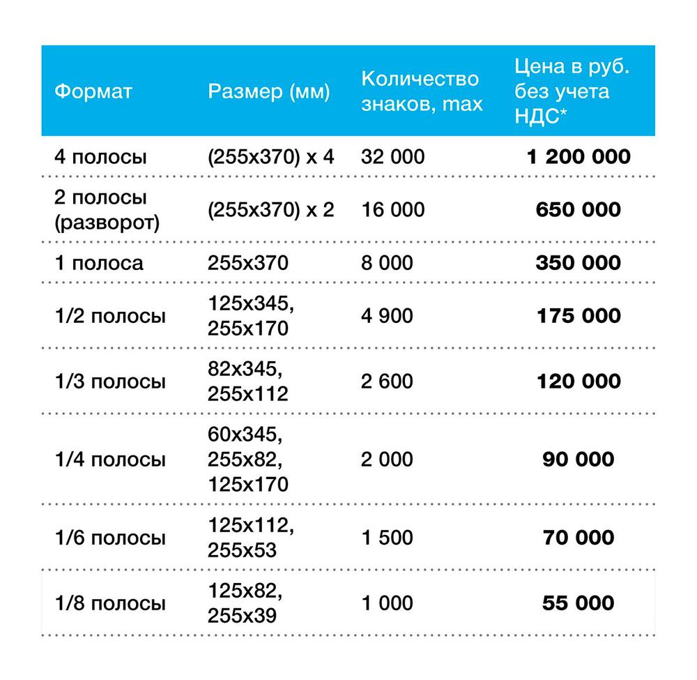

# Единый день голосования 19 сентября 2021 года. Расценки

- **URL:** https://novayagazeta.ru/articles/2021/07/01/edinyi-den-golosovaniia-19-sentiabria-2021-goda
- **Дата:** 2021-07-01
- **Автор:** Лариса Малюкова

## Единый день голосования 19 сентября 2021 года

## Расценки

Опубликовано 2 июля 2021 года

Предложение действует до 18 сентября 2021 года

При заключении договора до 18 августа 2021 года — скидка 15%

В соответствии со ст. 50 Федерального закона от 12.06.2002 № 67-ФЗ «Об основных гарантиях избирательных прав и права на участие в референдуме граждан Российской Федерации», «Автономная некоммерческая организация «Редакционно-издательский дом «Новая газета» (адрес: 101000 г. Москва, Потаповский пер., д. 3), являющаяся редакцией периодического печатного издания газеты «Новая газета» (свидетельство о регистрации ПИ № ФС 77-24833 от 04.07.2006), электронного периодического издания «Новая газета» (свидетельство о регистрации ЭЛ ФС77-28483 от 08.06.2007), выражает свою готовность предоставить печатную площадь в газете «Новая газета» и предоставить возможность размещения в электронном периодическом издании «Новая газета» на интернет-сайте www.novayagazeta.ru для предвыборной агитации зарегистрированным кандидатам по выборам, назначенным на 19 сентября 2021 г.:

- выборы депутатов Государственной Думы Федерального Собрания Российской Федерации восьмого созыва;
- выборы высших должностных лиц субъектов Российской Федерации: выборы губернатора Ульяновской области, выборы губернатора Тульской области, выборы губернатора Тверской области, выборы главы Чеченской Республики, досрочные выборы губернатора Хабаровского края, досрочные выборы губернатора Белгородской области, досрочные выборы главы Республики Мордовия, досрочные выборы губернатора Пензенской области, досрочные выборы главы — председателя Правительства Республики Тыва;
- выборы депутатов законодательных (представительных) органов государственной власти субъектов Российской Федерации: выборы депутатов Московской областной Думы, выборы депутатов Законодательного собрания Санкт-Петербурга седьмого созыва
- дополнительные выборы депутатов Московской городской Думы седьмого созыва.

на следующих условиях

### Тарифы на размещение предвыборной агитации в газете «НОВАЯ ГАЗЕТА»

* НДС начисляется в соответствии с законодательством РФ.

— последний день подачи заявки — «13» сентября 2021 г.

### Тарифы на распространение печатных агитационных материалов путем вложения в газету «НОВАЯ ГАЗЕТА»

Поддержите нашу работу!

1000 500 300 Нажимая кнопку «Стать соучастником», я принимаю условия и подтверждаю свое гражданство РФ

Если у вас есть вопросы, пишите [email protected] или звоните:+7 (929) 612-03-68

* НДС начисляется в соответствии с законодательством РФ.

— не включенные в таблицу возможности могут согласовываться в ценовой привязке к заявленным позициям;

— распространение агитационных материалов через вложение в «Новую газету»;

— форматы А5 (145х210 мм), А4 (210х290 мм), А3 (289x400 мм);

— при формате менее А5 может быть 1 лист, при этом плотность бумаги не менее 150 гр./кв. м;

— последний день подачи заявки — «13» сентября 2021 г.

### Тарифы на размещение предвыборной агитации в электронном периодическом издании «НОВАЯ ГАЗЕТА» на интернет-сайте NOVAYAGAZETA.RU

* НДС начисляется в соответствии с законодательством РФ.

— таргетинг + 30%;

— последний день подачи заявки — «13» сентября 2021 г.

— технические требования к баннерам — https://specs.adfox.ru/

* НДС начисляется в соответствии с законодательством РФ.

— последний день подачи заявки — «13» сентября 2021 г.

## КОНТАКТЫ:

E-mail: [email protected]

Телефон: + 7 495 648-35-01
