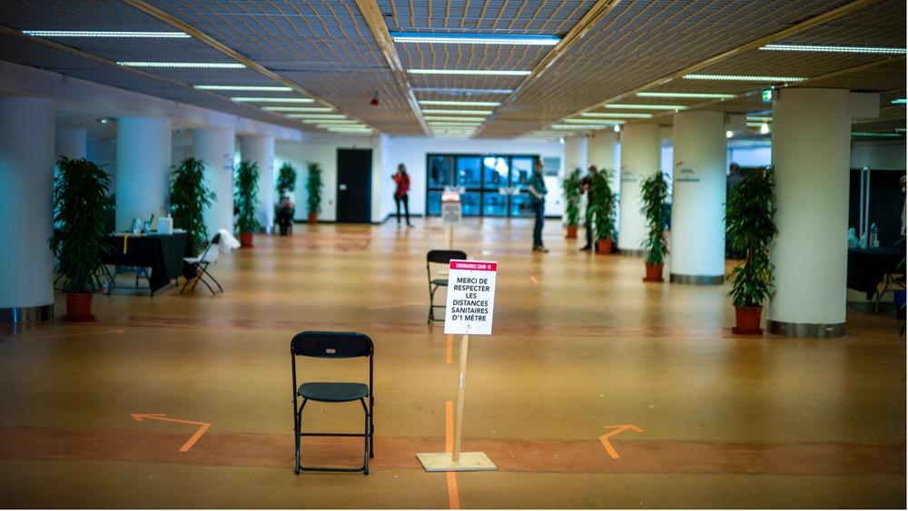

# Покидая скамейку запасных. Каннский фестиваль борется с ковидом, надеясь на терапевтическую силу качественного кино. Обзор программы

- **URL:** https://novayagazeta.ru/articles/2021/07/03/pokidaia-skameiku-zapasnykh
- **Дата:** 2021-07-03
- **Автор:** Лариса Малюкова

## Покидая скамейку запасных

## Каннский фестиваль борется с ковидом, надеясь на терапевтическую силу качественного кино. Обзор программы

Канны во время пандемии. Фото: Arnold Jerocki / Getty6 июля открывается главный киносмотр мира. Офлайн, но с беспрецедентными мерами защиты от пандемии. Насколько эти меры окажутся эффективными, покажет время.

В 2020-м именно Каннский из всех главных кинофестивалей пострадал от пандемии. Берлинский проскочил в феврале перед падением занавеса — локдауна. Венеция надела маски и показала фильмы сокращенной программы. В гибридном формате прошли фестивали в Санденсе, Торонто, в Сан-Себастьяне. Канны-2020 отменили. После Второй мировой это случалось лишь дважды: в 1948-м и 1950-м фестиваль не состоялся по экономическим причинам. В 1968-м он был прерван студенческими протестами.

И вот перенесенный с мая на жаркий июль фестиваль расстелил красную дорожку и изо всех сил пытается вернуться в физическую реальность.

Покидая скамейку запасных, Каннский смотр утверждает специальный медицинский регламент. Гости обязаны соблюдать социальную дистанцию — ради этого изменят систему очередей. В зал можно войти только в медицинской маске, ее рекомендуется не снимать и на улице. На Круазетт будет работать медицинский центр и скрининг-лаборатория для взятия анализов на COVID-19. Журналистам без признанной в Европе вакцины надо раз в два дня сдавать ПЦР-тест. На мероприятия, где ожидается больше тысячи участников, можно пройти только при наличии специального паспорта здоровья. Прибывшим из стран «красной зоны», в которую попала и Россия, придется отбывать 10 дней на карантине.

Правила карантина довольно странные: из отеля можно выходить на два часа, и в эти два часа практически все позволено, в том числе посещение кафе.

В официальном конкурсе 24 картины, выбранные из 2000 заявок. Часть фильмов, как «Петровы в гриппе» Кирилла Серебренникова, были приглашены еще в прошлом году и ждали своего часа (хотя некоторые продюсеры отдали киноленты из прошлогодней программы в Венецию, на Берлинале, выпустили на онлайн-платформах).

Конкурс, собранный за два года, обещает особенно яркие кинособытия — во всяком случае, встречи с самыми именитыми режиссерами мира. Многие из них уже побеждали на Круазетт: Нанни Моретти, Жак Одиар, Апичатпонг Вирасетакул, Франсуа Озон, Бруно Дюмон, Асгар Фархади и Поль Верхувен. Конкурс уже назвали маскулинным, хотя среди претендентов на каннское золото четыре картины сняли женщины: Ильдико Эниеди, Миа Хансен-Лав, Джулия Дюкурнау и Катрин Корсини. В большей степени пострадало новое независимое кино — кажется, отборщики не решились ставить на темных лошадок и вывели на авансцену в основном мэтров.

## Самые ожидаемые фильмы

Фильм открытия фестиваля — сюрреалистический мюзикл «Аннетт» Леоса Каракса (его «Дурная кровь» победила на Берлинале, а «Корпорация «Святые моторы» прогремела в Каннах) с Марион Котийяр и Адамом Драйвером.

Картина про то, как рождение дочери с особенным даром взрывает предсказуемое течение жизни семейной пары — оперной певицы и стендап-комика. Сценарий сочинен знаменитым поп-дуэтом Sparks. Именно на Каннском фестивале музыканты встретились с Караксом, рассказали о замысле, и режиссер загорелся идеей снять фильм.

Съемки затянулись на несколько лет. В марте 2017-го Amazon Studios приобрел права на дистрибуцию.

«Французский вестник. Приложение к газете «Либерти. Канзас ивнинг сан» — 10-й полнометражный фильм американского режиссера Уэса Андерсона, известного уникальным стилем работ, обладателя приза за режиссуру на Берлинале.

«Французский вестник» расскажет историю жизни редакции вымышленного еженедельного журнала начала прошлого века. В картине снимались Тимоти Шаламе, Тильда Суинтон, Оуэн Уилсон и другие. А режиссер «Семейки Тененбаум», «Поезда на Дарджилинг» и «Королевства полной луны» видит свое новое кино как любовное послание журналистам. Не всем, разумеется, — лишь тем, кто готов отстаивать право писать о том, что считает важным.

Действие драматической эксцентриады вертится волчком в несуществующем французском городке. Три сплетенных сюжетных линии связаны с журналистскими заметками. Скорее всего, прототипом киношного издания стал любимый Андерсоном The New Yorker, а прототипом персонажа Билла Мюррея — Артура Ховитцера-младшего — соучредитель и первый главный редактор The New Yorker Гарольд Росс. Эдриен Броуди играет арт-дилера Джулиана Кадацио, списанного с известного британского арт-дилера Джозефа Дювина (в 1951-м The New Yorker посвятил ему целую серию очерков). Прототипами журналиста, сыгранного Джеффри Райтом, оказались писатель Джеймс Болдуин и журналист А. Дж. Либлинг.

Кадр из фильма «Французский вестник»

Провокационный эротический триллер вечного бунтаря и возмутителя устоев Пола Верховена («Основной инстинкт», «Вспомнить все», «Она») о монахине XVII века, защитнице свободных нравов Бенедетте Карлини, открывшей в себе способности творить чудеса в разгар чумы. В молодости ее посещали религиозные и эротические видения. Впоследствии Карлини стала настоятельницей монастыря в тосканской коммуне Пеша, но вскоре ее обвинили в сексуальных сношениях с сестрами и одержимости дьяволом, лишили сана и отправили в тюрьму.

Фильм снят на основе книги историка Джудит С. Браун «Нескромные поступки: жизнь монахини-лесбиянки в Италии эпохи Возрождения».

Кадр из фильма «Непорочная дева»

В фильме-исследовании современных отношений французского режиссера, обладателя «Золотой пальмовой ветви» Жака Одиара («Профессионал», «Пророк», Братья Систерс») сыграли четверо друзей: Люси Чжан, Макита Самба, Ноэми Мерлан и Дженни Бет. Три девушки и парень: друзья? любовники? Но есть еще четвертый — черно-белый Париж, перед чарами которого никто из них не способен устоять.

Поддержите нашу работу!

1000 500 300 Нажимая кнопку «Стать соучастником», я принимаю условия и подтверждаю свое гражданство РФ

Если у вас есть вопросы, пишите [email protected] или звоните:+7 (929) 612-03-68

Фантастический альянс сочинителя киноснов о пограничье смерти и жизни, обладателя «Золотой пальмовой ветви» Апичатпонга Вирасетакула («Дядюшка Бунми, который помнит свои прошлые жизни») и «инопланетной» Тильды Суинтон, которая стала сотворцом и продюсером фильма.

Картина о последствиях гражданской войны в Колумбии, продолжавшейся десятилетия вплоть до недавнего времени. О ее разрушительной силе. О колониальной истории страны. «В 70-е и 80-е там были очень жестокие времена, — говорит режиссер. — Когда вы ехали на машине, можно было легко наткнуться на бомбу. Транспорт все время останавливали — и ты не знал почему. Люди жили в постоянном страхе, что-то придумывали. И мой фильм будет о такой ситуации: когда ждешь чего-то, но не знаешь, что именно случится». Режиссер исследует проблему, касающуюся многих стран: как коллективная память порождает чувство страха.

Впервые Вирасетакул снимал за пределами Таиланда. Для него каждый фильм — путь в тайное, запредельное. «Мы что-то себе выдумываем, а потом сами же этого боимся, — говорит режиссер об источниках вдохновения. — Фильм как раз об этом — об ожидании, что произойдет что-то, о чем ты не знаешь».

Двукратный обладатель премии «Оскар» иранский режиссер Асгар Фархади («Разделение», «Продавец») снял с присущей ему обстоятельностью очередную драму, в которой житейская ситуация становится катализатором саспенса. Снимали в Ширазе — одном из символов иранского искусства, и это увеличивает мировую популярность работы, посвященной «больным современным проблемам нашего общества».

Кадр из фильма «Герой»

Фильм Ильдико Эньеди («О теле и душе») — экранизация внушительного, но вязкого романа Милана Фюшта, номинированного на Нобелевскую премию. О превратностях любви, изменах.

Капитан Якоб Штэрр заключает пари с приятелем, что женится на первой женщине, которая переступит порог кабачка, где они коротают время. Избранницей становится ветреная француженка Лиззи (Леа Сейду). Обворожительная, но неверная…

Милан Фюшт исследует «психологию любви». Эньеди препарирует самые темные, потаенные стороны души своего героя, в его лице выражая сочувствие слабому и несовершенному мужскому полу.

Кадр из фильма «История моей жены»

В драме Мии Хансен-Леве пара американских кинематографистов (Тим Рот и Вики Крипс) совершают паломничество на остров Форё, чтобы вдохновиться воздухом и пейзажами места, где жил и снимал свои легендарные картины Ингмар Бергман.

Кадр из фильма «Остров Бергмана»

## Российские картины

Об обширном представительстве картин наших кинематографистов на фестивале «Новая» уже писала. Напомним, что в основной конкурс отобраны «Петровы в гриппе» Кирилла Серебренникова и продюсера Ильи Стюарта, а также фильм финского режиссера Юхо Куосманена «Купе номер шесть», сопродюсерами которого выступили Сергей Сельянов и Наталья Дрозд, в главной роли снялся Юра Борисов.

Читайте также

Канны не пройдут мимо

На фестивале — бенефис нашего нового кино

В «Особом взгляде» — «Дело» Алексея Германа-младшего (продюсер Артем Васильев) и «Разжимая кулаки» Киры Коваленко (продюсер Александр Роднянский). Во внеконкурсной программе — израильский анимационный фильм «Найти Анну Франк» (продюсер Александр Роднянский). В программе Cinéfondation — «Белой дороги!» Эллы Манжеевой.

Анимационный VR-сериал «Под подушкой» Георгия Молодцова включен в секцию Cannes XR. Георгий — новатор, последовательно расширяет границы кино. «Под подушкой» — мультиформатная история, погруженная в виртуальную реальность, которая побуждает ребенка в каждом из нас создавать воображаемого друга, а заодно узнавать нечто новое о себе — например, о спрятанных в дальний угол мечтах.

Поддержите нашу работу!

1000 500 300 Нажимая кнопку «Стать соучастником», я принимаю условия и подтверждаю свое гражданство РФ

Если у вас есть вопросы, пишите [email protected] или звоните:+7 (929) 612-03-68
