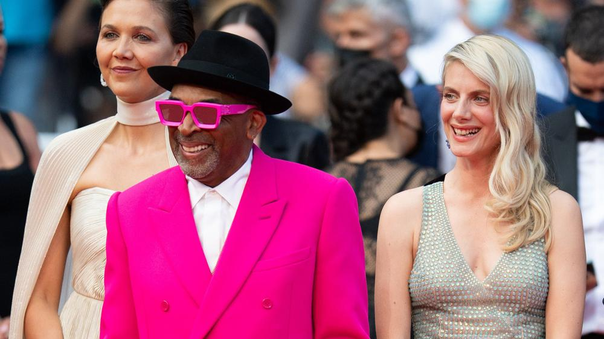

# Розовый смокинг на красной дорожке. В жестких условиях пандемии в Каннах стартовал 74-й кинофестиваль

- **URL:** https://novayagazeta.ru/articles/2021/07/09/rozovyi-smoking-na-krasnoi-dorozhke
- **Дата:** 2021-07-09
- **Автор:** Лариса Малюкова

## Розовый смокинг на красной дорожке

## В жестких условиях пандемии в Каннах стартовал 74-й кинофестиваль

Фото: Samir Hussein / WireImageКаннский фестиваль наконец-то расстелил красную дорожку. Немецкая актриса Айрис Бербен фланировала в дизайнерском платье-послании, где крупными буквами сиял девиз «Вместе сильнее». Джоди Фостер позировала с фотографом Александре Хедисон, с которой они недавно зарегистрировали брак. У Фостер на церемонии открытия была главная роль. Она получила «Золотую пальмовую ветвь» за вклад в кинематограф из рук Педро Альмодовара, который, сняв черную маску, посвятил ей краткий панегирик.

Фестиваль открыли на разных языках: по-французски (Фостер), по-корейски (обладатель каннского золота за «Паразитов» Пон Чжун Хо), по-английский (Спайк Ли).

Наряды нарядами, но участники фестиваля должны соблюдать строгий протокол. Для некоторых профессионалов из неблагополучных стран следует повторять тест каждые 48 часов, иначе в фестивальный дворец не пустят. На тему ограничений гуляют мемы и шутки. Но фестиваль делает все возможное, чтобы существовать физически — не виртуально.

Фото: Olivier Anrigo / Getty Images

Четыре тысячи тестов в день. Как сказал Тьерри Фремо, правило касается и звезд. Правда, им «тестовую услугу» окажут с доставкой в отель. Конфиденциальность гарантирована, проезд оплачивается. Некоторые съемочные группы добавили в свой состав «собственного врача или медсестер, чтобы они сами проводили анализы», объяснил Фремо.

Удивительно ли, что в первые фестивальные дни программа обнаружила: главными в фильмах актуальных режиссеров оказалась тема смерти, которая, как встарь, рифмуется с любовью.

## Аннетт на шее

Открылись трагическим мюзиклом Леоса Каракса на музыку группы Sparks.

Очередного фильма Каракса ждали девять лет. И вот — декларативная, странная, во многом автобиографическая картина. Арт-провокация сочинителя миров «Дурной крови» и «Корпорации «Святые моторы» — лучшая из возможных увертюр для главного форума авторского кино. Путешествие за край ночи в разгар мировой чумы.

Режиссер Леос Каракс представляет в Каннах фильм «Аннетт». Фото: Andreas Rentz / Getty Images

Идея, сценарий и музыка — сверкающих с 70-х братьев Sparks Рассела и Рона Мэла.

У самого фильма тоже есть пролог. Рон, Рассел и Каракс в студии звукозаписи. К Караксу приближается его и его погибшей жены Екатерины Голубевой дочь Настя.

«Можем начинать?» Мотор идет. Они выходят на улицу Санта-Моники — те, кто с песней по жизни шагает, — и к ним присоединяются актеры, хор, массовка, по ходу переодеваясь и надевая парики — превращаясь в персонажей.

Действие разворачивается в Лос-Анджелесе.

Генри (Адам Драйвер), популярный стендап-комик, мчит на мотоцикле навстречу своей всепоглощающей любви — знаменитой оперной певице Энн (Марион Котийяр). У них появится улыбчивая дочь Аннетт, временами выглядящая как Пиноккио или кукла Чаки из слэшера «Проклятие Чаки» — производное их звездного нарциссизма.

Жизнь звезд вся «за стеклом»: публика и папарацци следят за каждым их шагом, готовясь обожание заменить ненавистью.

Впрочем, Генри пробуждает и провоцирует темные чувства зала в жестких антикомедийных спичах, ощерившихся горечью, шокирующих самоуничижением. Его шутки о вере, сексе, политике вызывают оторопь. Неслучайно он выходит на сцену в боксерском халате с капюшоном, его выступление — поединок с залом: кто кого. И пока Энн в машине ест райское яблоко, Адам Драйвер на всех парах на гоночном мотоцикле везет своего персонажа прямо в ад.

Поддержите нашу работу!

1000 500 300 Нажимая кнопку «Стать соучастником», я принимаю условия и подтверждаю свое гражданство РФ

Если у вас есть вопросы, пишите [email protected] или звоните:+7 (929) 612-03-68

Кадр из фильма «Аннетт». Источник: Kinopoisk

Каракса не отпускает тема путаных любовно-вражеских взаимоотношений человека и его таланта. Кто кому принадлежит? Кто кого монетизирует? И публика — участник этой битвы, готова внимать звезде и… манипулировать ею. «Я убил сегодня свою аудиторию», — заявляет Генри. «А я спасла их», — отвечает Энн.

Впрочем, чтобы спасти, надо умереть. И опера дает ей щедрую возможность каждый день то Дездемоной, то Чио-Чио-Сан умирать на сцене, и современные театральные постановщики обыгрывают изощренно ее смерть, раскрашивая кровью наряды, геометрические декорации, ее рыжий парик. Ее сценическая смерть — репетиция подлинной.

Каракс экспериментирует, окуная историю в театрализованное цифровое пространство (оператором является изобретательная Кэролайн Шампетье, которая снимала и «Корпорацию «Святые моторы»), играет с жанрами. Смешивает несоединимое: грубоватую рок-оперу с мелодрамой и роком. Иронизирует над злободневными темами вроде скандалов и признаний#meetoo.

Балансируя на грани нервного срыва, «Аннетт» взывает ко многим сюжетам от архетипических «Русалки» до «Пиноккио», угадываются интонации и «Танцующей в темноте», и «Шербурских зонтиков», и «Призрака оперы». Есть приветы Жану Виго и Мелвиллу, Жорджу Кьюкору и его драме «Звезда родилась» с негасимыми Джуди Гарленд и Джеймсом Мэйсоном. Есть самоцитаты из «Святых моторов». Глядя на милую Аннетт, не к ночи вспомнишь и злобного манекена-чревовещателя из британского хоррора «Мертвая ночь».

Кадр из фильма «Аннетт». Источник: Kinopoisk

Депрессивно-карнавальный нуар о таланте, славе, самолюбовании, убивающих любовь, — нет, не идеальный шедевр, как показалось кому-то из моих коллег. Есть банальные мелодраматические ходы (как история соперников, до смерти влюбленных в Аннетт). Смущает вокальная патетика во время интимных сцен, особенно когда поющий Генри выползает между колен Энн. Но предсказуемость срезается иронией. Мелодраматизм компенсируют врезавшиеся в память фантастически придуманные эпизоды. Например, смерть микрофона на сцене во время шоу. И Генри приходится делать ему искусственное дыхание. Но нет, сердце микрофона остановилось. Только ли микрофона… Есть отличные музыкальные номера, есть поэзия. В конце концов, авторский азарт и безумие этого «анти-ла-ла-ленда» вынуждают забыть о помехах, и ты аплодируешь по-настоящему нетривиальной попытке соединить кино и музыку.

Однажды Каракс рассказал о своем сне: «Было утро, я открыл газету и прочитал: «Три хорошие новости: Леос Каракс умер…» Я удивился, потому что думал, что Леос Каракс — это я. И испытал огромное облегчение. Три хорошие новости в одной! Я не Леос Каракс, я не умер, а Леос Каракс умер!»

Завершается этот интимный фильм-дневник режиссера, который не умер, посвящением дочери Насте. В титрах Каракс выражает личную благодарность Эдгару По, Рене Магритту и Кингу Видору. Ну что же, хороший ряд, Каракс в него вписывается.

## Смерть ей к лицу

В первые фестивальные дни состоялось еще одно кинопризнание — Франсуа Озона «Все прошло хорошо». Это адаптация книги Эммануэль Бернхейм, в которой рассказывается ее собственная история: отец писательницы, знаменитый искусствовед и скульптор, попросил ее помочь ему умереть.

Один из лучших французских актеров Андре Дюссолье играет упрямого 80-летнего старика, который просит дочь Эммануэль (Софи Марсо) помочь ему прервать долгое и мучительное доживание после инсульта. Звучит ужасно безнадежно. И если в анонсе будет краткое изложение сюжета, оно может отпугнуть зрителя.

Франсуа Озон представляет фильм «Все прошло хорошо». Фото: Pool / Getty Images

Озон же снял тонкое, не лишенное юмора кино, в котором размышляет о принятии смерти. И о любви, разумеется, в самых разных ее ипостасях.

Совершенно новая, зрелая, но по-прежнему прекрасная Софи Марсо, «шальная любовь» Франции, — в сложнейшей роли дочери, которая оказывается перед мучительным выбором и все же становится на сторону отца, хотя с ним у нее всегда были непростые отношения. Эммануэль и ее сестра, а также колеблющаяся союзница Паскаль (Жеральдин Пайяс) до последнего момента надеются, что редкие удовольствия жизни (поездка в любимый ресторан, концерт внука) заставят старика передумать. Но Андре непреклонен. Эммануэль находит через интернет швейцарскую организацию «Право умереть с достоинством». Кстати, очень недешевое это дело — «культурная эвтаназия». «Как же это делают бедные?» — интересуется Андре. «Они ждут смерти», — отвечает Эммануэль. Вскоре из Швейцарии явится и тихий, ласковый ангел смерти (великая Ханна Шигулла), который расскажет с удивительным тактом и человечностью, как их отец совершит этот «переход» в инобытие. Вместе они будут выбирать дату, чтобы подальше от дня рождения детей. Будет оговорена даже музыка: соната Брамса. Эммануэль и ее сестре придется преодолеть целый ряд препятствий: донос в полицию (во Франции эвтаназия запрещена), возмущение американской родни, выжившей в Холокост ради того, чтобы жить…

О прощании с самыми близкими. Для Озона это тоже личная история. Она посвящена Эммануэль Бернхейм — его подруге и соавтору («Под песком», «Бассейн», «5х2». Несколько лет назад Эммануэль умерла от рака. Но на экране оживает ее история. «Эммануэль так мечтала о Каннах!» — скажет Озон.

Поддержите нашу работу!

1000 500 300 Нажимая кнопку «Стать соучастником», я принимаю условия и подтверждаю свое гражданство РФ

Если у вас есть вопросы, пишите [email protected] или звоните:+7 (929) 612-03-68
