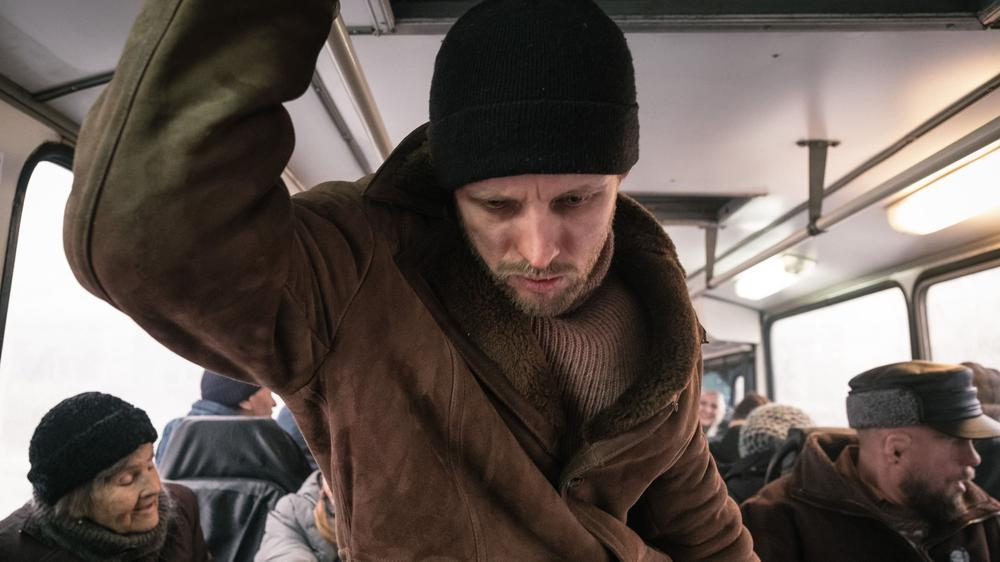

# «Петровы в гриппе» и другие кошмары Кирилла Серебренникова. На главном кинофестивале мировая премьера фильма режиссера, которого в Канны не пустили. Ему запрещено покидать территорию РФ

- **URL:** https://novayagazeta.ru/articles/2021/07/12/petrovy-v-grippe-i-drugie-koshmary-kirilla-serebrennikova
- **Дата:** 2021-07-12
- **Автор:** Лариса Малюкова

## «Петровы в гриппе» и другие кошмары Кирилла Серебренникова

## На главном кинофестивале мировая премьера фильма режиссера, которого в Канны не пустили. Ему запрещено покидать территорию РФ

Кадр из фильма «Петровы в гриппе»Зачин, как у Сальникова в романе. В троллейбусе, населенном безумцами, горемычными, обиженными, оскорбленными со своими заезженными темами: Горбачев страну продал, Ельцин пропил, золото партии, таджики, евреи, стрелять… Если вы бывали в том последнем троллейбусе, знаете.

У нас и без пандемии — птичьей ли, мышиной ли, политической̆, судебной — реальность разогрета до жаркого бреда. И стоит ли удивляться пожухлой кондукторше-Снегурочке, турагентству «Ад», внезапному расстрелу зазевавшихся нарядных господ или соло вставной челюсти. Видали всякое. Поэтому вместе с гриппозными автослесарем Петровым (Семен Серзин), его женой библиотекаршей Нурлынисой (Чулпан Хаматова) и их заболевшим сыном — путешествуем из огня температурной лихорадки да в полымя тусклой провинциальной̆ хтони, из жизни — в смерть и обратно. Мчим на катафалке меланхоличного Харона — водилы труповозки (Николай Коляда)в пограничье между царством мертвых и живых вместе с внезапным дружком Петрова безбашенным авантюристом Артюхиным Игорем Дмитриевичем (Юрий Колокольников с азартом перевоплощается в травестированного Мефисто, инициалы которого складываются в «Аид»). Из тесного «здесь» — в воображаемое «далеко с грибными дождями». Ау, есть кто живой? Участвуем в заседании литкружка в районной̆ библиотеке, где служит Нурлыниса Петрова, и критик Анна Наринская ставит на место местных поэтов, цитируя неместного Мандельштама. Водим хороводы с бледной токсикозной Снегурочкой (Юлия Пересильд), помогаем уйти из жизни незадачливому писателю с амбициями (привет эрдмановскому «Самоубийце», в роли бумагомарателя — Иван Дорн).

Кадр из фильма «Петровы в гриппе»

Путаем, как вся страна до самых до окраин, — галлюцинации с новостями. Нурлыниса, страдающая манией убийства, разделочным ножом режет незнакомцев, но вроде бы готова и своих. У кого здесь 39,5? Этот стон у нас дискотекой зовется, он вырывается джинном из всегда включенного телевизора и вьюжит, пуржит. Гагарин с Пушкиным со стен библиотеки взирают на ильфо-петровскую драку между доморощенными поэтами и жарким сексом Петровых между книжками на буквы «О» и «Е». Смерть (воображаемая? реальная?) вертится в стиральной машинке вместе с зеленым пальто Нурлынисы, и на выжиме пальто истекает кровью. Она течет по разделочной доске, струится по горке во дворе. Смерть похожа на Снегурочку на новогодней елке в детстве Петрова. Его рука была огненной, ее — ледяной.

В отличие от книги Сальникова и спектакля в «Гоголь-центре» Кирилл Серебренников и оператор Влад Опельянц сочиняют поэму в сбивчивых белых стихах, в каждом эпизоде сталкивая рифмы, цитаты, подсмотренные детали.

Разворачивают картину множественности миров. Каждый строитель своего темного космоса или его макета. Здесь у всех вторые лица и тайные сущности. Скучная библиотекарша превращается в одержимую и страдающую женщину-Амок. Интеллигентный автослесарь — в проекцию убийцы, дама из самодеятельного театра — в мента или в человека-рыбу (у актера-оркестра Трибунцева не сосчитать здесь ролей̆), а сладострастная богиня-Снегурочка, глазами раздевающая мужчин, оказывается скромной провинциалкой с трудной судьбой. Вышел месяц из тумана, вынул ножик из кармана. Покойник убежит. Писатель — нет. Маленький человек Петров, возомнивший себя художником, попытается по-свифтовски рассмотреть свою маленькую жизнь с точки зрения неба. Да температура помешает. И аспирин 77-го года выпуска не поможет. Или поможет? И Петров все рассмотрит? И теперь мы видим вещий сон, в котором, как в кальдероновской фантазии, явь и сновидения пьют на брудершафт. Это лабиринт во внутреннее пространство, смежное с внешним. Не знаешь, в какой нехорошей квартире проснешься, в какое воспоминание провалишься на экваторе Нового года, который всегда рубеж, переход под бой часов. Время вместе с зайчиками, снежинками и космонавтами скачет вокруг Елки в разные стороны, причинно-следственные связи разорваны и наспех склеены «Моментом».

Фильм сам похож на елку с перепутанными игрушками: старые советские, блескучая мишура 90-х, папье-маше нынешнего пыльно-безликого промежутка.

Поначалу глаз режет чрезмерность, аляповатость, шумный эмоциональный перехлест, впрочем временами родной, узнаваемый: ритуальные услуги предлагаются вместе с искусственными цветами и новогодними лампочками.

Поддержите нашу работу!

1000 500 300 Нажимая кнопку «Стать соучастником», я принимаю условия и подтверждаю свое гражданство РФ

Если у вас есть вопросы, пишите [email protected] или звоните:+7 (929) 612-03-68

Кадр из фильма «Петровы в гриппе»

В редких соприкосновениях дают электрический ток цепкие приметы детства (Сальникова, Серебренникова, нашего?). Манная каша, колючий свитер, снегирь краснопузый непуганый, зеленые бананы, «доходящие» на окне. Сменка и перекрученные колготки, стреножащие легкость бытия. Давайте попросим, чтобы елочка зажглась! Кто тут промолчал, кто тут не сказал? Мама и папа снова превратятся в юных Адама и Еву. Ложечку за маму, ложечку за папу. Почему зима не проходит? Даже летом.

У киноодиссеи «Петровы в гриппе» нет последовательного нарратива, это многослойный трип в мир, приснившийся то ли одному Петрову — то ли миллионам петровых наяву. Каждый переболевает вирусом ностальгии по прошлому самостоятельно, со своими симптомами — врезавшимися в память случайными приметами. В сальниковском романе болезнь (как безумие у Гоголя или Достоевского, наркотики — у Булгакова) — транспорт, на котором он погружает нас в мир, балансирующий между настоящим и бывшим, осязаемым и галлюциногенным, демоническими силами, мистикой и бытовым.

Кадр из фильма «Петровы в гриппе»

Благодаря психологически точной игре (здесь собрана сборная российских актеров всех поколений — от новой звезды Юрия Борисова до мастеровитого Сергея Дрейдена, а монолог выпотрошенной жизнью уборщицы — матери Снегурочки в исполнении кинокритика Любови Аркус — отдельная монодрама) — инфернальная жуть просачивается сквозь щели типовой панельной застройки, заглядывает в окна «синих троллейбусов» и выцветших от времени дворцов культуры и пыльных библиотек. Тронутая безумием реальность или ее колдовская изнанка подмигивает нам из аквариума в малогабиритке, тусклого коридора в литиздательстве, из полыхающей времянки писателя (Иван Дорн в этом долгом эпизоде, снятом едва ли не одним планом, как и Аркус, убедительней иных профессионалов). И сквозь гриппозное марево пыли и благодати проступают и исчезают характеры, судьбы.

Нам ли, не знающим преград, не помнить: контагиозная зараза рассыпается на миллионы частиц быстрее андерсоновского зеркала, манипулируя эмоциями, мыслями, поступками масс, на глазах превращаемых в пациентов. Сюрреализм — путевой лист нашего троллейбуса, летящего вперед без остановки. Пытаемся свыкнуться, хотя трагически невозможно. Как в песне группы «Ноль», звучащей с экрана: «Как-то раз весной в начале мая / Грохот, скрежет, пыль и благодать, / Ехали по улицам трамваи, / Ехали куда-то умирать».

Порой кажется, что при всей ядрености, ядовитости фильму (2:20) не хватает воздуха, внутренней энергии. Экран посильней любого рентгена впитывает не только идеи, фантазии, но и авторское состояние. «Петровых в гриппе» снимали в основном ночами, потому что днем режиссера мытарили в абсурдном мареве кафкианского процесса. (Мы рассказывали о съемках, состоявшихся благодаря усилиям творческой группы и талантливой продюсерской команды Ильи Стюарта, проходивших на рубеже 2019-го и 2020-го. 37 съемочных дней с перерывом на Новый год.)

Кадр из фильма «Петровы в гриппе»

Стоит ли удивляться, что за сверкающей облаткой фильма, за инфернальным бурлеском — ощущение гулкой пустоты, бессилия, бессмысленности неоправданных надежд. И отчетливо ощущается внутренняя связь «Петровых… » с программными спектаклями «Гоголь-центра» — «Мертвыми душами» и «Кому на Руси жить хорошо»: тот же коллективный портрет страны, скользящей на тройке с бубенцами по заледеневшей дороге в непроглядную метель. Тот же монтаж разножанровых сцен, ритмов, черно-белых и цветных, балаганных реприз и психологических конвульсий. И цвета все больше нездоровые, то ядовито зеленоватые, как лицо покойника, то красноватые, пышущие жаром, то дымчато-серые — тоскливые, то черно-белые — как в воспоминаниях или в выдуманной параллельной реальности, в которой порой хочется спрятаться.

Вот так примерно сюр и пишет сценарий высокотемпературной жизни. Гриппозный угар вырывает, вымарывает фрагменты привычной картинки, жирно дописывая галлюциногенными красками «виды» из окна нашего кольцевого троллейбуса с беззубой Снегурочкой-кондукторшей. Ну правда, Русь, чего ты хочешь от меня?

Поддержите нашу работу!

1000 500 300 Нажимая кнопку «Стать соучастником», я принимаю условия и подтверждаю свое гражданство РФ

Если у вас есть вопросы, пишите [email protected] или звоните:+7 (929) 612-03-68
