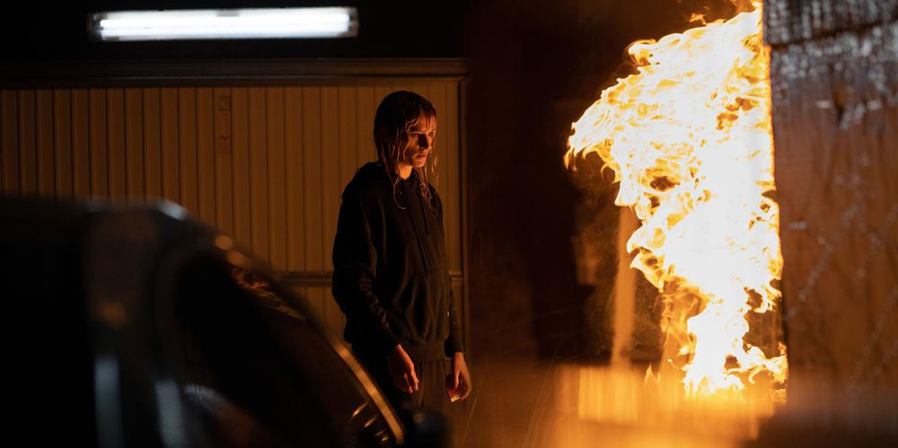

# Пороховой взрыв в Каннах. Эпатажного «Титана» французской режиссерши Джулии Дюкорно встретили аплодисментами и критикой

- **URL:** https://novayagazeta.ru/articles/2021/07/15/porokhovoi-vzryv-v-kannakh
- **Дата:** 2021-07-15
- **Автор:** Лариса Малюкова

## Пороховой взрыв в Каннах

## Эпатажного «Титана» французской режиссерши Джулии Дюкорно встретили аплодисментами и критикой

Кадр из фильма «Титан»

На фоне степенных классиков, снимающих выверенное и, скажем честно, предсказуемое кино, вроде семейной саги «Три этажа» Нани Моретти или драмы морального беспокойства «Герой» Асгара Фархади, пороховым взрывом в каннском конкурсе оказалась мировая премьера эпатажного «Титана» храброй до наглости французской постановщицы Джулии Дюкорно.

Это ее второй боди-хоррор. Первый — «Сырое» — коктейль из секса, перверсий, каннибализма — под струны клавесина — тоже смотрели, зажмурившись. После автомобильной аварии Алексе вживляют в висок титановую пластину, а по сути — безжалостность и неоправданные вспышки гнева. Алекса вроде бы девушка, но больше похожа на гендерквира, и эта гендерная неоднозначность станет пружиной конфликта. Поначалу беловолосая Алекса столь зазывно-эротично танцует на автомобильной выставке, что мужчины теряют дар речи, забыв о машинах. А у самой Алексы как раз неплатоническая связь со своим кадиллаком. После такого, в духе Кроненберга, пламенного автосекса трудно не забеременеть. Из сосков Алексы будет сочиться мазут…

Джулия Дюкарно. Фото: ЕРА

Не сказать, что «Титан» — революционное кино. Дэвид Кроненберг — в анамнезе этого безумного фильма. Его «Автокатастрофа» повествовала о сексуальной девиации любителей получать удовольствие от катастроф. Видимо, скоро все больше будет и зрителей, стремящихся к удовольствию от сильного допинга с превышением «разрешенных препаратов» — усилителей впечатления. В восемь лет Дюкорно посмотрела «Психо», и ужас стал ее путеводной звездой, а Кроненберг — одним из самых любимых режиссеров. В 33 она сняла каннибальский арт-триллер «Сырое» — зрелище не для слабонервных: превращение вегетарианки в каннибала.

«Титан» тоже экстремально жуткий опыт, но визионерски изобретательный, жонглирующий кошмаром и смехом, переворачивающий ожидания.

Поддержите нашу работу!

1000 500 300 Нажимая кнопку «Стать соучастником», я принимаю условия и подтверждаю свое гражданство РФ

Если у вас есть вопросы, пишите [email protected] или звоните:+7 (929) 612-03-68

Самое поразительное, как на глазах преображается жанр и сама история: от полного беспредела (главное оружие социопатки Алексы с ее возмущенным гневом против нахрапистых мужланов и прочих людишек разного пола и возраста — ее заколка, которую она виртуозно вонзает в разные части организма) — к драме о пропавшем сыне.

Читайте также

«Петровы в гриппе» и другие кошмары Кирилла Серебренникова

На главном кинофестивале мировая премьера фильма режиссера, которого в Канны не пустили. Ему запрещено покидать территорию РФ

Сына Адриано потерял начальник пожарной охраны Винсент (Винсент Линдон). И травма его столь громадна, что в обнаруженной на улице Алексе он видит своего Адриана. И постепенно Алекса, как шекспировская Виола, смиряется с этой новой мальчиковой ролью (тем более что ей и от полиции прятаться необходимо). Кульминация «перемены участи», когда хладнокровной киллерше Алексе приходится делать искусственное дыхание — «рот в рот» — умирающей старухе. Папаша Винсент задает ритм «искусственного дыхания», напевая Макарену.

Кадр из фильма «Титан»

Пересказывать эти сюжетные «американские горки» не имеет смысла, да и в пересказе (а временами и на экране) боевитый и решительный сюр выглядит шизофренически. Но снято с такой дерзостью, иронией, с наглыми аллегориями и аллюзиями с Библией — что даже на пресс-показе в финале звучали аплодисменты.

Критики полярно разошлись в оценках, но большинству он не понравился. Мне кажется, «метод Дюкорно» — путь в никуда. И фильм — отличный повод для дискуссии о допустимости сильнодействующих «препаратов» в искусстве. Если так пойдет, вскоре для усиления впечатлений потребуются средства еще более «эффективные». Экран уже научился передавать запахи, почему бы не перейти к ощущениям физической боли? Любопытно, как отнесется к опытам французской режиссерши Спайк Ли, возглавивший жюри. Ведь некогда и спорная «Катастрофа» Кроненберга на Каннском фестивале получила спецприз жюри «За мужество, смелость и оригинальность». Говорят, и российские дистрибьюторы фильм купили. И если они решатся выпустить фильм на экран, то и у российских зрителей будет возможность принять участие в этой животрепещущей — в прямом смысле слова — дискуссии.

Поддержите нашу работу!

1000 500 300 Нажимая кнопку «Стать соучастником», я принимаю условия и подтверждаю свое гражданство РФ

Если у вас есть вопросы, пишите [email protected] или звоните:+7 (929) 612-03-68
