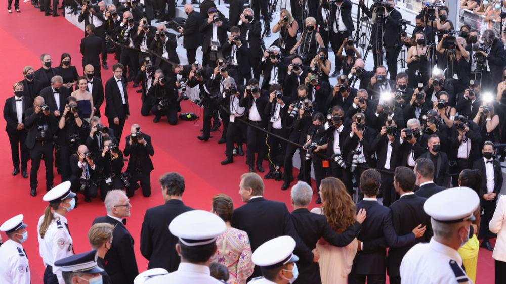

# Канны. Контекст. Завершился 74-й, самый необычный за всю историю существования Каннский фестиваль. Чем он удивил?

- **URL:** https://novayagazeta.ru/articles/2021/07/18/kanny-kontekst
- **Дата:** 2021-07-18
- **Автор:** Лариса Малюкова

## Канны. Контекст

## Завершился 74-й, самый необычный за всю историю существования Каннский фестиваль. Чем он удивил?

Церемония закрытия Каннского фестиваля. Фото: Andreas Rentz/Getty ImagesКанны и QR В эпоху, определяемую словом «ковид», Каннский форум, проходивший офф-лайн, кардинально перестроился. Вместо комфортного мая — душный июль. Значительно меньше журналистов. Но и очереди на показы короче. Вся запись через интернет, где сохранена иерархия бейджей. Нас всех посчитали, и чтобы посетить Фестивальный дворец, пресс-конференцию, журналист делает каждые 48 часов ПЦР тест и предъявляет соответствующий QR код. Для фестивального автобуса свой QR. Думаю, в ближайшем будущем в алгоритме кода будет столько информации, что он вытеснит разнообразные ID и бейджи. Охранник всматривается в черные иероглифы на телефоне и считывает твои данные: когда ты приехал, какие фильмы и события посетил, результат тестирования. Кстати, по кулуарам упорно ползли слухи, что за время фестиваля заметно выросло число зараженных ковидом. Правда, официальной информации об этой тревожной тенденции не появилось.

Из-за пандемии многие звезды не смогли приехать. Но и фланирующих по красной дорожке было достаточно. Билл Мюррей и Мэтт Дэймон, Шэрон Стоун и Изабель Юппер, Мэгги Джилленхол, Тильда Суинтон, Мелани Лоран, Марион Котийяр, Милен Фармер, Тахар Рахим. А вот Леа Сейду, у которой в показе пять (!) картин, до дорожки не доехала — у нее обнаружили ковид. Маски не снимали во время показа, но не на красной дорожке. Соцсети разразились шквалом огня, направленного на директора фестиваля Тьерри Фремо и председателя жюри Спайка Ли. Удивительно и тревожно: кинозалы были забиты до предела, в отличие от Венецианского кинофестиваля, где сохраняли соцдистанцию и каждому зрителю строго указывалось его место. Теперь будем следить из нашего захваченного ковидом далека за пока более-менее спокойными цифрами Ривьеры.

Зрители церемонии закрытия Каннского фестиваля. Фото: Kate Green/Getty Images

## Канны и гендер

Среди главных особенностей фестиваля — «женская оптика». Да, в конкурсе всего четыре постановщицы, но само кино сосредоточено на женщине. Ее чувства, мысли, рефлексии, заблуждения, неожиданные поступки — двигатели историй в фильмах Верховена, Моретти, Озона, Одиара, Дюмона, Триера… «Самый худший человек» Иоахима Триера воздушное драмеди о женщине, о словно случайно выхваченных днях из потока ее жизни, в которой роятся ошибки, путаются клубки отношений, привязанностей. Эссе, разыгранное в одно касание с рассеянным светом и легкими диалогами. И Рената Реинсве (приз за лучшую роль) существует так, словно заглянула в камеру прохожая… Просто камера в нее влюбилась, следует за ней, не может от оторваться.

Рената Реинсве. Фото: Andreas Rentz/Getty Images

А что мужчины? Уязвимые, безумные, безответственные, мошенники, слабые духом, социопаты. Как герой мрачнейшего и притягательного «Нитрама» австралийца Джастина Курцеля («Снежный город»). Про юношу с неустойчивой психикой, его странных отношениях с немолодой богатой наследницей (как в культовом «Гарольде и Мод» Эшби), с вымотанными, уставшими родителями. Про его кипящий разум и путь к ужасающей бойне (история со взбесившимся Мартином Брайантом, расстрелявшим 35 человек в Порт-Артуре). Художник Дамьен в «Беспокойном» Жоакина Лафосса страдает биполярным расстройством, бесконечно мытарит маниакальными вспышками гнева семью. Это особый треугольник, она, он — и болезнь, которая ревнует и не отпускает.

Добросовестная, но старомодная драма Шона Пенна «День флага» поведала нам историю афериста и фальшивомонетчика из 90-х, разбившего сердце дочери. Кажется, сам Пенн, сыгравший главную роль в этом иносказании, винится перед дочерью Дилан (она и играет дочь героя) за свои ошибки и упущенное время. Один из главных вопросов фильма: способны ли люди меняться под своими социальными масками? «Герой» - мастерская, математически выверенная и предсказуемая работа оскароносца Асгара Фархади о запутавшемся в долгах калиграфе Рахиме, ставшем заложником общественного мнения. Время героев кануло в прошлое, стать героем в эпоху диктатуры социальных сетей и навязываемой ими морали невозможно.

Юхо Куосманен и Асгар Фархади Фото: Daniele Venturelli / WireImage

И наконец, самый выразительный среди фильмов про аутсайдеров «Красная ракета» Шона Бейкера. Сатирическая инди-драма о труженике порноиндустрии Майки (Саймон Рекс), вернувшемся в техасское захолустье из Лос-Анджелеса к жене и теще, чтобы перезагрузить жизнь. Перезагрузки не получается, потому что живет он по законам трамповской эпохи: переступая все правила, урви и тащи все, что можешь унести. В том числе собственные ноги. Мощное отрицательное обаяние негодяя, «шершавый реализм» и проблески «новой чувственности» в духе Кассаветиса.

## Канны и искусство

Конечно, по большому счету, главный арт-фестиваль может отбирать все самое ценное, созданное в кинематографе. Поэтому и все претензии — к отборщикам. Программа в общем сложилась интересная, многое объясняющая про нынешнюю реальность. Здесь и желтые жилеты («Перелом» Катрин Корсини), и женская дискриминация (беспомощные «Священные узы» Махамат Салех-Харун), и проблема эвтаназии (тончайшая картина Озона «Все прошло хорошо»)… И яркие трагические события с их подоплекой, и шокирующие фантазии на самые вольные темы. Но Канны ставят в первую очередь на увенчанные славой имена, это их козырь, и слабость. Как не сделать мировую премьеру фильма обладателя «Пальмовой ветви»? Он затаит обиду, и следующую картину отдаст Венеции, Берлинале, Локарно. Так фестиваль становится заложником звездных имен, отвергая возможность открывать новые пути и тренды.

Впрочем, и среди фильмов ветеранов — сверкают образцы подлинного искусства.

Апичатпонг Вирасетакула и Тильда Суинтон во время церемонии закрытия фестиваля. Фото: Pascal Le Segretain/Getty Images

Поддержите нашу работу!

1000 500 300 Нажимая кнопку «Стать соучастником», я принимаю условия и подтверждаю свое гражданство РФ

Если у вас есть вопросы, пишите [email protected] или звоните:+7 (929) 612-03-68

«Память» Апичатпонга Вирасетакула («Тропическая болезнь» и « Дядя Бунми, который может вспомнить свои прошлые жизни») - первый фильм режиссера, снятый за пределами Таиланда. Колумбия. Космическая пришелица Тильда Суинтон играет англичанку-эмигрантку Джессику Она одна слышит внезапные гулкие удары, словно эхо каких-то глубоких сдвигов в мировом пространстве. С помощью звукорежиссера Эрнана они пытаются воссоздать этот шум в цифровом виде. Для Вирасетакула нет границ между сознанием и космосом, далеким прошлым и сиюминутным настоящим, мистикой и реальностью. Здесь одни персонажи реинкарнируются в других, мертвые в живых, память — тоннель к тайнам рождения и смерти, и в этом тоннеле археологи ведут раскопки. Как в неистощимых строках Борхеса, в которых можно присвоить чужую память, например, Шекспира. Воспоминания восстанавливаются, если настроиться на определенные частоты. Джессика, словно антенна, улавливающая эти звуки, не знающая, что с этим знанием делать. Этот очень медленная одиссея из Боготы в джунгли, в тропический дождь, в тени снов и детских воспоминаний, в которых мама перебирает твои пальчики. Замирающие по-буддистски планы, крики обезьян или гибнущих когда-то давно воинов — тебя гипнотизирует, вот-вот и окажешься в другом измерении, где изуродованная принцесса занимается сексом с сомом, сам начнешь видеть прошлые жизни. Твои или Дядюшки Бунми.

Или тихая поэма о жизни и театре Рёсукэ Хамагути — вольная фантазии на тему рассказа Мураками. Герой фильма «Веди мою машину» — актер и режиссер, мучимый идеей свежо, не архаично поставить Чехова. Для поездок в театр нужен водитель, он разочарован тем, что это совсем молодая драйверша. Постепенно время, проведенное в машине под запись репетиций спектакля «Дядя Ваня», соединяет двух чужих, очень разных людей. А монолог Сони про ангелов и небо в алмазах руками произносит немая корейская актриса. «Слышна» и значима каждая фраза. «А когда наступит наш час, мы покорно умрем и там за гробом мы скажем, что мы страдали, что мы плакали, что нам было горько, и бог сжалится над нами».

Саймон Хелберг, Марион Котийяр, режиссер Лео Каракс, Адам Драйвер, Рон Маэл и Рассел Маэл. Фото: Lionel Hahn/Getty Images

И конечно, «Аннетт» Лео Каракса и группы «Sparks» — изобретательный трагический нуар-мюзикл о любовно-враждебных отношениях человека и его таланта, о том, как нарциссизм убивает любовь.

Выбор рок-н-рольщика Спайка Ли, явившегося на церемонию Закрытия в костюме, «заляпанном» кистью художника, очевиден. На фоне досконально выверенных картин мэтров, хотелось отметить нечто драйвовое, живое, неуправляемое. Кстати, Ли и картине Шона Бейкера аплодировал стоя.

Читайте также

Титаны

Жюри захотело свежей крови. «Золотую пальмовую ветвь» неожиданно получил фильм Джулии Дюкорно. Лариса Малюкова — с итогами Каннского кинофестиваля

## Канны и Россия

За отечественное кино, правда, было не стыдно. Два фильма в конкурсе: «Петровы в гриппе» Кирилла Серебренникова и финско-российский — «Купе номер шесть» Юхо Куосманен. «Петровых в гриппе», полностью погруженных в российский контекст, со всплесками неисчезаемого прошлого в настоящем, с зияющей дырой в календаре под название Новый год — иностранцем понять непросто. На пресс-конференции невыездной Кирилл Серебренников общался с прессой по зуму, и объяснял журналистам, интересующимся эстетикой абсурда и черной фантазией его кино: «Все, что вы видите в фильме — так и есть. Это наша жизнь». Еще спрашивали о плодотворности опыта, приобретенном за время «домашнего ареста». Он отвечал, что успел сделать много, но потом дал совет: «Даже не пытайтесь этот опыт повторить. Искренне не советую». Кстати, оператор фильма «Петровы в гриппе» Владислав Опельянц награжден премией Высшей технической комиссии за мастерство.

Нежное меланхолическое роуд-муви «Купе номер шесть» (совместное производство Финляндии, России и Эстонии), снятое на русском языке, удостоено Гран-при жюри (разделив приз с «Героем» Фархади). О встрече молодой финки (Сейди Хаарла), мечтающей увидеть петроглифы мурманского Канозера и бритоголового, сильно пьющего рабочего парня Лехи (Юра Борисов) в поезде «Москва — Мурманск». О попытке сближения на краю света. И о том, что свет на краю света есть.

Читайте также

«Петровы в гриппе» и другие кошмары Кирилла Серебренникова

На главном кинофестивале мировая премьера фильма режиссера, которого в Канны не пустили. Ему запрещено покидать территорию РФ

Две российских картины в «Особом взгляде»: «Дело» Алексея Германа и исповедальное кино «Разжимая кулаки» Киры Коваленко, которая и получила главный приз. Все-таки Александр Николаевич Сокуров дал своим ученикам какой-то выверенный временем код и понимание, зачем они снимают кино.

Александр Роднянский, Милана Агузарова и Кира Коваленко. Фото: Mustafa Yalcin/Anadolu Agency via Getty Images

Короткометражка «Почтальон» Клима Тукаева победила в программе «Неделя критики». Анимационный VR-сериал «Под подушкой» Георгия Молодцова вызвал интерес в программе «Cannes XR». Разработчики адаптировали историю под несколько форматов, удобных для показов в парках развлечений, на мобильных VR-очках, в полнокупольных кинотеатрах, но и на смартфонах с применением дополненной реальности.

И наконец, впервые в секцию Atelier отобран российский проект фильм Эллы Манжеевой «Белой дороги!». Элла представила будущий фильм в формате арт-перфоманса. Она исполнила фрагменты из древнего эпоса «Гесер». Красиво.

Перед фильмами, примеченными и отмеченными Каннами — открываются колоссальные перспективы в мировом кинопространстве, фестивальные показы, кинопрокат, интерес дистрибьюторов и байеров. К примеру, «Петровых в гриппе» уже купили для показа в двадцати странах.

В Российском павильоне на кинорынке бурлила деловая жизнь, обнадеживая и обещая новые копродукции. Кристофер Вурлиас, из Variety признался, что здесь он узнает о рождении нового поколения кинематографистов, на которое следует обратить внимание. Среди новых инициатив — единый экспортный бренд нашей индустрии для развития международных связей (еще бы политики кинематографистам не мешали). Среди важных встреч — конференция российских и израильских продюсеров (в показе был чудесный фильм «Анна Франк» знаменитого израильского режиссера Ари Фольмана («Вальс с Баширом»), среди продюсеров фильма — Александр Роднянский. Состоялись дискуссии о возможности снимать в России, о продвижении наших актеров на запад. Ну и в тренде времени — круглый стол «Женщины в российской киноиндустрии». У нашего кино в основном мужская оптика, генералы-продюсеры заняли ведущие позиции в киноиндустрии. Думаю, до поры, до времени. «Время женщин» в мировом кино уже наступило.

Поддержите нашу работу!

1000 500 300 Нажимая кнопку «Стать соучастником», я принимаю условия и подтверждаю свое гражданство РФ

Если у вас есть вопросы, пишите [email protected] или звоните:+7 (929) 612-03-68
