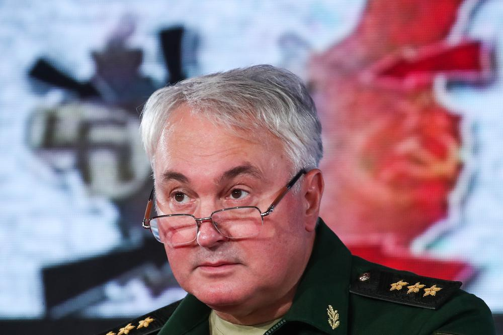

# Смотрящие при погонах. Российских солдат подготовят к бою с врагом с помощью «патриотического» кино. А также с помощью «Бесогона». Список «идеологически правильных» картин

- **URL:** https://novayagazeta.ru/articles/2021/08/18/smotriashchie-pri-pogonakh
- **Дата:** 2021-08-18
- **Автор:** Лариса Малюкова

## Смотрящие при погонах

## Российских солдат подготовят к бою с врагом с помощью «патриотического» кино. А также с помощью «Бесогона». Список «идеологически правильных» картин

Заместитель министра обороны РФ, генерал-полковник Андрей Картаполов взялся за воспитание российских солдат и твердо намерен этот опыт перенести на все взрослое население страны. Среди методов — рекомендательный список фильмов и телепрограмм.

Андрей Картаполов. Фото: Сергей Карпухин / ТАСС

В интервью «Аргументам и фактам» главный идеолог армии поведал, как намерен научить солдат родину любить, а заодно отличать правду от фейков.

По его мнению, эффективней всего в этом поможет цикл «Бесогон», в котором режиссер всея Руси с державным пылом обличает молодых артистов за оппозиционные настроения, высматривает компьютерную графику в съемках белорусских протестов, а в прививках от коронавируса обнаруживает чипирование. Любые тексты в сравнении с таким познавательным видео, как и «Уроки русского» Захара Прилепина, по мнению военачальника, сокрушительно проигрывают: «Посадили солдат, показали серию, обсудили. И это работает. У них есть интерес».

А с недавнего времени важной частью идеологической работы стал и «обязательный к просмотру перечень кинофильмов, утвержденный министром обороны… куда входят произведения, формирующие нормальное сознание воина-патриота».

В этом перечне удивительным образом уживаются и советская киноклассика, и вызванные к жизни сталинской заботой правильной надстройке ленты, и снятое по лекалам прошлого российское патриотическое кино.

О чем свидетельствует разношерстный список? Прежде всего, о возвращении советской оптики. В эпоху новой России пантеона героев не создано.

Значит, новые песни о героях былых времен, тех, «кто в штыки поднимался, как один».

Сам «перечень» похож на машину времени, возвращающую нас в СССР. Там будет мама молодая и отец живой:

- все вместе со слезами на глазах посмотрим затертых телевизором до дыр «Офицеров»;
- «Белорусский вокзал»;
- «В бой идут одни старики»;
- «Добровольцы»;
- ну и «Повесть о настоящем человеке», в котором летал и приземлялся без горючего «на одном желании» герой повести Бориса Полевого. А в финале командир Борис Бабочкин, экс-Чапаев, подводил черту: «С таким народом любую войну выиграем!»

Киношедевры о войне — всегда антимилитаристское искусство, размышляющее о цене человеческой жизни. В «Торпедоносцах», «Иди и смотри», «Белорусском вокзале» прорывается правда о войне, так называемая «окопная правда», ощущение неизбывного горя, связанного с побоищем, размышления о цене человеческой жизни. Это сегодня не актуально.

Увы, в обязательном для просмотра списке нет ни легендарных «Баллады о солдате», ни «Летят журавли», ни «Восхождения», ни одной картины Алексея Германа, нет «Иванова детства», нет трагикомедий «Кукушки» и «Женя, Женечка и «катюша».

Потому что сверхзадача главного замполита научить не «любить человека», какие бы испытание на его долю ни выпали, а героически умирать, жертвовать собой. За Родину, за Сталина. Партию, правительство, «Единую Россию».

Когда страна прикажет быть героем, У нас героем становится любой…

Известно, что, начиная с середины 30-х, Сталин самолично определял стратегию развития советского кино, давал «приказы» по созданию отдельных фильмов. Ему нужен был миф, возвеличивающий и переосмысливающий прошлое. Нужен был иконостас геройских, мудрых правителей:

- «Александр Невский»;
- «Петр I»;
- и, наконец, ставший аватаром генералиссимуса, любимый царь «Иван Грозный» (правда, после второй серии «Ивана Грозного», исследующей пороки тирании, репрессии опричнины, — началась расправа над Эйзенштейном). Все три фильма — в рекомендованном списке.

Запрограммированная Сталиным портретная галерея должна была отвечать запросам партии и правительства, поэтому титульные персонажи «Кутузова», «Суворова», «Ушакова», «Нахимова», «Пирогова», «Павлова», «Мичурина» своими военными и мирными свершениями славили страну, доказывали преимущество советского строя. И этим фильмам высочайшей волей дозволялось ради политических задач пренебрегать исторической правдой.

Главным цензором страны экран был призван на передовую борьбы с чуждыми элементами. Его последователям кажется, что пришло время «повторить»: вновь обеспечить атмосферу подозрительности, шизофренических поисков врагов народа снаружи и внутри.

Если советское кино смотрим с поправкой на время, цензуру, то

фильмы нового времени красноречивей иных газет расскажут нам о том, как менялась атмосфера страны, медленно сползающей в овраг неглубокой старины.

Поддержите нашу работу!

1000 500 300 Нажимая кнопку «Стать соучастником», я принимаю условия и подтверждаю свое гражданство РФ

Если у вас есть вопросы, пишите [email protected] или звоните:+7 (929) 612-03-68

На рубеже нулевых еще прорываются картины, описывающие войну как машину, перемалывающую человеческое («Блокпост», «Война окончена. Забудьте…», «В августе 44-го»).

Но уже тогда самые прозорливые режиссеры начали производить фильмы, как макеты оружия. В них пропаганда, искаженные идеи и образы упакованы в модные обертки, как в «Августе. Восьмого». Фильм о восьмидневной войне обрамлен жанром гламурного фэнтези-боевика. Здесь осетины свои, а «враги»-грузины нет-нет да и заговорят между собой по-русски (чтобы мы лучше поняли): «Стреляй на хрен ее!» По мнению продюсеров и авторов фильма «Август. Восьмого», их опус и есть образчик патриотического и в то же время привлекательного для зрителя фильма.

Фото: РИА Новости

С приходом в 2012-м Владимира Мединского, возглавившего культуру под эгидой Военно-исторического общества, отношение к истории полностью пересматривается.

Патриотизм воспитывается с помощью мифотворчества. «Сохранение исторической памяти» причислено к «национальным интересам» РФ, и защищать эту память призваны силовые ведомства от Генпрокураторы до Совета безопасности и МВД. Но понятие «память» следует воспринимать расширительно. Факт, исторические свидетельства и документы заменяет миф. Министр культуры называет историю 28 панфиловцев святой легендой, к которой нельзя прикасаться, а людей, которые это делают, «мразями кончеными». Новую доктрину Минкульта одобрили на самом верху. Дмитрий Песков подтвердил, что благодаря такому фильму всем историческим гипотезам, подвергающим легенду сомнениям, пришел конец: «Поэтому эта картина с точки зрения исторической правды представляет особое значение». Ученым теперь ничего другого не остается, как идти в кино и смотреть, что им режиссеры Клим Дружинин, Андрей Шальопа расскажут про панфиловцев и Михаила Кошкина, Максим Бриус и Леонид Пляскин про Зою Космодемьянскую.

Читайте также

Повелители истории

Новое назначение Мединского и грядущее «дело историков»

Продюсеры ленты «Первый после года» заявляют, что их история полностью основана на фактах биографии капитана-подводника Александра Маринеско. У него обнаруживается брат-монах, бывший колчаковец, который вроде бы так и не погиб. Хорошо, если зритель не в курсе, что родился Маринеско в 1913-ом. Сколько ж лет должно быть его вымышленному брату? «Собибором» возмущались очевидцы, оставшиеся в живых, потому что лагерь, изображенный в фильме как лагерь для военнопленных, был создан программой «Рейнхард» — операцией по массовому уничтожению евреев.

Кстати, в списке среди первых названий обозначен сериал «Вечная Отечественная» (11 серий), 2020-го, инициированный Минобороны. Сценаристом и автором текста выступает Захар Прилепин, которого Картаполов наряду с Никитой Михалковым называет борцом с мифами.

Фото: РИА Новости

Картаполов, возрождающий в армии военно-политические органы, утверждает, что замполит должен сделать так, чтобы солдат четко понимал: в кого он будет стрелять и почему. И правильное кино ему в помощь, как и историкам. Оно призвано перенастроить мозги солдат, чтобы, не задавая лишних вопросов, они осознали «в кого стрелять…».

В последние годы вновь процветает жанр патриотического оборонного кино, нахлынувшего на экраны перед Отечественной войной. Мы воюем и побеждаем в кино на танках, самолетах, подводных лодках и воздушных шарах. Уничтожаем врага, который не сдается. И строим новые несокрушимые мифы в духе монументальных скульптур Салавата Щербакова. Да, мифы нередко более живучи, чем реальная память, особенно разыгранные известными актерами, разукрашенные компьютерной графикой. Распространенное мнение, что нельзя трогать легенду, вошедшую в сознание людей, разрушать их веру. Хотя, по мнению ученых, это контрпродуктивно. Разрушение мифа, обнаружение его глиняных ног может стать подлинной драмой для верующих в него.

Впрочем, зачем миф подвергать анализу, искать обоснования в исторической перспективе? В миф надо просто верить. «Если я что-то утверждаю, — говорит Никита Сергеевич, — я не обязан представлять доказательства. Если вы утверждаете обратное, опровергая меня, это вы должны доказательства представлять! Разве это не так?!»

Вот Андрей Картаполов, крепко усвоивший уроки экс-министра культуры, продолжает подъем по карьерной лестнице печатным шагом — в Госдуму: «У нас в армии ты знаешь, что будет завтра, поэтому у военного человека есть уверенность в будущем, которая передается его семье. Люди четко знают, как устроена жизнь, куда двигаться дальше. На гражданке этого нет. Я хочу попробовать приложить это ко всему обществу. Чтобы оно развивалось понятно, чтобы выпускник любого вуза не думал, куда он пойдет со своим дипломом. Он должен четко знать, что попадет на конкретное предприятие, где его возьмут, и там он сможет трудиться. Иначе смысл высшего образования теряется».

А чтобы выпускник не думал — куда идти, солдат — в кого стрелять, покажем им духоподъемное кино про неубиваемых героев-победителей, на ратном поле и в футболе, в космосе и под водой, в смутные времена четыре века назад и сегодня.

Поддержите нашу работу!

1000 500 300 Нажимая кнопку «Стать соучастником», я принимаю условия и подтверждаю свое гражданство РФ

Если у вас есть вопросы, пишите [email protected] или звоните:+7 (929) 612-03-68
