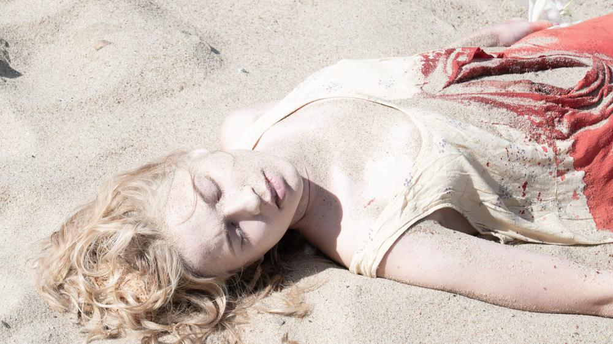

# Amore more, или Пингвины нашей надежды. Новые российские сериалы. На что стоит обратить внимание

- **URL:** https://novayagazeta.ru/articles/2021/08/26/amore-more-ili-pingviny-nashei-nadezhdy
- **Дата:** 2021-08-26
- **Автор:** Лариса Малюкова

## Amore more, или Пингвины нашей надежды

## Новые российские сериалы. На что стоит обратить внимание

Кадр из фильма «Коса». Фото: kino-teatr.ruКак и было обещано, новая платформа KION набирает обороты семимильными шагами, догоняя зрелые онлайн-сервисы. На традиционном летнем фестивале Strelka, который с этого года проводится совместно с онлайн-кинотеатром (Strelka Film Festival By KION), показывают каннские хиты вроде «Искушения» Верховена, «Памяти» Вирасетакула, «Героя» Фархади, с ними в одной афише — пилотные серии амбициозных кионовских сериалов: «Коса» Игоря Волошина и «Пингвины моей мамы» Натальи Мещаниновой. И судя по этим проектам, продюсеры KIONа исследуют возможности перезагрузки многосерийного кино и намерены создавать проекты, пульс которых совпадает с пульсом времени.

## «Коса», сериал

Сериал «Коса» Игоря Волошина вышел 25 августа. Триллер с наркотическим привкусом мистики и скандинавского нуара. Холодная внешне, но словно выжженная дотла следователь, детектив Еве Кайдас (Линда Лапиньш) по прозвищу Росомаха, идет след в след за маньяком, орудующим на Куршской косе. Когда на побережье обнаруживают растерзанную девушку с лилией в руке, Еве пытается доказать, что у убийцы тот же почерк, что и у маньяка по кличке Жнец, убившего 12 девочек здесь же, на косе, в 1990-е. Жнец совершал ритуальные убийства, фигурно вспарывая животы своих жертв серпом. Тот ли самый маньяк объявил новый сезон для своих страшных инсталляций или кто-то ему подражает? Твин-пиксовская атмосфера, прихотливые изгибы связей, поиск собственного киноязыка отличает кино Волошина («Нирвана», «Бедуин») от армии сериалов про маньяков.

Кадр из сериала «Коса»

«Коса» — удачный микс коммерческого кино и авторского, с изысканной операторской работой, странными ракурсами, сбивчивым монтажом, аллюзиями с мифологией Куршской косы,

где по сию пору бродит призрак зыбучих песков. Поиск красоты — в жутком, словно сам маньяк режиссирует картину. «Я визионер, — говорит Волошин, — не могу относиться поверхностно к изображению, форме проекта и драматургии. Мне нравится взламывать банальности и превращать истории во что-то более барочное, увесистое, прорывное».

Приз за лучший сериал на Нью-Йоркском международном кинофестивале.

## «Пингвины моей мамы» Натальи Мещаниновой

«Меня зовут Гоша, мне 15 лет. У меня возраст Христа. А что, Христу не было пятнадцати?» Гоша (его сыграл Макар Хлебников, сын постоянного соавтора Мещаниновой режиссера Бориса Хлебникова) пришел в этот мир, чтобы его гармонизировать… с помощью честного непричесанного стендапа, неретушированных слов и смыслов. Как принято в клубе на Новом Арбате. Правда, что ни день в зале обнаруживаются скандалисты, шумно оскорбляющиеся на шутки, — над сексом, религией, жертвоприношениями, священниками.

Сегодня быть честным стендапером трудно. Сакральных тем все больше.

Стендап внимательно изучают правоохранительные органы. В общем, как пишут в соцсетях, «все сложно». Да и дома у Гоши запутанные взаимоотношения с родителями (профессиональными усыновителями), с приемными братьями и сестрой. У Мещаниновой («Комбинат «Надежда», «Сердце мира», «Аритмия», «Красные браслеты») редкий дар — подключенность к вызовам времени, к его языку, фактуре. Кино для Мещаниновой — вспышки импульсов, история страстных отношений с жизнью. Настоящей. Без прикрас.

Кадр из фильма «Пингвины моей мамы». Фото: kino-teatr.ru

Роман взросления «Пингвины моей мамы» создан Натальей Мещаниновой вместе с ученицей Марины Разбежкиной Закой Абдрахмановой («Жаным», «Юбилейный год»). А маму Гоши сыграла талантливая актриса Александра Урсуляк.

Поддержите нашу работу!

1000 500 300 Нажимая кнопку «Стать соучастником», я принимаю условия и подтверждаю свое гражданство РФ

Если у вас есть вопросы, пишите [email protected] или звоните:+7 (929) 612-03-68

## «Вертинский» Авдотьи Смирновой, многосерийный фильм

Среди новых проектов, которые представил KION на «Стрелке», наибольший интерес представляет «Вертинский» Авдотьи Смирновой, который стартует в сентябре сначала на платформе, а затем на Первом канале. Одного из самых талантливых и причудливых шансонье, поэта, артиста, композитора играет Алексей Филимонов («Жить», «Кислород», «Человек, который удивил всех»). В роли Веры Холодной, чей талант разглядел именно Вертинский, — Паулина Андреева («Оттепель», «Метод», «Лучше, чем люди»). Сценарий традиционно писали Авдотья Смирнова вместе с драматургом и режиссером Анной Пармас.

Кадр из фильма «Вертинский». Фото: kino-teatr.ru

Кадр из фильма «Вертинский». Фото: kino-teatr.ru

## «Товарищ майор» Бориса Хлебникова, комедия

Алексей Филимонов сыграл главную роль и в остроумной комедии «Товарищ майор» Бориса Хлебникова (авторы — Хлебников и Авдотья Смирнова). О жизни рьяного, но мелкого сотрудника ФСБ, которого изводит ревностью жена (в ролях — Евгений Сытый, Тимофей Трибунцев, Олеся Железняк, Михаил Пореченков, Аглая Тарасова, Виталий Хаев). Его основная работа — прослушка, но в какой-то момент резьбу гэбэшного служаки срывает, и он начинает помогать тем… кого должен пасти. Конечно, вспоминается «Жизнь других», но человечество, как и велел Карл Маркс, должно, смеясь, расставаться с прошлым. Хотя бы на экране.

## «Чиновница» Оксаны Карас, многосерийный фильм

С 21 сентября на платформе еще один любопытный многосерийный фильм — «Чиновница» Оксаны Карас. Обеспеченная жизнь чиновницы регионального минздрава Арины Алферовой (Виктория Толстоганова), царицы местного розлива. Женщиной опытной, умеющей закрывать глаза на подписи в договорах с фармацевтическими предприятиями. Благоволящей на тендерах «правильным» людям. Цена вопроса — жизни людей. Премьеру пришлось существенно задержать: в пандемический год, когда развернулись бурные дискуссии вокруг вакцин, решили не подливать масла в огонь. Виктория Толстоганова, как всегда, на высоте.

Кадр из фильма «Чиновница». Фото: kino-teatr.ru

Кадр из фильма «Чиновница». Фото: kino-teatr.ru

## Что еще посмотреnm на KION: Дарья Мороз, Валерия Гай-Германика и другие

Платформа KION стартовала в апреле.

- Среди оригинальных проектов кинотеатра точно стоит смотреть триллер «Хрустальный» (верхняя строчка рейтинга по количеству просмотров и положительных оценок).

Дальше выбираем на свой вкус и риск.

- Кому-то нравятся «Немцы» (по мотивам романа Александра Терехова),
- кому-то — «Клиника счастья» с Дарьей Мороз (планируется второй сезон). Будет второй сезон и весьма востребованной у молодежи черной ромкомедии «Секреты семейной жизни».

А в производстве —

- сериал «Обоюдное согласие» о насилии и неоднозначном отношении к нему в архаичном патриархальном обществе. Снимает его Валерия Гай-Германика.

Кадр из сериала «Обоюдное согласие»

- «Amore More» Яны Гладких — откровенное драмеди о полиамории (немоногамных отношениях). Авторы задаются вопросом, не изживает ли себя консервативная модель семьи.

Сегодня рост аудитории KION — плюс 170%. Продюсер Игорь Мишин обещает, что к 2023 году онлайн-кинотеатр войдет в первую тройку российских стриминговых сервисов, имея 10 млн платных подписчиков.

Кстати, цена подписки ожидаемо выросла до 199 рублей в месяц.

Поддержите нашу работу!

1000 500 300 Нажимая кнопку «Стать соучастником», я принимаю условия и подтверждаю свое гражданство РФ

Если у вас есть вопросы, пишите [email protected] или звоните:+7 (929) 612-03-68
