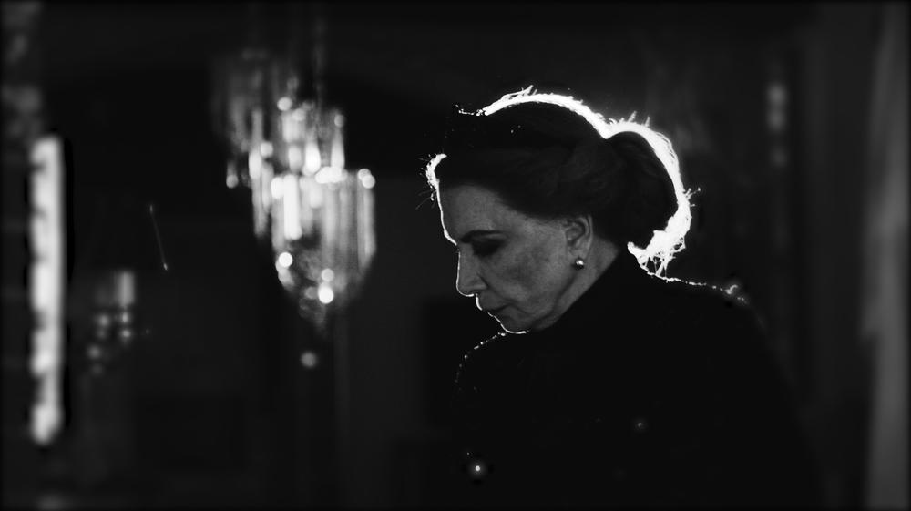

# Кто победит ничто. О самом главном, что случилось на XV Международном фестивале им. Андрея Тарковского

- **URL:** https://novayagazeta.ru/articles/2021/08/28/po-kom-zvonit-kolokol
- **Дата:** 2021-08-28
- **Автор:** Лариса Малюкова

## Кто победит ничто

## О самом главном, что случилось на XV Международном фестивале им. Андрея Тарковского

Алла Демидова. Кадр из фильма «Кто тебя победил никто»Нет. Это не обзор в привычном смысле слова. Хочется рассказать о самом, на мой взгляд, существенном, случившемся на форуме имени главного отечественного кинопоэта.

Сроки юбилейного XV Международного кинофестиваля имени Андрея Тарковского «Зеркало» все время сдвигали. И поэтому программы формировали в экстремальном режиме, что, впрочем, не отразилось на их насыщенности.

Любопытно следить за тем, как фестиваль превращается в мультижанровый форум искусств, перекресток, на котором кинематограф периодически уступает дорогу научным конференциям, променад — спектаклям, выставкам, а классика — современности.

Открылось «Зеркало» композицией Филиппа Горбачева и группы «Колокол», в которой ритмы техно и индастриала сосуществуют на равных с настоящим колокольным перезвоном. «Для меня музыкальная деятельность всегда была связана с покаянием, радостью, духовными американскими горками, потому что без них вообще ничего невозможно сделать», — говорит Горбачев.

Открытие состоялось в День российского кино, 27 августа, в Юрьевце — городе детства Андрея Тарковского, который он воссоздавал в «Зеркале», как Феллини воссоздавал родной Римини в «Амаркорде». Сегодня Юрьевец — место паломничества синефилов со всего мира. Вел церемонию режиссер, актер, художественный руководитель «Гоголь-центра» Алексей Агранович. На территории бывшего Юрьевецкого пивоваренного завода построены сцена и уличный кинотеатр, в котором идут показы и встречи с авторами фильмов.

«Совесть» Алексея Козлова представляет Россию в международном конкурсе. У этой камерной черно-белой картины три награды Шанхайского фестиваля, состоявшегося в июне этого года.

### «Совесть», режиссер Алексей Козлов

Двадцатые годы. Постреволюционный Питер, замерший в черной расщелине эпох. Бандитские малины, расстрельные списки, тушенка из-под полы, конфискованные слитки золота. Борис Аркадьевич (Владислав Комаров) из бывших, профессор права, для которого правосудие — не право судить, а правильный суд и презумпция невиновности — не пустые слова. В свободное от лекций время помогает советской власти ловить бандитов. Мечтает о справедливом мире. Только время с каждым днем все надрывней, запутанней, душнее. И бандит Пантелеев, растерзавший и ограбивший брата профессора, и его прямой начальник — сифилитик, вор, и чекисты в галстуках и кожаных плащах, напоминающие образцово-показательных эсэсовцев — по сути, все убийцы, готовые вести «смертный бой» по отмашке сверху ради мифического «царства труда».

Мозг профессора закипает в неразрешимых вопросах. Во что превращается право в стране, отменяющей законы? И какова цена, которую приходится платить бесправным защитникам этого самого права? Мозг профессора спорит с его волей, но ни воля, ни страх не могут заглушить голос совести.

Не в состоянии профессор сделать мир справедливым. Даже спасти маленькую племянницу, намертво замолчавшую после убийства родителей. Фильм неровный, но с магнетическими моментами, в духе кино Германа. И еще мне запомнилась большущая комната в ЧК с мокрым полом. Черно-белая комната с запахом смерти и крови, только что смытой.

Кадр из фильма «Совесть»

## «Не верьте сказкам, они были правдой»

Тема «Зеркала-2021» — «Сказка как документ». Она выстроена вокруг традиционной программы фестиваля «Костюм в кино» Надежды Васильевой-Балабановой, художника по костюмам с гигантской фильмографией. В этом году она «одела» две киносказки: «Конек-Горбунок» Олега Погодина и «Северный ветер» Ренаты Литвиновой.

Тема сказки возникает и в творчестве Андрея Тарковского: фестиваль «Зеркало» совместно с петербургским книжным проектом «Порядок слов» выпустили книгу «Гофманиана» — не поставленный сценарий Андрея Тарковского со вступительными статьями Олега Ковалова и Ларисы Полубояриновой.

У Андрея Тарковского целый мартиролог задуманных, но не рожденных картин. От «Идиота» и «Преступления и наказания» до «Волшебной горы», «Иосифа и его братьев», «Мастера и Маргариты». Например о замысле «Идиота» директор «Мосфильма» сказал: «Идиот» «Мосфильму» не нужен». Та же участь постигла «Гофманиану».

Сценарий писал по заказу эстонской студии, она выручила его в трудные времена безденежья. «Гофманиана» должна была стать своеобразным продолжением «Зеркала». «Гофманиана» вытекает из предсмертной исповеди героя. Волшебник и сказочник Теодор Гофман на пороге смерти. Вокруг тающего писателя собрались реальные и выдуманные персонажи. И тут же зеркало, в котором он ищет свое отражение. И не находит.

Зеркало и для Гофмана, и для Тарковского — не только средство самопознания (как у Бергмана), но портал в иные, параллельные миры. Сценарий Госкино не утвердило. Уже за границей он пытался к нему вернуться.

Русских людей должны были играть русские актеры, самого Гофмана — Дастин Хоффман.

## Кто тебя победил?

Режиссер и основательница журнала «Сеанс», автор и составительница семитомной «Новейшей истории российского кино» Любовь Аркус награждена почетным призом XV Международного кинофестиваля им. Андрея Тарковского «Зеркало» за вклад в киноискусство. Фильм Закрытия киносмотра — новая работа Аркус «Кто тебя победил никто».

В релизе сказано, что это фильм-портрет Аллы Демидовой на фоне нескольких эпох и затонувшей Атлантиды советского кинематографа. И театра, разумеется. Про фон все верно. Портрет? Не знаю, во всяком случае, точно не байопик. Пять лет делался фильм. Он и сейчас доделывается, уточняется. Словно автору никак не расстаться со своей героиней. Магнетичной, невыносимой, невероятной. Словно фильм как-то мучительно связал их. Удивительно, но продюсер Константин Эрнст велел не торопить режиссера, видимо, в память о временах, когда сам был создателем богемной арт-программы «Матадор».

Поначалу фильм представляется их поединком: «Люба, если бы вы не были другом семьи… я бы ни за что на это не пошла…» Примерно тем же отвечает ей автор. Демидовой не нравятся бессмысленные — как ей видится — проезды на машине, проходы, то, как ее гримируют.

Кадр из фильма «Кто тебя победил никто»

Зачем «выглядеть», пусть будет как есть: усталая после бессонных ночей, немолодая женщина. То и дело возникает неподдельное напряжение: «Я даже отвечать не буду… Я не буду, как в художественном фильме…»

О своем несносном характере она знает лучше других. Многое объясняется детством, которое не любит вспоминать. Анемия, туберкулез.

Когда с такими данными воспитанная бабушкой-старообрядкой девочка вознамерилась утвердиться среди сверстников, они просто схватили ее и держали над рекой, грозя бросить вниз.

Поддержите нашу работу!

1000 500 300 Нажимая кнопку «Стать соучастником», я принимаю условия и подтверждаю свое гражданство РФ

Если у вас есть вопросы, пишите [email protected] или звоните:+7 (929) 612-03-68

С тех пор ненавидит толпы. Взывающие к казни и восторженно славящие. Толпа всегда тюрьма, искусственная вентиляция. Она бросается в одиночество как в спасение, возможность самостоятельно дышать. «Одиночество учит сути вещей». Всегда вразрез с монолитными советскими надстройками и дружным бражничеством таганковской труппы. Вот редкая хроника — таганковцы в перерыве грандиозного, обжигающего «Гамлета» за кулисами поют-дурачатся, и только ее Гертруда тенью проскальзывает в свою гримерку, плотно прикрыв дверь. Да, она и в шумной, фееричной «Таганке» чувствовала себя лишней.

Кадр из фильма «Кто тебя победил никто»

Лишний человек на рандеву со временем. Когда «сукины дети» устраивают травлю Эфроса, Демидова в ней не участвует, когда они хором проклинают создателя театра Любимова, она встает на его защиту: родного отца из дома не выгоняют. Ее максималистский выбор, ее отчуждение, ее этический кодекс — неколебимы.

Экран ее приметил и востребовал уже за тридцать — в постоттепельную эпоху сокрушительного разочарования. Но в это же время случается «Зеркало». А там ее Лиза с нервными пальцами, ближайшая подруга героини Тереховой. И ее дурацкий фляк — в финале долгого прохода по коридору типографии. Актриса взяла и подпрыгнула. А Тарковский взял и оставил это в фильме. И тут все совпало: и наше знание о том, что эта Лиза утром умерла, и этот фляк. Больно.

Чем отличается фильм «Кто тебя победил никто» от множества актерских или режиссерских байопиков? Это кинороман, размышляющий о времени. В главной роли — Актриса. Сквозной сюжет — «незримое прорастание истории в человеке», в ролях, поступках. Здесь автор — киновед и аналитик — исследует непростой путь отечественного театра и кино, погружаясь в тайну искусства отдельной царственной актрисы, так и не ставшей крепостной, выламывающейся из институций гниющего Эльсинора с рычащим названием «Эсэсэсэр».

Отдельность Демидовой проявляется и в анализе женского кинообраза эпохи застоя: директорши фабрик, мэры, странные, сладкие женщины, ищущие своего мужчину. Это все не про нее. Хрупкую и стальную. Взрослую. Штучную. Самодостаточную. Ее персонажи такие же отдельностоящие: поэтесса, фанатичка, аристократка, колдунья, герцогиня Мальборо.

Как бы ни пряталась под маской Посторонней, фильм высвечивает притягательную силу актрисы, моменты ее восхитительного и трагического романа со сценой или камерой. Ее гретогарбовскую холодность, плавящуюся в «сверхчувственных энергиях» и странных сближениях с гениями. Ее жертвенность. «Железная леди», умеющая держать дистанцию между собой и ролью, готова выкладываться до последнего, рискуя собой. В «…Каменном госте» Анатолия Васильева она, едва придя в себя после двух операций, спасала спектакль танцем с кастаньетами, вбивая каблуками в дощатый пол смерть, крик боли.

В фильме редкая хроника — живые отпечатки истекшей эпохи, и последние интервью Гаевского, Туровской, Муратовой. И неспешные разговоры с Васильевым, Курентзисом, Серебренниковым.

И ведь с кем бы из великих Демидова ни работала — оставалась хозяйкой роли. Посмела в образ своей диковинной женщины-птицы Раневской влить «каплю цинизма, современного ломкого интеллигентства — и тем самым рискованно приблизить ее к современникам. Да и в муратовском «Настройщике» первоначально ее состоятельная вдова Анна Сергеевна была более карикатурной, провинциальной, это Демидова «заразила» ее чеховской нелепостью, словно Дама с собачкой состарилась в провинции у моря, но так и не приобрела никакого жизненного опыта. Их дуэт с Высоцким в «Гамлете» и в «Вишневом саде» — необъяснимое чудо, алхимия, центр спектаклей Любимова и Эфроса. «Свои лучшие роли они сыграли в паре», — скажет Аркус.

Зависимость актерской профессии… ну сколько можно. Кажется, она сама выбирала титанов: Любимов, Эфрос, Тарковский, Виктюк, Шепитько, Муратова, Хамдамов, Бродский.

Наблюдаем, как она располагает себя на сцене, дирижирует камерой, микрофоном. Готовится. И зрительницы, пришедшие на встречу с ней, в гардеробе филармонии переобуваются в туфли. Готовятся к встрече. Так было еще вчера. Сегодня она, как всегда капризничая, едет на выступление в «Гнезде глухаря». Читает Бродского. «На сетчатке моей — золотой пятак. Хватит на всю длину потемок». Зрители продолжают пить, жевать, разговаривать. Ее руки в кольцах хватаются за микрофон, как за соломинку — пытается выскользнуть из «черной пустоты».

Как объяснит проницательная Муратова: «Ее мания величия — форма самозащиты». Курентзис добавит: «Просто она и есть театр, нет границы между игрой и жизнью».

Ее время? Его нет. Оно истекло вместе с ее режиссерами, любимыми критиками, ее зрителями.

И поэтому частые гудки, звучащие за кадром, — рефрен нового времени. «Смежили очи гении». Кому звонить? Абоненты недоступны. Остались голоса, и эпизод с голосом Бродского, пожалуй, самый сильный в фильме. Как и воспоминание о парижских гастролях. «Вишневый сад» в Париже. За кадром Эфрос, слова прощания: «Жизнь, как вихрь, а люди не успевают за этим вихрем. Ветер сбивает людей, уносит их. И вихрь всегда над нами. И мы слабее этого вихря, которому название время. И время безжалостно, стремительно, беспощадно».

Не доиграно, не доделано: «Ухожу недовоплощенной». Васильев назовет это поражением. И у него нет труппы, дневники прописаны восклицаниями отчаяния.

А сейчас, когда сильно задержавшись, выходит фильм «Кто победил тебя», он попадает в самое больное — наше общее поражение.

Она смотрит в глаза беспощадному времени и не отводит взгляда. Поэтому и хочет быть перед камерой «как есть», не как в художественном кино. Но Аркус снимает художественное кино о художнике. Язвительном, колком, парадоксальном, бескомпромиссном. Уязвимом. С содранной кожей. Строящем невидимые непробиваемые стены между собой и крикливым неубиваемым Эльсинором. Там, за этими стенами, в тишине, среди матового хрустального блеска люстр и бокалов, она снимает очки и всматривается в зыбкие отражения, словно вспоминая пастернаковское «все люди, посланные нам, — наше отраженье». Любимов из темноты светит своим фонариком. Муратова оглядывается растерянно. Эфрос внезапно засмеется. Тарковский на мгновенье задумается. Высоцкий о чем-то с мученьем спрашивает. И ее муж, драматург Владимир Валуцкий, рядом с ней. Пьет вино. «А кто же тебя победил, старик? Никто. Я просто слишком далеко ушел в море».

Поддержите нашу работу!

1000 500 300 Нажимая кнопку «Стать соучастником», я принимаю условия и подтверждаю свое гражданство РФ

Если у вас есть вопросы, пишите [email protected] или звоните:+7 (929) 612-03-68
