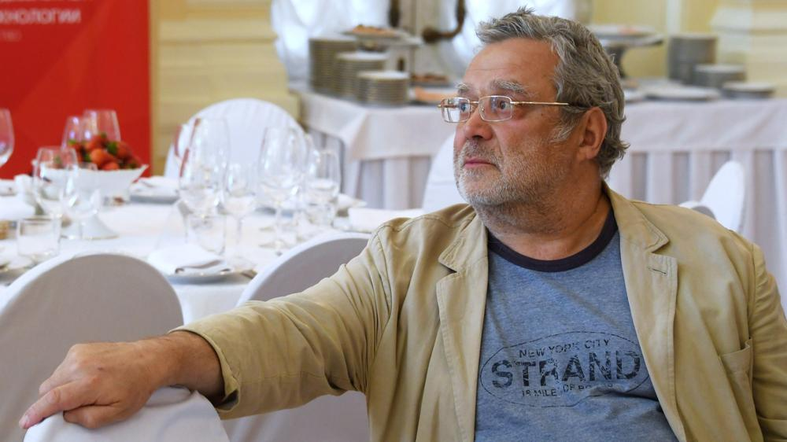

# Игорь Свинаренко: «Ну некуда идти дальше». Звезда постперестроечной журналистики — о сложностях профессии, жизни и отношений с самим собой

- **URL:** https://novayagazeta.ru/articles/2021/09/02/igor-svinarenko-nu-nekuda-idti-dalshe
- **Дата:** 2021-09-02
- **Автор:** Лариса Малюкова

## Игорь Свинаренко: «Ну некуда идти дальше»

## Звезда постперестроечной журналистики — о сложностях профессии, жизни и отношений с самим собой

Фото: РИА НовостиВ издательстве «Захаров» вышла новая книга Игоря Свинаренко «Тайна исповеди». Текст, словно неуправляемый поток, несется по ХХ веку, сжимается в историю «совецкого» мальчика и его деда, который с чекистским запалом расстреливал врагов-соотечественников, а потом смывал кровь походом на войну против врагов-немцев; и другого деда — станичника; и его родных, для которых убийственные взрывы в шахтах — обыденность; и отца, проведшего детство на оккупированной территории. Мемуары — нечто отстоявшееся, высмотренное словно через бинокль. «Тайна исповеди» рассказана, будто с лету, шероховато, с внезапными ответвлениями, былью и небылицами. Так, как сокровенное, наболевшее, внезапно вспомнившееся доверяют случайному попутчику. Чистосердечное признание швами наружу.

— Как сформулировать коротко, про что книжка? Ведь события и люди в ней рассыпаны по всему прошлому веку. Ненависти в ней сорок пудов, и любви тоже, но почему-то ненависти больше.

— Поскольку не было романов, которые бы описали весь XX век, я решил восполнить этот пробел. И там много про Германию, поскольку это важнейшая страна для России: воюем, дружим. Я по стечению обстоятельств связан с Германией, в детстве учил немецкий. В детском саду играли в войну: убивали немцев из деревянных автоматов. Мои деды воевали, один — инвалид, другого убили под Сталинградом, материн отчим вернулся, меня воспитывал. Да у всех вокруг кто-то воевал. Кончилось тем, что в 1989-м нам привозили бундесверовские пайки — гуманитарную помощь.

В общем, это все склеилось, и я ничего не преувеличивал, мне кажется, это неразделимо: XX век — это война, ненависть, месть, ну и сочувствие.

Люди того поколения мне рассказывали не только про зверства фашистов, но и про человеческие поступки оккупантов. Мою бабку таскали на допросы после того, как ее сын, мой дядька, украл еду и винтовку с армейского склада — и сбежал из города. А укради мальчик банку тушенки в НКВД — что б было?

— Сегодня параллели между сталинской системой и Третьим рейхом — подсудное дело.

— Эээ… Немцы — в 70-е еще много было стариков, которые думали, что кроме вождя дети рабочих никому не нужны! Их родители получили работу. Кабы не революция 1918-го, которую учинили социалисты, то страна б не проиграла первую мировую — в это верили миллионы немцев!

Мы детьми страшно жалели, что опоздали на войну и не могли убивать немцев… убивали их в мечтах, в своих играх. Теперь детей, как при Совке, приучают к оружию, к мысли, что убивать — норма. А молодые немцы сейчас — в основном хипповатые пацифисты, не могут злое слово сказать оборзевшему беженцу. И тут перегибают палку. В 1999-м спрашиваю немецкого офицера в штабе НАТО, перед наземной операцией на Балканах: «Зачем вы идете в Югославию?» «Ну мы НАТО, все идут». — «Турки-то не идут». Он изумляется: «Точно, не идут!» Я говорю: «А знаешь, почему не идут? Они же там так наследили, резали, казнили. Они поняли — нас и так уже там все ненавидят». Офицер говорит: «Но мы-то давно демократическая страна, мы уже все избыли — изжили — расплатились». «Да кто тебе это сказал?»

— Себя ты называешь не русским, а русскоязычным. Где ты свой, а где чужой: в России или в Украине?

— Пытаясь это понять, я осознал, что нигде я не свой. В Украине считаюсь эмигрантом, в «ДНР» — врагом, мои родственники, которые за Киев, обвиняют меня в том, что я обстреливаю их, когда они отдыхают в Мариуполе. Русские меня не считают русским. Какой из меня русский, сразу видно, что украинец. И фрикативное «г», как у лучших людей — Солженицын, Шолохов, Горбачев.

— А вот где образ этого гэкающего вахлака из Макеевки, который ты являешь людям, — и где Свинаренко подлинный: полиглот, объездивший весь мир, написавший столько книг… Помню, Авдотья Смирнова тебя уличала в телевизоре: «Просто скажи чисто «г», хотя бы на английском».

— Помню, Кох, соавтор по книге «Ящик водки», донимал: «Что ты прикидываешься донецким вахлаком, ты же учился в университете, работал в редакциях». Говорю: «Предлагаешь мне изображать питерского русского дворянина из профессорской семьи?» Это было бы глупостью. Я же действительно с шахтерского поселка. Рос среди пролетариев, гопников, там порой и дети становились бандитами. Я тоже ходил с финкой, пили портвейн в старших классах, дрались, у меня шрам от финки в боку.

Зачем врать, что я тонкий профессор? Русский для меня немножко иностранный, понимаешь? Потому что вырос в суржике.

— Осознанно не хочешь от этого говора отказываться?

— И в голову не приходит. Какой смысл? Я писал тексты и лекции читал на украинском. Кстати, «козача балачка», которая в ходу на Кубани, — она куда ближе к украинскому, чем к русскому. Мой дед, под Сталинградом убитый, был станичник. Кубанская станица Степная. Кадровый военный, орден Красной Звезды за борьбу с финскими белогвардейцами. Макеевка принадлежала области Всевеликого войска Донского, а Донецк — уже нет. Когда я разговаривал с бригадным генералом Мигелем Красновым, который был у Пиночета правая рука в Сантьяго, услышал эту беспримесную речь. Какое он говорит «гэ», вот я уже такое не умею!

— А вот это повторяющееся в книге слово «совецкий», видимо, для усугубления его значения? Солженицын в «Крохотках» писал, что советский человек не умрет никогда. Он живет в тебе?

— Отчасти я как кентавр такой. Как бы советский, но не советский. Не знаю. Дед, который ветеран ЧК, все-таки он меня воспитывал. Заходим в магазин, он говорит: «Всех посадить на десять лет, кто здесь торгует, а потом судить! Я в 19-м стрелял таких!» Такая корневая идея — убивать тех, кто не нравится. Когда их убьешь — настанет светлое будущее, новый мир. Только надо, чтобы тебя за это не наказывали. И, кажется, огромное количество людей скажет: если получим гарантию, что нам за это ничего не будет, мы, сука, поубиваем всех, кто нам не нравится. Что с этим делать? Как это изменить?

— На твой взгляд, кто эти молодые люди, которые идут в Росгвардию и дубасят дубинками сверстников?

— Ну это же путь карьеры такой мощной. Дочка моего друга дружила с парнем. Как-то сидим, выпиваем, я интересуюсь: «Зачем ты учишься на юрфаке? Хочешь справедливость нести в этот мир?» Он говорит: «Нет, хочу хорошо жить, работать прокурором. Разбогатеть, но честно». «А как честно?» — «Не буду брать у бандитов взятки, я все-таки честный, а буду возбуждать дела против бизнесменов. Они дадут мне денег, я дела закрою. Все честно и красиво. Это путь надежный».

— В своей «…исповеди» ты преступаешь все возможные границы дозволенного, рассказываешь о вещах, о которых не принято публично говорить.

— Если закрываться границами дозволенного, зачем тогда садиться писать? Ну и потом, как я предупредил в вводке, все это злостные заведомо ложные измышления.

— Ты вспомнил интервью с генеральным прокурором Красновым, за которое тебя критиковали. А еще был Кадыров, серийные киллеры… Это профессиональное или просто человеческое любопытство?

— Меня попрекали, что я беру интервью у нерукопожатных. Я б с удовольствием говорил только с Ганди и матерью Терезой, жаль, они умерли! Я писал книжку «Русские сидят», ездил по тюрьмам, разговаривал с «пропащими». Например, с измайловским маньяком, который в лесу ловил и убивал проституток и гомосексуалистов.

А где-то в Мордовии «допрашивал» сатанистов, совершавших ритуальные убийства. И тоже: «Нет, ну зачем разговаривать с этими…»

— А зачем?

— Чтобы попытаться понять: как это, почему? Вот человек начитался брошюр со своими товарищами, восхищается: «Как интересно!» Потом убивают кошку ритуально. Потом думают: «Ну, кошка мелко…» И убили человека. Какие-то знаки нарисовали. Можно сказать: ну, сатанист или фашист, чего с ним говорить, пусть посадят, и все. Или попытаться туда, внутрь, залезть, да?

Кстати, мы и с Прилепиным выпивали, я делал с ним несколько интервью. Меня заинтересовало: вот мент, но пишет не ментовские истории, а какую-то лирику. Учился в нижегородском университете, ездил в Чечню, воевал. И как точно он описывает этих молодых нацболов!

Игорь Свинаренко и Захар Прилепин на праздновании дня рождения радиостанции «Эхо Москвы» в Галерее искусств Зураба Церетели, 2013 год. Фото: РИА Новости

— А после 2014-го вы общались?

— Он меня отфрендил после того, как отказался вести дискуссию про Сталина… Вот когда вышел этот его манифест, письмо отцу родному Сталину от лица подлых либералов. Я говорю: «Давайте сделаем дебаты в журнале «Медведь». Мы тогда общались — он, Кох и я. Ты будешь за Сталина, Кох — против, я — рефери. Опубликуем без купюр. Интересно же — открытые дебаты. Он: «Мне неинтересно… все уже сказано, уже не о чем с вами говорить».

— Ну да, все, дебаты закончены. Забудьте. Сталин на коне, это и Лавров подтвердил. С журналистами воюют на улицах, их арестовывают… Они ищут новые формы жизни в YouTube, в блогах… Но ощущение вынужденной девальвации профессии не исчезает.

— Был прогноз в Лондоне в 1894 году: «При теперешнем темпе развития города к 1950 году лет мостовые будут покрыты слоем конского навоза в 50 сантиметров». Люди всерьез этого боялись.

Кстати, сейчас не понимаю, как я работал репортером, когда тебе строго велели: «Иди туда, напиши про это, причем именно так, а не эдак».

Поддержите нашу работу!

1000 500 300 Нажимая кнопку «Стать соучастником», я принимаю условия и подтверждаю свое гражданство РФ

Если у вас есть вопросы, пишите [email protected] или звоните:+7 (929) 612-03-68

— Подожди, ты шел к Белому дому и описывал все так, как видел.

— Я написал правду, долго потом удивлялся: эту заметку я мог бы напечатать и в гэкачепистских СМИ, а вышла она в «Общей газете». Я цитировал военных, которые окружили Белый дом: «Мы не на защиту демократии, просто пришли сюда, заняли позицию». «А почему у вас триколоры на антеннах?» — «Пусть будут, это же не мешает выполнению боевой задачи». — «А если вам прикажут стрелять?» — «Прикажут — будем стрелять».

На сегодняшнюю журналистику смотрю со стороны. Меня выгнали все СМИ, и поделом.

— Почему поделом?

— Потому что сам бы выгнал таких сотрудников, которые не слушаются начальства. А газета — это производство, завод. Мне просто посчастливилось: целое десятилетие с 2001-го по 2011-й, когда я работал в «Медведе», я командовал журналом. И используя служебное положение, писал, про что хотел, с кем не хотел — не встречался.

— Как быть сегодня журналистам?

— Сегодня профессия вслед за пляжными фотографами и трубочистами на наших глазах растворяется. Случилось какое-то событие — мы немедленно читаем о нем фейсбуке. А журналисту надо выписывать командировку, брать билет, лететь. Каждый журналист — сам себе режиссер, стрингер.

— А я думаю, что журналистика неубиваемая профессия.

— Неубиваемая, да. Но она рассыпалась, понимаешь? Каждый человек, если ему повезет оказаться на месте события, становится его транслятором. Но журналист — это же умственный агрегат: собрал информацию по новостному поводу, придумал хлесткий заголовок…

— Подожди, лучшие тексты Колесникова, Панюшкина, Свинаренко — точно не агрегатные.

— Допустим, я взял множество интервью, сколько-то сборников этих разговоров вышло. Сегодня смотрю Дудя и думаю: вот я-то с какого боку? Все эти мои бумажные беседы «для своих», а тут миллионы просмотров.

— Эти «бумажные беседы» уже часть истории. От Немцова, Битова, Новодворской, Неизвестного, Черномырдина — до сатанистов. Какие из этих разговоров особенно запомнились?

— Смешные мы делали интервью, начиная с 1996-го, с Немцовым, когда он в Нижнем был губернатором. Чистое удовольствие. Последнее я у него взял за две недели до выстрела… Там много разного. Про русскую мечту, например. Мы с ним всегда спорили. Он говорит: «Я серьезно был преемником!» «Да брось ты, — говорю, — как еврей в нашей стране может быть президентом?» Он обижался, возражал. Потом сразу: «Ты должен вступить в СПС». Я: «Журналист не должен быть в партии». «Нет, наша партия особенная, и мы приносим пользу людям». Спустя время: «Ты прав, не надо журналистам в партию». Вообще, был очень откровенным.

С Борисом Немцовым. Фото из личного архива

— Но ведь какие-то вещи из доверительной беседы ты не публикуешь.

— Интимные вещи — да.

— У тебя в книжке много неполиткорректного, в том числе сексистские выпады: женщин ты называешь бабами, «ценной добычей» для мужика. Какие у тебя отношения с «новой этикой»?

— Даже не знаю, есть ли у меня вообще отношения с «новой этикой». Я ж ушел на покой, не знакомлюсь с девушками. Но если без идиотизма, то все это нормально. Я даже знаю, как стать феминистом. Надо родить двух дочек, и все.

— Вот ты много писал про водку. Что есть пьянство для нашего соотечественника. Ритуал? Побег от действительности? Психотерапия? Бражничество?

— Зависит от химических реакций человека. Одни бражничают. Другие уходят в запои и умирают от цирроза. У меня, к счастью, пока что запоев не было. Что происходит? Изменение сознания… В одном виде сознания тяжело постоянно находиться. А понять, что у тебя происходит в подсознании, без бухла сложно. Я человек, который уделяет огромное внимание своему подсознанию. Пытаюсь в него заглянуть — что там и как. Мне снятся сны, потом думаю, почему вот эти картины-сюжеты приснились. Когда что-то понимаю, чувствую себя счастливым.

Пьянство — для общения с мужиками. Вот вы с ним вроде друзья, но не бухаете — это как какое-то жалкое подобие левой руки.

Еще при советской власти я прочитал книжку Ирины Галинской про мотивы дзэн-буддизма у Сэлинджера. И думаю: «Боже мой, так оказывается, я дзэн-буддист!» Мне понравилось, что пьянка у них была формой религиозного ритуала. Вот люди сидят и пьют саке, это их погружение в религию. И как же правильно, что они не делали ни скульптур из мрамора, ни полотен монументальных, ни романов четырехтомных… А написал хокку, тушью нарисовал мгновенный рисунок… Это мне близко. Свобода от внешних условий, технических сложностей.

Фото из личного архива

— А мне больше всего запомнился твой разговор с Битовым. Душераздирающий. И поразительные догадки о времени.

— Несколько раз встречались по-соседски: сидели долго, разговаривали. Приношу ему текст визировать. Думаю: часа хватит. Какие-то встречи еще наметил. «Ну давай, поехали». Начинаем править, бухаем, спорим, смеемся, подначиваем друг друга. Я позвонил, все отменил — сидели пять часов. Я был просто в восторге. Мы же многое переписывали. Но не как зануды, а великолепно! Сама работа над текстом была чистым кайфом.

— В этом разговоре по душам вы касались и очень сложных тем, в том числе говорили о его страшной болезни, когда он думал, что умирает. Ты спрашивал, было ли ему страшно, на что надеялся? Я знаю, что ты нездоров. Наверное, и себе задаешь те же вопросы.

— На самом деле тут нет ничего сложного, человек рождается, живет, потом помирает. Когда мне в 2008-м поставили диагноз — злокачественная херня, я посмотрел американскую статистику по лимфоме. Там примерно от трех до пяти лет дается человеку. Прошло 13, это больше, чем я планировал. Но в молодости я и не собирался жить до 60, думал: ну полтос — уже преклонный возраст. И как видишь, я отчасти дзэн-буддист, отсюда мой путь самурая. Всегда спорил с товарищами-бизнесменами: путь купца — дешевка, позор, путь воина — вот это высоко. Может, со стороны и не похоже, но в душе я самурай. Я себя представлял даже белым офицером: ну что, суки, расстреляйте меня, а я плюну в вас. Да, мы потерпели поражение, и те белые офицеры, и те самостоящие люди при советской власти до 1991-го, и сейчас. Проиграна война.

— В нынешней ситуации тотального разочарования, в чем надежда, брат?

— Надежда? Не знаю. Думаю, что во всем этом есть какой-то смысл. Взять хотя бы тезис, что нет власти не от Бога. Он не о том, что всякая власть хороша, а о том, что власть, возможно, послана нам за грехи. За то, что вот мы, такие тупые, все прозевали. Справедливое наказание несем. И дальше выбор. Пойти за бабки на «Раша Тудей»? Продаться задорого? Были случаи, когда человек брал бабки, потом спивался или вешался. Или лоснился от благополучия и сытости. Может, та полоса радостной демократии с 1985-го до 2000-го оборвалась, потому что не может медовый месяц продолжаться вечно.

А теперь давайте, посмотрите, что мы натворили, почему не судили коммунистов. Я ж не пророк. Думал, что советской власти хватит на наш век, и страшно удивился, когда это все накрылось медным тазом. Я не надеялся, что Ходорковского выпустят живым. Как говорил Гайдар: кто берется предсказать цену нефти, тот мудозвон. Не поспоришь с классиком: «Сегодня мы живем, а завтра — кто предскажет!» Но думаю, что режим все-таки поменяется в ближайшее время, ну некуда идти дальше.

Поддержите нашу работу!

1000 500 300 Нажимая кнопку «Стать соучастником», я принимаю условия и подтверждаю свое гражданство РФ

Если у вас есть вопросы, пишите [email protected] или звоните:+7 (929) 612-03-68
