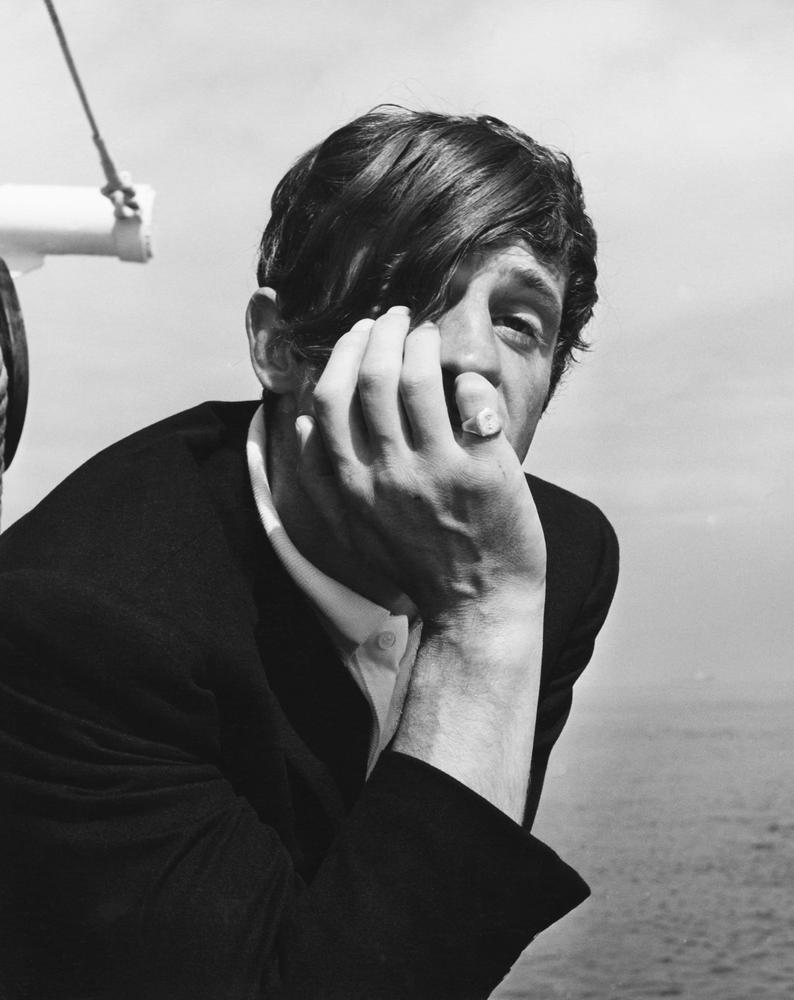

# На последнем дыхании. Жан-Поль Бельмондо умер на 89-м году жизни

- **URL:** https://novayagazeta.ru/articles/2021/09/06/na-poslednem-dykhanii
- **Дата:** 2021-09-06
- **Автор:** Лариса Малюкова

## На последнем дыхании

## Жан-Поль Бельмондо умер на 89-м году жизни

Как-то это ужасно неправильно звучит: «Бельмондо умер». Трудно представить себе более витальных, стихийных, умопомрачительно храбрых, бессмертных героев, бросавших перчатку не только бесчисленным врагам, но и судьбе.

Жан-Поль Бельмондо. Фото: John Springer Collection / CORBIS / Corbis / Getty Images

В таких случаях говорят: «Ворвался в кино». Но он же действительно ворвался «На последнем дыхании». Его Мишель Пуакар — аморальный бунтарь, обворожительный прожигатель жизни, поклонник Хамфри Богарта. Его днем с огнем ищут пожарные, ищет полиция — а он продолжает грабить, объедаться до отвала всеми радостями жизни. Фильм Годара стал манифестом новой волны. Может, просто потому, что совпало рваное дыхание героя и рваный революционный монтаж Годара.

Он целился в солнце и бежал с пулей в спине… историки кино говорили, что со смертью Пуакара начались настоящие непричесанные, неуправляемые шестидесятые. А бунтарь с неотразимой улыбкой в 64 зуба стал кумиром молодежи.

Он никогда не пожалел, что в юности изменил боксу и отправился в Консерваторию драматических искусств постигать профессию. Впрочем, там ему пророчили актерское фиаско. «Ты никогда не сможешь обнять женщину, не вызвав гомерического хохота в зале», — твердили ему. О, как они ошибались! Партнершами «баловня судьбы» были первые красавицы мира: Урсула Андресс, Джина Лоллобриджида, Софи Лорен, Катрин Денев и Клаудиа Кардинале. А как любили его труженицы Советского Союза! Правда, как и везде в Европе,

у нас было две партии: и поклонницы Бельмондо презирали поклонниц Делона.

Поддержите нашу работу!

1000 500 300 Нажимая кнопку «Стать соучастником», я принимаю условия и подтверждаю свое гражданство РФ

Если у вас есть вопросы, пишите [email protected] или звоните:+7 (929) 612-03-68

Однажды Клод Шаброль сказал: «Жан-Поль обладает одним секретом: он действительно такой, каким выглядит, ему нечего изображать из себя, фабриковать некий имидж, напяливать маску. Он действительно симпатяга, действительно спортивен, действительно умница».

А еще действительно храбрец, до тяжелой травмы выполнявший сам головокружительные трюки.

А еще актер — вне времени. Его снимали Луи Маль, Жан-Люк Годар, Франсуа Трюффо, Клод Шаброль, Ален Рене. Кстати, у Рене он сыграл эмигранта из России изобретательного мошенника и афериста Стависки в одноименном фильме. Играл классику: Шекспира, Мольера, Гольдони — и современность. «Сезара» заслуженно получил за близкую по духу роль авантюриста по природе, но в душе романтика, в фильме Клода Лелуша («Баловень судьбы»).

Да ладно, кого он только не играл! Сценаристов, клошаров, преступников, суперменов, полицейских, бандитов, счастливых влюбленных и одиноких стариков. Кажется, в этой портретной галерее собралась вся Франция. И сегодня она прощается с собой.

«Великолепный», «чудовище», «профессионал», «безумный Пьеро». В какой-то момент маски всемогущих героев пристали к его лицу. «Я так много играл непобедимых парней, что сам поверил в свою неуязвимость», — повторял он в интервью.

Он так часто выходил из самых разных передряг на экране, погибал и — вуаля! — оживал, что мы сами уверовали в его бессмертность.

Он вернется, мы снова услышим:

«Нет! Я еще не успел докурить свою последнюю сигарету!»

Поддержите нашу работу!

1000 500 300 Нажимая кнопку «Стать соучастником», я принимаю условия и подтверждаю свое гражданство РФ

Если у вас есть вопросы, пишите [email protected] или звоните:+7 (929) 612-03-68
