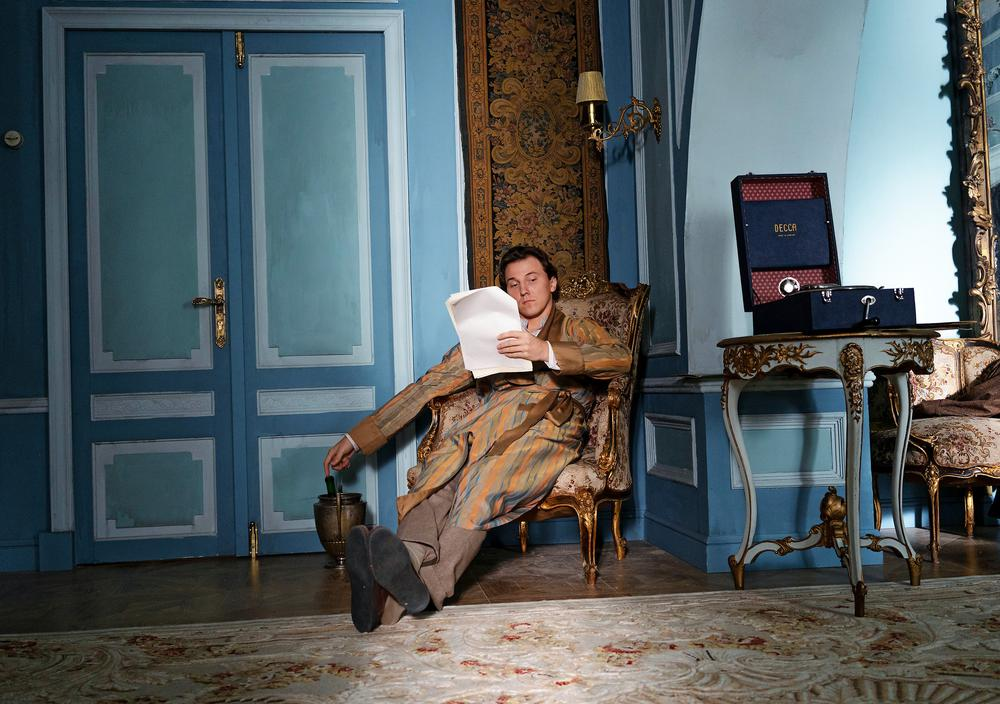

# Праздник жизни у подножия катастрофы. Долгожданный «Вертинский» Авдотьи Смирновой 13 сентября выходит сначала в онлайн-кинотеатре KION и только потом на Первом канале

- **URL:** https://novayagazeta.ru/articles/2021/09/08/prazdnik-zhizni-u-podnozhiia-katastrofy
- **Дата:** 2021-09-08
- **Автор:** Лариса Малюкова

## Праздник жизни у подножия катастрофы

## Долгожданный «Вертинский» Авдотьи Смирновой 13 сентября выходит сначала в онлайн-кинотеатре KION и только потом на Первом канале

Кадр из сериала «Вертинский»

## Как было

С идеей сделать про Александра Вертинского многосерийное кино к Константину Эрнсту обратилась Анастасия Вертинская в 2013-м. Сценарий писали Смирнова, ее верный товарищ по перу Анна Пармас, помогал писатель и историк Джон Шемякин, консультировал историк эмиграции Иван Толстой. Анастасия Вертинская открыла для исследовательской работы архив Александра Николаевича.

## Что получилось

Восьмисерийный сложнопостановочный исторический и поэтический байопик о самом знаменитом русском шансонье ХХ века, охватывающий почти полвека.

Знаменитом, да. Но в основном бродячими клише и байками. Про экзальтированного Пьеро, жеманного, заламывающего руки грассирующего декадента — хрупкий нездешний цветок, в суровых местах на свою беду произросший. Певшего о бананово-лимонном Сингапуре, маленьком креольчике, лиловом негре. В общем, мадам, уже песни пропеты.

Где мы и где — Вертинский, уехавший из страны, чтобы вернуться.

## Танго «Магнолия»

Его одиссея похожа на увлекательный роман сочинителя с бурным воображением. Незаконнорожденный, сирота, которому лгали о смерти сестры, прошедший огонь (санитаром в санпоезде сделал 35 тысяч перевязок и даже операцию), воду пагубных страстей и медные трубы мировой славы. Бежал с белой армией и неутомимо вояжировал в эмиграции: Константинополь, Париж, Берлин, Америка, Харбин и Шанхай. И наконец, в 1943-м круг замкнулся — СССР. «Я износил себя, как старое пальто».

Событий этой избыточной биографии (начиная с того, что «строгий юноша» был натурщиком для памятника Достоевскому, Станиславский не взял его в театр из-за картавости, что был посажен в бессарабскую тюрьму будто бы за шпионаж) хватило бы на эпос. И что там было правдой, а что легендами, возможно, скажут лишь самые близкие. Но и встреч достопримечательных, запечатленных очевидцами (от Веры Холодной, Маяковского, Шаляпина до Марлен Дитрих и Чаплина), не счесть. Все это, разумеется, отлично понимали авторы фильма, которые к тому же вряд ли забыли, что в юности шансонье сравнивали с Бендером.

Поэтому их кино, во всяком случае в первой половине, авантюрно-приключенческий роман, танго с ХХ веком. Партнером страстным, коварным, безжалостным.

Кадр из сериала «Вертинский»

## К мысу Радости

Первые серии, выползающие из треска старой пластинки — легкие, авантюрные, темповые, с криминальным привкусом, — бегут, пританцовывая под «таперский аккомпанемент» (композитор Игорь Вдовин сочинил для фильма целую симфонию, со сквозными лейтмотивами, трансформацией стилистики в зависимости от места и времени действия).

Поддержите нашу работу!

1000 500 300 Нажимая кнопку «Стать соучастником», я принимаю условия и подтверждаю свое гражданство РФ

Если у вас есть вопросы, пишите [email protected] или звоните:+7 (929) 612-03-68

Шатается по городу, шляется по кабакам, заглядывает на съемочные площадки слезливых немых картин мушкетерская четверка шалопаев. Арамис — рассеянный лирик художник Осмеркин (Степан Девонин), теряющий сознание от вида крови, свято верящий в силу искусства. Атос — создатель душераздирающей «Кокаинеточки» и «Романа с кокаином», мудрый и верный товарищ Агеев (Сергей Уманов). Звезда кино Иван Мозжухин, достающий из-под полы коньяк и водку в грелках, — крепко стоящий на ногах Портос. Ну и главный романтик, щедрый на влюбленности Александр — д’Артаньян (Алексей Филимонов). Каждому выписана своя драматическая линия жизни, хотя поначалу это разбитные и азартные бражники, спорящие до хрипоты о поэтическом первенстве Блока или Гумилева. Вымаливающие в аптеке заветную коробочку немецкого кокаина «для больных зубов». С табуретками на головах и в самодельных маскарадных костюмах побирающиеся на улицах. Можно и фрак продать, и душу — дьяволу, и в «художке» позировать, и в надрывной фильме у бездарного режиссера сняться среди картонных декораций — лишь бы… На сцену прорваться, прославиться, создать нечто необычайное в духе Северянина, «Бубнового валета», Шаляпина. Нет! Придумать собственное, убийственно надрывное, как «Кокаинетка», «распятая в мокрых бульварах Москвы». Или же на последние деньги купить бегонию в петлицу. Весь этот карнавал шаляй-валяй и есть праздник жизни у подножия катастрофы. Последний вздох. Скоро чекисты заявят артисту с неправильным репертуаром: надо будет, и дышать запретим.

Их выдуманная реальность, затуманенная кокаиновыми фантазиями, не только болезнь роста, но способ проявить душевный плюрализм, демонстрация внутренней свободы, поиск самовоплощения.

Авдотья Смирнова вкрапливает черными каплями в эту жизнь-игру и неотвержимую катастрофу: пробеги героев по грязной, бандитской Хитровке, одноногих инвалидов, портреты Николая на демонстрациях, свирепую матросню, шальные пули во дворе среди брошенных жильцами пальм.

Временами в начальной части сериала есть некоторая чрезмерность: эмоций, движений, событий — словно зрителя атакуют.

Кажется, авторам так хорошо со своими героями, что они не умеряют собственного пыла, влюбленности в персонажей, любуются ими.

Кадр из сериала «Вертинский»

Оборвется веселье, как игла с пластинки сорвется, похоронами юнкеров, посланных на смерть недрожащей рукой. И окажется наш герой в вагоне с отравленными газами солдатами, которых выворачивает наизнанку. И будет перевязывать раненых, лечить, утешать, петь им. Райская птица в аду.

Думаю, самым сложным для авторов был выбор из моря событий — «событий и людей», которые бы стали красками для этого фасеточного портрета. Избрали форму романа в новеллах. Некоторые из реальных персонажей угадываются сразу, некоторые синтезированы, другие выдуманы вовсе. Каждая серия обозначает новый поворот удивительного трипа по «темнеющей дороге» с очередной эмблематичной песней. И с каждой новеллой на наших глазах творится, трансформируется образ Пьеро, ожившего героя блоковского «Балаганчика»: «Нам мнится — дышит беспощадно Жизнь»

## Homme fatale

«Вертинский» сделан с неместной дотошностью: интерьеры (запомнится «хрустальная» матовая гостиная Веры Холодной), костюмы из старых тканей, цветовая палитра. Сложней всего попасть в актера, тут действительно пан или пропал. Кажется, Алексей Филимонов («Жить», «Кислород») переустроил собственную психофизику. Отдельное удовольствие следить, как его карнавальный хулиган взрослеет, «меняя роли, гримы». Как трагедия вползает в жизнь, и белый Пьеро становится черным, эстрадная звезда — большим актером, под гримом обнаруживается лицо. Как творится собственная эстетика. Формируется образ, в котором высокопарно-романтическое и шутовское, надменное и беззащитное, слезные сантименты и самоирония. Как постепенно выкристаллизовывается личность, отдельность, упрямо сопротивляющаяся обособленность «обломка российской империи». Но ключевое качество «homme fatale» — сверхчувственность. Филимонов поет сам, не копируя «один в один» Вертинского. Оставляет зазор между собой и голосом с царапанной временем пластинки. Удаленный доступ, уважительное расстояние, словно он со своим героем на «вы». При этом тщательная нюансировка, отточенная драматургия песни. Камера Сергея Трофимова влюбленно, то «из публики», то непозволительно близко вглядывается в «артиста», в пластику говорящих рук, игру пальцев, пахнущих ладаном, и «плывущих теней». Обнаруживает безкожность. Когда в зале пьют, дымят, двигают стулья, произносят тосты, он похож на брошенную на сцене тряпичную куклу, и черные брови домиком вскидываются оскорбленно: «Я не кабацкий лакей!» Ну да, эпохи меняются, а свинская публика все та же.

Кадр из сериала «Вертинский»

Я пока не досмотрела сериал, в котором, конечно же, будет и драма патриота, придумавшего себе родину, и трагедия его друзей (надо сказать, сыгранных один лучше другого) и его тапера (не буду раскрывать сюжет, но герой Геннадия Смирнова оказался вторым эмоциональным центром фильма). Но уже очевидно, что

на ключевой вопрос «В чем же магия артиста, в голос которого мы и сегодня вслушиваемся с волнением?» у авторов определенный ответ.

Это самые дефицитные качества: душевное благородство и космическое сострадание, чуткость и человечность. Как говорил он, «правда сердца».

В своих мемуарах он восклицал: «У меня есть высшая надпартийная правда — человечность. Гуманность. Но если сегодня нам не нужна она, значит, надо кричать: «Убей!» и т. д. Все это трудно и безнадежно. И бездорожье полнейшее! От моего проклятого искусства, искусства игры на тончайших и скрытых чувствах и нюансах человеческой души, во мне развернулась сложная и большая машина. Эти маленькие тайные моторы стучат и дрожат и работают на холостом ходу — после концертов или после болезни — и буквально сводят с ума».

### P.S.

У сериала две версии. Одна будет показываться на платформе KION с ограничением 18+. Отредактированная версия с ограничением 12+ выйдет в эфире Первого канала.

Поддержите нашу работу!

1000 500 300 Нажимая кнопку «Стать соучастником», я принимаю условия и подтверждаю свое гражданство РФ

Если у вас есть вопросы, пишите [email protected] или звоните:+7 (929) 612-03-68
