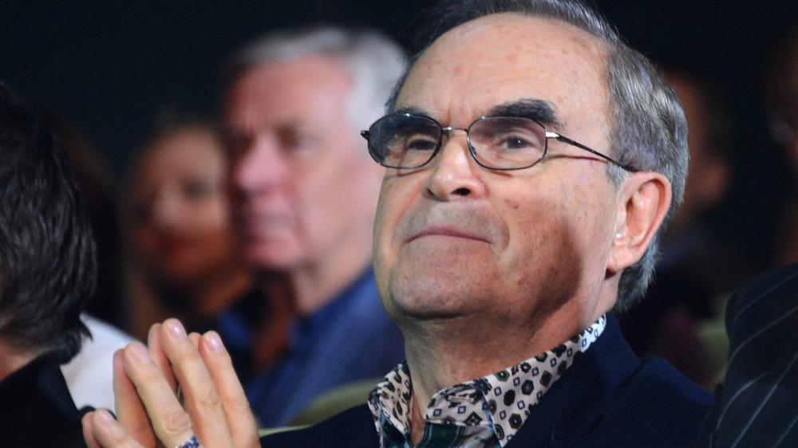

# Глеб Панфилов: «Самая ценная категория для человека — сострадание». Выдающийся режиссер о детстве, своей новой работе «Иван Денисович», сотрудничестве с Солженицыным и потребности правды сегодня

- **URL:** https://novayagazeta.ru/articles/2021/09/09/gleb-panfilov-samaia-tsennaia-kategoriia-dlia-cheloveka-sostradanie
- **Дата:** 2021-09-09
- **Автор:** Лариса Малюкова

## Глеб Панфилов: «Самая ценная категория для человека — сострадание»

## Выдающийся режиссер о детстве, своей новой работе «Иван Денисович», сотрудничестве с Солженицыным и потребности правды сегодня

Глеб Панфилов. Фото: РИА НовостиПоследний из могикан. Всегда против течения. Мастер. И дело не в «Золотых леопардах», «Медведях», «Орлах», «Серебряных львах». Его «Начало», «В огне брода нет», «Мать», «Прошу слова», «Тема», «Васса» пробуждали в нас первостепенные вопросы, и среди них главный: зачем мы?

В них выстраданное осмысление действительности, проза жизни и поэтический восторг, горечь и поразительная без злобы ирония, прикосновение к тайне сердца и система непреложных ценностей. И «несвоевременные мысли» о сущности человека в разных, в том числе трагических обстоятельствах.

В них время и место действия. ХХ век. Россия.

«Иван Денисович» — художественный репортаж из круга первого. Хотя изначально — телевизионная картина. Нет, это не экранизация эпохальной повести, перевернувшей сознание советского человека. Об «Одном дне Ивана Денисовича» Ахматова писала: «Эту повесть обязан прочитать и выучить наизусть — каждый гражданин изо всех двухсот миллионов граждан Советского Союза».

Панфилов снимает собственное кино по мотивам, меняя не только сюжетную траекторию, но и интонацию, строит фильм по законам не литературы — кинематографа.

И начинается эта история про жизнь в ГУЛАГе… с волшебства. Прямо как в сказке. С тихой поступи странницы (Инна Чурикова) по снежному полю. Куда русскому человеку без чуда. Без чуда страшно. Без чуда смерть — от голода, холода, болезни, беззакония, отчаяния, оскотинивания… В общем, почти все, как описано у Солженицына. Но это «почти» и есть суть фильма.

— В 2006-м вы уже обращались к Солженицыну: и в сериале «В круге первом», и в фильме «Хранить вечно». Вам кажется, что в XXI веке Александр Солженицын по-прежнему актуален?

— Для меня он важный и необходимый автор. Но я более других авторов люблю Горького. Да, даже не Чехова, именно Горького. Надо признаться себе в этом, при всей высоте и величии Антона Павловича, вот провинциально мужицкий Горький, с его прозой, с его поэзией… А что касается осмысления нашей истории, его прозорливости — трудно найти ему равных. Ну, это уже дело восприятия каждого. Думаю, он ближе всех к нашей жизни реальной, пусть вас это не удивляет.

— Не удивляет, вы же в фильмах «Мать» и «Васса» в свое время предсказали многое: и наивные надежды обмануть законы истории, и оскал капитализма, и мелких хищников, поедающих крупных, и грядущие перемены, которые вот-вот должны были прийти. Поэтому в финале «Вассы» кораблик властной судовладелицы плыл по нынешней Волге мимо новостроек и здоровенных лайнеров.

— Горький дает возможность связать воедино бывшее с настоящим. А что такое для кинематографиста автор? Вот это: дает или не дает такую возможность, как автору кажется, в данном случае мне, задаться вопросом, всерьез ли мы живем. Что же касается Александра Исаевича, для меня тема ГУЛАГа и сохранения души в нечеловеческих обстоятельствах одна из важнейших.

— Вы прочитали «…Ивана Денисовича» тогда же, в 1962-м?

— Я прочитал в 1964-м, когда поступил на высшие режиссерские курсы в Москве. Но еще большее потрясение, даже не потрясение, а уже неистощимое желание коснуться этой темы, пришло позже — в 1974-м, когда прочитал роман «В круге первом». Потому что там драматургия, там сюжет острый. Как киношник я думал: «Вот это бы поставить! Это да! Но нескоро случится, лет через триста…» А оказалось, совсем недолго, тридцать…

Александр Солженицын и Глеб Панфилов

— Ну тридцать с лишним лет тоже не коротко. И вот уже четверть века вы с Солженицыным так или иначе связаны.

— Да, вначале наша компания «Вера» приобрела права на экранизацию романа, потом присоединился канал «Россия». А снять «Один день Ивана Денисовича» уже сам канал предложил к столетию писателя, уважение к которому сохранилось. Но был заказ. И в этом оказался подвох для меня.

— А в чем подвох?

— Я вроде бы помнил этот рассказ и согласился. Потом перечитал и понял, что поставить в том виде, в каком написано, нельзя. Это чистая литература. Надо придумать сценарий, это серьезная проблема. То есть ответить на вопросы, на которые у автора ответов нет. Мы знаем, что Иван Денисович воевал. Как воевал? Неизвестно. Попал в плен как? Бежал. Как? Не знаем. Вообще мы про его личную жизнь ничего не знаем…

— Про семью только, что тяжелую колхозную работу тянут женщины, ищут способы выжить.

— Просто жена и две девочки. И посылка, пришедшая однажды, — он же запретил остальные, их жалея. Всё! Остальное — покурить, поесть, спрятать пайку, потом ее скушать. Биология… какие-то естественные нужды. В кино это совершенно неинтересно. А что было бы интересно — неизвестно. И вот прийти к мысли, что я должен это придумать, стало угнетать. Не знал, что делать.

— Ну да, и возникло много другого. И герой Филиппа Янковского никакой не крестьянин, скорее тракторист с машинно-тракторной станции.

— Я не хотел, чтобы он был хлеборобом, потому что я мало что знаю про это, рабочие мне близки, я инженер. Хотелось, чтобы был просвещенный на уровне советских правил и возможностей человек. Он мне интереснее, когда слышит, видит, чувствует и понимает время. Это важно для меня. Поэтому МТС.

Филипп Янковский. Кадр из фильма

— Он серьезно отличается от литературного героя. И даже такое понятие, как «внутренний христианский подвиг», в кино довольно сложно показывать. А в фильме у него есть поступки, есть цель: не только животно выжить. Он думает о спасении дочерей.

— Ну а как? Жена умерла от кори, заразившись от девочек. Девочки выздоровели. Это такие уже глубинные фишки, которые пришлось расставить, чтобы история обрела плоть и кровь, иначе снимать невозможно. Поэтому меня трудно в этом смысле сбить или упрекнуть. История становится конкретно-живой, понятной…

— Я слышала, что вы советовались с Натальей Дмитриевной. Было сложно?

— Я не советовался. Я ей показал материал, и он ей в целом понравился. Но она сделала ряд замечаний, некоторые я тут же учел, не все, конечно. Но кое-что осталось, потому что касалось уже того, о чем мы сейчас с вами говорим.

— Я читала, что за основу декорации взята картина Николая Гетмана «Лагпункт Верхний Дебин», Колыма. Гетман — невероятный художник: и документальный, и поэтичный.

— Да, потрясающий. Я просто использовал его сюжет. У меня в фильме и картина его снята, мы его имя указываем в титрах… Получилось, что он нам сцену с лагерным художником подарил, нет ее в повести, это важное прибавление.

Кадр из фильма

Поддержите нашу работу!

1000 500 300 Нажимая кнопку «Стать соучастником», я принимаю условия и подтверждаю свое гражданство РФ

Если у вас есть вопросы, пишите [email protected] или звоните:+7 (929) 612-03-68

— Когда я увидела Шухова Филиппа Янковского, он показался мне персонажем, сошедшим с гулаговских картин Гетмана, ушанка с задранным ухом, неказистость, нелепость, изможденность.

— У меня до сих пор сидит в голове его автопортрет, который снят в картине. Шапка набекрень, смотрит на нас: и образ, и реальная справка о реабилитации, вклеенная. Для меня эта сцена — принципиальная, и она, кажется, органично существует в сюжете. Это же не фотография, правильно художник наш говорит Шухову: «Это ваш образ». Так что все решилось, когда туда Гетман вошел органично и добавил картине объема.

— Замечательно, что вы его вспомнили. Читала воспоминания Гетмана, а вспоминала Шухова: то же постоянное чувство опасности, раскаленное до предела, когда надо быть начеку, а при этом на что-то надеяться. Это ощущение есть в картине.

— Совершенно верно. Это же не выдуманная категория, она про необходимость Ивану Денисовичу вернуться, потому что у него две дочки. Одна совсем юная — беременная, причем влюбленная и уверенная, что у нее обязательно мальчик. Потому что у ее взрослого, вероятно, женатого избранника трое уже есть, двое взрослых работают, а третий в пятом классе. Вы понимаете, в ее коротком письме — трагедия, которая может разыграться в течение двух-трех месяцев!

Поэтому Ивану Денисовичу обязательно выйти надо — спасать семью. Тут я взвинчиваю сюжет, но не наспех — обоснованно. И история обретает человеческий посыл.

— А при этом есть и в этом «картинном» лагере у Гетмана, да и у вас, волшебство, фонарики — прямо рождественская картинка, неожиданная в гулаговской истории.

— Ну с этого же начинается. Когда мы сверху, с неба — издалека — смотрим на лагерь. Летим… «Но нам не туда, у нас другой маршрут».

— Нам не в Европу.

— Да-да, нам не в Европу, не в Ленинград или Хельсинки. И с этого самолета, с этой музыкой в самолете, понимаете, оно как-то вошло и исчезло — а дальше пошел другой сюжет. В общем, я формой удовлетворен. Это мое сочинение по мотивам «Одного дня…»

— Филипп Янковский в этой своей роли, конечно, ваш союзник, потому что становится не только протагонистом, но как бы транслятором идеи автора. Это больше чем актерская работа.

— Как артист, он обладает для меня качествами, которые мне хотелось, чтобы были у героя. Он понимал серьезность момента, насколько глубоко, не знаю, но эмоционально делал все, чтобы это состоялось: терпел мороз, стужу, напряжение работы, а были крайне напряженные моменты. Один раз у него был срыв, но который я совершенно понимаю и прощаю.

— Кстати, Гетман рассказывал, что говорил в семидесятые с Зюгановым, который должен был открыть его выставку, и очень просил сказать, что подобного больше никогда не повторится, на что Зюганов ответил: «Я не обязан искать палачей и сводить с ними счеты». Гетман писал, что о ГУЛАГе вообще предпочитают забыть. Почему эта тема едва ли не табуирована?

— Вы знаете, как ни странно, почему-то читателей многих обращение к теме ГУЛАГа оскорбляет, да ведь и мои фильмы многих обижают — мне это тоже дают понять. То есть я никаким боком, слава богу, в жизни от этого не пострадал, но пострадавшим сознательно сострадал. Многие меня осуждают за то, что я снова коснулся произведений Солженицына.

— Наверное, вы помните, как обвиняли Солженицына в клевете, именовали «литературным власовцем», искажающим нашу историю.

— Да это ведь и продолжается, к сожалению, это меня не удивляет. Хочу сказать, что так полагают люди индифферентные, которым ну до лампочки все это, в том числе муки, страдания других, их предков. Они вот считают, что это обидно и не нужно вовсе. Это зависит от внутренней потребности в правде и от чувства сострадания. Есть замечательное слово «сострадание», когда у человека есть эта способность, в нем многое открывается, появляется понимание того, что многим не дано.

Кадр из фильма

— Тогда у меня вопрос: почему человек способен превращаться в волка? Издеваться над голодными узниками или сегодня бить безоружных на улице дубинами.

— Дело в том, что тайна жестокости меня не интересует. Если разобраться, то за этим конкретно стоит природный характер человека: кто отец, кто мать, то есть родословная, и не обязательно воспитанная, а чисто биологическая. Есть жестокие виды, ну не дано им сострадать. Но даже в волке может быть сочувствующий элемент, который помнит добро, сделанное человеком, и гениальные произведения литературы повествуют об этом. И все-таки человек сознательное создание. Говорят, интеллигентный человек склонен к состраданию больше, чем человек дикий, хотя необязательно: случается и наоборот.

— Есть и способность человека к самообману. Как в нобелевской речи говорил Солженицын: «Всякий, кто однажды провозгласил насилие своим методом, неумолимо должен избрать ложь своим принципом». Гениальная формула, по-моему.

— Ну, наверное, типичная для определенного вида людей. Точно подмеченная, но не обязательная, конечно, нет. Все-таки не устаю повторять, что сострадание для человека — самая ценная из категорий.

— Это обнадеживает.

— Да-да, именно так я и думаю о роде человеческом. С молодых лет у меня такое убеждение формировалось. Я был мальчиком и хорошо помню день, когда началась война, как она продолжалась. Я пошел учиться в школу в 1942-м в Свердловске. И вот в подробностях помню свой двор: у нас большой двор был, большие дома в центре города, а рядом кварталы деревянных домов. И свое детство, счастливые годы юности, а стало быть, свое время обожаю. Друзья, учеба… Одним словом, я насквозь советский человек. Правда, к учебе я свободно относился, меня иногда за плохое поведение выгоняли с уроков, и я шел в кино.

— А что вы смотрели?

— Во-первых, документальные сюжеты…

— Военные сборники…

— Конечно, с этого начиналось. Я их обожал, потому что это хроника, настоящие люди, наши защитники. Потом фильмы, я уж не знаю, сколько раз я «Веселых ребят» смотрел или «Подруги» с Зоей Федоровой. Одним словом, кино и было волшебством, питавшим нашу тыловую жизнь. Я и в оперу ходил, но особенно любил балет, потому что там солист был Олешкевич — очень похож на моего отца, который был на фронте. Я ходил как на встречу с папой. Детство, конечно, фантастической силы источник, питающий всю нашу жизнь.

— К слову, о детстве. В конце 1997-го было решено ввести в школьную программу некоторые произведения Александра Солженицына. А сейчас снова звучат призывы изъять его из программы…

— Я не знал этого. Но меня это совсем не удивляет. Наверное, потому что реакция на его произведения неоднозначная, вот и решили немножко попридержать.

— Постепенно и ГУЛАГ «отменят», и жертв сталинских репрессий: зачем очернять историю!

— Это отчасти инфантилизм. Мы же в моем детстве слышали, что людей сажают в тюрьму, но насчет сталинского террора совсем не знали. Мы переживали за успехи на фронте, мы ходили в госпитали к раненым показывать самодеятельность, устраивали школьные детские концерты. Но, вообще-то, это и называется патриотизм. Мы этим названием не пользовались, просто переживали за все, что происходит на войне и в тылу. За тех, кто сражался, погибал, был ранен, возвращался инвалидом, «колясочником». Жизнь нас учила переживать, болеть за других.

— Но почему бредем кругами? Я же вижу, что реакция на книгу в 60–70-е годы и сегодня — будто одни и те же люди, одни и те же злые слова.

— Не берусь судить… Конечно, жизнь меняется, вкусы. И все же отношение к происходящему, к произведениям искусства, старым или новым, к литературе зависит от того, как развивается человек. Хочет ли развиваться. Иной раз поражает, насколько тупо и быстро люди реагируют, не могут, даже не желают разобраться в самых простых явлениях. Это меня изумляет, а порой удручает. Тут многое зависит от способности каждого человека, его желания понять происходящее вокруг.

Кадр со съемок фильма

— Но есть человечность восприятия — своего рода талант «сокровенного человека», как писали критики о персонажах, которых играет Чурикова: они ощущают мир, его красоту и уродство всем сердцем.

— Безусловно. Сердечный человек и способен постигать вещи, которые стоят за словами, иногда за противоположными словами. Это самая эффективная форма восприятия жизни. Тут и интуиция, тут и ум, простите, здравый смысл. Здравый смысл в сочетании с интуицией дает потрясающий эффект. Я имею в виду природный ум. Образование развивает, шлифует, осложняет жизнь человека, позволяет ему видеть больше, чем хотелось бы знать. А это природное. Для меня это мои бабушки, дедушки — мудрые люди.

— Все-таки в отличие от книги ваш фильм дает надежду, и сделано это преднамеренно.

— Вы знаете, для меня это потребность, так вижу. Тем более знаю, что прототип Шухова остался жив, уехал на родину, то есть для него жизнь продолжалась. Зачем его умерщвлять, делать жестокий финал? Жестокой бывает жизнь, люди бывают жестокими. А здесь свой мир, Господь Бог и человек. И когда человек осознает что-то важное и говорит: «Спасибо, Господи», значит, скорее всего, выдержит, будет жить.

К чему человека еще больше удручать? И без того проблем у него хватает: и пандемия, и стихии, и столько всего беспощадного, что сокращает жизнь. Для меня ключевая сцена, когда Шухов падает на колени перед начальником охраны и прилюдно говорит: «Пощади, майор». Такой сцены нет у Александра Исаевича.

— Но это кульминация фильма.

— Ну, конечно же, для меня это потрясение, я его понимаю. Вы знаете, когда мы это снимали, группа — вся на общем плане — как же они реагировали! Я не сделал ни одного замечания, все были настолько в событии, в этой поглощающей эмоции, были безупречны. Их реакция — тишина, но какая напряженная!

— Майя Туровская говорила, что ваши картины — «будущее в прошедшем». И действительно, это прогностическое кино многое объясняет про сегодняшний день. В том числе и «Иван Денисович», если его смотреть вне клише идеологии, по-человечески…

— Это самая содержательная форма воздействия, самая продуктивная. И с точки зрения автора, и с точки зрения зрителя.

Поддержите нашу работу!

1000 500 300 Нажимая кнопку «Стать соучастником», я принимаю условия и подтверждаю свое гражданство РФ

Если у вас есть вопросы, пишите [email protected] или звоните:+7 (929) 612-03-68
