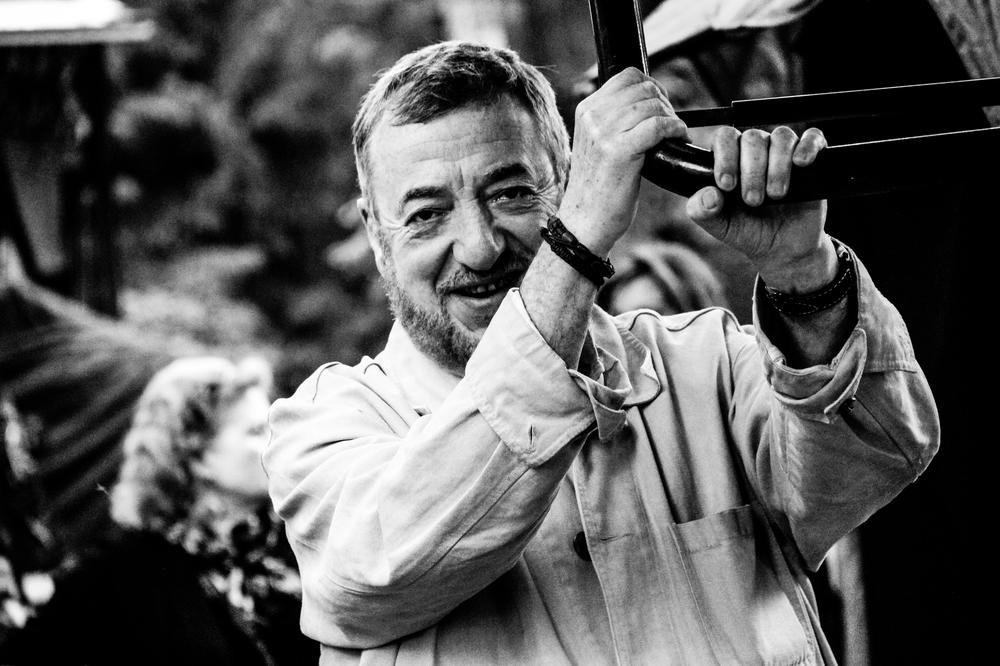

# «Мечта авторитарного правителя — остановить время». Режиссер Павел Лунгин — о набирающей обороты ревизии истории, новом мифотворчестве и вдохновенном желании угодить начальству

- **URL:** https://novayagazeta.ru/articles/2021/09/16/mechta-avtoritarnogo-pravitelia-ostanovit-vremia
- **Дата:** 2021-09-16
- **Автор:** Лариса Малюкова

## «Мечта авторитарного правителя — остановить время»

## Режиссер Павел Лунгин — о набирающей обороты ревизии истории, новом мифотворчестве и вдохновенном желании угодить начальству

Павел Лунгин. Фото из личного архива

— Нам предъявляют благочестивые образы царя Ивана Грозного, мудрость и велеречивость Сталина. Что происходит с отношением к отечественной истории, которую мы как будто бы не изучали? Словно произошел какой-то сдвиг, нам со всей строгостью Уголовного кодекса велят, как именно следует оценивать то или иное событие, ту или иную фигуру, вроде Грозного, Николая I, Сталина, Малюты Скуратова…

— Проблема в том, что сейчас и велеть-то ничего не надо, сами все понимают, без слов. Да и интеллигенцией уже до такой степени все заболтано, в том числе отношение к истории… И уже все кому не лень сказали, что историю переписывают. Историю действительно переписывают. Это любимая русская традиция. Еще во времена Ивана Грозного собирали монахов, летописцев — проверяли, что пишут, вымарывали чего не дозволено. Отношение к истории как к артефакту, над которым надо работать, цензурировать, раскрашивать, вписывать или вымарывать, издавна было в России, особенно при советской власти.

— Да и не только у нас. Еще одна расхожая фраза — историю переписывают победители.

— Сложно понять, кто победитель. На самом деле, если взять Францию или Италию, победили они или проиграли? В общем, все победили и все проиграли. В жизни нет и не может быть победителей, хотя бы потому, что она кончается смертью. Если бы кто-то обрел, уродуя историю, вечную жизнь… Попытки были, но к счастью, это невозможно.

Переписывание истории скорее имеет символическое значение, это же не реальный интерес к преданьям старины глубокой. Потому что молодежь вообще не знает истории. Спроси, тебе скажут, что Петр I жил в XII веке, Ленин выиграл Вторую мировую войну… Но есть запрос на знак, символ — надо создать галерею победительных исторических фигур. И на их примере показать, что современная Россия вписывается в естественно развивающийся образ великой России. Что мы являемся звеном, закономерным элементом, а может, даже и вершиной этой цепи. И не может быть в этой крепкой цепи слабых звеньев, проигрышей, уступок. Так есть и так будет.

То есть современна ревизия истории — попытка захватить даже не сегодня, а будущее. «Сегодня» уже захвачено и все в порядке.

А подкрашенная история упирается в будущее и провозглашает: «Так будет, потому что так было!»

— А не странно ли переписывать каноническое житие митрополита Филиппа, которого вроде и не убивал, как вдруг выяснилось, Скуратов.

— Услышав эту дискуссию, я был потрясен. Любопытно, что этого же не было при Сталине. Хотя тогда могли посадить, расстрелять, убить. Сейчас вроде нет таких прямых опасностей, но общая атмосфера такова, что люди срываются. Будто какая-то сила подбрасывает: не успел ни подумать протоирей Цыпин, ни замереть… Не думаю даже, что успел добежать до патриарха. Сказанул. Знаете, как у отличников на первой парте, пожирающих глазами учительницу. Стоит ей что-то произнести, прямо со стула подпрыгивают: «Сделаем, Марьивановна! Как скажете! Стереть с доски? Диктуйте!»

— Кстати, патриарх Алексий в свое время категорически отказался канонизировать Грозного.

— Алексий отказался — ну нельзя убийцу канонизировать. И старая дореволюционная Россия не спорила с тем, что Иван Грозный убийца. И историки великие, начиная с Карамзина и дальше, тоже закидывали крюк в будущее, говоря, что так нельзя, подобное не должно повториться. В этом смысле никто не любил Грозного, кроме отдельно взятых коммунистов почему-то.

— Сталин восхищался «великим и мудрым правителем» Грозным.

— Так он и есть «отдельно взятый коммунист». Любопытно наблюдать за тем, как людей вдохновляет это желание — угодить.

— Что-то услышат сверху и…

— Даже не услышат, тень пролетела, ночная бабочка пропорхала, муха прожужжала, а человек уже, теряя лицо, спешит угадать. Изумительная пластичность.

Павел Лунгин. Фото: Пресс-служба кинофестиваля имени А.Тарковского/ТАСС

— Спешит стать первым учеником. Скажите, может, здесь есть утилитарная рифма, чтобы оправдать происходящее? Как востребованно звучит сталинская сентенция: «Мудрость Ивана Грозного состояла в том, что он стоял на национальной точке зрения и иностранцев в свою страну не пускал, ограждая страну от проникновения иностранного влияния». И опричнину сегодня необходимо оправдывать, объясняя ее прогрессивность.

— Конечно. Но ведь везде были опричнины. Вот все повторяют, что Белоруссия существует на силе России. А по-моему, Белоруссия живет на силе своей опричнины. Такие же «белоруссии» мы видим в Латинской Америке, такие же «белоруссии» были на Гаити при Франсуа Дювалье, да и во многих африканских государствах. Я хочу сказать, что это какой-то закономерный выверт: если идешь по линии страха, подавления, то опричнина появляется всегда. И, к сожалению, такое государство может существовать долго. Хотя Иван Грозный, как мы знаем, разрушил опричнину…

— Причем жестоко. И потрошители поплатились жизнью, как и сталинские убийцы.

— Все жестоко. Сталин тоже расправлялся, но по-другому, более технологично, слой за слоем, сначала верхний слой, снизу новый нарастал. А он, как Мичурин, корочку за корочкой снимал.

Фото: Влад Докшин / «Новая»

— В основном плодородные слои, хотел докопаться до безжизненной глины.

— Грозный был безумцем. Его пожирал вечный страх… Впрочем, Малюта Скуратов не был репрессирован, честно погиб от ран во время Ливонской войны.

— Карамзин в красках описывал налеты Скуратова на владения впавших в опалу бояр, после чего «захватывал их жен и дочерей на поругание», его жестокость в пытках. Да и в народе про него говорили: «Не так страшен царь, как его Малюта». Во время новгородского похода царя, судя по сохранившимся документам, он замучил больше людей, чем погибло при самом захвате города войсками. И вот эта эмблема страха снова нужна?

— Мне кажется, все похоже, но ничто не повторяется. Я взялся за Ивана Грозного, когда случайно набрел на эту коллизию противостояния царя и митрополита, да еще и увидел мамоновский профиль во время съемок «Острова», его внутреннее искрометание… Увидел в нем эту личность средневековую. Надо сказать, Мамонов — сам явление из другого времени.

Кадр из фильма «Царь»

— В фильме «Царь» он временами похож на мятущуюся хищную птицу. А напряжение картины держится на оппозиции Грозного (Петр Мамонов) и митрополита Филиппа (Олег Янковский), деспотизма и гуманности.

— Но в то же время и Грозный по-своему истово верует. Это столкновение двух вер, их непримиримый конфликт меня изумил: власть и церковь там схлестнулись. Потому что Филипп тоже был тверд в своих идеях и убеждениях. Я хотел показать, что когда власть принимает себя за бога, считая, что может изменить все: день — на ночь, ход истории, то зло приходит неизбежно.

Веры в порядочность, духовные силы не хватает, нужны какие-то более мощные опоры, чтобы противостоять этому натиску человеческой власти, которая карабкается к небу.

Готова занять место Бога.

— Грозный и называл себя «игуменом всея Руси». Кстати, вам после выхода фильма, который буквально в первые дни собрал миллион долларов, досталось от царебожников, от националистов, от православных историков. Писали президенту, требовали запретить фильм.

— Ну да это не страшно, тогда не так гнобили, как сейчас гнобят. Меня поразило другое. Большинство зрителей все-таки встали на сторону власти, в этом конфликте выбрав не жертву, не Филиппа, а — силу. Царя. Это многое говорит о внутренних устремлениях народных.

— Я, кстати, была в «парке аттракционов» — пыточных машин, воссозданных вашими декораторами в Суздале. Невозможно забыть. Увы, сегодня не только благочестивый Грозный, но потихонечку-потихонечку многие темы сакрализуются. Прежде всего война, ее причины, победа. И вот уже Совет федерации поддерживает идею генпрокурора Краснова приравнять оправдание и пропаганду нацизма к экстремистской деятельности. Почему подобные инициативы вызывают тревогу?

— Я не знаю, никто еще до конца не знает. Все чувствуют, что опасно анализировать, устраивать дискуссии по целому ряду тем.

Фото: РИА Новости

Поддержите нашу работу!

1000 500 300 Нажимая кнопку «Стать соучастником», я принимаю условия и подтверждаю свое гражданство РФ

Если у вас есть вопросы, пишите [email protected] или звоните:+7 (929) 612-03-68

— В том числе размышлять о пакте Молотова — Риббентропа, о числе жертв, о количестве панфиловцев. Все эти темы практически табуированы.

— Представь себе хаос метро… Сначала ты едешь в вагоне в темноте, потом вдруг на секунду свет — так хорошо, открываются двери, можно даже выйти. Потом двери закрываются, кто остался, едет дальше в темноту. Те, кто на перроне, в толпе, тоже не сразу понимают, куда двигаться. Вдруг в этом хаосе обнаруживается эскалатор. Ты вроде едешь. Но не тебе выбирать направление, вниз бежать невозможно, потому что тебя растопчут те, которые идут вверх. Сейчас почему люди волнуются? Возникло ощущение, что эскалатор заработал и нас куда-то тащит. И начиная с какого-то пятого, десятого фонаря возникают разговоры о войне. А за разговорами следом идет война.

— Но механик эскалатора скажет, что вас к свету везут, к свободе.

— Но понятно, что вольное, пусть хаотичное, движение окончено. И мы понимаем, почему говорят о войне: у нас не так много победных символов.

— Взяли бы и все свои неистощимые силы бросили на космос.

— Ну космос же ужасен, там холод… Очевидно, что космос не для людей…

— А война для людей?

— Увы. Начиная с Троянской или даже со схваток банд обезьян — вечная тема. Мы же знаем, что какая-то внутренняя необходимость в войне существует, помним знаменитое высказывание Фукуямы о войне как величайшей силе, позволяющей сохранить политическую автономию, усвоить технологии своих врагов. Но… Нет такого чувства, что хотят войны. Мне кажется, что сейчас войны, все эти противостояния проживаются скорее виртуально, никто не надевает, так сказать, лат, не берет ружья…

— Ну, если бы не бомбили, не обстреливали живых людей.

— И все же война приобретает некоторый цифровой или театрализованный характер. Порой напоминают постановки для подбадривания духа нации… Это, кстати, было описано у Стругацких, Сорокина, Пелевина. Такие полупридуманные идеологические войны, необходимые, чтобы воспитывать народ, держать его в узде. Смотри, чем больше проходит времени, тем эти два разных писателя по-разному оказываются предсказателями, а их тексты — пророческими. Если Сорокин скорее камлает, как шаман, переносит нас в ближнее будущее, то с Пелевиным летишь куда-то далеко, в мир цифрово-наркотических трипов, но которые тоже осуществляются. Еще раз думаю о том, насколько близоруко мнение интеллигенции, пренебрежительно отмахивающейся от их книг: «Разве это литература? Это про что?»

— Нынешние ползучие войны не столько виртуальны, сколько гибридны. Слово «гибридность» вдруг стало ключевым для сегодняшнего дня. У нас вся жизнь гибридная: вроде нельзя путешествовать, а можно. Вроде не воюем, а стреляем.

— Судя по всему, мы входим в новую какую-то культуру. Бывают такие цивилизационные разломы. Один из них — в начале XX века, потому что между XIX и XX веками возникла пропасть. Как в эпохи, когда Африка отъезжала от Евразии… Гигантские тектонические сдвиги. И ведь начинается все потихонечку. Сначала одна плита, вторая… Потом вдруг закипела магма, и уже другая жизнь пошла. Не знаю, можно сказать, что нам «повезло»: мы попали в этот разлом. И лишь одаренные каким-то особым провидением люди понимают, что происходит. А может, и они не понимают. Потому что стоим на пороге новой эпохи, культуры. И может, правильнее всего сейчас думать о сохранении себя, своего «я», не поддаваться на эти искусственные общественные истерики. Вот как это сделать? И собой оставаться, и выживать — это большая сложная задача.

Читайте также

Смотрящие при погонах

Российских солдат подготовят к бою с врагом с помощью «патриотического» кино. А также с помощью «Бесогона». Список «идеологически правильных» картин

— С одной стороны непонятное надвигающееся грядущее, с другой — чудовищная архаика в кокошниках и пыльных шлемах, в которую мы впадаем. Помню схватки вокруг вашего «Братства», в котором вы хотели просто показать непарадную афганскую войну. Оказалось, что нельзя. Из-за протестов ура-патриотов фильм сняли с ММКФ. Борис Громов и его сторонники писали наверх, требуя изъять «вредный фильм» из проката.

— Потому что это история о том, как выходить из войны. Инициировал написание сценария покойный ныне Ковалев Николай Дмитриевич, офицер и генерал, экс-министр. Для него, видимо, самым сильным эмоциональным моментом памяти о той войне был вопрос, как «уйти, чтобы не вернуться».

Потому что как начинать войну, все знают, а как заканчивать — никто.

Картина как раз была посвящена этим тяжелым размышлениям. И вызвала такую стихийную ненависть, которая тогда казалась атавистической, архаической. Но многое архаическое, как мы видим, обгоняет нас. У нас историю закидывают ржавым абордажным крюком в будущее. Эта ненависть и была тем крюком. Они же не рассказывали о той войне, эти гневные старые генералы, которые отказывались вспоминать, как они выходили из Афганистана. Они хотели делать будущее! Их ненависть к фильму базировалась на том, что они хотели новых войн. Но иногда какая-то достоверность художественная, она все-таки уберегает от разорения и разрушения. Возможно, немногословная правда фильма, чудесные актеры каким-то образом раскрыли зонтик над запрещением картины.

Фото: РИА Новости

— Помню, как вы бились в Минкульте, в Думе, когда вас обвиняли в русофобии, поддержке террористов, хотя ничего подобного в «Братстве» нет. Но требовался исключительно подвиг на экране.

— Потому хотели и хотят вечно наступающей войны, к которой всем надо готовиться. Мы формально не ведем войну, но готовимся. Да и весь мир готовится, что самое интересное. Будучи запертыми за железной стеной, мы недооценивали, насколько мир продуваем общими ветрами. И духовная жизнь в СССР согласовывалась с мировым коллективным бессознательным. И наша оттепель совпала с протестными настроениями и выступлениями во всем мире: во Франции, в США, Колумбии, Праге, Финляндии.

Точно так же и сейчас… Россию можно считать барометром мировой погоды. Бывают такие стеклянные кастрюли, в которых видно, что кипит и как кипит. По нам можно судить о состоянии закипающего мира, который готовится к войне. К тому, чтобы распадаться, атомизироваться, закрываться в себе. Эта мечта сначала о всемирной Европе, потом о всемирном человечестве, о том, что мы все будем жить в открытом мире без границ, без распрей, закончилась везде. Видим, как Англия выходит из Европейского союза, закрывается Америка. Афганистан, который явно закроется в ближайшем будущем. Да и мы. Мир возвращается к себе архаичному на новом этапе. Я не знаю, как создается миф, мы в середине мифа. Я только иногда чувствую, что то, что волнует, каким-то образом беспокоит, потом оказывается объективно существующим. Вероятно, то, что мы увидели в книгах Сорокина и Пелевина, — варианты будущего мира, к которому мы идем. Каким он точно будет, никто не понимает.

— Ну да, нельзя все время ждать и призывать войну, она рано или поздно может прийти.

— Дело не только в войнах, мы чувствуем, как воздух мира меняется, атмосфера становится недоброжелательной, разреженной. Как мучительно стало летать на самолетах — ты вдруг превращаешься в узника: тебя загоняют в какой-то накопитель, шмонают, потом опять идешь с толпой коридорами. Я понимаю, это необходимо, но куда делись эти чудесные, веселые полеты нашего прошлого? Гораздо меньше хочется путешествовать, да и все меньше уголков на свете, куда мечталось бы поехать.

Кадр со съемок фильма «Братство»

— «Царь» и «Братство» вспомнились в связи с очередными интерпретациями родной истории, в которой миф важнее события, анализа историков.

— Потому что пытаемся рассказать отмершими словами о происходящем с нами, влезть со старыми мифами в другую жизнь. Мне иногда кажется, что в этом виртуальном мире, втягивающем реальную жизнь в экран компьютера, само понятие будущего, проистекания жизни куда-то исчезает. Но и мечта любого правителя, любого авторитарного государства — построить мир, в котором не будет времени. Время должно остановиться, сегодня будет такое же, как вчера, а завтра — такое же, как сегодня.

Читайте также

Повелители истории

Новое назначение Мединского и грядущее «дело историков»

— А год на календаре — всегда 1984-й.

— Именно. В принципе, это и есть мечта о ледяных глыбах незыблемого порядка. И вот то, что не удалось коммунистическому тоталитарному проекту, по-моему, получается. За ту же идею остановившегося времени взялись с другого конца. Тут на «Эхе» говорили про какую-то знаменитую блогершу, у которой миллионы всего: подписчиков, рублей, долларов. Она признается, что не прочитала ни одной книги. И гордится тем, ничего не знает и может прекрасно жить без «этого». «Это» — книги, история, когда жил Петр I, что написал Толстой. «Это» — все, что существовало до нее и теперь оказалось таким ненужным. И ведущие ее небогатые мысли обкатывали. А действительно, не нужно, ведь живет лучше, чем те, которые в мучениях думают о том, меняется ли история и мы сами, входим ли мы в новую культуру или не входим. Ее время остановилось, она, как букашка в янтаре, в этих долларах застыла. И я почувствовал даже нечто вроде укола зависти: а чего вообще мы? Ну нет, вру, конечно, я слишком старый. Но вообще существует огромное искушение отказа от времени, от культуры — всего того, что с этим тектоническим взрывом куда-то оторвалось, отъехало, а мы на своей Африке поплыли дальше в янтарный мир, который должен застыть и не шевелиться. Вот это и есть, наверное, главное беспокойство. Поэтому люди, которые пытаются что-то изменить, голосовать, разоблачать, они, как мухи, жужжат, нарушают, вскрывают этот покой постоянства, светящийся миллионами экранов…

Антон Новодережкин/ТАСС

— Как говорил Бисмарк, ложь востребована во время войны, после охоты и перед выборами.

— Но это правда. У нас все приобретает характер хитроумной виртуальной войны, в том числе выборы. Мы же видим, какая массированная подготовка идет.

— Вам не кажется, что за время, прошедшее с выхода ваших картин, все кардинально изменилось? Сегодня эти фильмы, скорей всего, не вышли бы или на их премьеры пришли бы активисты SERBа.

— Не знаю… Я не хочу мечтать о дыбе. Жизнь поколений проходила в этих жутких мечтах. Как бы не получилось, что эта цензура снизу оказалась ужасней цензуры сверху, той, что была в СССР. Советская цензура хотя бы исходила из одного корня, мы понимали ее. Цензура снизу, идущая от бескультурья, от накопившейся ненависти, от неудачной жизни, от дурно понятых книг, от неудачных браков, от конфликтов с детьми — вот все это выражается в злобную, необузданную силу. И она постепенно распространяется. Так ведь уже было: люди писали в инквизицию…

— Сегодня доносы слагают и в телевизоре, и в интернете.

— Да, и в Средневековье, когда ловили ведьм и жгли их на кострах, вся «инициатива» шла снизу. Потом уже приходил инквизитор. Снова впадаем в морок, когда простые, хорошие парни в камуфляже приходят и говорят, что вот этого спектакля не будет — всем разойтись. Или эти тетки оголтелые (я прямо вижу их лица) готовы с пеной у рта запрещать книги, фильмы, непохожести творчества — все, что не упирается в их внутренне разрешенное. Вообще в людях культивируется понятие «разрешенного» и «неразрешенного». Вот эта цензура, конечно, и есть страшный символ остановившегося времени…

— И ведь не только у нас, во всем мире.

— Да, в мире остановившегося времени перестает быть ценностью художественная новация. Его единственная универсальная мера — деньги. Если у тебя миллион подписчиков, ты априори не можешь быть ни плохим, ни глупым. В этом смысле наш тоталитаризм сливается с американским тоталитаризмом. И мы в этом смысле все-таки часть мира и, быть может, являем конец истории. Потому что все мелкие тычки политиков, угрозы — как школьники за партами. Один в другого плюнул из трубочки, другой двинул в ухо, но над всем этим учитель — деньги. Наше вымечтанное освобождение от коммунистической идеологии оказалось порталом в мир других мер и весов. Еще более тоталитарный, чем прежний.

Поддержите нашу работу!

1000 500 300 Нажимая кнопку «Стать соучастником», я принимаю условия и подтверждаю свое гражданство РФ

Если у вас есть вопросы, пишите [email protected] или звоните:+7 (929) 612-03-68
