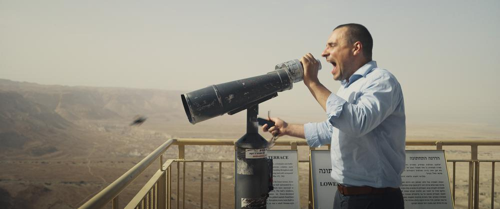

# «Убить людоеда. И простить его». Зельдович, Битоков, Добрыгин — как мифы Древней Греции помогают режиссерам разбираться с современностью. Хроники «Кинотавра»

- **URL:** https://novayagazeta.ru/articles/2021/09/23/ubit-liudoeda-i-prostit-ego
- **Дата:** 2021-09-23
- **Автор:** Лариса Малюкова

## «Убить людоеда. И простить его»

## Зельдович, Битоков, Добрыгин — как мифы Древней Греции помогают режиссерам разбираться с современностью. Хроники «Кинотавра»

Кадр из фильма «Медея». Фото: Кинопоиск

Если обозначить временной диапазон действия конкурсных картин, он простирается на территории тысячелетий. От поседевшего от времени многовекового мифа до обожженной войной и эпидемией современности.

Впрочем, Александр Зельдович перенес «Медею» в наши дни. В Израиль.

Медея бежит из замерзшей заснеженной фээсбэшной России вместе со своим возлюбленным бизнесменом Алексеем и двумя детьми. Правда, для этого ей приходится убить брата-силовика, который шантажирует Алексея. Медея исповедуется перед зарешеченным окошком. Есть ли за ним священник, бог знает… значит — перед нами. Не оправдываясь и не обвиняя.

По образованию она химик, и кажется, вся ее жизнь — грандиозный химический опыт с единственным элементом, за эфемерностью не попавшим в таблицу Менделеева: «любовь». И оказывается, в своем чистом бескомпромиссном виде это страшная, токсичная, разрушительная сила. Медея Тинатин Далакишвили — ядерный персонаж вне времени: выбеленные брови, лицо словно ожившая маска. Отчасти колдунья и ясновидящая (знает свою судьбу и будущее близких). Страстна до умопомрачения, от избытка чувств при оргазме теряет сознание. Умирает на мгновенье, чтобы выключить мир и потом снова зажечь.

Фильм Зельдовича не столько про предательство Ясона-Алексея, сколько о противоборстве, про две модели любовных отношений. Космическая женская, безграничная, всепоглощающая: и себя, и возлюбленного, и детей, и весь громадный мир, который ты можешь включить и выключить. Но обязательно искалечить.

Кадр из фильма «Медея». Фото: Кинопоиск

Рядом с этой грандиозной и падшей Женщиной (безжалостная и великолепная, страшная и изумительная Тинатин Далакишвили) — мужчина. Добрый и нормальный. Обычный. Настроенный на отношения «как у людей». Потому что как у богов — страшно. Прочитать или нет в таком противопоставлении мизогинию — зависит от зрительниц.

Зельдович осмелился на редчайший сегодня жанр — трагедию. Это монументальное кино о необратимости. Героиня пытается повернуть время вспять и даже убеждает столетнего часовщика наладить стрелки, чтобы бежали назад.

Стрелки соглашаются. Время — нет. Замерло. Так и стоит тысячелетия на месте вместе с человеком. Медея ищет путь, пытается поверить хотя бы в какого-то Бога: иудейского, христианского. В итоге отдается искушению похоти. И здесь фонтанирующую аффектацию режиссера хочется несколько умерить. Впрочем, это дело вкуса.

Камера Александра Ильховского не суетится, не спешит за героями, она тоже, по сути, глаз высших сил. Смотрит, не отрываясь, как герои разрушают друг друга, а современный Иерусалим или древние руины, римский акведук в Кесарии или монастырь молчальников живут своей размеренной жизнью.

Музыка для режиссера — половина фильма. Алексей Ретинский сочинил электроакустическую оперу со сложной системой лейтмотивов. У каждого из героев свое звуковое поле. И когда Он и Она встречаются, поля соединяются, создавая странный микс гармонии и какофонии. Но в кульминационный момент музыка обрывается. Медея, преданная и брошенная Ясоном, превращается в блудницу, демоницу Лилит, убивающую младенцев.

Российская премьера фильма «Мама, я дома» выпускника сокуровской школы Владимира Битокова и продюсера Александра Роднянского состоялась в Сочи после показа в Венеции.

Кадр из фильма «Мама, я дома». Фото: kino-teatr.ru

Нальчик, Кабардино-Балкария. У водительницы автобуса Антонины Петровны (Ксения Раппопорт) сын погибает, выполняя «военный долг» в Сирии в составе ЧВК. Женщине вместо сына или хотя бы его останков вручают пакет с деньгами. Как поверить, что этот пакет — все, что осталось… Что ее Женя действительно погиб. Теперь она должна хоронить пустой гроб. И она идет искать правду, ходит по кабинетам, пишет заявления прокуратуру, губернатору. Ее футболят, ей угрожают. И вообще эта шумиха некстати, вот-вот нагрянут люди из Москвы, решать, является ли исторической ценностью старинная усадьба — украшение города. Местный гоголевский чиновный хлыщ (шикарный набриолиненный Александр Горчилин) весь извертелся, чтобы припудрить развалины кокошниками, придать им товарный вид. Да и соскочить в столицу. Но вот тронули трухлявую стену, и из-под осыпавшейся штукатурки проявился лик Сталина. Неубиваемого. Да и Антонина — бестолочь и упрямица: не понимает, с какой страшной теневой силой, формально не признанной государством, связалась. С навязчивостью Антигоны докапывается до правды. И тогда на пороге ее квартиры появляется некто (Юра Борисов) и заявляет, что он и есть погибший сын: «Здравствуй, мама, я вернулся». Раппопорт здесь превратилась в обычную патлатую тетку, орущую на детей, замордовавшую мужа, сбежавшего к другой. И только горе открывает масштаб, величие женщины. Неукротимая Антонина/Антигона пишет большими буквами, как героиня Фрэнсис МакДорманд в «Трех билбордах на границе Эббинга, Миссури» на стенах, на автобусе вопрос властям. Куда делся солдат? Куда дели его жизнь? «Как же так вышло, гражданин начальник?» Ей нужна правда, ее гложет вина, ей нужен сын. А дальше — не сразу, постепенно — происходит невероятное. С помощью камеры Ксении Середы, но прежде всего запредельно точной и странной игры Юры Борисова «псевдосын» превращается в настоящего. Реальность начинает клубиться мифом — миф сохнет во дворе на веревке вместе с курткой сына, который вернулся.

Поддержите нашу работу!

1000 500 300 Нажимая кнопку «Стать соучастником», я принимаю условия и подтверждаю свое гражданство РФ

Если у вас есть вопросы, пишите [email protected] или звоните:+7 (929) 612-03-68

«На близком расстоянии» Григория Добрыгина — фильм об изоляции. Об одиночестве, не обязательно спровоцированном карантином. Кажется, коронавирус просто обострил хроническую проблему всеобщей разобщенности. На пороге своей роскошной квартиры известная актриса Инга (снова Ксения Раппопорт) обнаруживает курьера, мигранта из Средней Азии. Она, добросердечная, оставляет юношу у себя. Ею восхищаются в соцсетеях, у нее берут интервью.

Кадр из фильма «На близком расстоянии». Фото: kino-teatr.ru

Правда, на практике милосердный кров напоминает комфортную тюрьму. Курьеру — для Инги человеку с другой планеты — достается узкая комната с кушеткой, еда доставляется строго по часам, медицинские процедуры Инга делает сама в спецкомбинезоне. Она впустила в свою стерильную, выверенную жизнь «чужого», выделила ему крошечное, запертое на ключ пространство. Дальше события развиваются неожиданным образом, оставляя больше вопросов, чем ответов. Кто кого спасает? Кто жертва и кто хищник? Кто теряет и кто обретает? И тема милосердия получит совершенно неожиданное разрешение.

Эта тема в современном мире с неуправляемыми потоками мигрантов чрезвычайно наэлектризована. Человечество, кажется, проходит очередную проверку на человечность,

демонстрируя, что проповедовать эмпатию легче, чем проявлять ее в реальности.

Григорий Добрыгин рассказал, что, готовясь к фильму, устроился работать курьером, в закрытом рабочем чате набирался опыта и проводил кастинг. В итоге выбрал пухлощекого девятнадцатилетнего курьера Нурбола Уулу Кайратбека, который и сыграл девятнадцатилетнего героя. Он и не знал, что Ксения Раппопорт уже снималась в кино, да и свой шанс использовал просто как временный заработок.

Добрыгин снимает молекулярное в стиле Брессона кино, в котором материальная реальность растворяется, расползается в едва заметных глазу мотивах, жестах, поступках. Это словно обратная сторона очевидного мира, не менее, а быть может, и более значимая. Это и есть мир внутренней изоляции, в которой оказались герои, живущие в одной квартире — в разных вселенных. У каждого из них свои социальные маски, отлепить которые трудно, больно, невыносимо.

Читайте также

Страшный сон Веры Павловны, или Мама, сдохни!

«Кинотавр» расширяет пространство кинопоказов за счет короткометражек и сериалов. Рассказываем о самом интересном.

Кадр из фильма «Подельники». Фото: Кинопоиск

«Подельники» — игровой дебют известного документалиста Евгения Григорьева («Про рок», «Битва за Украину») — тоже про милосердие. И в его основе также миф. Дохристианский миф о медведе-шатуне, отправленном богами к людям с условием: не должен убивать. Да, трудно не ослушаться Медведю. Местный знахарь Людоед-Медведь, проживающий в коми-пермяцком поселке (Павел Деревянко), убил выпивающего художника за слово, которое считается здесь оскорблением. Теперь десятилетний Илья, сын погибшего, должен отомстить. Так положено. И для этого вернувшийся с большой земли в поселок биатлонист (Юра Борисов) учит его точно стрелять. Хотя на самом деле учит совсем другому.

Павел Деревянко в фильме «Подельники». Фото: Кинопоиск

В фильме соединяется (не всегда успешно) фольклорное начало и реализм (да и основана фабула на подлинных событиях), игровое кино — с документальными наблюдениями, профессиональные актеры и жители уральских деревень. И миф зеленеет вместе с местным монументальным Лениным, глядящим на трудную жизнь людей, всегда ждущих большую беду. Потому что такой у нас социальный гомеостаз, такое живучее динамическое постоянство «чем хуже, тем лучше»: только страшное способно сплотить, вооружить, оторвать от лежанки. Убить людоеда. И простить его.

Поддержите нашу работу!

1000 500 300 Нажимая кнопку «Стать соучастником», я принимаю условия и подтверждаю свое гражданство РФ

Если у вас есть вопросы, пишите [email protected] или звоните:+7 (929) 612-03-68
