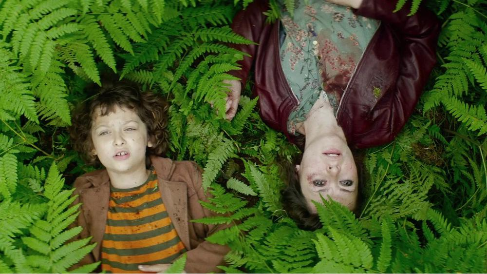

# Кино «здесь и сейчас». «Кинотавр» завершился. Есть надежда, что российский кинематограф перестает быть вещью в себе

- **URL:** https://novayagazeta.ru/articles/2021/09/25/kino-zdes-i-seichas
- **Дата:** 2021-09-25
- **Автор:** Лариса Малюкова

## Кино «здесь и сейчас»

## «Кинотавр» завершился. Есть надежда, что российский кинематограф перестает быть вещью в себе

«Оторви и выбрось». Кадр: KinopoiskСтоит ли повторять, что призовые списки чаще портретируют жюри. Перед началом фестиваля председатель судейства Чулпан Хаматова пообещала оценивать фильмы максимально субъективно. Так и вышло.

Самые интересные картины вызвали категорически полярные оценки и суждения. Это касается и фильма Евгения Григорьева «Подельники» — криминально-фольклорная быль с убийством и людоедом-Медведем в центре. И лирико-поэтический автофикшн «Дунай» Любовь Мульменко — о том, как юная душой и телом Надежда (Надежда Лумпова) решилась жизнь переиначить, воздухом другой страны надышаться, влюбиться в свободу непредсказуемо бражнической Сербии, войти в реку дважды… и почувствовать себя чужой. Пережить разрыв с мечтой, сделав собственный взрослый выбор.

«Дунай». Кадр: Kinopoisk

Пожалуй, единственная картина, которая всем в той или иной степени нравилась, — «Нуучча» Владимира Мункуева — былина из жизни якутов 19-го века, порабощенных русскими чужаками с имперскими замашками. Художественная экранизация ссыльного писателя Вацлава Серошевского удостоена приза за режиссуру.

Но пика остроты дискуссии достиг «Капитан Волконогов бежал» — притча-гротеск о сталинских репрессиях. Фильм Наташи Меркуловой и Алексея Чупова получил приз зрительского жюри и приз за лучший сценарий.

«Нуучча». Кадр: Kinopoisk

## То ли стрельбы, то ли допросы

1938-ой. Чистки в разгаре. Капитан Волконогов — богатырь сталинского розлива. Тягает гири, вписывается в акробатические пирамиды, танцует вприсядку под «Полюшко-поле» вместе со славным корешем, любителем компота Веретенниковым (Никита Кукушкин). Как только начинают исчезать его подельники — то ли стрельбы, то ли допросы, а начальник (Александр Яценко) выходит из окна — Волконогов стремительно сбегает. За одиночным «волком» охотится вся стая: система на воронках и трамваях во главе с харкающим кровью хитроумным майором Головней (Тимофей Трибунцев). А к беглецу из ада всходит его товарищ, почерневший от мук Веретенников: единственный способ избежать котла с чертями и выворачивания кишок наизнанку — испросить прощения хотя бы одного человека. Так начинаются блуждания бритоголового мизерабля в поисках спасения своей смертной души по квартирам погибших. Ну хотя бы кто-нибудь из их близких его простит?

«Капитан Волконогов бежал». Пресс-служба фестиваля «Кинотавр»

Третий полнометражный фильм Меркуловой и Чупова («Интимные места», «Человек, который удивил всех») — пороховой триллер о русском тоталитаризме, канкан вприсядку в расстрельном дворе НКВД, где легендарный виртуоз дядя Миша кладет врагов народа одним выстрелом.

Снимать кино о сталинских репрессиях сложно. Особенно в России. И наверху не возрадуются. И замаха германовского нет, и бюджеты не михалковские, и надежды повернуть колесо истории, как у Абуладзе, — нет. Надо придумать решение. Например, ретроутопию. Хотите миф? Не будем делать его былью, просто умножим на сто. «Волконогов» — постмодернистский комикс, соединивший воду с маслом. Сорокина с Рогожкиным, академию Штиглица с НКВД, театральность и натурализмом мертвецкой, авангардистские фантазии Малевича и Татлина, переосмысленные в костюмах Надежды Васильевой, — и граффити.

В сюрреалистическом Ленинграде 1938-го под гигантскими дирижаблями, опричники в модных красных трико и кожаных куртках играют в волейбол, пьют компот и расстреливают невиновных, экономя патроны.

Избыточная красочность эффектна, действие сжато в пружину. Волконогов кружит по городу, встречаясь с родными жертв, которые не виновны, просто «ненадежные».

Просто «план по посадкам». На каждое наказание обнаружим преступление. Расстреляем заблаговременно «виновных завтра». Временами фильм походит на плакат (некоторые плакаты даже цитируются, например, знаменитое изо «Не болтай!» Ватолиной и Денисова). Многое объясняется словами. Про страну в кольце врагов, невинных жертв. «Никто тебя не простит!», — объявляет приговор Волконогову маленькая взрослая девочка. Волконогов Юры Борисова нарезает круги по Ленинграду в поисках прощения. И даже вроде его получит, но сам себя не простит.

Фильм повышенной зрелищности и эффектности. После показа и долгой овации его сторонники и противники сцепились в спорах о дозволенных способах эстетизации насилия, карнавализации трагедии репрессий, любования и сочувствия к палачами (его впрочем, нет). Мнения, как всегда, формулируются с сильным захлестом. Думаю, когда фильм выйдет на экраны, споры эти вспыхнут ярким пламенем с новой силой и, быть может, (слабая надежда) пробудят вновь угасший интерес к трагическим событиям, которые в историографии постепенно припорашиваются, высветляются.

## «Кинотавр» — женский род множественное число

Все началось с Открытия. Казалось, что «Кинотавр» решился в духе времени поменять гендер. На сцене три сестры превратились в ведущих ток-шоу о лидерстве женщин и архетипических страхах мужчин. Манижа пела залу «Stand up!» Женщины в вечерних туалетах решительно ей аплодировали. Оба жюри возглавили актрисы. Судейство в главном конкурсе — Чулпан Хаматова, в коротком метре — Ингеборга Дапкунайте.

Большинство фильмов о сильных и сложных женщинах. В «Герде» Наташи Кудряшовой (диплом жюри) начинающий социолог днем и стриптизерша ночью, решает проблемы неблагополучной семьи. Мать Агриппины Стекловой из «Дня мертвых» Виктора Рыжакова вместе с сыном объезжает могилы родни, которая для нее живее всех живых. Интроверка Надя из фильма «Дунай» Любы Мульменко разбирается в себе, ищет любви, свободы в вымечтанном Белграде с вымечтанным любимым, жонглирующим собственной и чужими судьбами. Медея Тинатин Далакишвили в картине Александра Зельдовича не способна смириться с предательством бизнесмена Ясона и устраивает страшный спектакль мести. Четырнадцатилетняя Вика («Ничья» Виктории Ланской) не знает, как быть с ребенком, который у нее образовался. Ксения Раппопорт сыграла двух решительных героинь: Антонину из Нальчика, ищущую следы погибшего сына в фильме Битокова «Мама, я дома», и знаменитую актрису Ингу, приютившую гастарбайтера («На близком расстоянии» Григория Добрыгина).

«Ничья». Кадр: Kinopoisk

Поддержите нашу работу!

1000 500 300 Нажимая кнопку «Стать соучастником», я принимаю условия и подтверждаю свое гражданство РФ

Если у вас есть вопросы, пишите [email protected] или звоните:+7 (929) 612-03-68

Трешевая лирическая комедия «Оторви и выбрось» — про женщин трех поколений (не знаешь, какая из них сильней, упрямей, беспощадней, какая бьет больней).

Рядом с героиней обычно пьющий отец, ненадежный, потерянный спутник. Женщина — не просто сильный пол, она — мир. Мужчина мается в этом мире, подчиняясь его законам.

Юная Саша в элегии Николая Хомерики «Море волнуется раз» переживает колоссальное, как девятый вал, испытание первой любовью, у которой один безжалостный враг — время. За эту работу дочь Сергея Бодрова-младшего Ольга получила приз «За лучшую женскую роль», а сама история влюбленных подростков… даже не история — сон о любви, зыбкий, страшный и дивный так впечатлил жюри, что картине Хомерики вручили главный приз. И значит, не зря режиссер наконец-то вернулся из коммерции в авторское кино.

«Море волнуется раз». Кадр: Kinopoisk

## Один фестиваль — один актер

Нынешний «Кинотавр» назвали фестивалем одного актера. Юра Борисов снялся в шести (!) картинах, представленных на смотре. Седьмая роль — члена жюри короткого метра. Все-таки богатая фантазия и широкий кругозор у наших режиссеров. Еще недавно они дружно снимали Данилу Козловского, потом двух Александров — Кузнецова и Петрова. На нынешнем «Кинотавре» мы увидели режиссерский дебют Петрова — короткометражку «Ангел». В нем он сыграл артиста-аутсайдера, вынужденного подрабатывать аниматором на улицах и завидующего знаменитому актеру, воплощенному Иваном Янковским. Впрочем, жюри проигнорировало массовость борисовских ролей, разнообразие экранных характеров, и приз за лучшую мужскую роль присудило Павлу Деревянко за инфернальный образ человека-Медведя.

## Раскуклились

На протяжении многих лет мы изумлялись закукленности российского кино, оторванности от среды с ее вызовами, проблемами, настроениями новых поколений.

32-й «Кинотавр» свидетельствует, что этот разрыв сократился. Пришло поколение, для которого здесь и сейчас — на расстоянии вытянутой руки.

Больше всего актуальных фильмов по понятным причинам в коротком метре. Самое выразительное с художественной точки зрения высказывание на жгуче злободневную тему — «Почти весна» Насти Коркия об уставшей и измученной беспросветной жизнью милой школьной учительнице, вынужденной вбрасывать бюллетени в избирательной комиссии. О калечащем женском обрезании на Кавказе — эссе «Собирайся, поедем на праздник» Ламары Согоманян. О буллинге, доведшим девочку до попытки суицида («Хейт» Светланы Самошиной с Викторией Толстогановой в роли мамы-мстительницы). О встрече «ребят с нашего двора»: российского солдата и украинской снайперши в Донбассе («Сказка» Максима Кулькова). О девушке, сбежавшей от росгвардейцев и спрятавшейся в квартире… полицейского («По разные стороны»). Эта картина рифмуется со страшной в духе Балабанова притчей «Степка» — про стеснительную девушку, по-соседски заглянувшую к участковому, чтобы утихомирил пьющего отца, а заодно прошелся по дебоширам всего подъезда. В итоге ее приковывают к батарее и насилуют.

«По разные стороны». Кадр: kino-teatr.ru

«Марш!» Владилена Верного об учениках, которым назначили урок физкультуры, чтобы отвлечь от митинга. Центр фильма акварельная, без нажима работа Даши Калмыковой, сыгравшей современную директрису школы, радеющую за покой и порядок — идеальной прически и школы, с чеканной брезгливостью отмахивающейся от либеральных родителей восьмиклассника: «Так вы «из этих».

Но даже когда авторы снимают ретро, они говорят о злободневном. Это касается не только «Капитана Волконогова», но и конкурсного фильма «Общага» — по мотивам повести Алексея Иванова «Общага-на-крови». Антиутопия из 1984-го о неоправданных надеждах, предательстве как способе выживания, о метафизике человеческой природы. О кошмаре советского бесприютия. Приз за лучший дебют.

Показали первые новеллы остроумного сериала «Товарищ майор» Бориса Хлебникова. О рядовом труженике ФСБ Сан Саныче из отдела прослушки и его клиентах, которых не выбирают. Может, повезет, и сериал, созданный на платформе КИОН, все же выйдет (в чем многие сомневаются). В его добродушной иронии нет ничего крамольного. Духовник Сан Саныча, который вроде бы грешил рукоблудием, оказывается, просто вяжет потихоньку от жены, чтобы на пасху подарить ей новые варежки. Героический президент побеждает восьмерых нападавших. Либерал Алексея Аграновича клевещет в соцсетях на родину. А Сан Саныч (Евгений Сытый) — чудный маленький человек на своем ответственном месте. Родину защищает, людям помогает, даже тем, которые его об этом не просят.

Поддержите нашу работу!

1000 500 300 Нажимая кнопку «Стать соучастником», я принимаю условия и подтверждаю свое гражданство РФ

Если у вас есть вопросы, пишите [email protected] или звоните:+7 (929) 612-03-68
