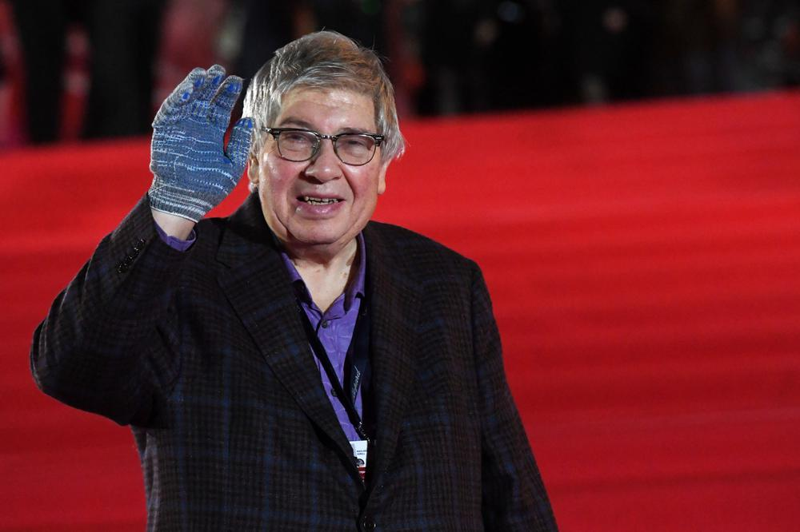

# Культ киноличности. Памяти Кирилла Эмильевича Разлогова

- **URL:** https://novayagazeta.ru/articles/2021/09/27/pamiati-kirilla-emilevicha-razlogova
- **Дата:** 2021-09-27
- **Автор:** Лариса Малюкова

## Культ киноличности

## Памяти Кирилла Эмильевича Разлогова

Кирилл Разлогов. Фото: РИА Новости

Из всех его многочисленных должностей, научных степеней и званий, пожалуй, самым важным в последние десятилетия было его руководство программой Московского международного фестиваля, институции для многих сомнительной и с политической, и с экономической точки зрения. Но благодаря Разлогову и его команде отборщиков для российских синефилов показы на ММКФ были возможностью соединения с мировым кинематографом. С режиссерами, с фильмами — старыми и самыми новыми, — которые по многим причинам во впадающей в мракобесие стране не могли быть показаны.

Разумеется, прежде всего, он был просветителем.

Поддержите нашу работу!

1000 500 300 Нажимая кнопку «Стать соучастником», я принимаю условия и подтверждаю свое гражданство РФ

Если у вас есть вопросы, пишите [email protected] или звоните:+7 (929) 612-03-68

Его авторская программа «Культкино» на канале «Культура» — не просто лекция, предваряющая кинопоказ. Это разговор о явлении культуры, о многоликом непрерываемом кинопроцессе, о едином пространстве, в котором живут китайское или монгольское кино, Голливуд и авангард, Годар и Хичкок, Барнет и Луцик с Саморядовым.

Кстати, в проекте «Новой газеты» о фильмах 90-х «Кино, которое мы потеряли», Кирилл Эмильевич выбрал для своей рецензии «Окраину» Луцика и Саморядова.

…Я защищала кандидатскую. Разлогов был оппонентом. ВГИК — ведущей организацией. И одна вгиковская тетенька написала поверхностный и кусачий отзыв. Кирилл Эмильевич вышел со стопкой листков: «Вот это мой официальный текст о междисциплинарной диссертации Малюковой. Его можно прочитать, кому интересно, — отложил листки в сторону. — А я буду оппонировать совершенно неубедительному отзыву кафедры киноведения ВГИКа».

Мы с ним нередко спорили, порой по очень существенным вопросам, порой публично (последняя дискуссия была на «Эхе Москвы»), но при этом никогда не ссорились. И никогда не убывало мое восхищение его энциклопедическими знаниями кино от киноавангарда до видеоарта, от Орсона Уэллса до французской волны, погруженностью в науку о кинематографе, культуре, ощущением личной сопричастности великому Синема, какой-то особой близости с титанами, с которыми он говорил на одном языке.

Светлая память!

Поддержите нашу работу!

1000 500 300 Нажимая кнопку «Стать соучастником», я принимаю условия и подтверждаю свое гражданство РФ

Если у вас есть вопросы, пишите [email protected] или звоните:+7 (929) 612-03-68
