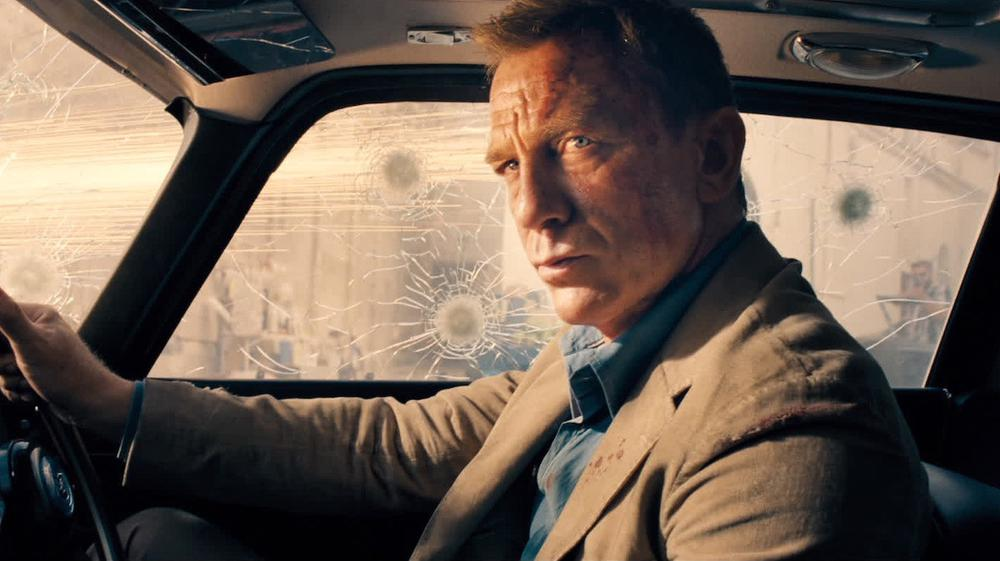

# Умри, но не сейчас. Джеймс Бонд возвращается

- **URL:** https://novayagazeta.ru/articles/2021/10/01/umri-no-ne-seichas
- **Дата:** 2021-10-01
- **Автор:** Лариса Малюкова

## Умри, но не сейчас

## Джеймс Бонд возвращается

Кадр из фильма «Не время умирать»Его ждали с 2015-го. Долго не могли приступить к съемкам, перебирали пасьянс из режиссеров и сценаристов, да и пандемия премьеру фильма «Не время умирать» отодвигала многократно (кое-что даже пришлось переснять, так как продакт-плейсмент, которого в бондиане всегда с излишком, быстро устаревает).

Юбилейная, 25-я серия бондовской саги, завершение большой пятичастной главы, в которой агентом 007 был Дэниел Крейг, вызывает, мягко говоря, смешанные чувства.

Заарканив артистичного Эрнста Ставро Блофельда — главу террористической организации СПЕКТР (Кристофер Вальц), Джеймс Бонд бросает на произвол судьбы МИ-6 и блаженствует на Ямайке среди лиан и пальм, ловит рыбу в заливе (точно как сам Янг Флеминг в своем поместье «Золотой глаз»)… Пока на острове, покрытом зеленью, не появляется его верный друг Феликс Лейтер из ЦРУ (Джеффри Райт) с просьбой о срочной помощи. Бонд не отказывает. Потому что Бондов бывших не бывает. Даже если их сместили на службе и легендарный номер 007 передали агенту Номи (как только темнокожая актриса Лашана Линч получила роль секретного агента, ее засыпали ругательствами в интернете). Лейтер просит Бонда разыскать похищенного ученого Вальдо Обручева вместе с биоматериалами, способными привести к гибели миллионов людей.

Так начинается новая миссия шпиона на все времена. Режиссером стал Кэри Фукунага («Без имени», «Настоящий детектив), хотя поначалу должен был снимать создатель «Миллионера из трущоб» Дэнни Бойл (Мендес, Нолан, Вильнев прозорливо отказались садиться в режиссерское кресло).

Новый Бонд — продолжение предыдущих четырех серий, их завершение. И временами кажется, что старая пластинка заела на все тех же мотивах и мелодиях, несмотря на новые технологические и смысловые навороты в духе времени.

Мы уже знаем, что Бонд Крейга человечней всех живых, способен на ошибки, изношен, воюет с мировым злом скорее по старой привычке. Он вообще привычкам не изменяет: от костюма с Сэвил Роу до легендарного Astin Martin DB 5 с непременными пулеметами вместо фар. Он меняется, потому что в новом толерантном мире и Бонду досталось за мизогинию. Так что больше 007-ой не посмеет сорвать с женщины купальник, без спроса зайти в душ, подать даме туфли… вместо одежды. Известно, что сам Флеминг не отличался политкорректностью, утверждая, что «мужчины хотят женщину, которую можно включить и выключить, как свет в комнате».

Бондиана нового века идет осторожно, оглядываясь во все стороны: осторожно, как бы не рассердить миллениалов.

Любовные сцены страшно целомудренны, по обоюдному согласию… за кадром. Бонда вроде бы в МИ-6 смещает женщина. Но это все наносное: миром в бондиане по-прежнему правит мужчина, он спасет и Вселенную, и ребенка, и подругу.

Со злодеями в фильме переизбыток. Во-первых, давно надо было разобраться с Эрнстом Блофельдом (кажется, Вальцу тоже надоела бондиана), закадычным врагом 007, пауком террористической паутины СПЕКТР. Теперь Блофельд, ослепший на один глаз после взрыва СПЕКТРа, сидит в клетке наподобие Лектора и управляет — до поры до времени — своими злобными марионетками из тюрьмы.

Но роли главного злодея удостоен Люцифер Сафин, отхвативший новейшую технологию наноботов, способную заражать население в гигантских масштабах, причем избирательно. Свое изрытое оспинами лицо человекоубийца Люцифер скрывает за японской маской театра Но. Рами Малек придумал для своего героя точную интонацию — сдержанную, без диких всплесков эмоций, словно его герой давно мертв и продолжает творить зло по инерции. Жаль, авторы не придумали для такого зрелищного персонажа развития образа. В итоге Сафин не слишком отличается от своих предшественников — антагонистов 007. Кстати, и в «007: СПЕКТР» был злодейский Призрак, сотканный в духе времени — из нанотехнологий. Слушайте, Бонд столько лет спасал мир, неужели он не заслужил грандиозного врага?

Поддержите нашу работу!

1000 500 300 Нажимая кнопку «Стать соучастником», я принимаю условия и подтверждаю свое гражданство РФ

Если у вас есть вопросы, пишите [email protected] или звоните:+7 (929) 612-03-68

Кадр из фильма «Не время умирать»

Есть еще шакал-перебежчик доктор Обручев — противный лысый очкарик, готовый вооружить боевыми штаммами оспы и убийственными биоматериалами любого. Обручев трудится в гигантской лаборатории на тайном острове (видимо, одном из тех, что русские не отдают Японии), с надписями по-русски на стенах и с помощницей Светланой.

Российский след возвращается в бондиану вместе с холодной войной. Теперь русские захватывают мир не с помощью нефтяных вышек, героина, установки по уничтожению компьютеров, а ядов, нанороботов, способных проникать под кожу. А еще — провидческого понимания, что люди больше не хотят свободы, по их венам течет желание подчиняться. Свою версию Бонда Фукунага описал как исследование мира шпионажа «в эпоху асимметричных войн»: когда существует дисбаланс в силах противника, слабая сторона применяет экстренные меры и средства (вроде «Новичка» или цифровой войны).

Авторы с удовольствием жонглируют «глазной темой». Сюрреалистический или бионический глаз Бловельда способен жить своей жизнью и даже вести собрание СПЕКТРа. Он же рифмуется с глазом на пружинке приспешника Циклопа, охотника за головой Бонда. Глаза Мадлен не может забыть злодей Люцифер, и возможно, однажды они спасли ей жизнь.

Кадр из фильма «Не время умирать»

А так в респектабельном сериале все по-прежнему. МИ-6 снова толкается локтями и пистолетами с ЦРУ. Бен Уишоу, Рэйф Файнс, Наоми Харрис вернулись к своим прежним обязанностям и одеждам. Томная доктор Мадлен Суон (Леа Сейду), многолетняя девушка Бонда, снова укрыта плотной паранджой тайны. Снова погони на суше и в море, уже виденные гонки по лестницам, головокружительные прыжки с мотоциклом, овцы, пытающиеся остановить 007. Горящий океан с маленьким «Титаником», который не спасти. Кажется, все это было. Но главное, 15 лет Бондом был Крейг. После «СПЕКТРа» он пообещал «порезать вены, прежде чем сыграть Бонда в пятый раз». Но как-то перетерпел. Хотя в глазах спецагента на службе Ее Величества — тоска и усталость. Крейг всегда играл на понижение образа супермена, нарядного мачо, «вспарывал» миф о его неуязвимости. И теперь, наконец, они полностью совпали: 007, которому надоело спасать мир, и 53-летний Крейг, которому осточертело скакать, летать, гореть и не плавиться в одной франшизе, которой вроде бы сносу нет. Впрочем, эта самая старая кинофраншиза, хотя и молодится темнокожими бондианками и миркороботами, все же выглядит на свои 59 лет.

«Не время умирать» — сплав оригинальных режиссерских находок (как зрелищный пролог на ледяном озере), или ныряльщицы среди развалин, или убийственная красота «цветов зла» (у злодея Сафина на острове растет живописный сад ядов) и клишированных сценарных ходов и дидактических диалогов: «Если отпустить прошлое — раскроется будущее», «В наше время не разберешь, где друг, где враг».

При всем обаянии и размахе фильм ценой в $250 000 000 и продолжительностью 2 часа 43 минуты — утомляет.

Правда, как только начинает звучать главная бондовская тема, зритель подобно кролику, загипнотизированному коброй, готов смотреть, не отрываясь, на экран. И только к середине понимаешь, что смотришь зрелище, сварганенное из ингредиентов предыдущих серий.

Что в фильме «Не время умирать» прекрасно, так это музыка. Ханс Циммер, только что подвигший поклонников «Дюны» скачивать незабываемый саундтрек, создал роскошную партитуру, которая развивает классические темы бондианы. А композиция No Time To Die Билли Айлиш и Финнеаса О’Коннела удостоилась отдельного выразительного клипа, где рядом с богиней военной стратегии Афиной — затонувшие часы, на стрелке которых завис командор 007.

Что будет со Вселенной Бонда? С экзотическими злодеями, русскими наемниками, паутинами террористов, бледными королями и угасающими королевами? Реинкарнируется ли сам 007? Понадобится ли он новым поколениям? Ну, хотя бы для того, чтобы бросить вызов монструозному COVID 19, в щупальцах которого корчится планета.

Ну же, Джеймс, сделай что-нибудь! Не бросай нас. Не время умирать!

Поддержите нашу работу!

1000 500 300 Нажимая кнопку «Стать соучастником», я принимаю условия и подтверждаю свое гражданство РФ

Если у вас есть вопросы, пишите [email protected] или звоните:+7 (929) 612-03-68
