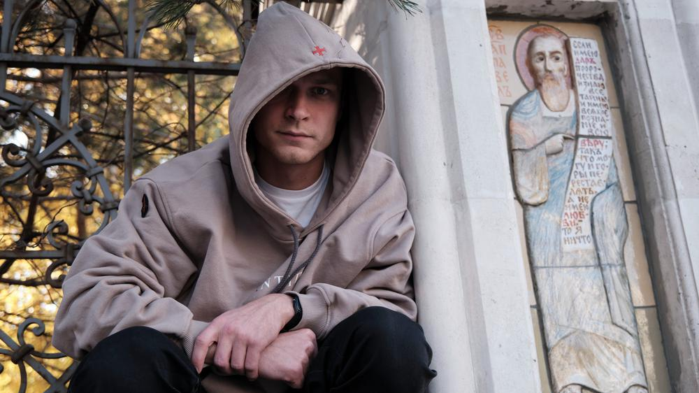

# Юра Борисов: «Будто мы все время готовимся к смерти». Интервью с самым востребованным российским актером 2021 года

- **URL:** https://novayagazeta.ru/articles/2021/10/18/iurii-borisov-budto-my-vse-vremia-gotovimsia-k-smerti
- **Дата:** 2021-10-18
- **Автор:** Лариса Малюкова

## Юра Борисов: «Будто мы все время готовимся к смерти»

## Интервью с самым востребованным российским актером 2021 года

Юрий Борисов. Фото: Антон Карлинер / для «Новой»Самый востребованный российский актер сегодня — Юра Борисов. В этом году небывалые рекорды: шесть фильмов с его участием на «Кинотавре», два в Венеции, два в Каннах; среди них «Купе номер 6», удостоенное Гран-при и сейчас выходящее на экраны. В чем секрет актера, которому уже приписали народную харизму, как актеру-хамелеону удается остаться самим собой?

— Тот самый случай, когда успех не свалился внезапно на голову. Поначалу раздавал фото по агентствам, стучался в двери мосфильмовских групп. Это упорство, упрямство или уверенность в себе? В кого ты такой?

— Не знаю, просто какие-то вещи кажутся очевидными, значит, надо их делать. И кстати, вскоре после этих походов на «Мосфильм» меня утвердили на главную роль в сериале «У каждого своя война» и в групповку «Елены» Звягинцева.

— Юра в честь Гагарина?

— Не уверен. Но точно не Юрий. Поначалу мама звала меня Ваней, пришел папа забирать из роддома: «Какой Ваня! Смотри, он же Юра!» Там же рядом Юрьев день — 8 декабря у меня день рождения.

— В «Сатириконе» совсем недолго пробыл. Не был готов выходить в массовке, занавес закрывать?

— Дело не в этом. Я просто идеализировал свое представление о театре, в институте нам говорили, что это место свято. Попав в театр, увидел, что все не так. Юношеский максимализм, наверное.

— Ты даже сказал, что тебе не понравилась режиссура Райкина.

— Ну и режиссура Райкина мне не понравилась. Выяснилось также, что каждый день нужно приходить в одно место, и чаще всего это не будет сопровождаться полетом. С ранней юности боялся, что моя работа будет меня тяготить. Я понял: если останусь в театре, он станет «тягостным» местом. К тому же не люблю район Марьина Роща, мне небезразлично место обитания.

— Какой же район тебе подходит?

— Ну вот этот, где мы встретились: Покровка.

— Хорошо, и «Новая газета» рядом. У тебя к 28 годам гигантская фильмография. И кажется, едва ли не каждая роль, даже не сложившаяся, проходная, — школа. Ты продолжаешь учиться. При этом утверждаешь, что ни одна из твоих ролей тебе не нравится.

— Можно на покой, если тебе понравится то, что ты сделал. Это как вообще? То, что мои работы мне не нравятся, дает возможность делать какие-то следующие шаги.

Кадр из фильма «Бык» (2019, реж. Борис Акопов)

— Расстраивают какие-то конкретные вещи? Что, например, не нравится в роли главаря районной банды Антона в «Быке», сделавшей тебя известным?

— Сложный вопрос, это внутренняя кухня. В «Быке» вижу какое-то самолюбование, хотелось бы от него избавиться. Впрочем, какие-то вещи вижу только я и моя жена Аня. Мы обсуждаем каждую роль. Вместе больше десяти лет, друг друга знаем, можем разобрать все по косточкам. И до съемок, и в процессе, и результат.

— Не комплиментарный взгляд?

— Абсолютно, все строго, честно. Мы учились у одних педагогов, заложивших в нас одну основу, говорим на одном языке. Когда внимательно разбираем мои работы — очевидно, что пока ничего даже близко не получилось. Существует гармония, которой никак не достичь. Хочется приблизиться к катарсису, а не выходит: расплескивается, не случается. Что-то от меня зависит, что-то не зависит, но пока не произошло.

— Мне многие работы актера Борисова нравятся, например, в зрелищной сказке «Серебряные коньки», вошедшей в топ Netflix. Отличная работа в магическом роуд-муви «Купе номер 6», где ты сыграл работягу и бражника Леху, с которым встретилась в поезде финская искусствоведка, там есть и очевидное развитие характера: в гопнике Лехе просыпается человек, нежность, когда он осторожно вступает в хрупкий мир отношений. Хотя в начале, когда видим его пьяное буйство, мне показалось, ты пережал.

— Возможно, не могу со стороны это оценивать. Просто чувствую: тут лучше, тут что-то не так. Но согласен, там не только начало, много чего пережато. Так это и круто: жизнь идет, что-то удается, что-то не получается. И ладно. Раньше переживал на эту тему. Сейчас думаю, надо учесть ошибки и двигаться дальше.

— На что готов ради роли? Я почитала про тебя: не исключаешь зуб потерять, зрачки расширить, проколоть ноздрю, попробовать наркотик…

— Могу сказать, на что не готов.

Не готов разрушать свою семью ради роли, на все остальное готов.

Фото: Антон Карлинер / для «Новой»

— А такой вопрос стоит?

— Конечно. Самое сложное и страшное, когда делаешь роль, это то, что с тобой происходит. Это отречение от собственной жизни — вынужденное, временное. Хотя есть шизофреническое непонимание, что есть моя жизнь, моя личность. Все время об этом думаю и не могу найти ответа. Я же постоянно разбираюсь в разных личностях, в которых должен превратиться, что их формирует, чем руководствуются. Мою личность тоже что-то сформировало. А если я могу разобрать на кирпичи, что и как ее сформировало, моя ли это личность? Когда я делаю персонажа, ныряю в него полностью. Отключая часть своей жизни, отключаюсь и от своих близких…

— Дома появляется Чужой?

— Странно все это. Да. В экспедиции все проще, понятнее. Другое место, как будто бы кусок другой жизни. А то, что этот персонаж приходит к нам домой, вроде это не совсем я. И непонятно, как проводить внутри себя эту границу. С одной стороны, нужно всем жертвовать ради того, чтобы «священнодействовать». С другой стороны, понимаю: священны-то как раз не роли, а они — дети и жена. Они останутся, они — в живом мире. А не тени на экране. Искусство в принципе субъективно, человеческая жизнь уникальна — потерянный день невозможно вернуть.

— Есть же такой диагноз — «расстройство множественной личности», в чем-то напоминающий актерство: в одном человеке уживаются разные идентичности, гендер, возраст, интеллект…

— Это самая интересная для меня тема: сосуществование разных идентичностей. И бесконечные вопросы. Мы себя как-то идентифицируем, кажется, что это мы, но это лишь набор нейронных связей, отвечающих за самоидентификацию.

— И каждая встреча в жизни меняет их рисунок.

— Не только встреча, любая информация!

— Кажется, ты заметно изменился за последние годы насыщенной работы, встреч с режиссерами: со Звягинцевым, Серебренниковым, Бондарчуком, Меркуловой и Чуповым. В такие разные характеры преображался: энкавэдэшник из прошлого («Капитан Волконогов бежал»), бандит из 90-х («Бык»), пришелец то ли с того света, то ли из ЧВК («Мама, я дома»), Алик-афганец («Мир! Дружба! Жвачка!»). Когда заканчивается работа, роли цепляются, оставляют след или ты выбрасываешь их, как однажды выбросил гору ненужных вещей, собрав все памятное в одной коробке?

— Сразу выбрасываю, стараюсь освободиться, ничего не забирать себе.

— Актеры, случается, говорят репликами своих героев.

— Это чаще в театре. Играли мы спектакли в институте, как только произнес фразу десятки раз, она потом из тебя сама выпрыгивает. Мне это не близко, какая-то высокопарность получается.

— Ролей много, но «Бык» про молодого лидера преступной группировки в 90-е Антона Быкова действительно стал прорывом. Хотя и до этого были работы, но тут все тебя увидели. Роль яркая, порой кажется, что именно ее шлейф в некоторых работах мелькает. В афганце Алике, в наемнике из ЧВК… Срабатывает коллективное бессознательное: «О, мы же его знаем!»

— Наверное, так устроен социум, нам нужны маячки, за которые держимся… Я согласен с тем, что актер играет одну роль всю жизнь. Хороший актер — в первую очередь индивидуальность. В институте нам говорили о значимости системы ценностей. Ты формируешь их: что можешь делать, чего не должен себе позволить. Все это транслируется дальше.

Нередко про актера говорят, что он одинаковый… А почему он должен быть разный? Бодров был везде одинаковый.

— Не только Бодров, но и Жан Габен. Но есть и актеры-лицедеи, неузнаваемые…

— Здорово порой преобразиться до неузнаваемости, полицедействовать, но и там ядро будет точно таким же.

«Купе номер 6». Кадр из фильма

— В «Петровых в гриппе» Серебренникова ты сыграл совершенно другого человека: милого, слабого, раздавленного сильной мамашей сына.

— Признаюсь, сам не очень его понимаю. Вроде мы с Кириллом Семеновичем его сделали, а что с ним происходит? Как я его для себя оправдал? Никак. Не получилось к нему найти ключ. Может, времени не хватило. Вроде бы и не надо всех оправдывать, потому что люди и характеры бывают разные. А не оправдывая, мне самому не очень интересно…

— Ты сказал про финского режиссера «Купе номер 6» Юхо Куосманена, что он ловец мира. Что ты под этим подразумевал?

— Ловец жизни, я имел в виду. Он смотрит и видит жизнь такой, какая она прямо сейчас перед глазами. Берет и интегрирует это в фильм. Видит рыбаков, снимает их, забирает в кино, никак ими не руководит, словно наблюдает, что будет происходить. И с актерами так же. Не говорит, что делать, а все время спрашивает: «Вот твой герой — это вот что? Ради чего?» И ты ищешь ответ…

Поддержите нашу работу!

1000 500 300 Нажимая кнопку «Стать соучастником», я принимаю условия и подтверждаю свое гражданство РФ

Если у вас есть вопросы, пишите [email protected] или звоните:+7 (929) 612-03-68

— Ну, например, твой бритоголовый Леха, случайный попутчик молодой финки из «Купе номер 6», едущей на русский север, чтобы увидеть мурманские петроглифы, он — что?

— Мы с Юхо это обсуждали, когда готовились, еще в Финляндии. Он меня спрашивает: «Если он из детского дома, то почему там оказался?» То есть вроде бы и подробно, но все такое… будто все из воздуха брал. Например, точно знает, как хочет сделать эпизод. А мы так не можем, потому что дверь не открывается, камеру здесь нельзя поставить, надо сцену переделать. И он не бесится по этому поводу, напротив…

— Находит что-то неожиданное. Так работала Кира Муратова.

— Ну вот я, к сожалению, не работал с Кирой Муратовой.

— Иностранные рецензенты писали о твоем герое: душа нараспашку, воплощение русского человека. Может, имели в виду как раз начало фильма, где Леха-гопник хлещет водку, пинает снежки на платформе? А может, переломные моменты, когда за этой «гармошкой» обнаруживается ранимая, беззащитная душа?

— Ну для меня он «гол как сокол», нечто угаданное про русского человека. Я думаю, откуда берется в нас то, что люди в других странах называют духовностью? Ощущение, будто мы все время готовы к смерти. Чем хуже, тем лучше. Халатно относимся к жизни: ну жизнь, ну смерть — и ладно.

Фото: Антон Карлинер / для «Новой»

— Движение по краю, отсутствие страха?

— Какой-то антиматериализм, разгильдяйство во всем. Может, из-за постоянной радикальной смены климата? Каждый год наблюдаем, как все умирает наглухо, просто ледяной апокалипсис… Ведь для многих людей с другой части планеты наша зима — реальное светопреставление: все застывает, накрывается снегом и льдом. Потом ба-бах — и заново возрождается. И это происходит регулярно! Будто знаем: ну да, смерть — это нормально, дальше-то опять будет жизнь. То же и в истории страны. Период за периодом у нас все отнимали, и мы привыкали ничего не иметь, потом объявляется ценность частной собственности, потом снова отнимают.

— Умирает одна политическая система, начинается другая… Среди многих картин в этом сезоне самая яркая — антиутопия о сталинском СССР «Капитан Волконогов бежал», про сбежавшего от расстрела энкавэдэшника, ищущего покаяние. Ты играл человека того времени или условного сорокинского опричника, комиксовый персонаж?

— Была попытка ничего не играть. Стать стертой личностью, умершей в каком-то смысле. Ступив на этот путь, он предал все человеческое, для меня — умер как душа, как сгусток энергии. Жаль, вылетели сцены, объяснявшие, как он тут оказался, где был до этого. А была тяжелейшая жизнь, в результате которой он и попал в структуру, которая ему все дала: комнату, товарищей. Наличие комнаты в то время — это как вилла на Рублевке сейчас.

— Помню претензии к фильму: мол, авторы пробуждают в нас эмпатию к опричникам, которые «пытают хуже фашистов». К герою, который постепенно прозревает, движется к покаянию.

— Это была лаборатория: можно ли испытать эмпатию к подобному человеку? Ответ на этот вопрос — нет. Я пытался впустить в себя палача, как я его ощущал. Зритель решает, может ли ему сочувствовать. Конечно, можно было бы сделать это более жалостливо, показать, как он мучается, но тогда сразу обнаружим у него душу. Человек мучается, когда понимает степень вины, душа мучается. А он не понимает, не чувствует.

— Для тебя происходит его усомнение в собственном зле, его развитие?

— Да. Перед финалом он чувствует боль. И возможно, кто-то испытает к нему эмпатию, даже понимая бэкграунд. Это вопрос. А вначале у него лишь корыстная цель, задача: заслужить прощение; он ее выполняет. Только в финале пробуждается что-то живое.

— Не раскрывая финала, скажем, что там есть связь со смертью. Я вижу, как скрупулезно разбираешь роль, читаешь не только сценарий, но книги, мемуары, пытаешься сформулировать сверхзадачу. Тебе однажды даже досталось за это от Звягинцева, когда ты приставал к нему с вопросами о твоем работяге из групповки: кто он, откуда?

— Ну да, Звягинцев ходил с монитором, у него было дел невпроворот. Он вообще не понимал, кто я, зачем задаю эти вопросы. И подходит человек из массовки или групповки и пытается осознать: «Камо грядеши».

— Это словно фрагмент из комедии про кино.

— Именно, я говорю: «Андрей, а мы как… вот мы здесь стоим, а как мы относимся к героине? Она проходит. Мы ее знаем? Мы ее осуждаем? Или мы…» Он как бы завис на секунду и говорит: «Никогда не задавайте вопросы режиссеру». Я надолго это запомнил.

— Притом что сам он въедливый, докапывается до запятых в сценариях и интервью, до отточий. А какую задачу, к примеру, ставил Кирилл Серебренников? Описывал жизнь Саши, этого маменького сынка, человека-тряпки?

— Все-таки там центр мира — мама. Главный, по сути, персонаж, движитель истории. Подавляет мужа и сына. То есть у моего Саши вроде все хорошо, все есть. При этом нет ничего, потому нет своей воли, он такой фрустрированный, самопридуманный. У парня большие проблемы с мужественностью и самоидентификацией. На самом деле, несчастный человек, но всему этому нет места в фильме, чтобы раскрыть.

— Сегодня ты серьезно вкапываешься в роль. Раньше ради работы соглашался на проходные роли разнообразных лейтенантов, солдат. Вопрос: сейчас ты был бы готов сыграть яркую, выигрышную роль, но в мутной, идеологически запрограммированной картине? Условно говоря, «Союзе Спасения», наглядном пособии о вреде революций с искаженными образами декабристов.

— Я бы, конечно, не хотел участвовать в таких фильмах, в которых не вижу правды: события, характеров. И эту картину не вижу смысла обсуждать, потому что все всё понимают. Зачем это делать? Поэтому и отказался сниматься в продолжении.

Кадр из фильма «Союз спасения» (2019, реж. Андрей Кравчук)

— Существует ли такая забота артиста… Вот идешь в фильм, допустим, в «Калашников». Где большая драматическая роль может получиться: драма изобретателя оружия, внутренний конфликт. И режиссер хороший. Но сценарий изначально слабый. Люди разговаривают, словно они из картона: «Все мы имеем сильное желание помочь тебе, парень, в твоем правильном деле». Много фактической неправды. Так вот, может ли актер в подобной ситуации что-то выровнять, очеловечить, подправить?

— Нет, к сожалению, не может. Все это следует делать на этапе принятия решения: участвовать или не участвовать. Урок за уроком получаю: все, что необходимо обсудить, поменять, уточнить, нужно делать до того, как вы ударили по рукам. Кино снимает режиссер, актер не должен мешать ему.

— Наверное, это идеализм, но мне кажется, создание кино — работа командная, когда у всех причастных одна цель — хороший фильм.

— Не хотел бы, если соберусь снимать кино, чтобы подходили актеры: «Слушай, а давай-ка сделаем вот так». Я бы сказал: «Давай-ка ты помолчишь, я буду снимать свое кино, а ты играть в нем». Придерживаюсь позиции: есть режиссер, каким бы он ни был, я ему помогаю, раз уж согласился сниматься.

— Но в «Т-34» ты не только изменил своего героя, но в каком-то смысле его придумал: характерного, с постоянным насморком, завязанным горлом.

— Это моя кухня, мои хитрости. Актеры всегда «дописывают» своего героя, полностью управляемые — скучные. Тех, кто делает в кадре что-то новое, режиссеру сложно вставить в конструкцию фильма. Впрочем, все зависит от персонажа. Когда Джим Керри играл в «Вечном сиянии чистого разума», он все время прятался от камеры, отворачивался. Вроде бы с точки зрения профессии — глупость…

Кадр из фильма «Мама, я дома» (2021, реж. Владимир Битоков)

— Но камера его ловила, возникала документальность.

— И с точки зрения энергии — это круто. Интересно что-то менять, но исключительно в своем внутреннем подходе к роли.

— Есть распространенная точка зрения: актеры и политика несовместны. В ней изначальная неточность. Политика — это депутаты, политтехнологические шоу. Несносно, когда актеры в этом принимают участие. Но мы все живем в каком-то воздухе или в безвоздушном пространстве. Вы с Аней растите девочек, ты же думаешь о том, в каком мире им жить? В нормальном обществе или фальшивом, где белое называют черным, журналиста — «иноагентом», за пост в Сети могут арестовать любого студента.

Как быть? Ты говоришь, что надо принимать мир таким, каков он есть. Но при этом выступил в поддержку осужденных по «Московскому делу», читал речь Егора Жукова, против которого возбудили дело через два года после публикации его видеоблога и осудили на пять лет. Ты же мог опасаться: вдруг тебя в блэк-лист запишут, но вместе с Евгением Цыгановым, Павлом Деревянко, Александром Палем и другими — выступил. Как существовать в этом пространстве, когда каждый день возникает какая-то нехорошая история?

— Что касается детей, наверное, надо просто постоянно с ними разговаривать, обсуждать, что есть правда, а что неправда, и почему это происходит, и что со всем этим делать. Просто сейчас такой период, такая политика. Хотя роль личности в истории во все времена определяющая. Глупо думать, что существует мир, в котором все по правде, по-честному. Это утопия, недостижимый рай. Поэтому нужно пытаться понять, как здесь/сейчас жить.

Почему актеры и политика — разные сферы жизни? Потому что актеры должны быть чувственными людьми, а чувственного человека легко возбудить, распалить. Политика — не про чувства, это чистая прагматика.

Чьи-то интересы. Надо как минимум понимать, чьи интересы ты отстаиваешь. Устинова и других арестованных по «Московскому делу» мы защищали от явной несправедливости. То же было с Кириллом Семеновичем Серебренниковым и процессом «Седьмой студии». Сейчас листаю ленту, вижу информацию, которая меня шокирует, возмущает. Потом проходит несколько часов, я понимаю, что получил неточную или неправильную информацию. А я уже выступил, участвую в какой-то волне. Поэтому на данный момент дистанцируюсь от участия в каких-то публичных высказываниях, отдаю себе отчет, что ничего не понимаю в том, что происходит.

Фото: Антон Карлинер / для «Новой»

— Ты правильно сказал однажды, что все перевороты происходят от отсутствия диалога власти с людьми. Что нужно для восстановления такого диалога?

— Если бы мы смогли прямо сейчас найти ответ на этот вопрос, что-то поменялось бы и у нас. Мне кажется, прежде всего нужно послушать и услышать своих детей и внуков. Говорю это и себе будущему, если доживу до этого времени. Услышать и понять, что они правы, хотя бы потому, что им еще жить, а тебе умирать. Только тогда возможен диалог. Если ты прожил длинную жизнь, это не повод смотреть свысока на молодых, зеленых. Недавно мы снимали у пруда рядом с Новодевичьим монастырем, там чудесная скульптурная композиция «Дорогу утятам!»: утка ведет за собой утят. Я подумал, что это мой любимый памятник. Он про дорогу юности, эти утята, которых по осени считают, обязательно сделают что-то свое, крутое, но пока не могут. И в силах опыта, зрелости — дать возможность им вырасти, сохранить себя, чтобы потом они дали место новым утятам. В «Строителе Сольнеса» Ибсена сформулированы важные мысли на эту тему. Пьеса о неумолимом движении времени, о том, что юные — это другие, требующие, чтобы старики уступили им место. Без диалога поколений, в том числе в политике, не развивается общество. И начинать лучше всего с себя. В своем доме пытаться услышать тех, кто младше. Все время хочется их задвинуть. У меня дочки пока маленькие, но как же хочется сказать: «Помолчи. Ты ничего не понимаешь! Я понимаю, я, умный, сейчас все объясню». Поэтому пытаюсь дать им возможность что-то решать, не зажимать их.

Читайте также

«Мечта авторитарного правителя — остановить время»

Режиссер Павел Лунгин — о набирающей обороты ревизии истории, новом мифотворчестве и вдохновенном желании угодить начальству

— Синдром популярности — плюсы и минусы? Твой любимый актер Сергей Бодров говорил, что за все надо платить, за успехи — утратой свободы.

— Плюс единственный и очевидный: популярность дает возможность зарабатывать больше денег, которыми я могу делиться с близкими людьми, улучшать их жизнь. Минусы в том, что это испытание… Может показаться, что ты чем-то лучше людей вокруг, — это не так. Ты должен постоянно говорить себе об этом. Люди подходят, произносят хорошие слова. В кого-то кино попало, показалось важным, он говорит, как все замечательно, какой ты прекрасный. Все надо фильтровать, откладывать в какой-то условный ящик благодарностей — и возвращаться к себе. Я постоянно слышу какие-то комплименты. Негативные оценки в лицо тебе не бросают, хотя негатив бывает конструктивным. Когда вокруг хором говорят, какой ты крутой, это реально отнимает много энергии и сил, это действительно потеря свободы.

— А свобода, она в чем для тебя?

— В том, что можешь просто идти себе по улице, быть обычным человеком, не смотря на себя со стороны, не выстраивая себя под взглядами и оценками других. Свобода — когда можешь видеть жизнь так, как ты ее хочешь видеть, а не так, как тебя заставляет кто-то ее видеть.

— Ну, и на финал: Шаламе или Драйвер?

— Драйвер.

— Почему?

— Не хочу быть на него похожим, но просто он клевый чувак. Мечтал бы с ним познакомиться и поработать. В нем есть внутренняя сложность, в которой хочется разбираться, за которой интересно наблюдать. Он не красивый в стандартных понятиях красоты, да и не пытающийся быть красивым. Оттого настоящий. А это самое ценное качество в актере. И в человеке.

Поддержите нашу работу!

1000 500 300 Нажимая кнопку «Стать соучастником», я принимаю условия и подтверждаю свое гражданство РФ

Если у вас есть вопросы, пишите [email protected] или звоните:+7 (929) 612-03-68
