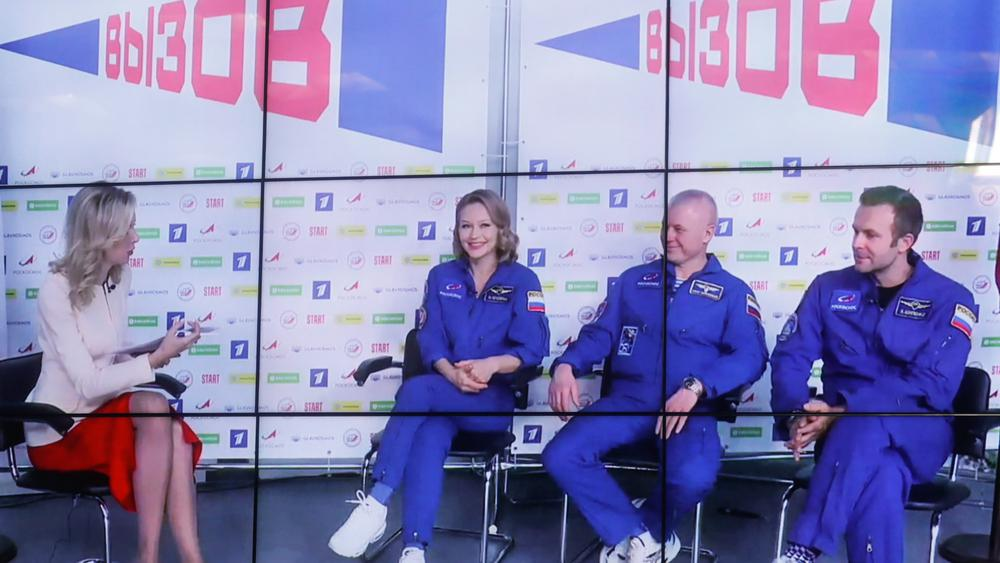

# «Это такое сильное впечатление — вспышка где-то снаружи». Актриса Юлия Пересильд, режиссер Клим Шипенко и космонавт Олег Новицкий дали первую пресс-конференцию после возвращения из космоса

- **URL:** https://novayagazeta.ru/articles/2021/10/19/eto-takoe-silnoe-vpechatlenie-vspyshka-gde-to-snaruzhi
- **Дата:** 2021-10-19
- **Автор:** Лариса Малюкова

## «Это такое сильное впечатление — вспышка где-то снаружи»

## Актриса Юлия Пересильд, режиссер Клим Шипенко и космонавт Олег Новицкий дали первую пресс-конференцию после возвращения из космоса

Актриса Юлия Пересильд, космонавт Олег Новицкий и режиссер Клим Шипенко во время пресс-конференции. Фото: Михаил Джапаридзе / ТАССПресс-конференция прошла в онлайн-формате на площадках ТАСС и Центра подготовки космонавтов имени Ю.А. Гагарина.

Внимание прессы было сосредоточено больше на кинематографистах.

Они сейчас заново учатся ходить.

Клим рассказал, что их поддерживали, потому что их заносило, шатало. Но больше говорил о необыкновенных видах в иллюминаторе, о том, как меняется свет, цвет. Такое невозможно придумать на земле. Это действительно опыт нового взгляда на кино: «А для меня кино и есть жизнь».

Юля заметила, что и на жизнь смотришь как-то иначе, когда каждая секунда открытие. Когда невозможно поверить в то, что видишь. Невозможно передать первые ощущения наших полетов.

«Это такое сильное впечатление — вспышка где-то снаружи. Честно говоря, хочется это прочувствовать неторопливо, прожить. Было же очень мало времени. И в последний день мы понимаем: завтра — все. А мы не насмотрелись… Не успели. Мы снимали, работали, все время шли съемки. Космонавты подключились, помогали нам, несмотря на огромное количество задач. Помогали снимать. Так что, с одной стороны, кажется, что это длилось вечность, с другой — прилетел — и уже обратно.

Пытаюсь до сих пор все держать в руках… чтобы не улетело. Все было на липучках: от помады до медицинского реквизита. Вещи мгновенно улетают, потом ищи их на вентиляторе. Про свои особенные впечатления и про сон Юля Пересильд рассказала, что в космосе она прекрасно спала. Час сна в космосе равняется двум на земле. Для девочек есть бонус — на лице не остается следов от подушки.

Встреча экипажа корабля «Союз МС-18» в Звездном городке. Фото: Михаил Джапаридзе / ТАСС

Поддержите нашу работу!

1000 500 300 Нажимая кнопку «Стать соучастником», я принимаю условия и подтверждаю свое гражданство РФ

Если у вас есть вопросы, пишите [email protected] или звоните:+7 (929) 612-03-68

Клим Шипенко: «Весь процесс съемок для меня и есть вызов. Впервые снимал практически один, без съемочной группы. Юля отвечала за реквизит и грим. Антон Шкаплеров таскал за ноги, чтобы я не разбился. Космонавтам пришлось обнаружить в себе актерский талант. У них не было другого выхода. Мы старались сделать максимум что могли. Себя не жалели.

Сценарий корректировался по обстоятельствам, космонавты уточняли диалоги. Иначе, чем задумывалось, складывались визуальные образы. Например, разговаривают двое: один верх головой, другой — вниз головой, а камера в третьей плоскости. Для меня это было кинематографическое открытие, как в многих плоскостях решать сцены».

Было снято порядка 30 терабайт. Более 30 часов. Однако после монтажа останется 25–30 минут.

На вопрос, получится ли оправдать затраты финансово, отвечал режиссер Шипенко:

«А почему нет? Думаю, что фильм окупится, ожидания не беспочвенны. Высоки ожидания не только международной кинообщественности, но людей из разных стран. Фильм будет делаться до конца следующего года, дальше продюсеры выберут «идеальную дату релиза. Мы за то, чтобы космическое кино снималось в космосе, почему в только студии? Про Луну — на Луне, про Марс — на Марсе».

Космонавт Олег Новицкий признался, что поначалу к киношникам было предвзятое отношение. Но они мгновенно включились в работу, не создавали бытовых проблем на станции: «Мы чувствовали себя с ними комфортно».

Под финал разговора вспомнили, как ходили в гости на ужин к иностранным космонавтам, живущим на МКС. Летели со своими подогретыми консервами, там их угощали десертами: «По кругу летит банка с чем-то вкусным, и все пробуют. Было весело». «Там люди летают, — сказал Клим Шипенко, — и это нормально».

Читайте также

Почему она полетела в космос

Юля Пересильд решилась на самый свой рискованный эксперимент. Пожелаем удачного возвращения

### P.S.

Наверное, в космосе все было хорошо, и техника не давала сбоев, и съемки прошли нормально. О земле такого не скажешь. Во всяком случае, во время пресс-конференции связь с Центром подготовки космонавтов все время прерывалась.

Поддержите нашу работу!

1000 500 300 Нажимая кнопку «Стать соучастником», я принимаю условия и подтверждаю свое гражданство РФ

Если у вас есть вопросы, пишите [email protected] или звоните:+7 (929) 612-03-68
