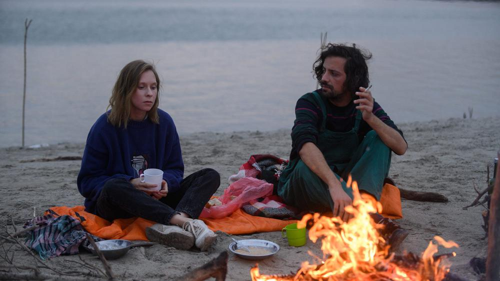

# Попутчики на Титанике. Кинорепертуар с расслабленных летних каникул вернулся к плотному графику актуальных премьер

- **URL:** https://novayagazeta.ru/articles/2021/10/20/poputchiki-na-titanike
- **Дата:** 2021-10-20
- **Автор:** Лариса Малюкова

## Попутчики на Титанике

## Кинорепертуар с расслабленных летних каникул вернулся к плотному графику актуальных премьер

Кадр из фильма «Дунай». Фото: kino-teatr.ru

## В гребень дунайской волны

«Дунай» — медитативный автофикшн Любови Мульменко — одной из самых актуальных авторш нового российского кино. По ее сценариям снимали Наталья Мещанинова, Валерий Тодоровский, Нигина Сайфуллаева. Она помогала Кире Коваленко разрабатывать сюжет для каннского призера, фильма «Разжимая кулаки». В ее режиссерском дебюте две героини: юная Надежда и нестареющая Сербия, к которой по всей очевидности прикипело сердце.

Одна скромная интровертка Надежда (Надежда Лумпова) отважилась броситься — как в воду — в жизнь другой страны. Воздухом ее наполнить легкие, плыть по течению, жить одним днем, влюбиться без памяти — то ли в уличного жонглера Нешу, который и шарики своего будущего бросает в воздух, — то ли в свободу, которой надышаться не могут ее новые знакомые и странная, непредсказуемо бражническая Сербия. Как же искательнице любви и приключений хочется здесь стать своей. Войти в этот джазовый ритм… И пережить разрыв с мечтой, сделав собственный взрослый выбор.

Здесь белградская повседневность качается на волнах ночных домашних вечеринок и разговоров до восхода. Камера Михаила Хурсевича ловит ее, цепляясь за реальные локации Белграда.

То ли игровое кино, то ли док с вшитыми личными историями. Непрофессионалы перемешаны с актерами. Кино дышит и задерживает дыхание,

вспоминая то «новую волну» с ее уличными лицами и всамделишными интонациями, то шероховатое разбежкинское кино. Временами кажется, что режиссер, как ее героиня, слишком увлекается избранным методом — чтобы все как в жизни, неспешно, почти импровизационно — ей самой очень хорошо в теплых волнах своего сербского псевдодока. Она, как вольный ветер Неша, немного жонглирует в кадре: вот судьба героини подброшена красным шариком, быть может, сейчас ее кто-то поймает… или она упадет.

Премьера 21 октября.

## Титаник номер 6

Для фильма, завоевавшего Гран-при Каннского фестиваля, Любовь Мульменко писала диалоги. Фильм «Купе номер 6» Юхо Куосманена снят по мотивам книги Розы Ликсом.

Кадр из фильма «Купе номер 6». Фото: kino-teatr.ru

По безразмерной замерзающей стране 90-х, греющейся спиртом Royal, мчит поезд, чтобы одна молодая финка, начинающий археолог Лора (Сейди Хаарла), могла увидеть петроглифы, которым всего-то 10 000 лет. Купе интеллигентная Лора вынуждена делить с лихим гопником Лёхой (Юра Борисов). Два мира — два Шапиро в двух с небольшим метрах качающейся жилплощади. Россия и Европа. Теснота. Она рисует, изучает историю, снимает настоящее, ловит нить времен. Он — «Водку будешь?» «Россия — великая наша держава». Попутчики на одном душном «Титанике»: который ими же не к ночи упомянут, продолжают мчаться сквозь заснеженную мглу далеко на север. Пытаются то ли избавиться друг от друга, то ли на скорости вырваться из одиночества. Чужих, пришельцев из разных миров соединит сочувствие, нежность. Та самая нежность, без которой земля пустеет, петроглифы стираются — приблизит и канувшее в небытие прошлое, и мигающее семафорами будущее. В безыскусное кино Юхо Куосманена, поначалу раздражающее, одновременно будничное и душераздирающее, втягиваешься постепенно, как бы нехотя. И начинаешь жить/дышать в его неспешном ритме. Вместе с непутевыми, неглянцевыми — словно подсмотренными в поезде героями. Под сердечный стук колес.

Премьера 22 октября.

Поддержите нашу работу!

1000 500 300 Нажимая кнопку «Стать соучастником», я принимаю условия и подтверждаю свое гражданство РФ

Если у вас есть вопросы, пишите [email protected] или звоните:+7 (929) 612-03-68

## А у нас сегодня кошка…

«Кошачьи миры Луиса Уэйна», мне кажется, подойдут прежде всего двум группам зрителей. Кошатникам и поклонникам Бенедикта Камбербэтча. Это семейный байопик Уилла Шарпа об эксцентричном аристократе, художнике Луисе Уэйне, известном портретисте антропоморфных котов, экзотическом представителе викторианской волшебной живописи. Том самом, о котором Герберт Уэллс говорил по радио: «Луис придумал кошачий стиль, кошачье сообщество, целый кошачий мир. Английским котам, не похожим на котов Луиса Уэйна, должно быть стыдно».

Кадр из фильма «Кошачьи миры Луиса Уэйна». Фото: kino-teatr.ru

В исполнении экстравагантного Камбербэтча Уэйн смотрится эксцентриком в квадрате. Он занимается открытиями в области электричества, пишет нечто вроде диковатой оперы, готов подраться с быком,

но в последний момент предложит ему арахис. А главное — он пытается контролировать шторм неодолимых кошмаров и бурлящий хаос в голове. Лихорадочные интересы тянут его в разные стороны, так можно и свой главный дар — рисование — прошляпить. Это сентиментальное (местами до сладкого сиропа) путешествие в воображаемый мир художника, пытавшегося изжить травму — раннюю смерть любимой жены — и прославившегося не многочисленными дарованиями, а милыми рисунками котов в самых разнообразных позах и занятиях. Это именно Уэйн — во всяком случае, он в этом убежден — изобрел кошку как любимого домашнего питомца, а не только ловца прожорливых мышей. И с его легкой руки даже дворяне стали содержать кошек.

На протяжении всего фильма мы стараемся сочувствовать его горю, умиляться бездомному котенку Питеру, облитому дождем, явившемуся утешить безутешного вдовца и дать направление его творчеству. Стараемся любоваться его рисунками, явленными нам ближе к финалу. Кошками-кулинарами, музыкантами, читателями, артистами, леди и джентльменами. Можно, конечно, порадоваться за кошек, электрическая энергия которых однажды позволит им посинеть и стать прямоходящими. Надо лишь поверить в это, как верил Уэйн, балансирующий по краю эксцентричности и безумия. Если не получается, быть может, вас утешат редкие блестки абсурда, масса декоративных виньеток в духе викторианской эпохи, живописная диккенсовская бедность семейки Уэйна и его истерических сестер, а прежде всего щедрая игра Камбербэтча в роли очередного Паганеля — страдающего, умилительного творца и ученого. Говорят, Камбербэтч добивался этой роли, в символическом поединке победил Эдди Редмейна, а потом со всей ответственностью погружался в образ художника, учился с педагогом рисовать, как Уэйнон, держать особым способом кисть и карандаш. Ему бы еще материала побольше — «королевство маловато — разгуляться негде».

В этом старомодном био много закадрового текста, словно это радиопередача из времен Герберта Уэллса. Читает оскароносная Оливия Колман, она и ведет нас в пограничье грез, рисованного и реального, человеческого и кошачьего миров. От нее мы и узнаем, что кошки предпочитают смотреть на север. И об опасности электрического напряжения, из-за которого начинаются войны. И о глупости человечества, которое вместо того, чтобы наслаждаться милейшими кошачьими мирами Уэйна, начинает истреблять себя.

Премьера 21 октября.

Поддержите нашу работу!

1000 500 300 Нажимая кнопку «Стать соучастником», я принимаю условия и подтверждаю свое гражданство РФ

Если у вас есть вопросы, пишите [email protected] или звоните:+7 (929) 612-03-68
