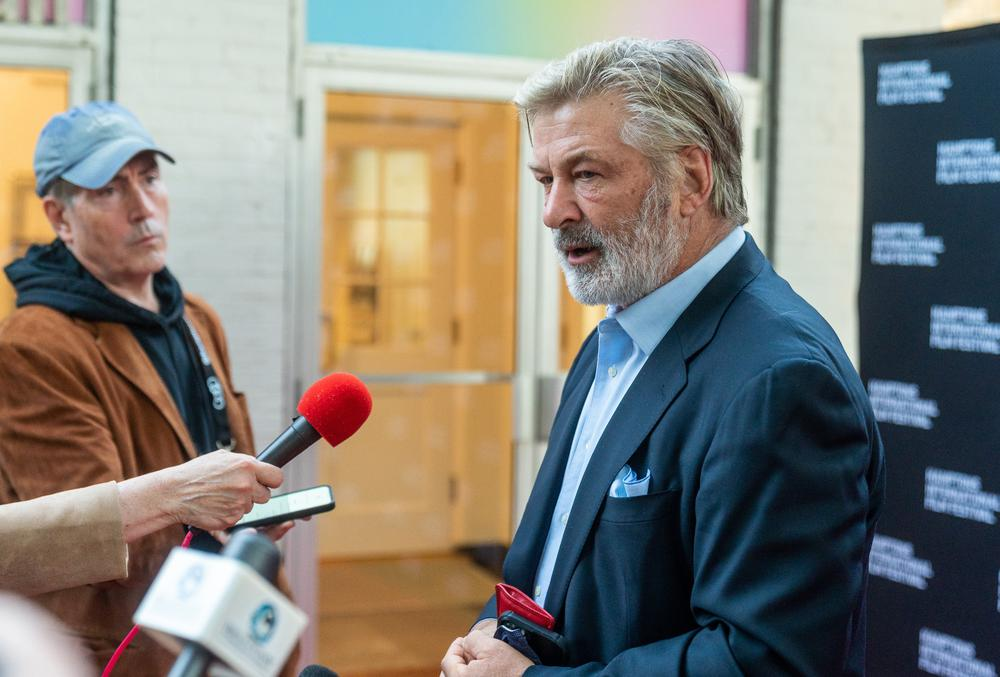

# Шальная пуля. Что случилось на площадке штата Нью-Мексико. Виноват ли Алек Болдуин?

- **URL:** https://novayagazeta.ru/articles/2021/10/22/shalnaia-pulia
- **Дата:** 2021-10-22
- **Автор:** Лариса Малюкова

## Шальная пуля

## Что случилось на площадке штата Нью-Мексико. Виноват ли Алек Болдуин?

Чудовищная история, происшедшая на съемках фильма «Ржавчина» (Rust), напоминает триллер — словно кино вырвалось в реальность, чтобы убить тех, кто его делает.

Алек Болдуин. Фото: Getty Images

## Что произошло

Во время съемок вестерна пистолет, который должен был быть заряжен холостыми патронами, выстрелил в руках Алека Болдуина, ранив оператора и режиссера. Оператор фильма 42-летняя Галина Хатчинс в критическом состоянии доставлена на вертолете в госпиталь Университета Нью-Мексико в Альбукерке, где она скончалась от полученных ранений. У режиссера Джоэла Соуса повреждена ключица.

Болдуин играет матерого преступника Харланда Раста (rust — с английского «ржавчина»), который узнает, что его внука-подростка обвиняют в случайном убийстве и отправляется в Канзас вызволить мальчишку из тюрьмы.

## Версии

Обстоятельства стрельбы выясняются. Но соцсети уже бурлят версиями. Среди них и неисправность реквизита, и халатность пиротехников, и даже преднамеренное в духе кино фантастическое «подставное убийство». Не специально ли подменил пистолет реквизитор — поклонник Трампа, — таким образом отомстив Болдуину, язвительно пародировавшему экс-президента.

Не был ли пьян актер?

За безопасность на съемках с участием огнестрельного оружия отвечают первый ассистент режиссера и специалист по реквизиту и спецэффектам. Полиция опрашивает всех свидетелей происшедшего. Пока Болдуину обвинение не предъявлено. Вместе с тем он является не только исполнителем, но и продюсером картины, а значит, несет за происшедшее ответственность. Съемки фильма остановлены.

На съемочной площадке фильма «Ржавчина». Фото: AFP / ТASS

## Жертва

Оператор Галина Хатчинс — уроженка Украины, выпускница факультета международной журналистики Киевского университета. В начале 2010-х Хатчинс переехала в Лос-Анджелес. Работала на различных кинопроектах в качестве осветителя и ассистента продюсера, в 2015-м окончила киношколу Американского киноинститута (AFI) и стала оператором. В ее фильмографии картины: «Дорогуша» (2019), «Заклятый враг» (2020) и «Шальная пуля» (2020).

Поддержите нашу работу!

1000 500 300 Нажимая кнопку «Стать соучастником», я принимаю условия и подтверждаю свое гражданство РФ

Если у вас есть вопросы, пишите [email protected] или звоните:+7 (929) 612-03-68

Погибшая Галина Хатчинс. Фото: личная страница в инстаграм

## Первые реакции

Международная гильдия кинематографистов выступила с заявлением по поводу трагического инцидента.

В заявлении, цитируемом агентством Associated Press, сказано: «Мы выступаем за полное расследование этого трагического события». Заявление подписали президент гильдии Джон Линдли и исполнительный директор Ребекка Райн. По оценке AP, с 1990 года на съемках в США погибли не менее 43 человек, около 150 человек получали серьезные ранения.

## Несчастные случаи на съемках

1984-й. Из револьвера «магнум» смертельно ранил себя 26-летний американский актер Джон-Эрик Хэксам на съемках очередной серии сериала «Скрываемый факт» (Cover Up). Оружие было заряжено холостым патроном. В перерыве между дублями, желая разрядить напряженную атмосферу на площадке, он сыграл в «русскую рулетку», приставив револьвер к виску. Пять часов шла операция, но спасти актера не удалось.

Контузии с частичной потерей слуха получили актеры Линда Хэмилтон и Брюс Уиллис. Во время съемок «Терминатора-2» (1990–1991) Линда Хэмилтон не воспользовалась берушами во время съемок стрельбы из дробовика в кабине лифта.

На съемках «Крепкого орешка» Уиллис почти оглох на левое ухо, когда стрелял, сидя под столом.

Столешница, отражая звук, сыграла роль ревербератора.

1993-й. Во время съемок готического комикса «Ворон» 28-летний актер Брэндон Ли, сын Брюса Ли, был убит пулей из пистолета, который должен был быть незаряженным. Его герой рок-музыкант Эрик вместе со своей возлюбленной накануне свадьбы погибают от рук бандитов, но затем Эрик воскресает и мстит убийцам. Одного из злодеев играл Майкл Мэсси. По недосмотру ассистентов в револьвере 44-го калибра оказалась застрявшая заглушка, которая вылетела при холостом выстреле и попала в живот Брэндона Ли. Спустя 12 часов он скончался в больнице в Уилмингтоне, Северная Каролина.

2018-й. Актер Милош Бикович («Лед», «Холоп») был ранен на съемках картины «Балканский рубеж»: в голову попала гильза, вылетевшая из крупнокалиберного пулемета. В Сети была фотография, на которой запечатлен процесс оказания актеру медицинской помощи.

Медицинский центр «Кристус Сент-Винсент» в Санта-Фе, где находится режиссер Джоэл Соуса. Фото: Getty Images

Евгений Голиков, оружейник концерна «Мосфильм», координатор спецэффектов:

— Мне сложно оценивать, что именно произошло на съемках американского фильма «Ржавчина». Знаю, что там обычно целая туча ассистентов все перепроверяют.

У нас за стрельбу, взрывы на съемочной площадке отвечает специальный цех по пиротехнике. На съемочных площадках во время съемок сцен с оружием действуют строгие правила безопасности. Прежде всего, используется только охолощенное оружие, предназначенное для имитации выстрела специальными имитационными боеприпасами (холостыми патронами). В такое оружие невозможно вставить боевой патрон. Там есть в небольшом количестве порох, чтобы создать видимость выстрела, но это неопасно для людей, которые находятся рядом.

Кроме того, строго запрещено даже охолощенным оружием целиться в людей и в камеру. Для этого перед съемками все продумывается, простраиваются мизансцены, проверяется расстояние от камеры, выверяется направление выстрела…

Знаю, что в некоторых случаях актера может заменить каскадер. В любом случае проводится инструктаж с исполнителями, участвующими в подобных сценах.

Поддержите нашу работу!

1000 500 300 Нажимая кнопку «Стать соучастником», я принимаю условия и подтверждаю свое гражданство РФ

Если у вас есть вопросы, пишите [email protected] или звоните:+7 (929) 612-03-68
