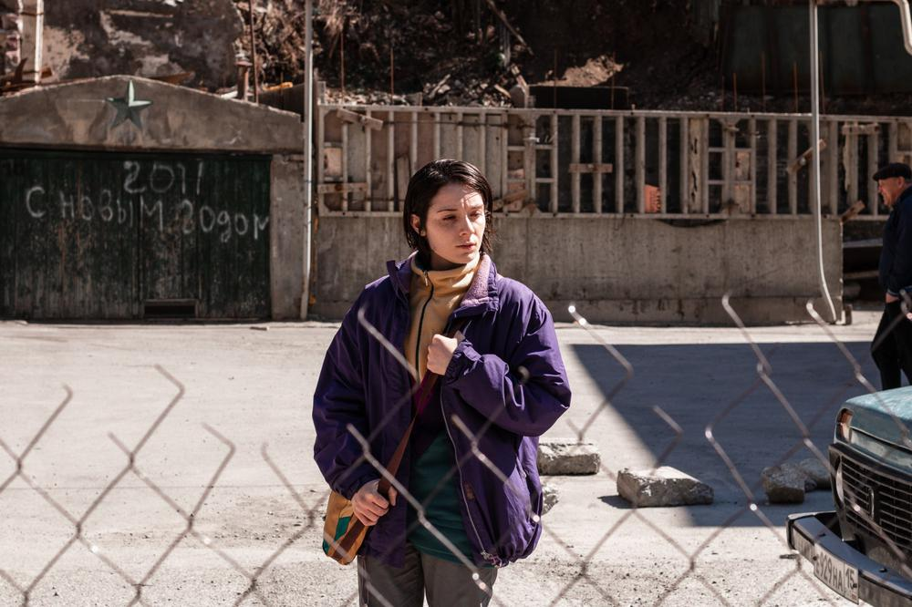

# Держим кулаки! Почему на «Оскар» в категории «Лучший международный фильм» выдвинута картина Киры Коваленко «Разжимая кулаки»

- **URL:** https://novayagazeta.ru/articles/2021/10/26/derzhim-kulaki
- **Дата:** 2021-10-26
- **Автор:** Лариса Малюкова

## Держим кулаки!

## Почему на «Оскар» в категории «Лучший международный фильм» выдвинута картина Киры Коваленко «Разжимая кулаки»

Кадр из фильма «Разжимая кулаки»

Все, что связано с российским оскаровским комитетом, кажется тайной за семью печатями. Усилиями председателя СК и вдохновителя российской киноакадемии «Золотой орел» Никиты Михалкова комитет непомерно разросся, сейчас в нем более 20 человек. Не все его члены смотрят все картины, не все голосуют. Поэтому некоторые из решений ареопага вызывали скандалы. Например, внезапное выдвижение «Дома дураков» Андрея Кончаловского (фильм даже не был в прокате).

В тот год были сняты «Кукушка» Александра Рогожкина — одна из лучших отечественных картин нового века. И, возможно, явись номинация для его фильма о взаимопонимании людей разных национальностей, то и судьба талантливейшего режиссера, недавно нас покинувшего, сложилась бы иначе. В тот год могли быть выдвинутыми «Война» Алексея Балабанова, «Любовник» Валерия Тодоровского. Но нет. И кстати, «Дом дураков» тогда пролетел со свистом. Похожий случай был в 2011-м. Обласканные международными фестивалями «Фауст» Александра Сокурова и «Елена» Андрея Звягинцева уступили по понятным причинам михалковской «Цитадели».

После смерти Владимира Меньшова, обладателя «Оскара» за фильм «Москва слезам не верит», оскаровский комитет возглавил Павел Чухрай (его «Вор» был в номинации на оскаровскую премию). Появилась надежда на адекватность.

И нынешний вердикт не вызывает нареканий. Премьера фильма «Разжимая кулаки» состоялась в 2021 году на Каннском кинофестивале. Он получил главную награду каннской программы «Особый взгляд». На «Кинопоиске» рейтинг картины, спродюсированной Александром Роднянским и Сергеем Мелькумовым, — 7,3.

Как мне кажется, для заокеанских киноакадемиков в фильме много манков. События происходят на таинственном для внешнего мира Северном Кавказе. И говорят даже не на русском, а на осетинском. Героиня Ада (Милана Агузарова), работает в магазине, и вся ее жизнь идет под гнетом правил, опеки и суровой любви отца.

Поддержите нашу работу!

1000 500 300 Нажимая кнопку «Стать соучастником», я принимаю условия и подтверждаю свое гражданство РФ

Если у вас есть вопросы, пишите [email protected] или звоните:+7 (929) 612-03-68

Среди горных пейзажей особенно ощутима несвобода: главной жаждой героини становится стремление вырваться, зажить, наконец, собственной жизнью. Это повесть взросления, история о конфликте поколений: юная девушка, дочь авторитарного отца, отстаивает право на собственный выбор. А еще это фильм о столкновении архаики и новых взглядов.

Кира Коваленко хорошо обучена в Северо-Кавказской мастерской Александра Сокурова. Несмотря на возраст, она — опытный режиссер с железной волей. Продюсеры рассказывали, что переубедить ее довольно сложно. Она знает, что хочет. К примеру, как ни уговаривали ее продюсеры остаться до окончания Каннского фестиваля, надеясь на награду, Кира уехала.

Кира Коваленко во время съемок фильма «Разжимая кулаки»

«Разжимая кулаки» — фильм взрослого автора, точно понимающего, как сложный замысел превратить в ясное поэтическое высказывание, со своим киноязыком, ритмом, атмосферой, погружением в среду.

Читайте также

Кира Коваленко: «Связанные надежной цепью, мы не умеем разговаривать друг с другом»

10 июля на Каннском кинофестивале мировая премьера фильма «Разжимая кулаки» ученицы Александра Сокурова

Это не просто фестивальное кино, в нем ток сегодняшнего времени, его голосов и его травм.

Среди альтернативных вариантов (а в шорт-листе оказалось более 10 картин) был «Чернобыль» — фильм-катастрофа Данилы Козловского о чернобыльской катастрофе. Но самым сильным конкурентом стала зрелищная антиутопия «Капитан Волконогов бежал» Натальи Меркуловой и Алексея Чупова. Можно конечно, сожалеть, что яркий антисталинский блокбастер, показанный на Венецианском фестивале, не будет представлять страну, забывающую о злодеяниях тирана, но картина Киры Коваленко, возможно, более понятна западной аудитории, соответствует ее ожиданиям.

Еще одно важное обстоятельство. Продюсер Александр Роднянский, сам член Киноакадемии США, умеет продвигать фильмы своей компании на международные фестивали, на кинорынок, на премии. Удивительно ли, что в последнее время именно его картины — самые частые российские участники крупнейших международных смотров.

Поддержите нашу работу!

1000 500 300 Нажимая кнопку «Стать соучастником», я принимаю условия и подтверждаю свое гражданство РФ

Если у вас есть вопросы, пишите [email protected] или звоните:+7 (929) 612-03-68
