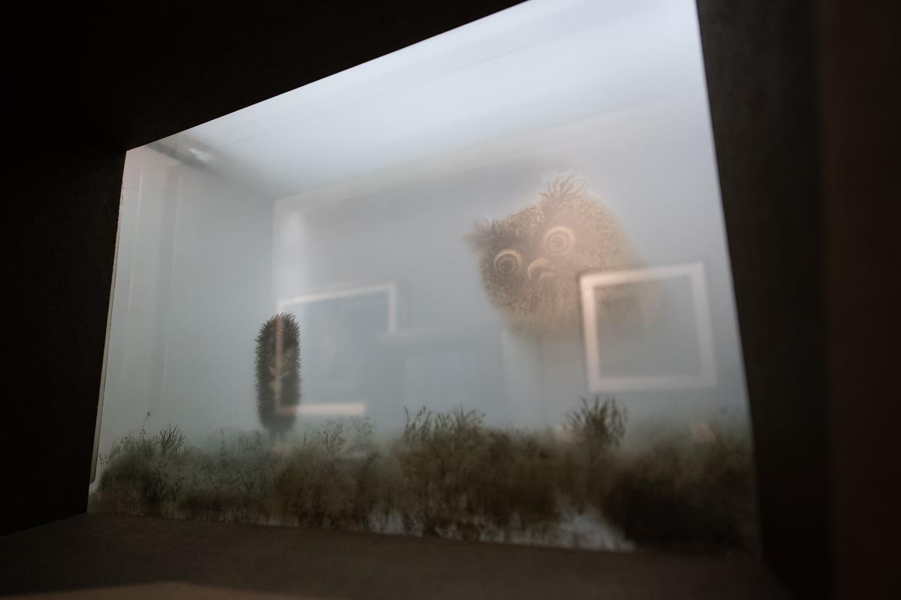

# Что написали на заборе? В Еврейском музее и центре толерантности открылась уникальная выставка Юрия Норштейна и Франчески Ярбусовой «Снег на траве»

- **URL:** https://novayagazeta.ru/articles/2021/11/10/chto-napisali-na-zabore
- **Дата:** 2021-11-10
- **Автор:** Лариса Малюкова

## Что написали на заборе?

## В Еврейском музее и центре толерантности открылась уникальная выставка Юрия Норштейна и Франчески Ярбусовой «Снег на траве»

Фото с открытия выставки Юрия Норштейна предоставлены Еврейским музеем и центром толерантности

А встретит вас деревянный, из старых видавших виды досок забор. На этих досках — анимация как способ видеть мир: запечатленное детство и двор — «Там, где — боже мой! — Будет мама молодая. И отец живой». И природа. И искусство. И друзья. Нарисованный мальчишка сороковых в рисунках — фазах движения — перелезает через доски, спрыгивает на землю, чтобы умчаться и соединиться с детворой Марьиной Рощи. Они там все вместе в эскизе сцены «Похороны птицы», не вошедшей в фильм-исповедь «Сказка сказок». Рядом соседи, со своими костылями Василий Максимович с чинариком; колонка, из которой в ведро хлещет вода; лопоухий семилетний Юра с веснушками и октябрьским значком. И его дети: маленькие Катя в голубой ночнушке и Боря играют в телефон. Меж ними веревочка, как писал Маяковский, «кабель тонюсенький — ну просто нитка! И все вот на этой держится ниточке». Лучшая в мире связь. «Боря, ты спишь? — Сплю. — А как же ты мне отвечаешь? — А я слабеющей рукой». Меж ними «Пионерская правда» с полезной статьей про самодельный киноаппарат.

И сама выcтавка, словно на ниточке, висит — не оторвется: любовь к жизни, к искусству, к друзьям, тем, которые еще живы и которых нет. Выставка текучая, как Ежик в тумане, которого можно помнить, любить, даже мысленно погладить, а скопировать — нет, не получается. Все какая-то лохматая нежить выходит.

Больше 500 работ, почти половина из них не выставлялась. Может быть, впервые в таком изобилии — работы художника Норштейна. «Мы показываем живопись Норштейна 1950-х и начала 1960-х годов, которую зрители совсем не знают», — говорит куратор Мария Гадас.

Юрий Норштейн, Мария Гадас и искусствовед Кристина Краснянская

## Нарисовать запах темно-синего

Он же спал и видел — быть живописцем, все рвался бежать из мультипликации. Но тут на глаза попались шесть томов Эйзенштейна, и он утонул в пространстве огромной личности, заколдовавшей его своими прозрениями и знаниями мирового искусства и кинематографа. Этот шеститомник — его университеты.

Среди его живописных работ портрет скрипичного мастера: он словно замер, напряженно, с закрытыми глазами прислушивается к звуку инструмента: чист ли? Или двойной мужской портрет с модильяновской неправильностью пропорций. Тут же коллаж к фильму «25-е — первый день». Красный трубач летит по воздуху над сумрачными штыкастыми красноармейцами. Гуашевые и акварельные коллажи-фантазии на темы работ Анненкова, Лебедева, Петрова-Водкина, Дейнеки.

Автопортреты и портреты Франчески Ярбусовой. На них Франческа — мадонна, причем разных эпох: от ренессансной до петрова-водкинской.

«Чем больше ее узнаю, тем меньше знаю», — говорит Юрий Борисович, именуя свою вторую половину «художником самого высокого накала».

Их общей магией, а не только ярбусовскими кистью и карандашом, нарисованы, расписаны, воплощены «Лиса и заяц», «Цапля и журавль», «Ежик в тумане», «Сказка сказок», «Шинель». Вот как им двум гениям в одной семье не тесно? И для этой выставки он по обыкновению делал эскизы, она воплощала в плотных, мощных и воздушных образах, в которых не только цвет или свет, но пение птиц, завывание осеннего ветра, стук бьющейся форточки, скрип костылей и первый легкий снег и «звон зелени среди него на пронзительно зеленой траве».

Давая задание, он требует запахов: полыни, темно-синего. Я ее спросила: «Как можно нарисовать морозный звук, запах темно-синего?»

— «Не знаю. Надо все это чувствовать. Знать. Любить с детства. Когда мы вернулись из эвакуации в Москву, моими первыми игрушками были карандаши и бумага. Рисовать я научилась раньше, чем ходить. С помощью карандаша передавать то, что чувствую». Юрий Борисович с Франческой всю жизнь. Их связывает и память. Как школьником Юра ждал воскресенья — и вот выходишь во двор, а там сосед чистит рыбу, а папа — на все руки мастер — перетягивает матрасы, которые несли к ним во двор со всей Марьиной Рощи.

## Кровь детства

Смотрю на фрагменты фильмов и теряю ощущение границы между жизнью и экраном. Вот рождение ребенка. Бори. Смерть близкого человека. Соседи. Экран все впитывает. Франческа поясняет:

— Так случилось, что мы почти одного возраста. Прошлое общее. Время. Детство. Кровь этого детства питала… Нам было легче понять друг друга.

В этой экспозиции — бесшовное соединение человеческого опыта, воспоминаний и мучительного творческого процесса. Сложное многоярусное пространство — как его кино: на каждом слое своя история, персонажи, мазки, воздух, реализованные и оборванные замыслы. Про фронтальную поэтическую сцену с Путником и Поэтом, напоминающим Гумилева из автофикшена «Сказка сказок», Норштейн написал: «Сцена делалась такой, какой хотела быть». Кажется, и выставка сама диктовала свое пространство, ритм, воздух, время.

Поддержите нашу работу!

1000 500 300 Нажимая кнопку «Стать соучастником», я принимаю условия и подтверждаю свое гражданство РФ

Если у вас есть вопросы, пишите [email protected] или звоните:+7 (929) 612-03-68

Вот эта рыба над городом. Он же собирался снимать фильм о Маяковском «Любовь поэта», в нем по мокрому от мелкого дождя городу плыла огромная рыба, над машинами, «над фонарями, отраженными в тротуаре и в рыбьей чешуе». Разорванные стихи падали на прохожих, когда плеча человека касался листочек — возгоралось пламя «немыслимой любви».

И разумеется, главная тема для ребенка сороковых, сквозная мелодия «Сказки сказок» — война. Не «огромная, священная», нет, личная, царапающая сердце, забирающая отцов у одноклассников, гнущая спины женщин. Неразрешимое столкновение войны и Вечного мира. Старый патефон на кружевной салфетке. На пластинке под песни 40-х кружится тот самый прощальный танец, в котором в «Сказке сказок» из вальсирующих пар, как в тире, выбивают партнеров невидимые пули. И они в плащ-палатках исчезают за горизонтом войны. И вот сейчас эти пары из картона, обнявшись, кружатся вместе с пластинкой Вадима Козина: «Ну поцелуй меня, я так люблю тебя».

На выставке танцплощадка-прощание повторяется в разных, будто бы на миг замерших инсталляциях с картонными марионетками. Придумывая этот киноэпизод, он ломал голову: как «осветить время»? И вспомнил, словно увидел, как однажды в деревне женщина из темноты вошла в шаткий круг света. Так возник этот неровный фонарь на столбе, слабая лампочка под ржавым колпаком с дрожащим светом. Скатерть в этой сцене горестных проводов на фронт, сорвавшись с длинного стола, улетала вслед за новобранцами.

И на выставке над нами летит когда-то белая скатерть. Но снизу она вся черная от копоти и грязи войны.

Одно цепляется за другое. Почти детский рисунок — ключевой для фильма: соседка Варвара Никитична шурует ухватом в горящей печи. Этот набросок стал камертоном фильма. Золотые шары и столетние липы Марьиной Рощи. И тир, и танцплощадка. И тонкий, в одну линию абрис Поэта. И черные птицы на заледеневшей снежной корке. Волчок пробирается по мраку коридора к ослепительному свету — распахнутой двери. Макеты с туманом за стеклом: когда сцены с туманом снимали, дышали с повышенной осторожностью, чтобы не сдуть со стекла мультстанка падающую пыль. Чтобы не потревожить «мир живой, ночной, влажный, непостижимый».

Под огромным плафоном, на котором кружит панорама из «Сказки сказок», — целая клумба персонажей. Такой цветник из старых знакомых. Их рассматриваешь, как живых, потому что для Норштейна мера анимации — сердце, мировое искусство, единственно возможный жест. И цвет. Например, поблекший от времени, выцветший, как старые треугольники фронтовых писем. Я их запомнила еще по давней норштейновской выставке в ГМИИ. Они и тогда колыхались, жили своей жизнью. И среди них — письма Доре Милехиной, подружке Юры с верхнего этажа. Папа писал с фронта крупными буквами, чтобы дочка могла прочесть. В фильме над страной распростерта похоронка, на ней — настоящее имя, Милехин. И в новой экспозиции письма дрожали от сквозняка так же, как пришпиленные к доске листки со сценами «Сказки сказок».

Читайте также

Разгребающий темноту

Вместо юбилейного тоста

## Прощай, Марьина Роща

Коллекция набросков «Шинели» (как сказал Юрий Борисович, это малая часть — шесть седьмых осталась в мастерской). Графический микроспектакль. Акакий Акакиевич обнаружил дыру в шинели, ощупывает ее прореху, перебирает ткань: нет ли еще ран? Греет свои детские руки. Беззащитный. Восьмилетний ребенок в мятой гимназической форме. Сморщенный, замерший в блаженной мечте. Почему чувство стыда охватывает, когда на него смотришь? И нестерпимое сочувствие. Как получается, что его неотмирность, «тайная сила», выдуманная жизнь — выпорхнула из старой дырявой шинели, развернулась к нам, летит.

Вот лекала, по которым кроится и шьется их с Франческой анимация. Выставка в буквальном смысле — «наглядное пособие». Она и про ту Марьину Рощу, где жили Шкловский, Енгибаров, Рыбников, бывал Мандельштам. Про жизнь, которую вытеснили «Райкин-плаза» и торговый центр «Капитолий». Как вытеснили на обочину ненужные рудименты — порядочность, совестливость — во взаимоотношениях, в искусстве. «Если б не было Марьиной Рощи, — говорит Юрий Борисович, — я был бы другим». Она осталась только в памяти, предъявленной здесь родными лицами, запахом старого дерева, веществом жизни. Как тот огромный лист лопуха и дырявый венский стул, которые бросились в глаза Норштейну, когда он приехал последний раз взглянуть на старую Марьину Рощу. Попрощаться.

Выставка — ненаглядное пособие по искусству любви.

Несколько месяцев помогали Норштейну ее строить молодые люди и сотрудники музея, как он выразился: «с пространством в глазах». Норштейн с присущим ему перфекционизмом традиционно мучил себя и других: «Не всегда же выходит сделать так, как происходит у тебя в душе!» Но и в приближении к замышленному произошло что-то необыкновенное.

Она еще только открывается, а я не могу не волноваться: что с этой грандиозной выставкой будет дальше? Выбросят и сожгут эти живые доски? Закончится окончательно вся эта жизнь с ее музыкой и цветом?

Уважаемая мэрия, неужели для создателя лучших фильмов всех времен и народов не найдется помещения для музея? Да хотя бы в той же Марьиной Роще?

Поддержите нашу работу!

1000 500 300 Нажимая кнопку «Стать соучастником», я принимаю условия и подтверждаю свое гражданство РФ

Если у вас есть вопросы, пишите [email protected] или звоните:+7 (929) 612-03-68
