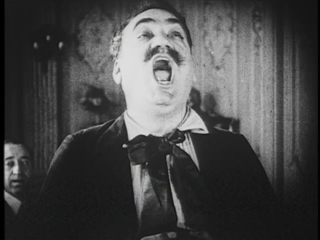

# Мой кузен Карузо. С 15 по 28 ноября — синефильское пиршество. Гид по Первому Московскому фестивалю архивного кино

- **URL:** https://novayagazeta.ru/articles/2021/11/15/moi-kuzen-karuzo
- **Дата:** 2021-11-15
- **Автор:** Лариса Малюкова

## Мой кузен Карузо

## С 15 по 28 ноября — синефильское пиршество. Гид по Первому Московскому фестивалю архивного кино

Кадр из фильма «Мой кузен» (1918, реж. Эдуард Хосе)

Первый он, конечно, условно, смотр продолжает историю уважаемого в профессиональной среде фестиваля «Белые Столбы», который проводился с 1997-го в Госфильмофонде России для знакомства киноведов и синефилов с необъятной коллекцией одного из крупнейших в мире киноархивов. Фестиваль проходил в Московской области в кинозалах Госфильмофонда и был вдохновлен на долгую жизнь его художественным руководителем киноведом-архивистом Владимиром Юрьевичем Дмитриевым. Потом программы составлялись с продуманной внутренней драматургией под присмотром талантливого молодого ученого, киноисторика, главного хранителя архива Петра Багрова, пока его не вынудили покинуть страну.

С нынешнего года фестиваль архивных фильмов пройдет в Москве.

Бо́льшая часть показов — с пленки вместе с просветительской программой: лекции, дискуссии с историками кино, киноведами, реставраторами, режиссерами и кураторами зарубежных архивов.

Одна из самых любимых программ — «Реставрации и находки».

Среди вновь обретенных работ — героический и кровавый эпос «Юдифь и Олоферн» (1909), ранняя работа будущего постановщика знаменитого сериала «Фантомас» Луи Фейада. Этого французского фильма еще никто не видел. Первый публичный показ ждут не только зрители, но и киноархивисты мира.

Меломанам на заметку: можно увидеть единственную сохранившуюся игровую ленту с легендарным тенором Энрико Карузо в главной роли — «Мой кузен» (1918). Фильм, отреставрированный в синематеке Болоньи, повествует о знаменитом певце и его двоюродном брате, бедном скульпторе. Обе роли исполняет Карузо. Копии фильмы были утеряны, лишь недавно одну нашли в библиотеке Шведского кино. Картина была снята как немое кино, голос певца записали отдельно. Звук и видео удалось синхронизировать.

Покажут оставшуюся незаконченной «Незнакомку» (1985) ленфильмовки Динары Асановой («Пацаны», «Не болит голова у дятла»), фильмы которой будоражили не одно поколение. «Незнакомка» по сценарию недавно ушедшего Юрия Клепикова должна была стать девятым фильмом режиссера. Ей хотелось снять не социальную драму, а пронзительную историю любви. Съемки проходили в Мурманске. Когда треть картины была снята, случилась трагедия: Динара Асанова умерла внезапно, от остановки сердца. Ей было всего 42 года.

Режиссер Динара Асанова на съемках. Фото из архива

Поддержите нашу работу!

1000 500 300 Нажимая кнопку «Стать соучастником», я принимаю условия и подтверждаю свое гражданство РФ

Если у вас есть вопросы, пишите [email protected] или звоните:+7 (929) 612-03-68

Отдельное удовольствие — просмотр на пленке отреставрированного «Молоха» (1999) Александра Сокурова. Это чрезвычайно важно, в фильме есть кадры поразительной глубины, которую пожирает «цифра». Один день 1942-го в секретной резиденции в Альпах. Адольф Гитлер и Ева Браун — несоединимые партнеры исторической любовной драмы. Фильм удостоен приза Каннского кинофестиваля за сценарий, написанный Юрием Арабовым. Сокуров, как обычно, был обделен наградой.

К юбилейным дням Достоевского — первая экранизация «Идиота», немой фильм Петра Чардынина, снятый в 1910-м.

Знаменитый продюсер Ханжонков вспоминал о съемках в Крылатском во времена, когда сама киносъемка представлялась космическим зрелищем: «Естественным недостатком съемок в этих условиях была работа в постоянном окружении любопытных: стоило только где-либо появиться оператору и артистам, как со всех сторон начинал стекаться разный люд… Они тихонько делились своими впечатлениями; только в моменты наивысших эмоциональных переживаний аудитория не выдерживала и вслух выражала как свои восторги, так и свое негодование… Актеры, исполнявшие роли для немого кино, также вслух выражали свои душевные переживания, и чем были эти переживания сильней, тем громче вырывались они из груди исполнителя».

Кадр из фильма «Идиот» (1910, режиссер Петр Чардынин)

Любопытнейшая ретроспектива недооцененного режиссера Алена Кавалье — к его девяностолетию. Обладатель «Сезара» работал параллельно с Годаром и Трюффо. Снимал не только политические триллеры, нуары и мелодрамы с Аленом Делоном, Катрин Денёв, Мишелем Пикколи, но в 1970-е камерные экспериментальные картины «Полный бак бензина высшего качества», «Мартин и Леа», стирая грань между документом и вымыслом. А в 1980-е прогремела его «Тереза» — история юной девушки, мечтающей поступить в орден кармелиток, — удостоенная наград Каннского фестиваля. Начиная с 2000-х любимый режиссер экс-президента Каннского фестиваля Жиля Жакоба снимает безбюджетное авторское кино на ручную камеру и не подчиняется никаким диктатам: ни политическим, ни экономическим, ни продюсерским. Ретроспектива так и называется: «Кинолюбитель, авторские фильмы Алена Кавалье».

Кадр из фильма «Полный бак бензина высшего качества» (1975, реж. Ален Кавалье)

Центральным событием публичной программы фестиваля станет конференция «Архивное кино. Этика реставрации и реконструкции», на которой встретятся известные архивисты и историки. Модератором выступит Николай Изволов — историк кино, художественный руководитель I Московского международного фестиваля архивных фильмов.

На открытии смотрите «Вокальные параллели» выдающегося кинохудожника Рустама Хамдамова. Постмодернистский фильм-концерт, развивающий стилистику l'echo du temps passe (эхо ушедшего), которой были верны художники Серебряного века. Хамдамов о своем фильме: «Оперные певцы — Араксия Давтян, Роза Джаманова, Эрик Курмангалиев — исполняют свои партии из Пуччини, Шумана, Россини. Рената Литвинова выходит, объявляет их арии и одновременно учит «жизни». Говорит, что в искусстве часто побеждает не талант, а посредственность, надо только выбрать правильную тактику и уметь идти на компромисс. А они плохо усваивают ее уроки, живут не так, поэтому им здесь не место. И они умирают. Потом летят на том свете на самолете, но все равно поют. Там, на небесах…» В этой гротескной, трагифарсовой музыкальной игре советской стилистике (военным шапкам, платкам, телогрейкам, убогости интерьеров) противостоят и побеждают нарядные шляпы, манто, падающие с покатых плеч, короны с камнями, вуали, шарф, унесенный ветром вглубь кадра. И роскошные оперные голоса звучат в юртах, убогих мазанках. Критики назовут этот эксперимент брутальной игрой с растерзанной реальностью.

Показы пройдут в кинотеатрах «Иллюзион», «Москино Космос», «Художественный», Центре документального кино (ЦДК) и Музее современного искусства «Гараж».

Поддержите нашу работу!

1000 500 300 Нажимая кнопку «Стать соучастником», я принимаю условия и подтверждаю свое гражданство РФ

Если у вас есть вопросы, пишите [email protected] или звоните:+7 (929) 612-03-68
