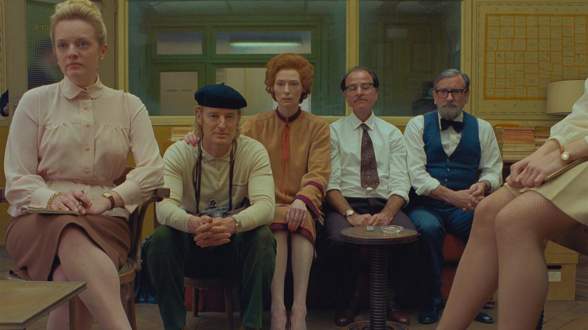

# «Мир убивает нас, чувак, мы боимся одного зла до тех пор, пока не найдем новое». 18 ноября в России выходят картины культовых режиссеров Абеля Феррары и Уэса Андерсона

- **URL:** https://novayagazeta.ru/articles/2021/11/18/mir-ubivaet-nas-chuvak-my-boimsia-odnogo-zla-do-tekh-por-poka-ne-naidem-novoe
- **Дата:** 2021-11-18
- **Автор:** Лариса Малюкова

## «Мир убивает нас, чувак, мы боимся одного зла до тех пор, пока не найдем новое»

## 18 ноября в России выходят картины культовых режиссеров Абеля Феррары и Уэса Андерсона

Кадр из фильма «Французский вестник. Приложение к газете "Либерти. Канзас ивнинг сан"». Источник: Kinopoisk.ru«Нули и единицы» Триллер о невыполнимой миссии против глобального террориста — вируса, взорвавшего наш мир.

Неутомимый, неистовый Абель Феррара. Американский режиссер итальянского происхождения вновь изумляет. В продолжение психодрамы бессознательного «Сибирь» с Уиллемом Дефо ветеран-провокатор снимает кино на пике пандемии, опустошившей города. Где? Разумеется, в городе, смонтировавшем цивилизации, — Риме.

Его кино о том, что с нами произошло. Что случилось с человеком. С человечеством.

В синопсисе сказано: «После апокалиптической осады следуем за американским солдатом Джей-Джеем (актер и режиссер Итан Хоук), который перемещается по ночному, безвыходному миру страхов, паранойи и зыбкой надежды. Он солдат войны между историей и будущим».

Кадр из фильма «Нули и единицы». Источник: Kinopoisk.ru

Вымерший темный город. Люди в масках. В основном — террористы, взывающие к честности, обвиняющие и немедленно наказывающие. Наркоманы с отрицательными пэцээрами. Сутенеры и милый китайский лесбийский клуб. Русские мафиози распевают ералашевскую песенку про «мальчишек и девчонок» и хотят ребенка от Джея-Джея.

И все они, а также их родители, а также весь мир распяты страхом. Неразрешимые религиозные конфликты, в которые вовлечены мусульмане, христиане, атеисты.

Пытки несогласных, наконец, взорванный Ватикан, взлетающий в воздух «Святой престол». Куда дальше?

Наемник Итана Хоука должен выполнить некую конкретно не сформулированную миссию. Потому что нынешний мир — тромбированная венозная система запутанных коррупционных и политических интересов, локальных и международных конфликтов, заговоров спецслужб, мутных геополитических схем, в которые вовлечены миллионы.

Кадр из фильма «Нули и единицы». Источник: Kinopoisk.ru

Вот и движется, озираясь, по пустым тревожным улицам, темным закоулкам параноидального вечного города Джей-Джей, встречая таких же, как он, единиц, превращенных цифровизацией в нули. Попавших, как и он, в капкан зараженного мира. Надевших маски, стирающих лица, получивших куар-коды вместо имен. Люди ночи, теряющие надежду под долгим черным римским небом и гигантским месяцем, изрытым оспинами кратеров.

Вооруженный странник Джей-Джей, подобно джармушевскому «Мертвецу», ищет ключи к закрытым дверям обезлюдевшего лабиринта. Герой и жертва. Как и его исчезнувший брат-близнец. Пытается спасти жену брата и ее ребенка. Пытается встретить рассвет. Вернутся ли с фронта эти солдаты? Если больше не существует границы между фронтом и миром, ее стерли, взорвали с помощью цифры и разнообразных кодов доступа. Невидимые «Большие братья» повсюду: видят тебя, слышат тебя, следят за тобой. Просим не отключать мобильные телефоны!

Концептуальный андеграунд Абеля Феррары, артистический нуар, бросает вызов, глумится над жанровыми шпионскими экшенами вроде «Миссия невыполнима», «Идентификация Борна» или триллера «Шпион, выйди вон» (не случайно герой — тезка режиссера Алана Джея Абрамсона, создателя многоходового хита «Миссия невыполнима»).

Кадр из фильма «Нули и единицы». Источник: Kinopoisk.ru

Феррара деконструирует, взрывает нарратив, жанр, сюжет, не стремится быть понятным. Мы же сами не понимаем, что вокруг нас происходит, чего ждать в следующем году или завтра.

Он и воссоздает неуловимую атмосферу «темных времен», нового крестового похода неизвестно кого против всех.

Бежать очень хочется, но неизвестно куда.

Оператор Шон Прайс Уильямс снимает Рим как узнаваемый и одновременно совершенно незнакомый город в стиле лоу-фай или хоум-видео: крупнопиксельная подрагивающая картинка, тусклое освещение и яркие лики знаменитых фресок, вихревые размазанные цветовые потоки, сверхкрупные планы, оборванные монтажные фразы. Словно и у камеры, попавшей в это галлюциногенное пространство, поднялась температура. Внезапный монтаж не дает заскучать: нагнетаемый саспенс торпедируют не только автоматы или гипотетический взрыв города, но и шум кипящего чайника. Вот герой осторожно открывает двери собственной квартиры — с монитора-компьютера на него смотрит его компаньон-заговорщик, который истошно орет: «Сваливай!». Цифра убивает. Цифра спасает. Дух нового порядка вынуждает к постоянной бдительности. Город больше не убежище, в нем страшно.

Будет и свет в конце петляющего тоннеля. Увидим живой город с опавшими листьями, голубями, цветочными магазинами, влюбленными, прозрачным небом… Но будущее ли это? Или воспоминание о прошлом? «Мир убивает нас, чувак, — говорит режиссер, — мы боимся одного зла до тех пор, пока не найдем новое».

Поддержите нашу работу!

1000 500 300 Нажимая кнопку «Стать соучастником», я принимаю условия и подтверждаю свое гражданство РФ

Если у вас есть вопросы, пишите [email protected] или звоните:+7 (929) 612-03-68

Семидесятилетний панк Абель Феррара заслужил аплодисменты фестиваля в Локарно и увез в Рим «Леопарда» за лучшую режиссуру.

## «Французский вестник. Приложение к газете "Либерти. Канзас ивнинг сан"»

Премьера фильма одного из самых популярных режиссеров, Уэса Андерсона, состоялась на Каннском кинофестивале и вызвала много шума. Однако сам фильм остался без наград.

Действие разворачивается в вымышленном мрачном городке Ансуи-сюр-Блазе, образ которого вдохновлен парижским кварталом Менильмонтан. Снимали во французском Ангулеме, столице галльской анимации. Сам фильм с момента появления окрестили любовным посланием The New Yorker — еженедельнику, четырежды обладателю Пулитцера, а также золотым перьям журналистики: Джозефу Митчеллу, Лиллиану Россу, Джеймсу Болдуину и другим перечисленным в титрах прославленным авторам и редакторам «Нью-Йоркера».

Кадр из фильма «Французский вестник. Приложение к газете "Либерти. Канзас ивнинг сан"». Источник: Kinopoisk.ru

Три истории, основанные на публикациях последнего номера выдуманного американского журнала «Французский вестник»: его знаменитые газетные колонки, некрологи, путеводители и рецепты, в ингредиенты которых вписаны преступления.

Билл Мюррей — редактор-основатель «Французского вестника» Артур Ховитцер. Идеальный шеф — добряга и прокурор (в прототипах — Гарольде Россе, Роберт Б. Сильверс и другие газетные легенды), не позволяющий рыдать в его кабинете. Тильда Суинтон — увлеченная искусством и выпивкой искусствоведша с неправильным прикусом и рыжим начесом (легко считываемый прототип — Розамунд Бернье, основательница парижского журнала L’oeil, известная лекциями в нью-йоркском Метрополитен-музее). Она читает нам и обширной аудитории лекцию о гениальном авангардном художнике-абстракционисте и его музе. Художник — осужденный убийца и социопат Мозес Розенталер (Бенисио Дель Торо). Обнаженная муза — модель, замирающая в невообразимых позах в свободное от сеансов время, — тюремная охранница Мозеса (Леа Сейду). Журналистка-асс Люсинда Кременц (Фрэнсис Макдорманд отсылает нас к канадской писательнице Мейвис Галлант, опубликовавшей 116 рассказов The New Yorker) известна блистательными репортажами о студенческих волнениях 1968-го. Ей претит понятие «журналистского нейтралитета». Она настолько вовлечена в свои статьи, что завязывает роман с героем своего репа, юным лидером восстания Чеффирелли (Тимоте Шаламе). Третья новелла (самая неубедительная) о журналисте, который собирал материал о шеф-поваре и его высокой кухне, а погрузился с головой в низкое преступление.

На самом деле, все вместе — это очередное послание американца и ретрофила Уэса Андерсона европейской культуре.

Вуайерист Андерсон по-прежнему влюблен в истекшее время, в исчезнувшую Европу, с ее эксцентрикой, интеллектуальными изысками, призраками Хичкока, Цвейга, Гертруды Стайн, Дали. Восстанавливает ее со скрупулезностью перфекциониста. Возможно, в будущем первую половину ХХ века будут изучать по его фильмам, не обращая внимания на то, что на экране полностью сочиненный кинематографистами мир.

Кадр из фильма «Французский вестник. Приложение к газете "Либерти. Канзас ивнинг сан"». Источник: Kinopoisk.ru

Пейзажи, города, павильоны в его кино похожи на декорации, фрагменты живописи или скриншоты из старых фильмов. А само кино до ватерлинии напичкано цитатами, мемами, вставными сюжетами, культурными отсылками к истории искусств. Режиссер перед показом в Каннах предложил будущим зрителям список рекомендательных фильмов, позволив оценить все спрятанные пасхалки и сюжетные тайники. Временами это головокружительное кинозрелище с россыпью неожиданных эпизодов и гэгов, напоминает доску в кабинете Ховитцера «Незавершенные дела», на которой пришпилены статьи и иллюстрации, претендующие на публикацию. Пестро, сбивчиво, сиюминутно, как в скороговорке.

В андерсоновском «королевстве полной луны», расположившемся между артом и трэшем, от звезд рябит в глазах. Помимо вышеназванных, в небольших эпизодах можно увидеть Эдриана Броуди и Джеффри Райта, Матье Амальрика и Кристофа Вальца, Тома Хадсона и Уиллема Дефо. А также темнокожих геев, разнообразных эмигрантов, телевизионные ретро-интервью, киднеппинг (исчезает ребенок комиссара полиции, которого играет Матьё Амальрик).

Не выдержав напряжения, экран на глазах распадается на части: «Тогда» и «Сейчас».

В действие вторгается анимация (зря, что ли, снимали в столице мультфильмов). Добавим к этому фирменный андерсоновский меланхоличный юмор и тщательно декорированное изображение.

Что и говорить — временами в глазах рябит, как от просмотренного на большой скорости сериала. Но заканчиваются бесконечные титры. И отчего-то щемит сердце. Словно на погасшем экране проявляется смысл любовного послания лучшим изданиям и лучшим временам журналистики: «Может быть, если повезет, мы найдем то, что ускользало от нас в тех местах, которые мы когда-то называли домом».

Кадр из фильма «Французский вестник. Приложение к газете "Либерти. Канзас ивнинг сан"». Источник: Kinopoisk.ru

Поддержите нашу работу!

1000 500 300 Нажимая кнопку «Стать соучастником», я принимаю условия и подтверждаю свое гражданство РФ

Если у вас есть вопросы, пишите [email protected] или звоните:+7 (929) 612-03-68
