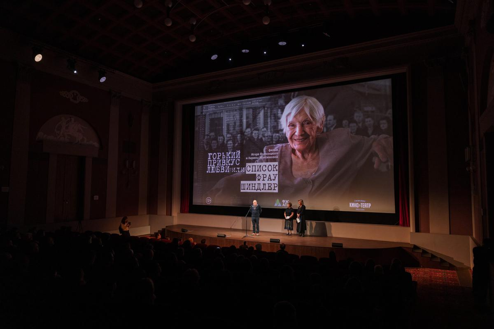

# Вы не слышали об Эмили Шиндлер? Документальное исследование Игоря Волосецкого и Ларисы Максимовой проливает свет на истинную роль жены знаменитого Оскара Шиндлера в деле спасения евреев

- **URL:** https://novayagazeta.ru/articles/2021/11/20/vy-ne-slyshali-ob-emili-shindler
- **Дата:** 2021-11-20
- **Автор:** Лариса Малюкова

## Вы не слышали об Эмили Шиндлер?

## Документальное исследование Игоря Волосецкого и Ларисы Максимовой проливает свет на истинную роль жены знаменитого Оскара Шиндлера в деле спасения евреев

Пресс-показ документальной ленты «Горький привкус любви, или Список фрау Шиндлер»

Мир узнал о подвиге Оскара после выхода спилберговского «Списка Шиндлера» (1994). Мир плакал, слушая скрипку выдающегося Ицхака Перлмана, музыку знаменитого композитора Джона Уильямса. Кинолегенда, восхитившая мир, основана на романе Томаса Кенилли о немецком бизнесмене и члене НСДАП, спасшем более тысячи польских евреев от гибели во время Холокоста. Ее абсолютным героем был ловкий и обаятельный коммерсант (Лиам Нисон), умеющий заводить знакомства с нужными людьми, высшими чинами армии и членами СС. Наживающийся на войне. Использующий евреев как дешевую рабсилу на своей фабрике эмалированной посуды… до войны принадлежавшей евреям.

Спилберг показывает эволюцию человека, в котором после ликвидации краковского гетто просыпается сочувствие к жертвам. Который перестает использовать войну в личных целях — начинает спасать людей, выдавая их за «квалифицированных рабочих». Была в этом фильме и жена Оскара (его бледная тень), с которой хитроумный и храбрый герой временами делился своими рискованными идеями.

Когда вышел фильм, Эмили ужаснулась и заявила: «Они меня сделали мертвой! К черту! Этот «герой» был бабником и прожигателем жизни!»

Но Голливуду не нужна была ни праведная католичка, действующая с мужем заодно, ни главный персонаж с сомнительными пристрастиями. Консервативный Голливуд предпочитал героя мужского пола единственного числа. Яркую личность и одинокий подвиг. Спилберг не прогадал, фильм получил семь «Оскаров».

Из нового дока «Горький привкус любви, или Список Фрау Шиндлер» мы узнаем о гигантской, по сути, равновеликой роли фрау Шиндлер в долгой операции спасения евреев во время оккупации Польши и Чехии. Именно Эмили, которая никогда не была приверженкой Гитлера, убедила успешного бизнесмена в том, что евреи — не рабочая сила, а люди, жизнь которых зависит от их сострадания к ним.

Она помогала рабочим и их детям лекарствами, едой. Договаривалась с бургомистром о перенаправлении состава с евреями, которых три недели в 30-градусный мороз везли к конечной станции — в газовые камеры. А потом сама выгружала слипшиеся тела живых и мертвых. Мыла, кормила выживших теплой кашей. Понемногу, чтобы не умерли. Четырежды она вызволяла Оскара из застенков — его арестовывали по подозрению в недопустимом содействии евреям. В конце концов, это на деньги Эмили, ее приданого и наследства, была построена фабрика Оскара. Не преуменьшая заслуги Шиндлера, надо сказать: они вместе превращали фабрику в прибежище для спасения.

Вместе рисковали жизнью. Вместе составляли списки евреев. Списки Шиндлеров.

Об этом говорят выжившие узники. Хотя бы вот эта супружеская пара, которую удалось разыскать в Израиле. И их слова могли бы подтвердить все 1200 спасенных, которые воспитывали внуков только потому, что их фамилии оказались в этих списках.

Поддержите нашу работу!

1000 500 300 Нажимая кнопку «Стать соучастником», я принимаю условия и подтверждаю свое гражданство РФ

Если у вас есть вопросы, пишите [email protected] или звоните:+7 (929) 612-03-68

Елена Коренева в роли фрау Шиндлер рассказывает, как они с мужем решились на эту безумную операцию. Как ее героиня, оставаясь в тени, пыталась влиять на своего мужа — авантюрного, хитроумного мошенника с добрым сердцем. Остававшегося бонвиваном, человеком-праздником до последних дней. Бросившего ее, забрав все деньги в доме.

О ней забыли, и фрау Эмили едва сводила концы с концами, когда доживала свои дни в Аргентине.

Эмили Шиндлер к старости осталась одна: муж бросил семью

Она вспоминает, как приехала на съемки. Спилберг снимал душераздирающий финал фильма, в котором процессия из спасенных евреев, их потомков, актеров, участвовавших в фильме, идет положить в знак уважения камень на могильную плиту Шиндлера в Израиле. В этой колонне была и Эмили. Ее пригласили на сьемки ассистенты как одну из выживших в концлагере. Она медленно двигалась в своей инвалидной коляске.

Жертвы Холокоста ее узнали, окружили, благодарили. Помощники побежали к Спилбергу, показали ему фрау Шиндлер. Но ему было некогда.

Почему-то знаменитому режиссеру и тогда, и спустя годы не хочется делить славу между своим возлюбленным героем и его женой. И когда продюсеры документального фильма попросили менеджеров студии Amblin Entertainment, принадлежащей Спилбергу, разрешения использовать кадры из «Списка Шиндлера» в картине об Эмили, то получили категорический отказ.

Спасибо создателям фильма за возвращение имени Эмили Шиндлер. Думаю, сегодня, когда отменяют память, играют в наперстки с историческими фактами, уничтожают «Мемориал»*, это кино особенно актуально.

Уже и до легендарного Спилберга дотянулись «доброхоты», воюющие с историей. И под видео фильма «Список Шиндлера» в Сети пестрят антисемитские посты о национальности режиссера, о «пропаганде Холокоста». Стирая память, ликвидаторов истории у нас не отменяют и не наказывают.

Хочется верить, что судьба Эмили заинтересует продюсеров и режиссеров игрового кино. И они снимут фильм об одной скромной католичке, верной до последних дней своему героическому и непутевому мужу, жившей не только по принципу «ешь-молись-люби», но отстаивавшей право жить другим. Фильм о маленькой большой женщине Эмили Шиндлер.

### * «Мемориал» Минюст считает организацией, выполняющей функции иностранного агента.

Поддержите нашу работу!

1000 500 300 Нажимая кнопку «Стать соучастником», я принимаю условия и подтверждаю свое гражданство РФ

Если у вас есть вопросы, пишите [email protected] или звоните:+7 (929) 612-03-68
