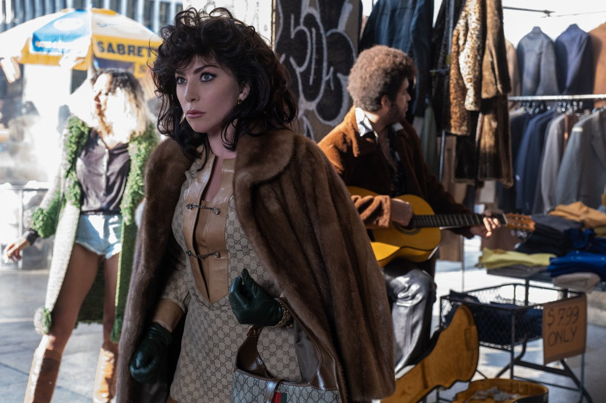

# «Сенсационная история убийства, безумия, гламура и жадности» или «клейкий аэропортовый бренд»? «Дом Gucci» уже на экранах

- **URL:** https://novayagazeta.ru/articles/2021/12/02/sensatsionnaia-istoriia-ubiistva-bezumiia-glamura-i-zhadnosti-ili-kleikii-aeroportovyi-brend
- **Дата:** 2021-12-02
- **Автор:** Лариса Малюкова

## «Сенсационная история убийства, безумия, гламура и жадности» или «клейкий аэропортовый бренд»?

## «Дом Gucci» уже на экранах

Выхода картины Ридли Скотта мир моды ждал с большим волнением, чем мир кино. Самая трагическая в истории моды лавстори c криминальным скандалом. Леди Гага, Адам Драйвер, Джаред Лето, Джереми Айронс, Аль Пачино, Сальма Хайек. Звезды, роскошь, упоительное ретро, убийство — что может быть привлекательней для зрителя? И в чем тут подвох?

Действие охватывает период с 70-х годов до середины 90-х. Зажигательная девица Патриция Реджани (Леди Гага, разумеется, не выглядит на двадцать, но действительно похожа на крепкую, жгучую и сексапильную Реджани) из семейки грузоперевозчиков знакомится на костюмированной вечеринке с наследником модного дома Gucci долговязым Маурицио Гуччи (Адам Драйвер). И начинает на него охоту. Отец Маурицио — престарелый Родольфо (Джереми Айронс) не может воспрепятствовать вопиющему мезальянсу. Вторая половина модного бренда принадлежит нью-йоркскому брату Родольфо — Альдо (Аль Пачино).

И пусть жена-сатана Маурицио не отличит Пикассо от Климта, не прочитает ни одной скучной книжки, правдами и подлогами она помогает восхождению своего раздолбая-мужа на трон красно-зеленой империи Гуччи. Она использует конфликт между королями Гуччи — братьями Родольфо и Альдо. Во имя отца, сына и дома Гуччи она готова засадить в тюрьму и дядюшку Альдо, и его лысеющего сыночка Паоло (Джаред Лето). Она дергает веревочки — самолюбие Паоло, «триумфа посредственности» в сливовом костюме и с космическими амбициями. Она прет как грузовик. Неудивительно, что в какой-то момент ее модный брак с Маурицио трещит по швам. И в 1995-м Маурицио гибнет от руки киллера, нанятого Патрицией… на деньги Gucci.

Кадр из фильма «Дом Gucci»

Фильм Ридли Скотта «Дом Gucci» закручен спиралью вокруг Леди Гаги, известной своими эпатажными нарядами: платьем из сырого мяса, костюмом Красной Шапочки с ажурными колготками… Здесь она играет монструозную плебейку, влезшую крепкой ногой на высоком каблуке в родовое гнездо и разворошившую его. Она затягивает талию, увеличивает декольте, меняет прически, наряды, сумки. Ее героиня и смешна, и страшна, как само время, сметающее на ходу правила, традиции, устои. И в при этом

она — выразительная и шаржированная иллюстрация булгаковского завета: «Бойтесь своих желаний, они имеют свойство сбываться».

Леди Гага играет размашисто, дерзко, лобово. Порой ее героине не хватает глубины. Поэтому даже в кульминационной сцене, когда Патриция пытается всучить бросившему ее мужу альбом с фотографиями, на которых они счастливы… нет, эмпатии она не вызывает. Только брезгливость. Но возможно, именно такую задачу перед, как выяснилось, небесталанной актрисой ставил мэтр Скотт.

Кадр из фильма «Дом Gucci»

А сама история оказывается знакомым до боли сюжетом заведомо проигранной битвы пленников романтического прошлого, эмблемы которого — маленькое черное платье и красно-зеленые полосы, в котором правят бал семейные кланы, и глобального будущего, представленного не крупными харизматичными индивидуальностями, но прайдом адвокатов и кошельков. А сами семейные бизнесы либо исчезают, поглощенные межконтинентальными конгломератами, либо возглавляются дерзкими американцами вроде Тома Форда, либо доживают последние дни под присмотром крупного бизнеса, распростершего свои брендовые объятия от Милана и Парижа до Японии, Китая и Нового Света.

Скотт решил превратить громкую криминальную историю в вызывающий поп-арт, в кричащую нарядами, местами смешную мыльную оперу, столь популярную в 80-е.

Демонстрирующую безвкусицу, кэмп, которые режиссер — как и сам Gucci — пытается трансформировать в искусство.

Поддержите нашу работу!

1000 500 300 Нажимая кнопку «Стать соучастником», я принимаю условия и подтверждаю свое гражданство РФ

Если у вас есть вопросы, пишите [email protected] или звоните:+7 (929) 612-03-68

Поэтому за кадром — попурри-компот: Верди, Джордж Майкл, «Фигаро», Донна Саммер, New Order, Eurythmics. А в кадре — роскошные интерьеры, знаменитые показы, закрытые вечеринки, закулисные интриги за витринами флагманского магазина Gucci, названного «Ватиканом моды». Плюс махинации с паевыми сертификатами, неуплаченными налогами. В общем, теневой бизнес во всей красе.

Проблема — в путаном, грешащим сюжетными прорехами и натяжками сценарии Бекки Джонстон и Роберто Бентивеньи (в его основе — книга Сары Гэй Форден «Дом Гуччи: Сенсационная история убийства, безумия, гламура и жадности»).

«Дом Gucci»

83-летний Ридли Скотт выпускает 27-й полнометражный фильм практически сразу после «Последней дуэли». Обе картины основаны на реальных фактах, от которых он с привычной легкостью удаляется. Но если «Последняя дуэль» метко расстреливала актуальные мишени вроде новой этики и гендерного переустройства мира, то здесь мэтр ностальгирует по эпохе позднего развитого капитализма, когда семейные империи держали власть над советами директоров. Он упивается воздухом времени, канувшего в Лету, времени кричащих амбиций и гардеробов в стиле Патрика Нагеля. И центральный гламурный образ агрессивно флиртующей, буквально сногсшибательной хищницы почти дотягивает до масштаба Леди Макбет Миланского подъезда, у порога которого и падет Маурицио Гуччи.

Читайте также

Изнасилование — вопрос собственности

Исторический эпос «Последняя дуэль» — погружение в средневековье в кольчуге актуальных проблем. Сэр Ридли Скотт возвращается в большое кино

Однако «почти» здесь ключевое слово.

И дело не в том, что авторы отходят от фактов, они теряют нерв истории, уплощают ее героев. Самый нелепый, карикатурный персонаж — отчаянно глупый бонвиван Паоло Гуччи в диковатом, клоунском до циркового исполнении Джареда Лето. Сальма Хайек наотмашь играет лохматую гадалку-предсказательницу из телевизора Пину Ауриемму, ближайшую подругу Патриции. Убийство века они планируют в грязевой ванне на бальнеологическом курорте. Девушки в летах натурально воплощают в себе бессмертный тип «из грязи в князи».

Кто-то из строгих критиков назвал «Дом Гуччи» запутанным и слишком длинным трейлером очередного номинанта на «Оскар», а не биографическим гигантом, которого ждали.

И хотя сам фильм смотрится весело, временами его шутки про запахи и аналогию шоколада и дерьма напоминают «клейкий аэропортовый Гуччи-бренд»…

(так в начале 1980-ых охарактеризовал некогда успешный дом мод главный редактор авторитетного модного журнала Vanity Fair, Грэйдон Картер).

Или подделки Gucci, которые продают на блошиных рынках, где легендарную сумку «Джеки-О» с бамбуковой ручкой — любимицу Жаклин Кеннеди — можно купить за 29 долларов. Это будет «почти Гуччи». Как сам шумный и веселый фильм Ридли Скотта.

### P.S.

Фильм возмутил наследников одного из владельцев модного дома Альдо Гуччи. Они опубликовали заявление, в котором обвинили авторов в клевете: «Создатели выставили Альдо Гуччи, который был президентом компании в течение 30 лет, и других членов семьи Гуччи как невежественных и нечувствительных к окружающему миру головорезов, что чрезвычайно болезненно с человеческой точки зрения. Все это оскорбляет наследие, на котором сегодня построен наш бренд».

Дизайнер и режиссер Том Форд, который в худший для бренда момент стал его креативным дизайнером, признался в смешанных чувствах. По его словам, на некоторых моментах ему казалось, что он смотрит «скетч в Saturday Night Live. Мне трудно было увидеть юмор в такой драматичной и кровавой истории, которую я знаю изнутри. Временами было абсурдно, но в конечном итоге это трагично».

Поддержите нашу работу!

1000 500 300 Нажимая кнопку «Стать соучастником», я принимаю условия и подтверждаю свое гражданство РФ

Если у вас есть вопросы, пишите [email protected] или звоните:+7 (929) 612-03-68
