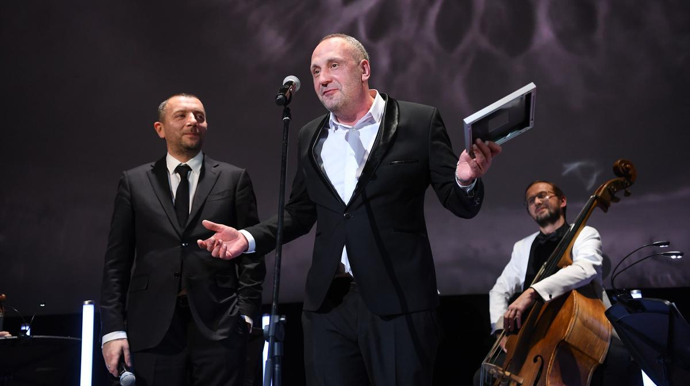

# Шепоты и крики кинокамеры. В «Художественном» в 17-й раз вручили «Белый квадрат» — самую лаконичную, стильную, сугубо профессиональную премию операторов

- **URL:** https://novayagazeta.ru/articles/2021/12/04/shepoty-i-kriki-kinokamery
- **Дата:** 2021-12-04
- **Автор:** Лариса Малюкова

## Шепоты и крики кинокамеры

## В «Художественном» в 17-й раз вручили «Белый квадрат» — самую лаконичную, стильную, сугубо профессиональную премию операторов

Актер Алексей Агранович и оператор Олег Лукичев на вручении премии «Белый квадрат». Фото предоставлено пресс-службой премии Возможно, это единственная из всех кинематографических профессий — столь сплоченная, дружелюбная, ответственная артель. Здесь при выборе лучших не срабатывает коррумпированность дружбой, регалии прошлых лет, генеральские звания и имена режиссеров. И в отличие от «орлов», «лучезарных ангелов» и прочих «фантастических тварей» — тяжелый бронзовый квадрат попадает в руки действительно достойнейших.

Прошедший год был сложным для кинематографистов, многие фильмы снимали во время карантина урывками. И все равно, по справедливому замечанию президента Гильдии операторов Ильи Демина: «Как снимала блокбастеры пятерка операторов во главе с Баштой, Гринякиным и Милашиным — так и снимают».

В начале вечера вспоминали операторов-юбиляров, тех, для которых кинематограф двигался к своей первородности, к пластическому, живописному искусству. И за кадром — строки Бродского «Квадрат окна. / В горшках — желтофиоль. / Снежинки, проносящиеся мимо… / Остановись, мгновенье! / Ты не столь прекрасно, сколько ты неповторимо».

Сегодня неповторимые моменты операторского искусства пересматривают, как чудо живописи великих мастеров.

Премия «Белый квадрат». Фото: kino-teatr.ru

Ворожбой занимался Георгий Рерберг. В «Дворянском гнезде» он создавал такие световые эффекты, что лицо Беаты Тышкевич светилось красотой. Тонкий луч попадает на лицо Ирины Купченко, и лицо освещает все темное пространство.

Премии «Призвание» удостоен Арман Яхин — оператор нового поколения, цифровой гений. В киномире говорят: «Что не может снять оператор, сделает Яхин». Он основатель и глава студии визуальных эффектов Main Road Post, занимающейся тяжеловесной графикой исторических, военных, приключенческих, фантастических проектов. Они способны уронить инопланетный корабль на Чертаново («Притяжение»), создать клон Москвы («Вторжение»). Работу студии можно увидеть и в «Бесах» Хотиненко, и в фильме-катастрофе «Метро» Антона Мегердичева, и в историческом эпосе «Золотая орда» Андрея Прошкина, и в отвязном экшене «Майор Гром: Чумной Доктор».

Операторы Илья Демин и Арман Яхин. Фото предоставлено пресс-службой премии «Белый квадрат»

Пятерка лучших в этом году — Ирина Уральская, Олег Лукичев, Максим Жуков, Михаил Милашин, Андрей Найденов.

Больше всего вопросов к работе Максима Жукова в разрекламированной «русской фантастике», хорроре «Спутник» Егора Абраменко. Оксана Акиньшина приручает чудовище, спрятавшееся в теле космонавта. Смесь «Чужих» с «Прибытием» Дени Вильнева. И оператору в темноватой советской стилистике, в отличие от липкого инопланетного чудища, здесь не развернуться.

Ирина Уральская в «Блокадном дневнике» Андрея Зайцева сочиняет вместе с художниками мертвое царство Ленинграда: вымороженное беспощадной войной пространство смерти. Кладбище трамваев, кладбище полуживых и мертвых, вмерзающих в застекленевший снег.

Прирожденная документалистка, Уральская снимает призрачный мир с хроникальной достоверностью и поразительной внимательностью с деталям.

Поддержите нашу работу!

1000 500 300 Нажимая кнопку «Стать соучастником», я принимаю условия и подтверждаю свое гражданство РФ

Если у вас есть вопросы, пишите [email protected] или звоните:+7 (929) 612-03-68

Олег Лукичев в «Северном ветре» Ренаты Литвиновой демонстрирует красоту распада: долгого умирания, тления вымышленного матримониального государства «Северный ветер». Настоящий пир эстетства, самолюбования Ренаты Литвиновой и безумной красоты на истлевших оборках истории, которой упивается, наслаждается камера Лукичева. Красиво. Даже слишком.

Михаил Милашин в спортивной драме про саблисток «На острие» Эдуарда Бордукова заряжает энергией зрелищное кино. Здесь само противостояние двух русских спортсменок фиксируется сверхкрупно: поединки на саблях крупным планом и в слоу-мо (замедленное движение), CGI-графика, съемка через сетчатую маску фехтовальщицы, озвученная ее прерывистым дыханием. И за всем этим столкновение характеров, эмоций, амбиций.

А лучшим оператором назван Андрей Найденов за работу в фильме «Дорогие товарищи». История Новочеркасского расстрела в интерпретации Андрея Кончаловского удостоена спецприза Венецианского кинофестиваля. Статичная камера Найденова словно безмолвный свидетель катастрофы. В черно-белой трагедии, запечатленной в ретроформате 4:3, оператор вспоминает работу итальянских неореалистов, выхватывая выразительные детали: от дефицитных чулок героини Высоцкой до несмываемых пятен крови после расстрела людей на асфальте. Изощренная светопись (поклон оператора Андрея Найденова Рербергу, снимавшему «Асю Клячину» и «Дворянское гнездо»), игра с рефлексами создает воздушную среду с цепкими, запоминающимися подробностями.

Кинооператор Андрей Найденов, награжденный за работу над фильмом Андрея Кончаловского «Дорогие товарищи». Фото предоставлено пресс-службой премии «Белый квадрат»

В лужах отражаются облака, это дворники сильными струями моют площадь от крови, заодно смывая разбросанные в панике башмаки, туфли.

Сложнейшая операторская командная работа. Фильм снят с 11 камер, и получая приз, Андрей Найденов назвал имена всех своих ассистентов.

«Белый квадрат» отдает дань оператору, не столько фиксирующему придуманные сценаристом и режиссером события, но равноправному автору фильма. Художнику кино. С него, собственно, и начинался кинематограф как искусство.

Русская операторская киношкола является одной из самых выдающихся в мире. И легендарные работы Москвина, Тиссе, Левицкого, Урусевского, Юсова, Лебешева, Рерберга, Калашникова изучают в киноинститутах мира. Премию имени Сергея Урусевского за вклад в операторское искусство получил Михаил Агранович. Активно работающий оператор и режиссер — только что вышла их с Глебом Панфиловым картина «Иван Денисович». Его камера всегда эмоциональна, сосредотачивает в своем глазу энергию фильма. В «Покаянии» — из темноты она высвечивает лицо диктатора Варлама Аравидзе. И знакомое, зловеще бликующее на солнце пенсне. Кружение по замкнутому пространству гроба превращается в метафору мертвой и неумираемой власти. Как электрический разряд — имена ссыльных на спилах сплавленных гулаговских сосен: «Я еще жив!». И головы наследников тирана в земле.

И еще раз вспомним об актуальности картины Тенгиза Абуладзе, особенно во времена гонений на «Мемориал» (организация внесена Минюстом в список НКО, выполняющих функцию иноагента). В «Крейцеровой сонате» камера не может оторваться от лица Олега Янковского, то задумчивого, то впадающего в безумство. Камера внимательна, сочувственна и бесстрастна: примечает и капельки пота на лбу, и бешеный взгляд ревнивца-убийцы, и его бешеное желание самооправдаться. «Маленькие трагедии» Швейцера запечатлены камерой как спонтанное творчество Импровизатора на темы, заданные публикой из «Египетских ночей». Камера Аграновича никогда не выпячивает себя, она любит актера, и делится этой любовью с нами. Автандил Махарадзе, Олег Янковский, Марина Неелова, Иннокентий Смоктуновский, Сергей Юрский, Инна Чурикова, Филипп Янковский. Оператор создает вместе с актером характеры — во всей противоречивости, причудливых непредсказуемых реакциях. И среди этой галереи незабываемых образов есть один важнейший — изрезанное морщинами лицо вечности — Верико Анджапаридзе в финале «Покаяния»: «зачем нужна дорога, если она не ведет к храму?»

Федор Бондарчук и Алексей Агранович в зрительном зале. Фото предоставлено пресс-службой премии «Белый квадрат»

Со сцены Ирина Уральская рассказала о реакции своих студентов на вопрос, что они же хотят снимать. «Что дадут, то и снимем», — покладисто отвечают они. Дел для операторов сегодня и впрямь невпроворот: сериалы, заказы платформ, новые форматы, в том числе сверхкраткие ролики, короткий метр, анимадок, реклама. Работа оператора меняется: на площадке много камер, дроны, снимают экшен камерой GoPro, которая крепится для съемки в условиях агрессивной окружающей среды и во время движения. Сева Каптур снимает «Нежность» Анны Меликян на айфон. А Борис Гуц — драмеди расставания «Фагот». Впрочем, суть не меняется. И ремесло, и новации не отменяют вечного стремления экрана из живой фотографии превратиться в искусство, предъявляющее себя на экране вместе со светом и тьмой, шепотами и криками.

Поддержите нашу работу!

1000 500 300 Нажимая кнопку «Стать соучастником», я принимаю условия и подтверждаю свое гражданство РФ

Если у вас есть вопросы, пишите [email protected] или звоните:+7 (929) 612-03-68
