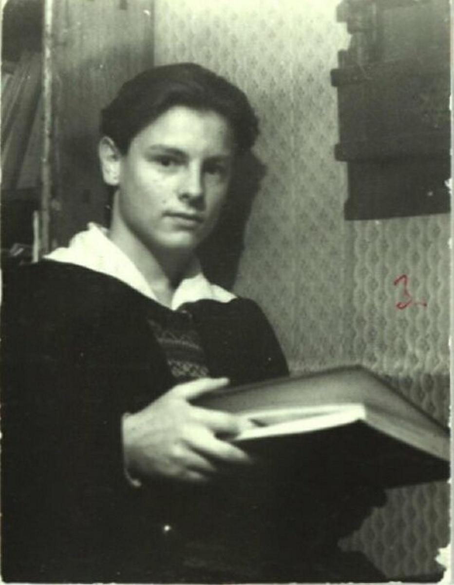

# На месте музея — зона отчуждения. Что важнее для памяти легендарного режиссера — государственные фанфары в связи с 90-летним юбилеем или обещанный «Дом Тарковских»

- **URL:** https://novayagazeta.ru/articles/2021/12/06/pustyr-na-meste-muzeia
- **Дата:** 2021-12-06
- **Автор:** Лариса Малюкова

## На месте музея — зона отчуждения

## Что важнее для памяти легендарного режиссера — государственные фанфары в связи с 90-летним юбилеем или обещанный «Дом Тарковских»

Андрей Тарковский. Фото из семейного архива

Вроде бы партией и правительством мы вновь вдохновлены на прославление величественного прошлого. И на знаменах страны мечтателей, страны героев — снова имена доблестных летчиков, футболистов, космонавтов, артистов.

Но и тут система дает сбой, прокручивая колеса на холостом ходу. Уж, казалось бы, есть ли в отечественной киноистории имя, сравнимое с именем Андрея Тарковского? О его искусстве писали Бергман и Куросава, ему посвящали свои фильмы Параджанов, Вендерс и фон Триер. Среди основателей Международного института Тарковского в Париже — Мстислав Ростропович, Робер Брессон, Максимилиан Шелл. Его фильмы разбирают покадрово и пересматривают дебютанты и выдающиеся режиссеры. В 2018 году

производное прилагательное от фамилии режиссера Tarkovskian включено в Оксфордский словарь английского языка.

Уж казалось бы, не он ли заслуживает музея в Москве? Тем более решение о создании этого музея принималось неоднократно.

В его родном доме «на Щипке» прошли первые тридцать лет жизни, на это время пришлось создание учебного фильма «Убийцы», дебютного фильма «Каток и скрипка», «Иваново детство», начало работы над «Страстями по Андрею» («Андрей Рублев»). Многие эпизоды «щипковского» детства стали частью «Зеркала». Это место давно стало культовым среди синефилов.

Мечта о музее грела сердце Элема Климова, Олега Янковского, Ролана Быкова… Обращались с просьбами, собирали подписи. И было это в 1987-м. Союз кинематографистов был инициатором музея, но он беднел.

Дом вернули в ведомство Москвы. Обнаружившийся инвестор решил построить себе бизнес-центр, выделив музею небольшую «зону». Да и разорился.

Тем времени и сам крепкий купеческий дом ветшал… В 2004-м рухнула крыша. Дом можно было спасти (хотя прозорливая Марина Тарковская забрала дверную ручку, прощаясь с надеждой на восстановление). Но его разобрали, бревна свезли в Красную Пахру (там пытались реконструировать кинематографический Дом творчества, да вместо этого и его продали).

Однако от мысли устроить в Москве Центр Тарковского самые настойчивые не отказывались. Была даже идея сделать музей трехъярусным: на разных этажах разместить экспозиции, посвященные Тарковскому, его соученику по ВГИКу Шукшину и их мастеру Михаилу Ромму…

В итоге дело сдвинулось с мертвой точки: выкопали большой котлован под фундамент, который надо было срочно укрепить.

Тогда Юрий Норштейн отдал свою денежную премию, полученную от японцев: котлован упрочили бетоном.

В 2007-м мэру Москвы писали

- Белла Ахмадулина,
- Андрей Вознесенский,
- Алла Демидова,
- Андрей Кончаловский,
- Павел Лунгин,
- Юрий Любимов,
- Эльдар Рязанов,
- Маргарита Терехова,
- Инна Чурикова,
- Александр Сокуров,
- Олег Янковский,
- родные и близкие Тарковских

(всего 40 подписей), просили поддержать идею Музея Андрея Тарковского.

Так возникло постановление правительства Москвы № 586 от 22 июля 2008 года «О воссоздании и дальнейшем использовании объекта культурного наследия по адресу: 1-й Щипковский пер., д. 26, стр. 1». Планировалось восстановление за счет средств города дома и создание в нем культурного центра «Дом Тарковских». Сроки исполнения: 2009–2011 гг. В проект будущего центра-музея вложили немалые средства.

В 2007-м в битву за музей включился московский депутат Евгений Бунимович. Благодаря его протекции Лужков написал резолюцию на очередном прошении, мол, музею с кинотекой и кинозалом — быть! Так и шло. Чиновники вроде и не отказывались, и копились бумаги с резолюциями и печатями. Создавались проекты, была описана музейная коллекция: рукописи, рисунки, фотографии, личные вещи Тарковского, сохраняемые его сестрой, семьей сына, а также коллегами Тарковских и частными коллекционерами. И… После прихода очередного руководителя Департамента культуры работы по созданию музея были приостановлены.

Транспаранты «Здесь будет Музей Тарковского» выкинули на помойку. Сегодня на месте «Дома Тарковских» — пустырь, зона, огороженная забором. Очень удобно для коммунальных служб, они здесь складируют инвентарь,

Поддержите нашу работу!

1000 500 300 Нажимая кнопку «Стать соучастником», я принимаю условия и подтверждаю свое гражданство РФ

Если у вас есть вопросы, пишите [email protected] или звоните:+7 (929) 612-03-68

до недавнего времени в подсобках ночевали гастарбайтеры. И эта видимая бесхозность может дать основание депутатам муниципального уровня поставить вопрос об изменении статуса территории и отмене постановления правительства Москвы № 586 от 22 июля 2008 года. Того и гляди — вместо «Дома Тарковских» увидим очередной бетонно-блочный склеп до небес.

Читайте также

Кто победит ничто

О самом главном, что случилось на XV Международном фестивале им. Андрея Тарковского

«Дом Тарковских» и сегодня значится в Адресной инвестиционной программе города Москвы, однако ее действие завершается в 2023 году. У инициаторов проекта нет уверенности, что сама идея создания Музея Андрея Тарковского не исчезнет вместе с инвестиционной программой.

Главным хранительницам бесценного архива и прочих музейных сокровищ — сестре режиссера Марине Тарковской и первой жене Ирме Рауш — за 80. Их волнует, что будет с музейным проектом после их ухода.

Скорее всего, коллекции будут разорены и по частям начнут «гулять» по аукционам мира.

Напомню, что всего несколько лет назад Ивановская область приобрела архив Андрея Тарковского, охватывающий 1967–1986 гг. на аукционе Sotheby's после жесточайшей борьбы с конкурентами за 1,49 миллиона фунтов стерлингов (около 2,4 миллиона долларов). Причем одним из покупателей был Ларс Фон Триер, для которого имя Тарковского священно.

С отцом. 1947 год. Фото из семейного архива

Вот и сейчас можем все спустить с молотка, чтобы потом приобретать за миллиарды историю своей культуры.

Через несколько месяцев, 4 апреля 2022 года, 90-летний юбилей режиссера. Уже создана юбилейная комиссия, будут фанфары, мемориальные концерты и показы. Но закончатся ли многолетние страдания по музею? Или по-прежнему будем с усердием платоновских героев разрывать котлован, засыпать его и рыть снова?

Марина Тарковская

сестра режиссера, член Союза кинематографистов РФ

— Прошло 34 года с того дня, как Комиссия по творческому наследию Андрея Тарковского под председательством Элема Германовича Климова вынесла постановление о создании Музея Андрея Тарковского. Но с самого начала, будто злой рок навис над нашим домом № 26 по 1-му Щипковскому переулку. Почему дом был снесен? Он мог бы простоять еще лет сто — типовая постройка: на крепком каменном первом этаже — деревянный верх из лиственницы, которая и в воде не гниет. А в 1991-м «Дом Тарковских» — теперь этот объект называется так — окончательно сносится. Дальше — тишина.

Сколько замечательных людей принимало участие в борьбе за создание Музея! Этот проект горячо поддержал Дмитрий Сергеевич Лихачев. Олег Иванович Янковский терял свое драгоценное время на хождения по кабинетам чиновников, просил, убеждал. Ролан Антонович Быков приезжал к руинам дома, чтобы в интервью каналу «Культура» сказать о необходимости создания Музея. Боролся за него Николай Бурляев. Юрий Норштейн передал денежную премию на строительство. А сколько было собраний, заседаний, обсуждений, сколько писем написано, сколько получено одобрительно-неопределенных ответов…

4 апреля 2022 года моему брату исполнилось бы девяносто лет, а я всего лишь на два с половиной года его моложе. Сколько же еще мне надо жить, чтобы, наконец, услышать, что вопрос о Музее «Дом Тарковских» решен положительно?

Павел Лунгин

режиссер

— Мы все клянемся в любви к Тарковскому, но любовь — это сохранение памяти, в том числе и материальной. Тарковскому, умершему на чужбине, нужен свой дом в Москве.

Дом, в котором родился Тарковский, лежит на дне Горьковского водохранилища. Но это не значит, что материальный мир Тарковского утонул подобно Атлантиде и исчез бесследно.

В Москве, в Замоскворечье, есть место, где стоял дом, в котором жили два поколения семьи Тарковских. К сожалению, в 2004 году он был разрушен. С тех пор, уже много лет ведутся разговоры о создании на этом месте мемориального центра. Но разговоры остаются разговорами.

Евгений Миронов

актер

— На меня большое впечатление произвела выставка, посвященная фильму «Андрей Рублев», в Новом Пространстве Театра Наций, которая проходила несколько лет назад. Это был самый настоящий музей одного фильма мирового уровня. Под стать самому Тарковскому, который считается в мире одним из главных культурных брэндов России. Удивительно, что прошло 35 лет после смерти мастера, а его музея в Москве до сих пор нет. При том, что энтузиастами этой темы собрана большая коллекция артефактов!

Евгений Бунимович

депутат Мосгордумы, член комиссии по культуре

— Вместо памятного места «Дома Тарковских» создан памятник бюрократической системе. Я не видел чиновников, которые возражали бы против создания такого центра, но абсурдность, неповоротливость бюрократической системы предъявлена во всей красе. Ровно об этом свое кино снимал Андрей Тарковский. За все это время единственно хорошая новость: это место не занято очередным человейником или торговым центром. Значит, осталась надежда. Осталась возможность решения столь долго не решаемой проблемы. Очередной раунд непростых переговоров с Департаментом культуры, Департаментом культурного наследия Москвы привели меня как депутата к необходимости внесения поправки в бюджет Москвы на ближайшие три года, который принимала Дума. В итоге министр финансов правительства Москвы Елена Юрьевна Зябарова в своем ответе сообщила, что объект культурного наследия включен в адресную инвестиционную программу Москвы на 2023 год с целью создания культурного центра «Дом Тарковских».

Поддержите нашу работу!

1000 500 300 Нажимая кнопку «Стать соучастником», я принимаю условия и подтверждаю свое гражданство РФ

Если у вас есть вопросы, пишите [email protected] или звоните:+7 (929) 612-03-68
