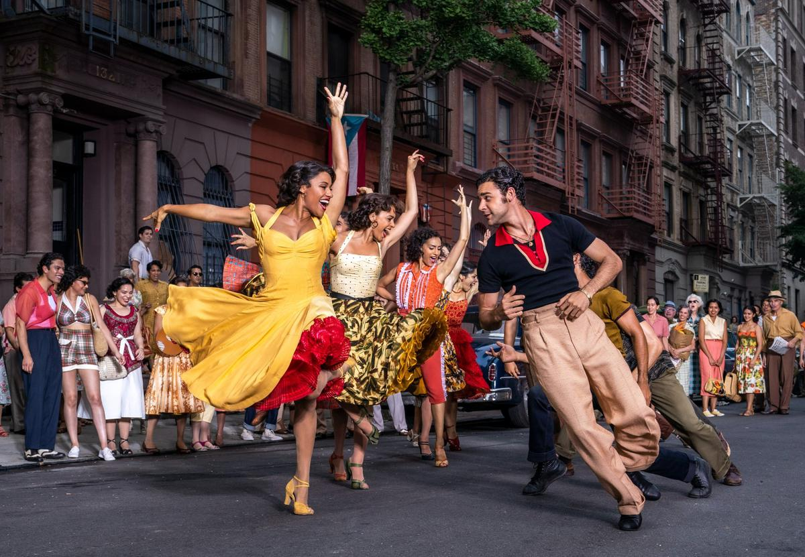

# Мы будем жить по-новому. Через 60 лет после премьеры легендарной картины Стивен Спилберг снял свою версию мюзикла «Вестсайдская история». На российских экранах с 9 декабря

- **URL:** https://novayagazeta.ru/articles/2021/12/08/my-budem-zhit-po-novomu
- **Дата:** 2021-12-08
- **Автор:** Лариса Малюкова

## Мы будем жить по-новому

## Через 60 лет после премьеры легендарной картины Стивен Спилберг снял свою версию мюзикла «Вестсайдская история». На российских экранах с 9 декабря

Фото: kinopoisk.ru

Предыстория. Оригинальная бродвейская постановка «Вестсайдской истории» в конце пятидесятых была обласкана призами и публикой. Прежде чем отправиться в мировое турне, сыграли 732 спектакля. Музыка Леонарда Бернстайна, поэтические тексты Стивена Сондхайма и негасимый шекспировский сюжет cтали залогом вот уже столетней жизни мюзикла. Но некоторые любят погорячее. Ромео превратился в эмигранта-поляка Тони, Джульетта — в пуэрториканку Марию. Герцог Веронский понижен в статусе и стал офицером полиции Крупке, вместо семей равных высоких веронских родов Монтекки и Капулетти появились две враждующие банды из западного Манхэттена: белые и пуэрториканцы. А Америка запела «Tonight», «One hand», «America».

Кинопродюсеры предполагали успех и бились за право ставить мюзикл Бернстайна. И оказались правы: картина режиссера Роберта Уайза, хореографа и режиссера Джерома Роббинса стала культовой. Получила 10 премий «Оскар» и вошла в историю кино как символ киномюзикла.

Стивен Спилберг в тот момент был подростком, воспитанным в музыкальной семье, потому не мог не влюбиться в музыкальную драму о первой любви. «Моя мама была классической пианисткой.

Весь наш дом был наполнен альбомами классической музыки. «Вестсайдская история» была первым произведением популярной музыки, которое наша семья позволила себе слушать дома.

«Вестсайдская история» была тем навязчивым искушением, которому я наконец поддался».

Сюжет. Сюжет нового фильма Спилберга основан в большей степени на бродвейской версии, включая сольные и танцевальные номера.

Польско-американские головорезы из группировки Джеты сражаются с пуэрториканской бандой Акулы. И пока они бьются за свою территорию, сама территория потихоньку приватизируется богатыми кошельками. Дома сносятся. Вот-вот на их месте вознесутся к небу дорогие новостройки, в них заедут благополучные янки и враждующему отребью здесь вообще не будет места. Об этом им бестрепетно заявляет полицейский Шранк, явно симпатизирующий белым хулиганам и презирающий пуэрториканцев. И для жителей этих улиц, все, что они любят, все, к чему привыкли, — либо сносится, либо продается.

И в это самое время Джета по имени Тони (Ансель Эльгорт) и сестру главной Акулы, Марию (Рэйчел Зеглер), угораздило увидеть друг друга на танцполе и буквально ослепнуть от любви с первого взгляда. И оторвавшись от суровой реальности, петь любовные баллады на балконе.

Фильм снят по сценарию Тони Кушнера, работавшего со Спилбергом над «Мюнхеном» и «Линкольном». Многие эпизоды из фильма Роберта Уайза узнаются, хотя ритмически, по дизайну, хореографии и целому ряду деталей отличаются от версии 1961 года. Например, пролог. В старой версии история начинается со стадиона, на который камера опускается с небес манхэттенских высоток. У Спилберга герои словно выныривают из-под земли в самой сердцевине развалин, еще вчера бывших домами. Место действия — руины Верхнего Вест-Сайда в 1958 году, где ветшающие многоквартирные дома сносят бульдозерами и гигантским железным шаром ради строительства нового Линкольн-центра.

Знаменитый номер Марии «I feel pretty» перенесли из свадебного ателье в многоэтажный супермаркет, где юная Золушка Мария кружится в дорогом (почти за 20 долларов!) зеленом шарфе, снятом с манекена. Испанские диалоги звучат без титров. Да и на музыкальных номерах титры не слишком нужны. Здесь все понятно без слов, и хореография Джастина Пека более чем красноречива.

Кастинг. Подобное музыкальное шоу — это прежде всего кастинг — самый масштабный, по словам Спилберга, за его карьеру со времен «Списка Шиндлера».

Фото: kinopoisk.ru

Поддержите нашу работу!

1000 500 300 Нажимая кнопку «Стать соучастником», я принимаю условия и подтверждаю свое гражданство РФ

Если у вас есть вопросы, пишите [email protected] или звоните:+7 (929) 612-03-68

Тони — Энсель Эльгорт, известный по фильмам «Малыш на драйве», «Дивергент», «Клуб миллиардеров» и «Щегол». Его герой из польской семьи только что вышел из тюрьмы за драку, в которой едва не убил противника, и больше не хочет участия в бандитских войнах. Пылкий, ранимый, дружелюбный. Пытается остановить войну. Живет в аптеке опекавшего его американца Дока, точнее, его вдовы, пуэрториканки Валентины. Ее сыграла Рита Морено, та самая, которая была Анитой в фильме 1961 года. Спилберг дарит ей волнующий хит «Somewhere»: «Где-то там, в другой жизни мы найдем время и силы для прощения».

В роли возлюбленной Тони — дебютантка Рэйчел Зеглер. Школьную выпускницу из Нью-Джерси Спилберг выбрал, увидев вирусное видео, в котором она поет «Shallow» из «Звезда родилась». Сейчас у видео уже больше 3 миллионов просмотров.

Роль лирической героини заведомо предсказуемая, но Зеглер накапливает силы от наивной юности и нежности в зачине до саднящей боли в финале. И до всех номинаций и «Оскаров», которые, разумеется, уже сулят очередной картине мэтра, можем констатировать: «Звезда родилась».

Съемки проходили в Нью-Йорке, в основном в Нью-Джерси и в Гарлеме, недалеко от Сан-Хуан-Хилла, где снималась оригинальная «Вестсайдская история». Волшебник Спилберг словно надевает на наши глаза изумрудные очки, и мы оказываемся в пятидесятых, свингующих на бродвейской сцене. И эти чудесные линзы — у камеры Януша Камински. Сплав реализма Эндрю Уайета и буйства красок Кунинга. Живописное использование света и теней, крупные планы, словно «вырезанные» из общих, — возвращают эстетику прошлого.

Потоки теплого света, зажженные окна с вентиляторами в форточках, постиранное белье на веревках во дворах-колодцах, длинные тени двух «армий», шагающих навстречу друг другу, разноцветное безумие юбок-солнце на улицах Манхэттена, драки в строительной пыли и замершие влюбленные среди массовки, разгоряченной ритмами мамбо и ромом. В действии принимают участие мусорные баки, банки с краской, арбузы, уличные кошки. Для новой версии музыку адаптировал композитор и дирижер Дэвид Ньюман, сделав акцент на самой разнообразной и самой неожиданной перкуссии.

Фото: kinopoisk.ru

Замысел. Вряд ли у Стивена Спилберга была идея переплюнуть новаторский для своего времени и во многом устаревший сегодня киномюзикл. Он просто делится своей первой любовью, возвращая нынешнему зрителю свежее восприятие классического музыкального кино в яркой оптике. С высочайшим уровнем профессионализма и уважения дает второе рождение киномюзиклу, не меняя нот Леонарда Бернстайна и лирики Стивена Сондхейма. Ускоряя темп (хотя в сравнении с нынешним кино фильм Спилберга кажется несколько заторможенным), решая монтаж с учетом музыкальных фраз и пауз, он сохраняет возвышенный дух их творения, укрупняя театральность, обостряя социальную подоплеку расового конфликта.

И классическая трагедия ошибок оказывается драмой любви, изначально обреченной на смерть. Есть в этой драматургии сильная самостоятельная мелодия. Это партия Аниты (роскошная темнокожая певица, актриса, танцовщица Ариана ДеБос). И дело не только в зашкаливающей энергии актрисы, примагничивающей взгляд, это роль с секретом, о котором не буду рассказывать, дабы не испортить вам впечатления. Только скажу, что именно Анита, подруга погибшего предводителя Акул Бернардо, становится ключевой фигурой фильма Спилберга, транслятором его идей.

«Вестсайдская история» — ремикс классики об обреченной любви, сделанный без желания ошеломить зрителя, но с намерением вернуть XXI веку музыкальную романтику, без сиропа,

но и без компьютерных аттракционов, постмодернистских игр.

Это сказка с плохим концом. Но гибель Тони в версии 2020-го объединяет вчерашних врагов, демонстрируя абсурдность, космический идиотизм социальных противостояний, уничтожающих все живое. Например, любовь. Например, людей.

Стивен Спилберг очень хотел, чтобы фильм, который был готов уже год назад, увидели на большом экране. И компания Disney согласилась не отдавать в пандемический год картину на платформы. Дождаться открытия кинотеатров.

Увы, сочинитель текстов, поэт и композитор Стивен Сондхейм умер за три дня до премьеры. Его называют переизобретателем классического мюзикла, потому что он не боялся соединять классику с актуальными темами, не боялся сложных текстов и конфликтов, обращался к «темным мучительным сторонам человеческого опыта». Трудно представить себе «Вестсайдскую историю» без его мощного поэтического и человеческого посыла: «Где-нибудь/Мы будем жить по-новому,/Мы найдем способ прощать/Где-нибудь…

### P.S.

Мюзикл Стивена Спилберга запретили к показу в шести странах Ближнего Востока. В Саудовской Аравии и Объединенных Арабских Эмиратах фильму не выдали прокатное удостоверение. В других странах попросили вырезать некоторые сцены, в частности эпизоды с трансгендерным персонажем Анибодисом, которого сыграла Эзра Минас. Студия Disney отказалась подвергать мюзикл цензуре.

Поддержите нашу работу!

1000 500 300 Нажимая кнопку «Стать соучастником», я принимаю условия и подтверждаю свое гражданство РФ

Если у вас есть вопросы, пишите [email protected] или звоните:+7 (929) 612-03-68
