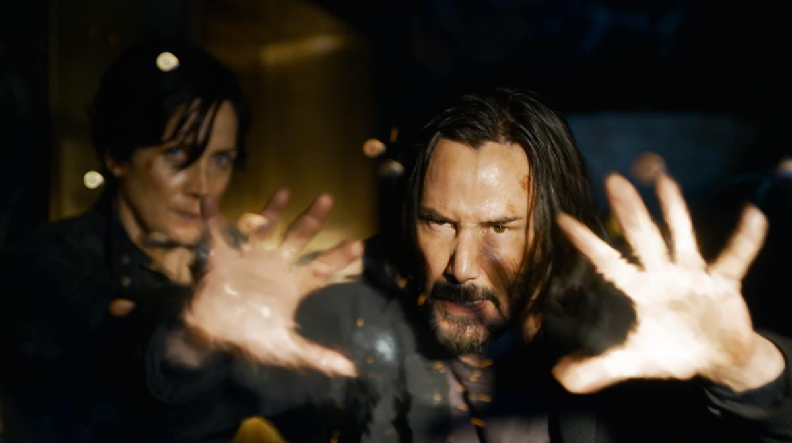

# Нео и Тринити были здесь, в «матрице». На экранах четвертая глава неубиваемой франшизы, вышедшая 20 лет спустя после премьеры культовой киноистории

- **URL:** https://novayagazeta.ru/articles/2021/12/16/neo-i-triniti-byli-zdes-v-matritse
- **Дата:** 2021-12-16
- **Автор:** Лариса Малюкова

## Нео и Тринити были здесь, в «матрице»

## На экранах четвертая глава неубиваемой франшизы, вышедшая 20 лет спустя после премьеры культовой киноистории

Кадр из фильма «Матрица.Воскрешение»«Матрица: Воскрешение». Ее сняла сольно Лана Вачовски без сестры Лилли, которая временно покинула режиссуру, пытаясь выйти из депрессии после смерти родителей.

Кстати, новая «Матрица» и посвящена родителям режиссерок. И это многое объясняет в картине, главная тема которой — экзистенциальный кризис. Давно известно, что ностальгия — лучшее средство от тревоги.

Говорить о фильме без спойлеров практически невозможно. Впрочем, информация об основной фабуле в широком доступе. Сразу понятно, насколько ностальгический киберпанк связан с реальностью, в которой цифровые коды постепенно заменяют удостоверение личности. Да и сама личность без QR-кода лишена права на нормальное существование. Одна из сквозных тем фильма — тотальный контроль над человеком, отсутствие свободы выбора — проблема давно и всерьез волнующая Вачовски.

Спустя восемнадцать лет после предыдущей «революционной» «Матрицы», в которой смертельно ранили Тринити, а сам Нео, спасший мир, был увезен без признаков жизни, — все обрело неустойчивую стабильность.

Томас Андерсон (отрастивший бороду Киану Ривз) — успешный, мрачный гейм-дизайнер, он-то и создал «порно для мозга» — игровую трилогию «Матрица». О людях, не подозревающих, что живут внутри симуляции. Он ходит к психотерапевту (Нил Патрик Харрис), дискутирует с веселым начальником, менеджером Смитом (Джонатан Грофф). И его лишают сна кошмары.

Поэтому он пьет синие таблетки забвения Морфеуса, чтобы помочь мозгу избавиться от навязчивых жутких видений. В них он — хакер Нео, борется с цифровыми тварями в черном. Фармакология неплохо работает: даже когда в кафе Нео встречает любовь всей жизни Тринити, они не узнают друг друга. И кабы не спасительные красные таблетки, так бы и остался Нео мухой, запертой внутри янтарного виртуального вакуума, отделенного от страдающего живого мира зелеными потоками цифр.

«Матрица: Воскрешение» — дефибриллятор подзабытой франшизы. Микс продолжения, ремейка и перезапуска. Многосложная, запутанная, с долгими провисами, при этом взрывающая мозг брутальная футуристическая драма с рейтингом «R» — «из-за насилия, ненормативной лексики и жестокости».

История построена по методу «mise en abyme», или принципа матрешки: сон во сне, жизнь в игре, но точнее — симуляция внутри симуляции.

По жанру — сплав хакерского нуара и фантастического любовного романа.

Поддержите нашу работу!

1000 500 300 Нажимая кнопку «Стать соучастником», я принимаю условия и подтверждаю свое гражданство РФ

Если у вас есть вопросы, пишите [email protected] или звоните:+7 (929) 612-03-68

Кадр из фильма «Матрица.Воскрешение»

Авторы предпринимают воскрешение уже возрастных Нео и Тринити, которые пробиваются друг к другу сквозь неодолимые препятствия, эвересты ловкого обмана, камуфлированной под действительность виртуальности. Цитаты из предыдущих фильмов (первый эпизод едва ли не полностью воспроизводит пролог «Матрицы»-1999), жонглирование многоумными терминами вроде «бинарной модальности», «изоморфными частицами», способными заменять друг друга. Двойные агенты, перекодированные версии оригинальных персонажей, игры искусственного разума, заводные монстры, гигантские насекомые, боты, падающие с неба, как бомбы. Да, Лана Вачовски впускает в сверхсерьезный мир «Матрицы» черный юмор, иронизирует над «содержанием предыдущих серий». В компании Смита и Андерсона говорят о возможности экранизации четвертой главы «Матрицы» студией Warner Bros, спорят о символах и ключах. Что это было? Поединок аллегорий? Вечная оппозиция капитализма и индивидуальности? Метафорические маршруты квир-теорий и гендерной идентичности?

«Воскрешение» — хитроумный и запутанный квест между жизнью и сном, реальностью и цифровым миром, которые ежеминутно меняются местами друг с другом, словно действительный мир сам увяз в «Матрице», как рука Нео в зеркале. Как нынешний мир в компьютере — на удаленке.

Фанаты, как обычно, разделятся на восторженных и обиженных. Подросшие поколения впервые войдут в «Матрицу» и без библии предыдущих глав с трудом поймут, кто воскрес, смертию смерть поправ, и зачем. Фильм, по сути, не развивает историю «Матрицы», лишь обобщает, любуется когда-то созданной вселенной и ее обитателями, многих из которых апгрейдили, заменив актеров. Новые лица дают надежду на продолжение.

Заменить Киану Ривза было бы тоже неплохо — смотреть на него скучно, он по-прежнему пресный, деревянный, словно внутри замороженный.

Возможно, поэтому для его героя и придумали депрессию — внутреннюю неподвижность.

Кадр из фильма «Матрица.Воскрешение»

Морфеус (вместо Лоуренса Фишборна его сыграл Яхья Абдул-Матин II) — духовный лидер восставших против машин людей, в начале фильма сравнивает Нео с кэрролловской Алисой, ему снова предстоит разобраться, «насколько глубока кроличья нора». Но хочет ли сам Нео быть избранным? Или Тринити и есть его параллельный мир? Лавстори неожиданно вторгается в science fiction и ломает стереотипы жанра, выходя на первый план. Именно человеческая история, история взаимоотношений, у которых нет срока давности, для Ланы Вачовски, потерявшей родителей, стала стимулом к созданию картины.

А сама «Матрица» с ее текущими по экрану цифрами, компьютерными эффектами от flo-mo до bullet time, с отражением пуль — руками Нео, с неостановимым мотоциклом Тринити, со снами о реальности под бионебом — похожа на синие таблетки Морфеуса. За этим и идем в кино.

Поддержите нашу работу!

1000 500 300 Нажимая кнопку «Стать соучастником», я принимаю условия и подтверждаю свое гражданство РФ

Если у вас есть вопросы, пишите [email protected] или звоните:+7 (929) 612-03-68
