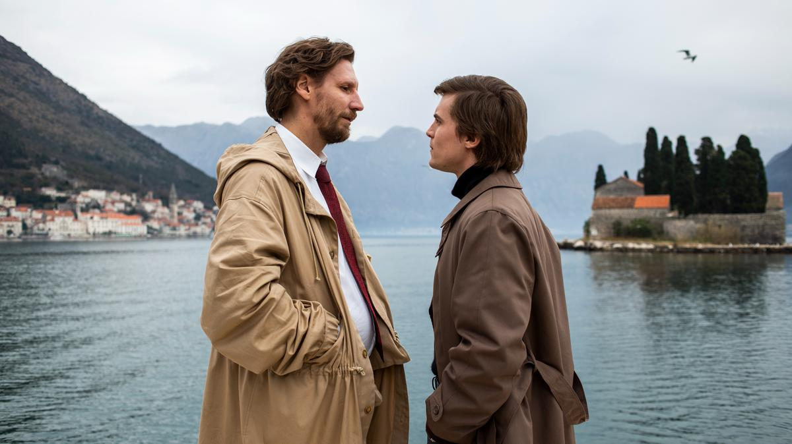

# Сгущенка из шахмат. Почему «Чемпион мира» выглядит ненастоящим?

- **URL:** https://novayagazeta.ru/articles/2021/12/24/sgushchenka-iz-shakhmat
- **Дата:** 2021-12-24
- **Автор:** Лариса Малюкова

## Сгущенка из шахмат

## Почему «Чемпион мира» выглядит ненастоящим?

«Чемпион мира». Кадр: kinopoisk.ruФильм Алексея Сидорова («Бой с тенью», «Т-34») — ретроблокбастер о легендарной марафонской битве за шахматную корону между Карповым и Корчным в 1978 году в филиппинском Багио.

Тогда трехмесячный поединок между действующим чемпионом мира Анатолием Карповым и претендентом на этот титул гроссмейстером Виктором Корчным, эмигрировавшим из СССР за несколько лет до знакового матча, вошел в историю как один из самых драматичных в истории шахмат. Подобного кипения страстей вокруг древней игры мир еще не видел. На пике застоя утомительный бой в Багио стал полигоном холодной войны.

И сегодня на пике очередного застоя фильм Сидорова смотрится как иллюстрация холодной войны. Будто кино снято в начале 1950-х, но с компьютерным апгрейдом.

Про апгрейд скажем отдельно. Не слишком оригинальное интро в виде карты, прорастающее из заставок «Мира дикого запада», «Властелина колец», «Матрицы», «Игры престолов»… В этом игровом «дебюте» — модели битв компьютерных конных рыцарей с пиками, модели живых нейронных сетей, трансформирующихся в карту военных действий с географическими центрами под именами знаменитых партий. И вновь продолжается бой.

Экспозиция — Дворец культуры Златоуста. Серьезный школьник на сеансе одновременной игры откажется от легкой победы над знаменитым гастролером — гроссмейстером Корчным, зевнувшим ферзя. Откажется, потому что «не спортивно», а честь надо беречь смолоду. Но лысеющему дяде со змеиной ухмылкой этого не понять. Еще одна незамысловатая метафора. Так завязывается, по версии киношников, этот многолетний поединок.

Фильм Алексея Сидорова производит странное впечатление, будто собрали целый ворох точных деталей, от хроникальных описаний партий до буквальных реконструкций событий — как Карпов с космонавтом Севастьяновым ездили на баскетбол в Манилу, чтобы снять напряжение, как за него переживал Брежнев (горячо болеющего генсека играет сильно загримированный Александр Филиппенко), — но с таким гигантским плюсом, что из исторических и бытовых подробностей получилась фальшмозаика о людях и событиях.

## Корчной — Константин Хабенский

Невозвращенец. Злобный маньяк, почти Мефистофель (это сравнение подчеркнуто сюжетом), провокатор, привокзальный шулер. Из СССР бежал, потому что урезали гроссмейстерскую стипендию. Силы предатель родины восстанавливает на кровавых петушиных боях. Предпочитает подковерные интриги, помощь экстрасенсов и телепатов. Все его выходки — «не спортивные», об этом нам напомнят. Начиная с зеркальных очков, в которых двоится соперник или шахматная доска, до мерзких колкостей, оскорблений за шахматной доской соперника. Делает все, чтобы вывести «бумажного короля» из строя. Шахматы превращает в войну. И оказывается, это он, а не Карпов проверял кресло противника на наличие тайного устройства или радиации.

«Чемпион мира». Кадр: kinopoisk.ru

## Карпов — Иван Янковский

Из чудесного вундеркинда вырастет чудный юноша в белой рубашке с чистыми помыслами и прекрасной анкетой. Символ девиза «миру мир». К тому же «настоящий уральский мужик» с несгибаемой волей. Самый советский шахматист в фильме позволяет себе конфликтовать с руководством Комитета по физической культуре СССР и лично министром Градовым (Владимир Вдовиченков играет гнусного функционера, подразумевая Сергея Павлова, который в то время руководил спортом). Анатолий — нежный и любящий сын, переживающий тяжкую болезнь отца (Федор Добронравов), не позволяющий манипулировать собой чиновникам от спорта.

Иван Янковский показывает нам человека закрытого, предельно сдержанного, фанатично преданного игре, отсекающего все лишнее, скованного этой моноидеей. Лишь в кульминационные моменты он даст герою право на эмоцию.

Корчному в помощь — фам-фаталь Петра Лееверик, руководитель делегации, секретарь, экономка, менеджер и шофер (в будущем она станет его женой). Но ничего про нее мы так и не узнаем, как и о судьбе реальной Петры, проведшей в воркутинских лагерях годы. У кинодамы пик текста нет, лишь молнии из черных недобрых глаз. Рядом с иудой Корчным — представители Международной террористической организации «Ананда Марга» йоги Стивен Двайер и Виктория Шеппард, лупоглазый гипнотизер, который мешает игре Карпова, телепаты и прочая мутная шушера.

В команде Карпова — товарищи по духу и шахматам. Известно, что на него работала едва ли не вся сборная СССР, ведущие шахматисты соцстран.

Поддержите нашу работу!

1000 500 300 Нажимая кнопку «Стать соучастником», я принимаю условия и подтверждаю свое гражданство РФ

Если у вас есть вопросы, пишите [email protected] или звоните:+7 (929) 612-03-68

Его поддерживает и необъятная страна. За него болеют-переживают пастухи, пограничники, геологи, оленеводы — труженики Северного полюса. Космонавты передают черный хлеб, подводники — воблу. Но Карпову Янковского не до гастрономических радостей. Он о шахматах думает денно и нощно, перестает спать и есть, только вот если сгущенку. Ответственность высока, дело чести — вернуть корону в страну, достойную короны. Повар — давний товарищ Анатолия, жарит ему сырники, чувствительный гэбэшник защищает от козней недругов, глава делегации Батуринский (Виктор Сухоруков) бьется с противниками на заседаниях, обличая, выступает с протестами. Парапсихологу Карпова Владимиру Зухарю, бесившему Корчного, которому казалось, что гипноз Зухаря, сидевшего в первом ряду, парализует его волю, времени почти не досталось. Известно, что Карпов в нем разочаровался, потому что психолог не помог решить проблему депривации сна.

«Чемпион мира». Кадр: kinopoisk.ru

Идеологическая подкладка фильма точно такая же, как нынешняя надстройка: весь мир против нас. Враги обложили нашу делегацию. Змеи вползают в номер на 11-м этаже, денно и нощно работающая газонокосилка, вертолет, зависший над домом нашей делегации, — все нацелено, чтобы не дать Карпову заснуть, замучить бессонницей и непрекращающимся дождем.

Ему поможет выиграть любовь. Умирающий отец будет вести за собой сына, являясь к нему в сновиденьях и воспоминаньях. Жена по его просьбе помчится в их квартиру, найдет заветную тетрадку с заветной полузабытой партией, продиктует кодовый ход, и окрыленный Анатолий полетит сквозь тропический ливень к победе. Отдельной благодарности заслуживают диалоги, словно списанные из статей негаснущей «Правды»: «Вокруг тебя люди, а не фигуры!», «Он должен пройти свой путь до конца!»

Здесь все работает на идейность. И в музыке четкая драматургия. Карпов решительно входит во Дворец в Багио под пахмутовский «Темп моей страны, моей земли» с рвущимся голосом Софии Ротару — «соловья из Буковины». В трудные моменты выбора шахматиста согреет «Мелодия» преданного «Орфея» Магомаева. Финальный триумф расцветит победительный пугачевский «Арлекино». Связующим материалом для советских хитов станет оригинальная электронная музыка, тикающая вместе с часами на сцене, нагнетающая эмоции, призывающая к решительному выигрышу.

Что имеем в эндшпиле? Вместо захватывающей, интеллектуальной игры двух гениев, сложных людей — битву добра со злом. Разумеется, Корчной был известен капризами, подозрительностью, вздорным характером, массой странностей. Менял диеты, пил таблетки «от всего», подозревал, завел скобу из жести, прикреплял ее на ночь к щиколотке, соединяя с батареей центрального отопления, — так «заземлялся». Но мы почти ничего не узнаем о гонениях на шахматиста, особенно после его резкого интервью югославской газете «Политика», в котором он нелестно отозвался о Карпове. Не узнаем, что во время матча его жену Беллу не выпускали из СССР, а сына и вовсе держали в тюрьме. Про то, что за свой побег из СССР он был предан анафеме, дисквалифицирован, а Шахматная федерация СССР поставила перед Международной шахматной федерацией вопрос об исключении Корчного из предстоящего соревнования претендентов на звание чемпиона мира. На протяжении многих лет федерация шантажировала организаторов матчей различного уровня: если в них принимает участие Корчной, наши шахматисты «не захотят» приехать.

В кино будет все проще: белый петух заклюет черного. Белый всадник победит черного. Белое кресло превратится в кресло чемпиона.

«Чемпион мира». Кадр: kinopoisk.ru

Драматургия во многом повторяет структуру и ходы предыдущих спортивных фильмов «ТРИТЭ» (в «Легенде номер 17» Харламову помогала побеждать ворожба Тарасова/Меньшикова, в «Движении вверх» — амбиции тренера Гаранжина/Машкова, здесь — мудрое наставничество отца). Обязательный бобслей из болельщиков всего СССР. Героям фильмов предстоит борьба не только на льду, спортивной площадке или шахматной доске. Чемпионам вставляют палки в колеса аппаратчики, функционеры.

Блокбастер снимали экономично. Основное место съемок — зал дворца в курортном Багио. Роль дворца «сыграл» старенький Дом кино — вотчина Союза кинематографистов, издавна возглавляемого Никитой Михалковым, по случайному совпадению, одним из продюсеров фильма. Даром, что ли, ДК не ремонтировали годами — он и законсервирован время: конец 1960-х, в которых был построен.

Когда Карпов чувствует себя измученным, истощенным — ложками ест сгущенку. Готовят сгущенку просто: нагревают молоко, очищают от разных примесей, пастеризуют и щедро добавляют сахарный сироп. Дешево и сладко. Кажется, по этому рецепту готовился и «Чемпион мира».

Как и предыдущие спортивные блокбастеры, новая лента «Студии ТРИТЭ Никиты Михалкова» выходит в прокат в самое хлебное время — под Новый год, 30 декабря, и будет идти все новогодние каникулы.

Поддержите нашу работу!

1000 500 300 Нажимая кнопку «Стать соучастником», я принимаю условия и подтверждаю свое гражданство РФ

Если у вас есть вопросы, пишите [email protected] или звоните:+7 (929) 612-03-68
