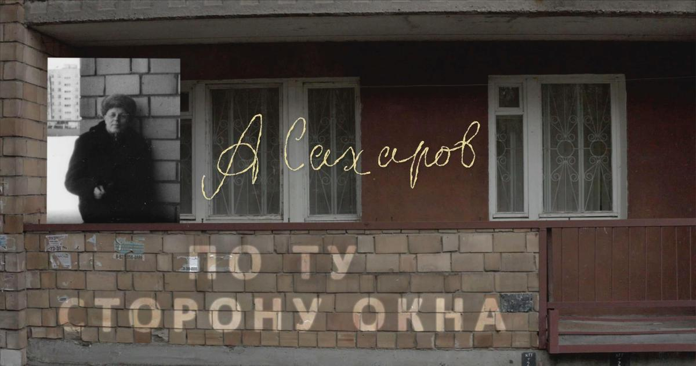

# Корень квадратный из истины = любовь. 12 января на сайте «Новой газеты» мировая премьера фильма  «Андрей Сахаров. По ту сторону окна». Борис Альтшулер рассказывает о картине

- **URL:** https://novayagazeta.ru/articles/2022/01/12/koren-kvadratnyi-iz-istiny-liubov
- **Дата:** 2022-01-12
- **Автор:** Лариса Малюкова

## Корень квадратный из истины = любовь

## 12 января на сайте «Новой газеты» мировая премьера фильма «Андрей Сахаров. По ту сторону окна». Борис Альтшулер рассказывает о картине

Кадр из фильма «Андрей Сахаров. По ту сторону окна»

В этом необычном кино сплетено научное просветительство (так уж ли мы понимаем, в чем именно заключались открытия выдающегося физика, в чем отличие водородной бомбы от атомной, как устроена сахаровская «слойка»?), подвижнический труд гуманиста Сахарова, его правозащитная деятельность. И становится очевидным, что научные принципы работы ученого — формулирование и постановка цели, а затем сосредоточение максимального усилия для решения поставленных задач — он задействовал и в решении глобальных гуманитарных и социальных проблем.

Среди материалов: секретные съемки — испытание термоядерного оружия, тайное наблюдение за Сахаровым и Боннэр во время ссылки в Горьком, воспоминания его коллег, рассекреченные архивные документы. А еще изобретательно и вольно одушевленные талантливым анимационным режиссером Дмитрием Геллером рисунки Андрея Дмитриевича на полях научных рукописей с расчетами и в письмах детям и внукам.

Динозаврик в очках восхищенно смотрит на высокую женщину, похожую на египетскую кошку, завороженно сидит у ее ног. Измученный динозаврик привязан к железной кровати в хаосе черноты. Муравьи ползут по белому экрану. Они приносят буквы и складывают их в сахаровскую формулу: корень квадратный из истины = любовь.

Кадр из фильма «Андрей Сахаров. По ту сторону окна»

Панорама: обычный кирпичный дом. На верхнем этаже — бюст Ленина; ниже этажом за грузинским проветриваемым ковриком Сталин, Андропов, Брежнев; дальше группа — Жданов, Хрущев, Орджоникидзе; еще ниже — ученые с Курчатовым во главе; опускаемся еще — стахановцы, метростроевцы. А внизу, рядом с окном, прислонился к стене Андрей Дмитриевич в пальто и шапке немного набекрень: «Я не на верхнем этаже. Я рядом с верхним этажом — по ту сторону окна», — как-то пошутил Сахаров, имея в виду этажи власти.

«По ту сторону окна» — это не только про параллельное существование с власть имущими, но и про острое несовпадение с самими установками системы.

Академик Зельдович уговаривал его принести пользу стране в группе экспертов при Совмине, которая помогла бы перестроить технику и науку в прогрессивном духе, главное — не ехать на суд над инакомыслящим Пименовым, иначе Сахаров поставит себя «по ту сторону». И тогда Андрей Дмитриевич сказал, что он действительно «по ту сторону».

Ему не давала покоя мысль о том, сколько именно потомков его бомба может убить за тысячелетия. Ему было жизненно важно, чтобы юная Лиза Алексеева выехала из страны к любимому человеку. «Как можете вы, великий, рисковать жизнью из-за какой-то девчонки?» — писали ему «доброжелатели». «Тоталитарное мышление», — кратко охарактеризовал Сахаров эту «заботу» в своих «Воспоминаниях». Он победил тогда в 1981-м.

А когда в мае 1984 года Елену Боннэр заперли в Горьком, оборвав единственную связь Сахарова с внешним миром, объявил длительные мучительные голодовки. «Я голодаю не только за твою поездку и не столько за твою поездку, сколько за свое окно в мир… Они хотят сделать меня живым трупом. Ты сохраняла меня живым, давая связь с миром».

Это фильм о страстном желании изобретателя бомбы сдержать войну. О том, что даже в условиях отсутствия выбора выбор остается. Даже в нечеловеческих условиях человек способен сохранить в себе человека.

Дмитрий Завильгельский — мастер документального научпопа, автор фильмов «Диссернет. Эволюция альтруизма» о сетевом сообществе, выявляющем плагиат при написании диссертаций, «Когда-то мы были звездами» об астрономах, «В ожидании волн и частиц» про поиск гравитационных волн.

Борис Альтшулер — физик, правозащитник, член Московской Хельсинкской группы, автор книги «Сахаров и власть».

Читайте также

Спасибо 130 тысячам зрителей!

Документальный фестиваль «Новой», «Артдокфеста» и платформы «Артдокмедиа» завершен

## Борис Альтшулер: «Сахаров никогда не переходил на личности»

— Идея сделать документальный фильм о Сахарове формировалась параллельно с изданием книги к его столетию. Благодаря помощи физика Бориса Штерна мы связались с режиссером Дмитрием Завильгельским. Его родители ученые, папа окончил физфак МГУ, занимался молекулярной биологией. Замысел мы обсуждали, с Фондом и Архивом Сахарова, с детьми Елены Георгиевны Боннэр — Алексеем Семеновым и Татьяной Янкелевич, с внучкой Андрея Дмитриевича Мариной Сахаровой-Либерман. Да и не только мы, к юбилею и Елена Якович, и ряд других авторов сделали свои картины о Сахарове.

Борис Альтшулер

— Если сформулировать кратко, чем отличается ваша картина?

— Прежде всего, в ней много самого Сахарова, его прямой речи, размышлений. Но дело, конечно, не только в этом. Фильм получился не сразу. Режиссер Дмитрий Завильгельский долго думал, как подступиться, чтобы не было банального ЖЗЛ. И сделал фильм, по-моему, интересный. Анимация Дмитрия Геллера тоже находка. Конечно, невозможно охватить планетарный масштаб сахаровской личности, но сквозь весь фильм проходит мысль о странности, особенности гения.

Понимаете, для Сахарова был важен отдельный человек, который через 3 тысячи лет — он это посчитал — точно умрет от рака из-за того, что сейчас взрываются его бомбы.

Поддержите нашу работу!

1000 500 300 Нажимая кнопку «Стать соучастником», я принимаю условия и подтверждаю свое гражданство РФ

Если у вас есть вопросы, пишите [email protected] или звоните:+7 (929) 612-03-68

И ведь это Сахаров еще до всякого диссидентства — еще в 1959-м. И в начале 1960-х, когда у него произошел конфликт с Хрущевым, решившим испытания возобновлять. И в 1962-м он пытался остановить двойное испытание, жертвуя своей бомбой. Говорил: «Пусть взрывают бомбу, которую сделали на Урале, мою не надо, не будем лишний раз отравлять атмосферу». Его обманул министр, взорвали обе бомбы. Сахаров пишет: «Ужасное преступление совершилось, и я не смог его предотвратить! Чувство бессилия, нестерпимой горечи, стыда и унижения охватило меня. Я упал лицом на стол и заплакал».

Его же никто не понимал. Юлий Борисович Харитон, очень его любивший, говорил: «Он был очень чувствителен». Однако благодаря Сахарову, его упорству в 1963-м был заключен Московский договор о запрете испытаний в трех средах и прекратилось отравление атмосферы. Вот они — странности гения, спасающие человечество.

И эти 127 имен советских политзаключенных, которые он перечисляет в нобелевской лекции. Ну что для сильных мира сего какой-то там узник совести. Это тот же муравей. Серьезными делами люди заняты: международная ядерная безопасность, вопросы войны и мира — и какой-то заключенный. Однако благодаря Сахарову тема прав человека стала предметом большой политики, что и позволило человечеству отойти от края термоядерной пропасти.

— Фильм начинается как научно-популярное исследование открытий Сахарова, постепенно режиссер переходит к правозащитной деятельности.

— Такова реальная жизнь Сахарова, прежде всего «бомбовая история». Представьте, младший научный сотрудник, кандидат наук — и вдруг его постоянно приглашают в Кремль на заседания, которые до четырех утра, потом все расходятся — и по своим машинам. Он вспоминает: «А у меня машины нет, и я никому не говорю, что машины нет». И если не поймать такси, то пешком 10–12 км до дома.

И вот этот кандидат наук через несколько лет стал для Кремля главным авторитетом в сфере ядерных вооружений. Это есть в фильме. Эта его значимость для лидеров страны, конечно, сыграла роль позже в правозащитную эпоху его жизни.

На самом деле, Брежнев его боготворил. В книге «Сахаров и власть» я привожу эпизоды, это подтверждающие. Это объясняет невероятную терпимость власти к «проделкам Сахарова» (выражение Л.И. Брежнева из его недавно опубликованных «Рабочих тетрадей»).

Но после введения войск в Афганистан началось закручивание гаек, Сахарова решили изолировать, сослав в город, закрытый для иностранцев, дабы исключить его контакты с «враждебными элементами». Их высылают 22 января с Еленой Георгиевной Боннэр. Ей тут же разрешают вернуться, она дает пресс-конференцию в своей квартире в Москве, зачитывает заявление Сахарова. За четыре года и четыре месяца она, нездоровый человек, более 70 раз совершила эти челночные поездки Горький — Москва — Горький. Тяжелейший был труд. Голос Сахарова звучал на весь мир, тысячекратно усиленный тем, что раздается он из ссылки. Почему ей это разрешали — загадка. Михаил Сергеевич Горбачев мог бы, наверно, разъяснить, но он молчит.

— Любопытный для сегодняшнего дня вопрос. Известно, что научное сообщество разделилось. Были опубликованы письма академиков, обвиняющих Сахарова в его связи с «реакционными, антисоветскими, милитаристскими кругами». Большое ли количество ученых все-таки осмеливалось выступать в его защиту?

— Что значит «выступать»? Де-факто фиановцы реально помогали. Во-первых, не дали его уволить после ссылки в январе 1980-го. Давление было колоссальным, правда, только устное. Не было письменных директив. Теоретикам разрешили к нему ездить. Несколько раз, несмотря на строжайшие запреты, они тайно вывезли документы и письма Сахарова, в том числе копию письма Горбачеву от февраля 1986 года с просьбой об освобождении советских политзаключенных. Это важнейшее письмо полностью изолированного от внешнего мира Сахарова было вовремя опубликовано за рубежом. Письмо вывез профессор Владимир Яковлевич Файнберг, посетивший Сахарова в день его рождения 21 мая 1986 года. Через несколько дней, после семинара в ФИАНе — я тогда работал дворником, но семинары посещал, — он отозвал меня и тихо, выбирая слова, сказал: «Борис (а я в студенчестве был его дипломником), вот это для Елены Георгиевны», — и передал письмо мне. Через два дня Елена Георгиевна прилетела из Америки, я ей отвез письмо, она успела отправить по своим каналам. Сахаров приложил записку: «Опубликовать 11 сентября» (за месяц до встречи в Рейкьявике Горбачева и Рейгана). Так вопрос об освобождении советских «узников совести» после этой публикации стал главным на этом саммите.

Кадр из фильма «Андрей Сахаров. По ту сторону окна»

— При всей своей скромности, когда он вспоминал свой первый доклад в ФИАНе в 1945-м, писал: «Я чувствовал себя посланцем богов». То есть было у него самоощущение большого ученого, значимого человека, который может изменить мир?

— Без сомнения.

Но во фразе «Я чувствовал себя посланцем богов» нет самолюбования. Это скорее выражение восхищения квантовой теорией поля, теоретической физикой, он преклонялся перед наукой.

И когда Елену Георгиевну попросили одним словом обозначить, кто был Сахаров, она сказала: «Физик». Это главное. И в фильме это показано.

И к общественным, политическим проблемам он подходил как физик, как гениальный инженер-конструктор. Плюс чувство огромной личной ответственности. «Мое имя не принадлежит только мне, и я должен это учитывать», — сказал он мне как-то в 1970-е.

— Интересно, как Сахаров реагировал бы на нашу сегодняшнюю ситуацию в России, на нестабильность в Казахстане.

— Что касается нестабильности, не могу не процитировать Владимира Владимировича Путина из статьи «Россия на рубеже тысячелетий» 1999 года: «История убедительно свидетельствует, что все диктатуры, авторитарные системы правления преходящи. Непреходящими оказываются только демократические системы. При всех их недостатках ничего лучшего человечество не придумало». Действительно, треножник — три независимые ветви власти — стабильнее опоры на одну ножку исполнительной власти, да еще заостренную внизу на одном человеке. Важнейшими факторами, обеспечивающими стабильность демократических систем, являются также эффективное местное самоуправление и многоплановые антикоррупционные механизмы контроля и надзора за «силовиками». Без этого нельзя, поскольку правоохранительная система — несущая конструкция любого государства, если прогнивает изнутри, то беда. Все эти механизмы хорошо известны, тут не надо «открывать Америк». Сахаров, как никто, это понимал.

— На протяжении многих лет вы общались, видели его за три дня до гибели на его выступлении в ФИАНе, скажите, каким он был в обычном общении? Обладал ли чувством юмора?

— Из ярких впечатлений от общения с Сахаровым — он был очень демократичен. И очень диалектичен, я таких людей больше не встречал. Он мог пересматривать свою точку зрения, вдумываться в проблему, постоянно анализировал, прокручивал в уме. В «Воспоминаниях» он приводит важные для него слова польского философа Лешека Колаковского: «Это тайное сознание противоречивости мира, это постоянное ощущение возможности собственной ошибки, а если не своей ошибки, то возможной правоты противника». Но когда что-то для себя решал, это было руководством к действию, и тогда он превращался в кремень.

Был внимателен к собеседнику, никакого самомнения. Например, когда они с Еленой Георгиевной поженились, у нее же какой круг знакомых? И Галич, и Окуджава, Ахмадулина. Он восхищался Галичем, когда тот пел. На Григория Померанца, который выступал в 1972-м у них на семинаре, Сахаров снизу вверх смотрел — он об этом пишет.

Читайте также

«Я лишь старался быть на уровне собственной судьбы»

Жизнь Андрея Сахарова была столь масштабна и многогранна, что ее историю можно рассказывать самым разным образом

В разговорах с Сахаровым всегда было видно, как изумительно он слушает… Говоришь ему что-то горячо, темпераментно. А в ответ молчание. Некоторые обижались. А для меня это была школа: ну, значит, глупости нес, как всегда, раз молчит. Но иногда он соглашался, или одним словом возразит или как-то дополнит. Был такой эпизод. Я прочитал в газете, а перестройка уже пошла, как большевики, придя к власти, в Санкт-Петербурге собрали 20 тысяч проституток, вывезли за город и расстреляли. Такой эпизод реальной революции. Не той революции, которой нам мозги полоскали 70 лет, а страшной, как в «Окаянных днях». Так вот, прихожу к Сахарову, говорю об этом эпизоде, произведшем на меня впечатление: «Это же фашизм какой-то!» Сахаров, немного так отвернувшись, после паузы очень тихо, продуманно: «Фашизм, конечно».

Кадр из фильма «Андрей Сахаров. По ту сторону окна»

Вот что интересно и поучительно: какие бы заявления по каким бы вопросам он ни делал, в них никогда не было, что называется, ругани. У его прадеда, Николая Ивановича Сахарова, был молитвенник, в котором было написано: «Никого не оскорбляй».

Сахаров никогда не переходил на личность, не тыкал пальцем в лидера — вот ты такой-сякой, он понимал, что все не так просто.

Татьяна Михайловна Великанова, замечательный человек, математик, правозащитник определила эту позицию Сахарова в отношении людей с математической точностью: «Презумпция порядочности». Причем в отношении любого человека.

Обладал ли чувством юмора? Конечно, и шутил, и смеялся остроумным шуткам и анекдотам, когда повод был и настроение. Через несколько дней после возвращения из ссылки в декабре 1986 года собрались друзья на знаменитой кухне в кв. 68. И кто-то спрашивает: «Андрей Дмитриевич, как вы считаете, насколько все это необратимо? Когда все эти невероятные чудеса с перестройкой, гласностью, вашим освобождением кончатся — все вернется на привычные и страшные круги?» Сахаров не стал гадать про наше всеобщее будущее, просто ответил длинной цитатой из «Орла-мецената» Салтыкова-Щедрина. В этой сказке орел решил в какой-то момент внедрить в своем царстве просвещение, и там все расчирикались. А потом ему это надоело. Сахаров процитировал финал сказки: «Шабаш! — вдруг раздалось в вышине. Это крикнул орел. Просвещение прекратило течение свое. Во всей дворне воцарилась такая тишина, что слышно было, как ползут по земле клеветнические шепоты».

Андрей Дмитриевич несколько раз повторил последние слова — причем свистяще-шипящие звуки произносил с особенным удовольствием. Как сейчас это слышу.

Читайте также

Наш Сахаров

Все забудем. Не потому, что память дурная, а потому, что умная

Поддержите нашу работу!

1000 500 300 Нажимая кнопку «Стать соучастником», я принимаю условия и подтверждаю свое гражданство РФ

Если у вас есть вопросы, пишите [email protected] или звоните:+7 (929) 612-03-68
