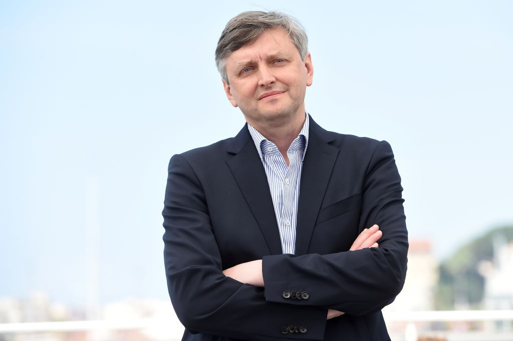

# Сергей Лозница: «Война — всегда отвратительный способ нерешения проблемы». 27 января — День памяти жертв Холокоста. Режиссер фильма «Бабий Яр. Контекст» — об амнезии памяти и надежде на целительность правды

- **URL:** https://novayagazeta.ru/articles/2022/01/26/sergei-loznitsa-voina-vsegda-otvratitelnyi-sposob-neresheniia-nikakoi-problemy
- **Дата:** 2022-01-26
- **Автор:** Лариса Малюкова

## Сергей Лозница: «Война — всегда отвратительный способ нерешения проблемы»

## 27 января — День памяти жертв Холокоста. Режиссер фильма «Бабий Яр. Контекст» — об амнезии памяти и надежде на целительность правды

Сергей Лозница — один из крупнейших современных режиссеров. Обладатель призов престижных кинофестивалей мира за документальные и игровые ленты. Он осмеливается своих фильмах непредвзято рассматривать самые болезненные страницы истории, не приспосабливаясь к текущему моменту. Неудивительно, что его «День Победы», «Процесс» вызывали нападки российских ура-патриотов, а документальный «Бабий Яр. Контекст», получивший на Каннском кинофестивале спецприз жюри «Золотой глаз» (L’Oeil d’or), пробудил недовольство украинских отрицателей правды. Однако Лозница никого не изобличает, не укоряет. Приближая историю на расстояние вытянутой руки, он размышляет. О причинах неизбывной трагедии, об исторической памяти и об амнезии — тяжком и опасном недуге человечества.

Сергей Лозница. Фото: Stephane Cardinale - Corbis / Corbis via Getty Images

— Больше восьми лет вы готовили картину. В ней известная хроника и неизвестные материалы. Страшный погром во Львове, кадры взрыва на Крещатике энкавэдэшниками перед уходом Советской армии… Какие открытия вы сделали для себя во время этой работы?

— На самом деле ничего нового про человечество для себя я не открыл. Удивляют поступки, которые совершаются против течения. Против собственного интереса и желания сохранить свою жизнь. Вот что поражает. Все остальное объяснимо. Это применимо и к нашей с вами сегодняшней повседневной жизни. За такие понятия, как «достоинство», «честь», необходимо сражаться, быть готовым умереть, как Гамлет, оказавшийся перед лицом неизбежности. Парадокс в том, что именно из таких ситуаций и прорастает человеческое.

В 1941-м люди не понимали, что с ними происходит. Те, кто встречал немцев радостно, как освободителей, не понимали, что немцы не пришли освобождать, и это не 1918-й, когда немецкие войска зашли в Украину за хлебом — не за человеческими жизнями. В 1941 году солдаты, сдававшиеся целыми подразделениями в плен, не понимали, какова будет их судьба. Надеялись, что война для них закончена, что Советский Союз закончен, — придут немцы, восстановят какую-нибудь другую хуже-лучше жизнь. Об этой колоссальной ошибке свидетельствуют многие воспоминания. Трудно представить себе крестьянина (среди призванных на фронт огромное большинство составляли крестьяне), думавшего иначе в то время. Из 5 миллионов советских солдат, сдавшихся или попавших в плен, выжило, по-моему, 700–800 тысяч, остальные погибли.

Я читал свидетельства о том, как ждали — в том числе и евреи — немцев. Ведь в 1918-м не было погромов, немцы пытались установить какой-то порядок. И люди могли надеяться, что такую власть они переживут.

Еще одно поражает в отсмотренных мною архивных материалах — готовность населения принимать власть, которая оккупирует территорию и силой навязывает себя. А как вы можете сопротивляться?

Мирное население — заложник любой власти. Какие шансы были у людей в оккупации? Свести счеты с жизнью или уйти в партизаны, что, в общем-то, тоже движение к краю жизни. Или как-то сотрудничать с властью, приспосабливаясь к предложенным условиям.

— Мы не знаем, с какими новостями проснемся завтра, с миром или войной, отчасти потому, что не хотим помнить, что было вчера. Это связанные вещи. Ваша картина посвящена забвению; мне кажется, у забвения много лиц. Государство скажет, что убивали не только евреев, и в какой-то момент уточнит, что кровь жертв на руках сионистов, будет бороться с «безродными космополитами», превратит в свалку Бабий Яр, зальет его пульпой. Но и обыватель категорически не хочет знать, что было на самом деле. Виктор Некрасов задавался вопросом: кто же разрушал эти еврейские кладбища неподалеку от места катастрофы?

— Безусловно, связанные. Если люди, жившие по соседству, поживились тем, что можно было взять из квартиры, хозяев которой увели на расстрел, — они же постараются стереть из памяти то, что было сделано.

В Киеве был один из последних в Европе еврейских погромов. Недавно вышел двухтомник Павла Поляна: антология стихов о Бабьем Яре и история антисемитизма на советской и досоветской территории. В частности, там подробно описан погром в Киеве в 1945-м. Началось все, как обычно, из-за квартирного вопроса. Вернулся с фронта офицер-еврей в свою квартиру, которую уже заняли украинцы или русские, это неважно. Из спички ссоры разгорелся страшный погром. Естественно, об это не хотят помнить.

Если мы говорим про Украину, то эта тема связана еще с другими болезненными обстоятельствами. У организации украинских националистов не было никакой особой концепции по отношению к евреям, она была такая же, как и у национал-социалистов, поэтому они и не выступили в защиту евреев. Мало того, многие члены ОУН (организация признана экстремистской и запрещена) служили в полиции. Теперь их потомкам приходится делать сложный выбор. О трагическом опыте того времени написано много. К примеру, я бы рекомендовал фундаментальную монографию канадского историка украинского происхождения Джона-Пола Химки «Украинские националисты и Холокост. Участие ОУН и УПА (организации признаны экстремистскими и запрещены) в уничтожении украинского еврейства, 1941–1944». Надеюсь, это исследование напечатают в Украине. Можно вспомнить книгу Тимоти Снайдера «Реконструкция наций». Я знаю людей, которые пытаются непредвзято изучать историю этого периода, но это очень сложно и в Литве, и в Латвии, и в Эстонии, и Белоруссии, и в Украине, и в России. Нужна смелость, чтобы говорить правду и потом с этой правдой жить. Это тяжелый крест.

Читайте также

Полпроцента Холокоста

За два дня — 29 и 30 сентября 1941 г. — в Бабьем Яру было расстреляно 34 тысячи евреев

— Поэтому тема Холокоста не вызывает сегодня большого интереса — во всяком случае, у широкой публики?

— Не могу согласиться, в Европе венгерский фильм «Сын Саула» очень хорошо прошел. Или фильм «Список Шиндлера»…

— Ну, фильму Спилберга почти тридцать лет, а «Сын Саула» Немеша — да, библейский репортаж из Преисподней.

— Нужно просто сделать серьезную картину, тогда она вызовет интерес. К этой теме сложно прикасаться, поскольку существует определенное внутреннее сопротивление, нежелание погружаться в трагедию. Необходимо иметь мускул, смелость, чтобы браться за фундаментальные вопросы цивилизации. Об этом, например, роман «Благоволительницы» Джонатана Литтелла.

Кадр из фильма «Бабий Яр. Контекст»

— К теме «Благоволительниц»… В Бабьем Яру палачами были не только члены зондеркоманды айнзацгруппы 4а, но и два батальона полицаев. Вопрос не риторический: во что может превратиться человек, откуда это варварство в Сребренице, в сегодняшней Беларуси?

— Это хорошая тема для исследования. Да, известно, что помимо членов зондеркоманд и немецкой полиции в организации расстрелов принимали участие и служащие украинской вспомогательной полиции.

К сожалению, поведение людей основано на базовых реакциях и животных инстинктах. Они мгновенно просыпаются в ситуации, когда необходимо либо сражаться, либо бежать —

два фундаментальных рефлекса, которыми обладает животное. И человек, как оказалось, в общем, недалеко ушел от животного мира.

А пленка культуры, которая нас удерживает от этой дикости, чрезвычайно тонкая, она рвется мгновенно.

И все же нет другого спасения — культура и образование, больше ничего.

— Мне тоже кажется, что преступление против человечности начинается с малого: со лжи, с подмены факта мифом или киномифом, который сегодня особенно востребован. Политики хитроумно используют историю для своей текущей идеологии. Так было всегда.

— Конечно. Человеческую глупость использовали всегда те, кто находился у власти.

— Особенно это очевидно, когда уходят живые свидетели. В этом смысле особенно ценно появление картины, которая сама свидетельствует.

— К сожалению, пока были живы свидетели трагедии в Бабьем Яру, эта тема была под запретом. С 1941 по 1991 годы про Бабий Яр не принято было говорить.

Меня вот что изумляет. Овраг этот начали затапливать всякой дрянью, начиная примерно с 1952-го, и затапливали до 1961-го. Каждый день жители района Куренёвка проходили, проезжали на автобусах мимо места, про которое они знали, что там уничтожено до 150 тысяч человек. Люди прекрасно знали, что большинство из погибших — евреи, что там в страшно разоренном состоянии находится еврейское кладбище. Тем не менее спокойно ходили, жили по соседству. Как точно сформулировал Василий Гроссман в эссе «Украина без евреев», были злодейски убиты и культура, и народ — и некому плакать. Думаю, это и было целью — сделать так, чтобы некому было вспоминать, плакать, память уничтожали с корнем.

Сейчас я заканчиваю фильм «Киевский процесс», основанный на материалах суда над немецкими нацистами. Процесс, проходивший в январе 1946-го, полностью снимали. Для этого показательного процесса выбрали 15 нацистов — от солдата до генерала — и после приговора 12 человек повесили…

— Эпизод этой публичной казни в Киеве, в окружении 200 тысяч зрителей, — один из самых макабрических в фильме.

— Да, невероятное количество людей. Так вот, на этом процессе рассматривались не только случаи расстрела евреев в Ровно, Кременчуге, Львове и Киеве, но и случаи уничтожения украинских деревень, где жили не евреи. Украина на тот момент — многонациональная страна, там и поляки, и евреи, и немцы, и русские, и татары, и караины, и греки, и даже итальянцы.

На суде один из высокопоставленных немецких офицеров объяснил: «У нас была программа уничтожить полностью население и очистить это пространство для жизни». Так получилось, что евреи были первыми,

Поддержите нашу работу!

1000 500 300 Нажимая кнопку «Стать соучастником», я принимаю условия и подтверждаю свое гражданство РФ

Если у вас есть вопросы, пишите [email protected] или звоните:+7 (929) 612-03-68

дальше — украинцы или поляки. Следовало использовать украинцев против поляков или поляков против украинцев, кого проще, потом заняться русскими. Такова стратегия. Не хватило времени ее полностью воплотить.

С этой точки зрения, странно звучит слово «коллаборация». Известно, чем она обернулась для части группы украинских националистов, отказавшихся сотрудничать с немцами. После того как им отказали в создании независимой Украины под протекторатом Германии, они ушли в лес. Какая-то часть осталась и продолжала работать. Но, видите, легко порицать, судить, махать шашками спустя время. Никто не знает, обладали бы столь проницательным умом и храбростью нынешние прокуроры. Может быть, эти истории нас научат хотя бы задавать себе вопросы.

Кадр из фильма «Бабий Яр. Контекст»

— На Киевском процессе прозвучали невероятной силы монологи: пожилого профессора о трагедии еврейской старухи, потерявшей близких, монолог актрисы Дины Проничевой. Вы собираетесь как-то использовать эти истории в своей игровой картине «Бабий Яр», над которой работаете? Ведь история Проничевой, дважды попадавшей в Бабий Яр и дважды чудом спасавшейся, — настоящий триллер.

— Истории Дины Проничевой у меня в картине не будет. Ее рассказ подробно описан в книге Анатолия Кузнецова.

В игровом фильме другая задача; я хочу, как и в документальном фильме «Бабий Яр. Контекст», представить мозаику событий. Но в игровом фильме я нахожусь в самой середине событий, в местах принятия решений. Мне важно показать, по какой причине именно эти решения были приняты. Что происходило именно там, в Бабьем Яру. Этого, естественно, никто не может подробно рассказать, но сохранились крохи воспоминаний, мы постараемся их восстановить. Я не собираюсь шокировать зрителя, стараюсь избежать сильнодействующих кадров и эпизодов, тем не менее хочу дать возможность почувствовать, как это было, кожей. Игровая картина будет дополнять документальную.

На самом деле документальный фильм был сделан по предложению Ильи Хржановского. Он был приглашен в мемориал «Бабий Яр» в Киеве в качестве художественного руководителя. Илья знал, что я давно занимаюсь этой темой, и предложил сделать что-то. Я готовился к картине, планировал использовать найденные документальные кадры в игровом фильме таким образом, чтобы было непонятно, где документальное, а где игровое кино. Добиться такого вот состояния, когда вы верите не только в то, что происходит на первом плане с актерами, но и на втором… и дальше.

Мы уже что-то монтировали, когда я принял предложение Ильи и начал разыскивать материалы. Нашел сокровища: вещи, о существовании которых даже не догадывались.

Читайте также

«Внутри России удобно, даже уютно. Но работать нельзя вообще»

Разговор писателя Дмитрия Быкова и режиссера и художественного руководителя мемориала «Бабий Яр» Ильи Хржановского — о сценариях будущего страны

— Обладая редчайшей хроникой и фотоматериалами из многих архивов мира, было трудно от чего-то отказываться?

— Конечно. Это художественное произведение — значит, существует определенная договоренность. В игровом фильме вы можете делать что угодно. В документальном — степень приближения колоссальна и степень доверия тоже. Если зайдете слишком далеко в откровенности показа, перейдя порог нашей способности воспринимать, можете выбить зрителя из седла, оттолкнуть его, загрузив кошмаром. Мне хотелось бы это хрупкое доверие зрителя сохранить.

Кадр из фильма «Бабий Яр. Контекст»

— Томас Манн писал, что Гитлер не случайность… не промах истории, а явление чисто немецкое. Прежде всего — как осуществление амбиций своего времени, «громогласных домогательств уличной толпы». Это исследование перерождения доброй Германии в «злую», соблазненную идеей «владеть всей властью мира», чрезвычайно современно. Вы стремились к актуальности своей картины?

— Картина актуальна, пока существует подобное представление о жизни и обществе. Например, я задаю простой вопрос: должен ли солдат исполнять преступный приказ? С другой стороны, фундаментальное основание армии — беспрекословное подчинение солдата или офицера своему начальству, иначе армии не существует. Дадите солдату право рассуждать и принимать решения — не сможете воевать. В этом корневое противоречие. Почему? Приказы отдают люди, которые сами физически не убивают. Гитлер, думаю, не убил ни одного человека. Но они берут, как мы считаем, ответственность за убийства на себя. И в результате их казнят.

Как там Гитлер говорил: «Я освобождаю вас от морали». Значит, он освобождает от морали подневольных солдат, выполняющих приказ. Непосредственно они убивают, являются преступниками, и никакая фигура речи не изменит непоправимой ситуации: один человек стоит напротив другого, стреляет в него и убивает. Это его преступление, не Гитлера. Принятая во всем мире условность вроде бы извиняет непосредственного исполнителя, перекладывая ответственность на другого. Это перераспределение ответственности и позволяет возникать подобному варварству. Что с этим делать — ни спустя 80 лет после Холокоста, ни дальше, — человечество не придумало. Пока не будет решен этот важнейший вопрос о перераспределении ответственности, ничего не изменится.

И не дай бог скатиться сейчас в какое-нибудь вооруженное, с кровью противостояние — нам уже не остановить его. Это движение к точке «ноль». Война — всегда отвратительный способ нерешения никакой проблемы. И что останется в точке «ноль» от этих людей, от человечества, которое пока существует, ездит на продвинутых автомобилях и летает на самолетах…

— Когда смотрела на лица зрителей, собравшихся на публичную казнь, которую вы показывали в фильме, думала о том, что «венец творения» не меняется со времен зверских церемониальных казней в Древнем Риме.

— Ну, Древний Рим — еще цивилизация, были еще интереснее времена. Как Чингисхан с уйгурами поступал: выстраивал мужчин, ставил мерку, и всем, кто выше, — срубал голову. Мы живем в более-менее приличное время, хотя бы по сравнению с дикостью, в которой пребывало человечество раньше.

— Не знаю, что может быть кошмарней Холокоста.

— Что тут сравнивать… Но в эпоху каннибализма нормально съесть соседа, потому что есть хочется, потому что соперничество за прекрасную половину человечества. В наше время подобного все-таки нет — значит, прогресс существует.

— Мне кажется, что Холокост и есть каннибализм «цивилизованного» Третьего рейха. Как вам кажется, а почему так беспощадны и скандальны дискуссии в связи с увековечиванием трагедии Бабьего Яра?

— Могу лишь сказать, что интерес к этой теме большой. Наш фильм был дважды показан в Украине по телевидению. Фильм посмотрели пять миллионов человек. Отклики очень хорошие, люди благодарили за картину.

Насколько позиция группы, называющей себя украинской интеллектуальной элитой, отражает общее мнение, не знаю.

Но если вы походите в районе Бабьего Яра и поговорите с людьми… Могу ошибаться, но есть ощущение, что многим вообще безразлично, что здесь происходило 80 лет назад.

К тому же выгодно сегодня эксплуатировать тему участия российского режиссера, российских меценатов в этом мемориале Холокосту в Украине.

— Если бы я вас не знала раньше, то подумала бы, что вы поседели на этом фильме. Провести тысячи часов с подобным материалом… Что вас поддерживало?

— Я не сказал бы, что это ад. Это все равно что спросить хирурга, как он может рассекать жизненно важные органы. Необходимо иметь определенную защиту — я этим занимаюсь уже давно. У меня своеобразная проекция — я хронику воспринимаю с другой точки зрения. Естественно, участвую эмоционально, но только в момент, когда уже заканчиваю картину, подключаю эмоции, проверяю, правильно ли выстроен фильм.

Читайте также

Достать из-под земли!

Как работали зондеркоманды, уничтожавшие трупы в Бабьем Яре

— На что надеяться, когда вы находитесь в этой темноте?

— Во-первых, на способности познания. На то, что у людей сохраняется эмпатия и они не могут равнодушно проходить мимо того, что произошло. Это мой главный побудительный мотив. Я испытываю горечь, глубокое чувство боли, когда думаю о происшедшем в моем родном городе. Поэтому обязан об этом говорить. Мне кажется, что забвение, попытки сместить все это на периферию сознания чреваты колоссальными катастрофами в будущем. То есть для меня это в какой-то степени целительный опыт. Думаю, что надеяться нужно на правду. На то, чтобы сказать правду, пережить и прожить ее, нести ее в себе и пытаться как-то с этим совладать. Иначе невозможно никакое развитие. Невозможно строительство никакого общества, если вы будете топтаться на лжи, как продолжает топтаться на лжи бо́льшая часть постсоветского пространства.

Читайте также

Вериги истории

Что происходило в Бабьем Яру спустя 80 лет после трагедии

Поддержите нашу работу!

1000 500 300 Нажимая кнопку «Стать соучастником», я принимаю условия и подтверждаю свое гражданство РФ

Если у вас есть вопросы, пишите [email protected] или звоните:+7 (929) 612-03-68
