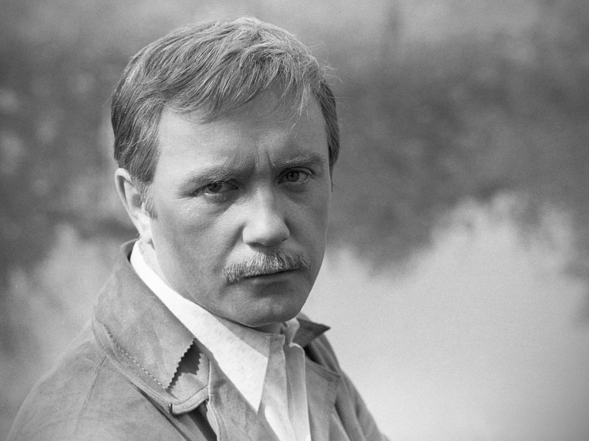

# Самый сложный простак отечественного кино. Памяти Леонида Куравлева

- **URL:** https://novayagazeta.ru/articles/2022/01/30/samyi-slozhnyi-prostak-otechestvennogo-kino
- **Дата:** 2022-01-30
- **Автор:** Лариса Малюкова

## Самый сложный простак отечественного кино

## Памяти Леонида Куравлева

Он входил в кадр и мгновенно приковывал к экранам миллионы зрителей, став близким, понятным. Своим. Был в нем сильнейший магнит человеческого обаяния, открытого, веселого. При этом Леонид Вячеславович не был простаком. Георгий Данелия говорил: «Есть в нем какая-то загадка, другого бы так не любили».

Леонид Куравлев. Фото: Николай Малышев /Фотохроника ТАСС

Над его героями чаще смеялись, но как же их любили и жалели. Даже по советским канонам «отрицательного» Афоню. Этот пьющий раздолбай, негодный человек вызывал гигантское сочувствие (более 60 миллионов зрителей посмотрели картину), а в наглом взгляде из-под кепки пряталось одиночество. Поэтому зритель страшно надеялся, что его преданная мечта Катюша вернется. И Данелия оставлял эту надежду вместе с открытым финалом. После выхода картины «Мосфильм» завалили письмами: «Как там Афоня? Что с ним?» И ведь на эту роль пробовались замечательные актеры: Даниэль Ольбрыхский и Владимир Высоцкий, но Данелия выбрал Куравлева, потому что его герою простить многое.

«Афоня, рубль гони!», — помним. Потому что Куравлев — это еще и время. Время газировки в автоматах, крепдешиновых маминых платьев, простодушных шукшинских чудиков. Таких как Пашка Кокольников, чуйский шофер, дурашливый балагур, способный на подвиг. С этим героем сам Шукшин пришел в кино, втянув нас в поток доли, жизни соотечественника, за которого радостно и больно. И именно Куравлева Шукшин видел в роли Егора Прокудина из «Калины красной», и именно Куравлев убедил Василия Макаровича самому прожить эту главную в своей жизни роль. И его дураки и пьяницы, нет, не были простаками. Вот Шуру Балаганова, застрявшего в детстве хулигана, называют «дураком до гениальности». И этой золотой ролью в «Золотом теленке» актер зажегся «от спички», поднесенной режиссером Швейцером: «Твой Шура — дворняга, ищущая хозяина!» Вот! Прием был найден. Осталось только накрутить выбеленные волосы и стать Балагановым.

В Куравлеве смех был перламутровым, он переливался с грустью.

Пашка-пирамидон, Балаганов, Жорж Милославский, Афанасий Борщов, уголовник Бисягин… Но не только. Матрос Камушкин, Хома Брут, Инспектор Анри Гранден, Робинзон Крузо, Лепорелло, Курт Айсман и даже Горбачев. И незабываемый Степан Воеводин из драмы «Ваш сын и брат», перед самой амнистией совершивший наиглупейший побег, чтобы увидеть своих, потому что сердце жгло тоской. А еще совестливый, наивный Леня Шиндин из лиозновской картины «Мы, нижеподписавшиеся», который бьется с советской бюрократией за правду.

Но мало кто знает, что дебютировал Леонид Вячеславович ролью сапера Морозова в курсовой работе вгиковских студентов Андрея Тарковского и Александра Гордона «Сегодня увольнения не будет». Кстати, терпеть не мог говорить о себе, всегда о любимых режиссерах – Василии Шукшине, Михаиле Швейцере, Глебе Панфилове, Георгии Данелии, Леониде Гайдае: «Они питали меня своим талантом, вкладывали в меня свой гений».

Только представьте себе, более 200 ролей. 200 характеров, красок, судеб. Он заставлял нас забыть о существовании камеры, режиссера, о своей профессии. Он превращался в других. Которых мы вроде бы знали не понаслышке, но которые всегда были интересны. Может, благодаря, особому знанию жизни, людей. В страшном 1941-ом, маму пятилетнего Лени по доносу арестовали и отправили в ссылку. 58-я. Десять лет они провели на озере Имандра, на Кольском полуострове. Вернулись, когда Лене было 15.

Более всего он ценил в людях человечность, способность к сочувствию. Критики о нем говорили: «Самый сложный простак отечественного кино». Виртуозно играя простаков, сам Куравлев был другим, начитанным, глубоким. Актеры рассказывали, что в перерывах между съемками уходил в угол читать Гоголя или Ницше. Был очень скромным, совестливым. Почти как Паша Колокольников: «Вот вы напишете про подвиг, а мне стыдно будет». Последние годы, после смерти жены очень тосковал. Искал способы найти радость. Пытался следовать своему же, когда-то сформулированному девизу: «Счастье, пожалуй, в том, чтобы уметь, будь оно все неладно, — чувствовать себя счастливым!» Получалось не всегда. А нас его роли, все эти чудные и чудные, абсолютно живые герои совершенно точно — поддерживают, делают счастливыми.

Поддержите нашу работу!

1000 500 300 Нажимая кнопку «Стать соучастником», я принимаю условия и подтверждаю свое гражданство РФ

Если у вас есть вопросы, пишите [email protected] или звоните:+7 (929) 612-03-68
