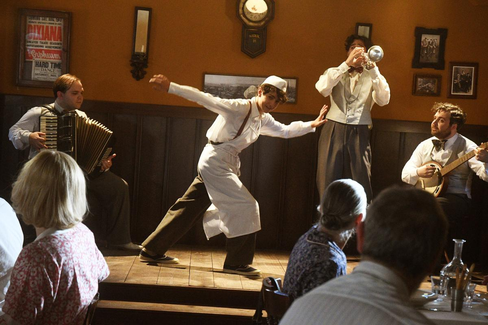

# По обе стороны лезвия. 10 февраля на пике новой волны пандемии открывается 72-й Берлинский международный кинофестиваль

- **URL:** https://novayagazeta.ru/articles/2022/02/08/po-obe-storony-lezviia
- **Дата:** 2022-02-08
- **Автор:** Лариса Малюкова

## По обе стороны лезвия

## 10 февраля на пике новой волны пандемии открывается 72-й Берлинский международный кинофестиваль

В прошлом году устроители приняли решение о переносе показов в онлайн. На пике очередного витка пандемии нынешний фестиваль открывает кинозалы в беспрецедентно строгих санитарных условиях (требования 2G+ предусматривают допуск на фестиваль привитых и переболевших коронавирусом при наличии у них негативного результата экспресс-теста).

Кадр из фильма «Леонора Аддио»

В основном конкурсе 18 проектов из 15 стран. Семь картин созданы женщинами. Среди авторов — дебютанты и маститые художники с мировым именем: Ульрих Зайдль, Клер Дени, Урсула Майер, Паоло Тавиани, Франсуа Озон и Хон Сан Су.

Три года назад художественным руководителем смотра стал итальянец Карло Шатриан. «Действие более половины отобранных картин разворачивается в наши дни, но только два из них отражают жизнь в нынешней ситуации с пандемией. Прежде всего, человеческие и эмоциональные связи проходят красной нитью через все фильмы», — рассказал он журналистам.

## Конкурс

### Среди ожидаемого

«Фильм романиста» южнокорейского кинопоэта грез Хон Сан Су (поэтический склад его дарования не мешает завидной продуктивности — в прошлом году он выпустил два фильма, один из них был в основном конкурсе Берлинале. В своей 27-й полнометражной картине он размышляет о творческом кризисе и прихотливом течении времени. Мир истерит, страшась изменчивого вируса, режиссура Хон Сан Су неизменно фиксирует непрерывность жизни, ее прерывистое дыхание.

Герой «Римини» Ульриха Зайдля в прежние годы — знаменитая поп-звезда. Сейчас он пытается гнаться за былой славой, звездным статусом, которого уж и в помине нет. Остались выступления для туристов в курортном городке и каникулярные романы. Тем временем его отец, страдающий деменцией, находится в австрийском доме престарелых, вспоминая свое нацистское прошлое.

Кадр из фильма «Римини»

«По обе стороны лезвия» Клер Дени с Жюльет Бинош и Венсаном Линдоном — история запутанных самой жизнью любовных связей. И герои фильма не спешат эти клубки распутывать.

О семейных разладах и притяжениях, о неистребимых конфликтах родителей и детей — «Линия» франко-швейцарской постановщицы Урсулы Майер (ее «Сестра» в 2012-м была удостоена «Серебряного медведя»).

Поддержите нашу работу!

1000 500 300 Нажимая кнопку «Стать соучастником», я принимаю условия и подтверждаю свое гражданство РФ

Если у вас есть вопросы, пишите [email protected] или звоните:+7 (929) 612-03-68

Паоло Тавиани через три года после смерти своего брата Витторио, с которым они снимали кино, возвращается к творчеству Луиджи Пиранделло. Героем фильма «Леонора Аддио» станет сам Пиранделло, точнее его прах, спешно захороненный в Риме во времена фашизма, а теперь его перевозят к месту постоянного упокоения на Сицилии. И в завершение фильма мы вспомним последний рассказ Пиранделло «Гвоздь», написанный за двадцать дней до смерти. В этом рассказе юный Бастианеду, вырванный из рук матери на Сицилии и вынужденный следовать за отцом через океан, не может залечить детских травм.

Филлис Наги когда-то написала сценарий к нашумевшей женской драме «Кэрол» Тодда Хейнса с Руни Мара и Кейт Бланшетт с шестью номинациями на «Оскар». Героиня ее новой картины «Позвони Джейн» — домохозяйка из 1960-х, которая борется за права женщин. Это единственная лента в основном конкурсе, премьера которой состоялась на «Сандэнсе», а не в Берлине.

Кадр из фильма «Позвони Джейн»

Фильм открытия — «Петер фон Кант» Франсуа Озона, возвращающегося в берлинский конкурс в шестой раз. Самым незабываемым стал показ его «8 женщин» 20 лет назад, когда «Серебряного медведя» за особое художественное достижение получил выдающийся ансамбль актрис. Кстати, «8 женщин» снова будет показан в этом году в ретроспективе, посвященной Изабель Юппер.

Новая картина — адаптация и вольная интерпретация пьесы «Горькие слезы Петры фон Кант» и одноименного фильма 1972 года легендарного немецкого режиссера, сценариста, драматурга и актера Райнера Вернера Фассбиндера. Но Озон гендерно переосмысливает экспрессионистское каммершпиле. Преуспевающая модельерша Петра фон Кант превратилась в мужчину — кинорежиссера Петера фон Канта, роль которого исполнил французский актер Дени Меноше, ранее снявшийся в фильмах Озона «Хвалите Бога» (2018) и «В ее доме» (2012), зритель помнит его и по «Бесславным ублюдкам» Тарантино. Это психодрама о безответной любви и предательстве.

Российских фильмов в конкурсе нет. Но есть достойные работы в самых разных программах.

В новаторской секции Encounters, существующей с 2020 года и призванной поддержать новые голоса, формирующей силовое поле авторского кинематографа, — тонким пером писанная картина Александра Золотухина «Брат во всем». О мечте братьев-близнецов, которые изучают сложную и опасную профессию военных летчиков. Которые неразрывны, примерно как Инь и Ян. Об их стремлении покорить небо и высокой цене этой мечты. Александр Золотухин — ученик Александра Сокурова. Пожалуй, самый последовательный его ученик.

Кадр из фильма «Продукты 24»

В «Панораме» дебютный фильм Михаила Бородина «Продукты 24». Он основан на реальных событиях, отчасти на истории «гольяновских рабов» — из продуктового магазина в столичном районе Гольяново.

Героиня картины Мухаббат (Зухара Сансызбай) живет и работает в продуктовом магазине в спальном районе. В подвале бетонной многоэтажки вместе с другими мигрантами. Подавленная и униженная властной хозяйкой, как и другие. Без денег и документов. Пытается вырваться на свободу… Михаил Бородин приехал в Москву из Узбекистана и не понаслышке знает о драме «чужих» в нашем «гостеприимном» городе.

В программу Generation 14plus, посвященной фильмам о подростках, включена картина «Страна Саша» — режиссерский дебют Юлии Трофимовой. А сценарий написали девушки, сочинившие резонансный сериал «Почка». Лирическая живая, атмосферная, забавная юношеская история взросления, с которой непосредственно связана тема одиночества подростка. С человеческими лицами. С человеческими отношениями. И еще эта картина о том, как взрослеют не только дети, но и их инфантильные родители.

Поддержите нашу работу!

1000 500 300 Нажимая кнопку «Стать соучастником», я принимаю условия и подтверждаю свое гражданство РФ

Если у вас есть вопросы, пишите [email protected] или звоните:+7 (929) 612-03-68
