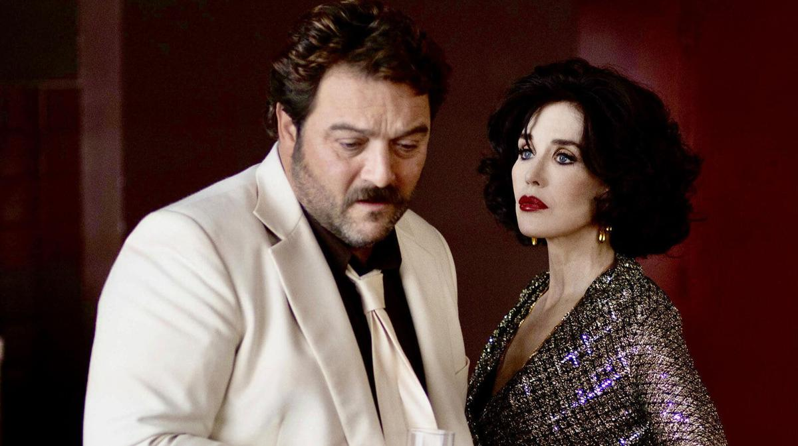

# Озон, Зайдль и Фассбиндер были здесь. Что происходит на Берлинале

- **URL:** https://novayagazeta.ru/articles/2022/02/12/ozon-zaidl-i-fassbinder-byli-zdes
- **Дата:** 2022-02-12
- **Автор:** Лариса Малюкова

## Озон, Зайдль и Фассбиндер были здесь

## Что происходит на Берлинале

Кадр из фильма Франсуа Озона «Петер фон Кант» из программы БерлиналеНынешний пандемийный фестиваль осунулся и похудел. Звезд практически не видно, меньше зрителей (в кинотеатрах рассадка — 50%), почти вдвое сократилось число аккредитованных журналистов (1600). Дождь над красной дорожкой горюет о былых сверкающих нарядами временах и вечеринках, которые отменены.

Зато контрвирусные меры напоминают военную операцию. Все участники Берлинале: пресса, волонтеры — в одинаковых масках 2G, напоминающих растянутый клюв птицы. И когда смотришь на зрительный зал: строгая шахматная рассадка, вместо лиц — сплошные маски, кажется, что попал в антиутопию или картину Магритта. На каждом шагу санитарные киоски или автобусы, в которых журналисты ежедневно делают экспресс-тесты.

## «Петер фон Кант»

Фильм открытия Берлинале «Петер фон Кант» — взвешенное решение, нацеленное сразу на несколько задач.

Во-первых, любимец фестиваля Франсуа Озон почтительно и вместе с тем вольно переосмыслил классическую темную драму хрониста немецкой души Райнера Фассбиндера «Горькие слезы Петры фон Кант». Он решился на гендерную инверсию, превратив главную героиню, модную модельершу Петру, в известного режиссера Петера, а ее безмолвную служанку — в робкого субтильного юношу Карла.

Таким образом, фестиваль объединяет киноисторию, которая пишется сегодня, но чернилами «великанов», на плечах которых арт-кино еще как-то держится.

Во-вторых, Озон — приверженец арт-мейнстрима, и его кино в той или иной степени близко и широкой аудитории, и профессионалам, что и продемонстрировала овация после мировой премьеры.

В-третьих, фильм соединяет две фундаментальных европейских культуры: немецкую (оригинала) и французскую (сиквела). И говорят в нем на двух языках.

В-четвертых, клаустрофобический сюжет, развивающийся, по сути, в одних декорациях, отвечает настроению карантинной эпохи, неслучайно картину называют театрализованным тур-де-форсом на темы самоизоляции.

И наконец, в обеих картинах — и Фассбиндера, и Озона — есть Ханна Шигула как связующее звено. А ее участие в кино — всегда событие.

Барочный эстетский шедевр Фассбиндера был создан на основе его же пьесы. В нем фешен-дизайнер Петра фон Кант (любимица Фассбиндера Маргит Карстенсен), ломкая, скандальная, андрогинная представительница умирающего богемного класса, не так давно развелась со вторым мужем. Единственный безоговорочно преданный ей человек — молчаливая секретарша Марлен. Петра привыкла управлять и манипулировать людьми, но вот незадача — влюбляется в белокурую плебейку, бестию Карен. И песочные часы ее жизни переворачиваются. В герметичном пространстве наркотической гаммы цветов рисовались огненные вихри страсти и унижения, нежности и манипулятивности. Используя брехтовскую концепцию «эпического театра» с его эффектом отчуждения, Фассбиндер, конечно же, в большой степени рассказывал о себе, о собственных травмах и страданиях, о вписанности в унизительные ролевые игры.

Франсуа Озон решил возвратить сюжету его первоначальный замысел. По его же признанию, в «Петере фон Канте» он объединил черты Фассбиндера с собственными.

И все же Дени Меноше играет самого Фассбиндера. Петер — знаменитый режиссер, инженер человеческих душ, у которого готовы сниматься звезды, в том числе бесподобная Роми Шнайдер. Студия «Бавария» предлагает договор на новую картину. Оплывший, порочный, избалованный сибарит, зависший в своей арт-студии между Каннским и Венецианским фестивалями, принимает свою давнюю подругу (Изабель Аджани) и ее юного спутника Амира, пришельца с Востока. Безмолвная секретарша Марлен превратилась в субтильного безропотного помощника Карла, мгновенно выполняющего любую прихоть капризного хозяина. Белокурая плебейка Карен трансформировалась в арабского юношу с живописными угольными завитками, пухлыми губами и идеальным телом.

Дальше начинается гомоэротическое пиршество с сильным социальным подтекстом. Игра в «слуг и господ», которые на безжалостном поле «личного фронта» меняются ролями, приносит лишь разочарование, самолюбие всех уязвлено.

Любовная связь, по Озону, — наилучший из способов порабощения.

Поддержите нашу работу!

1000 500 300 Нажимая кнопку «Стать соучастником», я принимаю условия и подтверждаю свое гражданство РФ

Если у вас есть вопросы, пишите [email protected] или звоните:+7 (929) 612-03-68

Любовь, подобно взрыву, вносит в расчерченную жизнь хаос. На стенах квартиры Петера, помимо «Вакха и Мидаса» — «Святой Себастьян», пронзенный стрелами. У женщин здесь роли второстепенные, но значимые. Изабель Аджани предстает одурманенной кокаином стареющей дивой, некогда музой режиссера. Ханна Шигула — муза самого Фассбиндера, в его фильме сыгравшая простолюдинку Карен, вскружившую голову Петре и манипулирующую своей недавней хозяйкой.

Но развивая на свой лад историю про доминирование, мазохистские связи, угасшие отношения, Озон оставляет героям надежду. Петер крушит свои многочисленные зеркальные отражения, но возможно, он еще восстанет из разрухи. В картине Озона меньше критики, больше сочувствия к персонажам, хотя и умолчаний тоже меньше. Психодрама, классовая или гендерная, сдвигается в сторону сатирической мелодрамы с участием очередных «растиньяков». Иронией автор ошпаривает практически всех героев.

На рубеже веков начинающий режиссер Озон экранизировал юношескую пьесу Фассбиндера «Капли дождя на раскаленных скалах». Озон еще больше своего кумира Фассбиндера демонстрирует театральность приема с первых же кадров, в которых Карл раздвигает шторы на окнах квартиры Петера, как занавес, за которым начинает разыгрываться каммер-шпиле, где разбиваются сердца. Меньше метафизики, больше конкретных сцен с обнаженными телами. Больше материальности. Аккуратный терпила Карл дождется своего эффектного плевка в лицо неблагодарному хозяину. За окном будет идти снег. Как надежда. Или смерть.

## «Римини»

Об Ульрихе Зайдле говорят, что он и его кино существуют по ту сторону добра и зла. На самом деле безжалостный провокатор и патопсихолог просто открывает нам те стороны жизни людей, на которые смотреть не принято.

Режиссер enfant-terror снимает с глаз шторки, и мы видим непривлекательную старость, секс без лессировок, смерть, которая пристраивается в хвост жизни. И новая картина начинается с дома престарелых, в котором обитает впавший в деменцию отец героя, как видно по привычному «зигу» — в прошлом нацист. А вот и сам герой. Из бывших. Сладкоголосый Ричи Браво когда-то был поп-звездой. И вот теперь на заснеженном курорте, где на пляже мерзнут черные фигуры беженцев из Сомали и Сирии, он пытается реинкарнировать остатки вылетевшей в трубу славы. В злато-серебряном костюме Ричи бархатно поет для престарелых фанаток в полупустых ресторанах. Калиф на час заглядывает в глаза, берет морщинистые руки в свои. Оказывает им секс-услуги. С ним они тоже на мгновение молоды.

Но однажды к всеобщему аmore mio является его взрослая дочь в окружении сирийских беженцев. И Калиф, пренебрегавший дочерью, наивно надеется обрести семью.

Зайдль сплетает самые разные темы: от размышлений о безжалостной человеческой природе и неудовлетворенной тоске по счастью до мыслей о постколониальном синдроме вины Европы, ее же разрушающем.

Читайте также

По обе стороны лезвия

10 февраля на пике новой волны пандемии открывается 72-й Берлинский международный кинофестиваль

Майкл Томас, сыгравший главную роль в «Импорте-экспорте», здесь одновременно отвратительный и сказочно харизматичный. Сентиментальный и жестокий, душевно щедрый и подлый, уродливый и красивый, согревающий и творящий зло. И вот этот игрок, проходимец, алкоголик тем не менее вызывает сочувствие. А все его баталии и дебоши в итоге оказываются безуспешной борьбой с тотальным одиночеством.

Зайдль продолжает снимать игровое кино как документальное. «Мне важно, — утверждает он, — чтобы зритель воспринимал фильм не как нечто отвлеченное и иллюзорное, а как частицу реальности, чтобы он узнавал и себя на экране, идентифицировал себя с героями картины».

Идентифицировать себя с героями не хочется. Люди вообще не любят кино про свою изнанку.

Режиссер снимает кино как продолжение своего манифеста: «Нам продают форму красоты, которая не соответствует тому, кем являются 90% из нас и что не соответствует действительности. Нам говорят, что это истинная красота, это то, к чему мы должны стремиться. Я думаю, что красота может заключаться в чем-то другом, и я ищу эту красоту в других формах».

Исследуя обратную сторону планеты «Человек», складывая трагикомичный пазл человеческого существования из повседневных, временами забавных страниц, режиссер добивается особого эффекта. Его персонажи вкапываются в твою память, в сердце, ворочаются там, провоцируя на размышления, от которых ты бежал. Кира Муратова сравнивала австрийского нонконформиста с когтистым чудовищем: «Раздерет тебя насквозь, да еще расскажет тебе же, разодранному, что у тебя внутри».

Берлин.

Поддержите нашу работу!

1000 500 300 Нажимая кнопку «Стать соучастником», я принимаю условия и подтверждаю свое гражданство РФ

Если у вас есть вопросы, пишите [email protected] или звоните:+7 (929) 612-03-68
