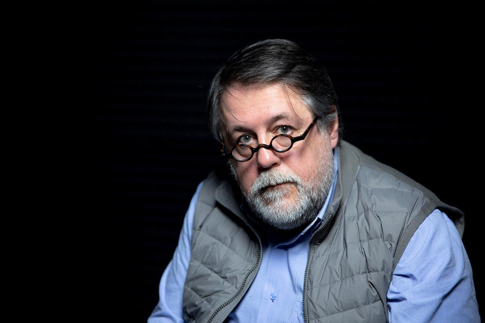

# Братья и сестры, они же — «родные». Посмотрите фильм Виталия Манского о судьбах украинцев. И о нас. Только 24 часа на сайте «Новой»

- **URL:** https://novayagazeta.ru/articles/2022/02/18/bratia-i-sestry-oni-zhe-rodnye
- **Дата:** 2022-02-18
- **Автор:** Лариса Малюкова

## Братья и сестры, они же — «родные»

## Посмотрите фильм Виталия Манского о судьбах украинцев. И о нас. Только 24 часа на сайте «Новой»

Они о нас думают. А мы — о них. И все опасаются, как бы ни началось. Как бы развести руками нагнанные политиками тучи. В дни обещанной войны мы решили показать фильм «Родные» Виталия Манского — ключевого режиссера отечественной документалистики. На экране в России его практически не было, только на «Артдокфесте». Прокатное удостоверение картине долго не давали, сочтя абсолютно пацифистскую работу агиткой. Ну, у нас теперь все, что против войны, можно обозвать злобным антипатриотическим памфлетом.

Посмотрите этот фильм. Он о самых близких. Кровных. Которых не отстроить от нас стеной, приказом главнокомандующего, воплем пропагандистов.

Он — не только «о них», но и о нас.

Фильм был доступен только для просмотра жителям России в течение 24 часов — с 12:00 мск 18 февраля по 12:00 мск 19 февраля. Спасибо нашим зрителям

Для Виталия Манского это личная, исповедальная работа. Трагедия его семьи, разбросанной по всей Украине — от запада до востока, разорванной по-живому. Теперь фрагменты большой семьи пытаются выживать отдельно. Манский родился во Львове — столице Западной Украины. Его родственники живут в Одессе, Севастополе, Киеве, Донецке.

Начнется действие весной знаменательного и очень сложного для Украины 2014-го во Львове. Потечет через Киев, Одессу, Севастополь, Донбасс — в Москву. Для автора его герои — и есть «новая история». Но еще — живая, неотъемлемая часть его самого. Часть его памяти. И памяти его родных, помнящих автора ребенком — Виталиком Манским.

Чтобы окончательно не потерять друг друга, тетки из Крыма и из Киева обещают друг другу не заводить в скайпе разговор о политике, чтоб она пропала. Они пытаются нащупать общие ценности «по ту сторону баррикад». Но все равно сорвутся на крик. Вот же, эта сука-политика, в углу комнаты спряталась в незамолкающем телевизоре.

Телевизор — полноценный герой фильма, обратная сторона героев, которые вдруг начинают говорить, «как телевизор», его тоном, его словами.

Поддержите нашу работу!

1000 500 300 Нажимая кнопку «Стать соучастником», я принимаю условия и подтверждаю свое гражданство РФ

Если у вас есть вопросы, пишите [email protected] или звоните:+7 (929) 612-03-68

Политика постепенно заполняет пространство личной жизни, вымещая его. Семья расползается, распускается, как надорванный свитер, — на отдельные ветхие нитки.

Абсурдность этой разгорающейся вражды сегодня еще очевиднее, чем восемь лет назад, когда все только начиналось и долго тлело. Виталию Манскому удалось зафиксировать момент, когда из этих ветхих нитей стали вязать бикфордовы шнуры.

«Родные» — вдумчивая драма одной семьи, словно взгляд изнутри на то, что с нами происходит. Почему свои превратились в чужих, родные — вчера еще жившие по соседству в единой стране, — оказались в разных государствах и готовы солидаризироваться с массированной пропагандой.

Камеру Александры Ивановой не назовешь бесстрастной. Она всматривается в лица, нарушает границы, дистанцию. Пытается увидеть что-то важное за словами. Авторы сосредоточили свое внимание на лицах, на людях. Манский всего лишь задает вопросы. Он слушает.

Слово режиссеру.

## Виталий Манский: «Верю: cвернуть с тропы войны можно всегда — даже когда она уже идет»

Виталий Манский. Фото: Влад Докшин / «Новая»

— Я начал снимать картину в мае 2014-го, потому что навис дамоклов меч над нашими странами. Меч предчувствия войны. Возник страх войны. Не абстрактный — из тостов 1970-х «лишь бы не было войны», — а конкретный, осязаемый. Я попытался его зафиксировать, запечатлеть на пленку.

Этот фильм снимался не постфактум, а в развитии истории, в которую я входил вместе с ее героями. Входил вместе с ними в процесс материализации этого страха. И в съемках точка была поставлена ровно через год после крымских событий, когда возникло это неведомое нашему поколению чувство приближающейся войны.

Из фильма мы выходим в неопределенность. Она длилась восемь лет.

Сегодня мы понимаем, что занесенный меч может опуститься под своей собственной тяжестью. Уже чувствуем холод булатной стали. Будто касается она нашего темени.

И в этом смысле мы имеем возможность в кино отмотать, как в машине времени, назад, снова увидеть и понять, как все начиналось. Можно ли было куда-то свернуть, сгладить углы, найти другой путь для развития современной истории? Верю: cвернуть с тропы войны можно всегда — даже когда она уже идет. Поэтому анализ и трезвое ощущение времени необходимо для нас всех. Этим фильм отличается от новостных сводок, политических ток-шоу и прочих баталий.

Несмотря на принципиальные разногласия всех героев этой картины, между ними и мной, — они все остаются для меня родными. Может, это и есть ключ к выходу из патовой ситуации?

Читайте также

«Здесь никто не признается: все облажались по полной программе»

Рассказывает украинка, жительница Донецка, в прошлой жизни — биофизик
