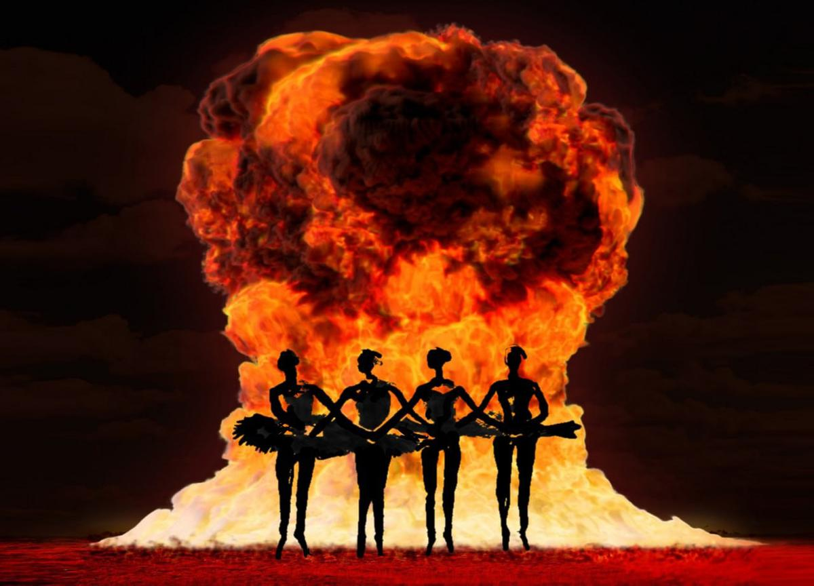

# Пора Уже Танцевать Чайковского. «Лебединое озеро», или 32 фуэте из похорон и переворотов

- **URL:** https://novayagazeta.ru/articles/2022/03/07/pora-uzhe-tantsevat-chaikovskogo
- **Дата:** 2022-03-07
- **Автор:** Лариса Малюкова

## Пора Уже Танцевать Чайковского

## «Лебединое озеро», или 32 фуэте из похорон и переворотов

Иллюстрация: Петр Саруханов / «Новая газета»‎

С 6 марта в кинотеатрах начинаются показы бессмертного балета «Лебединое озеро».

Нет, это не специальная акция, не плач по нашим разрушенным жизням, как объявила афиша долгоиграющего проекта TheatreHD, с его регулярными трансляциями лучших мировых спектаклей в кинотеатрах. Это красноречивое совпадение, хотя у нас случайных совпадений не бывает. Прощаясь со своим зрителем, телеканал «Дождь» (объявлен иноагентом и фактически закрыт властями) в честь траура включил черно-белую, архивную запись балета Чайковского.

К тому же (еще одно совпадение) 4 марта исполнилось 145 лет со дня премьеры бессмертного произведения композитора.

В истории «Лебединого» — почти полуторавековая история страны, роман, в котором нерасторжимы искусство и политика, жизнь и — нежизнь.

## А как хорошо все начиналось

Дирекция императорских театров обратилась к Петру Ильичу с необычным заказом: сочинить балет «Озеро лебедей». Дело в том, что ранее для серьезных композиторов балетная музыка представлялась «легким жанром». Либретто пересказывало на свой лад бродячие немецкие легенды о заколдованных девушках, превращенных в лебедей. В этих сказках любовь торжествовала над смертью. В жизни все прозаичнее. В письме Римскому-Корсакову Петр Ильич признавался, что взялся за работу по двум причинам: «…отчасти ради денег, в которых нуждаюсь, отчасти потому, что мне давно хотелось попробовать себя в этом роде музыки». Обещали, между прочим, 800 рублей. Громадные по тем временам деньги.

И вот мартовским днем премьера в Большом. Высшие круги общества, ложи блещут, на сцене артисты императорской труппы и… постановка Вацлава Рейзингера терпит провал.

Критики разругали все в пух и прах — кроме музыки.

Чайковский писал: «Когда музыка хороша, не все ли равно, танцует под нее Собещанская или не танцует». Вот тут остановимся. Балетная прима Анна Собещанская сама отказалась от партии Одетты/Одилии в премьерном спектакле. Ей нужен был позарез в третьем акте сольный номер. Чайковский, смягчившись, этот номер сочинил специально для нее, а ненасытная — уговорила композитора прибавить еще и роскошную вариацию для полного счастья… ее и балетоманов следующих поколений.

Петр Чайковский. Фото 1887 года. Архив РИА Новости

Странная смерть 54-летнего композитора вызвала небывалую волну любви к его музыке. Для концерта памяти Чайковского хореограф Лев Иванов поставил второй акт.

И — внимание! — это он придумал «танец маленьких лебедей», который постепенно превратился в trite — замыленное, затасканное до дыр танц-шоу,

которое исполняют и в «Ну, погоди!», и в «Камеди Клаб», и в детских садах, и переодетыми дядями на корпоративах с выкладкой в интернет.

## Мильон терзаний

Классической на многие десятилетия стала версия Петипа, хотя в разные времена балет ставили и Ваганова, и Нуриев. Джон Ноймайер в истории о влюбленном в лебедя принце Зигфриде разглядел отражение трагической судьбы «сказочного» короля Людвига II Баварского, создателя замка Нойшванштайн.

Этот балет с его меланхолией обреченной любви действительно открывает возможность для самых неожиданных интерпретаций.

В кинотеатрах покажут версию Юрия Григоровича, предложенную в 1969 году. Погружение в мильон душевных терзаний принца Зигфрида. Волшебник Ротбарт превращался в Злого гения — черное alter ego героя. Сцены на озере отражали мир его зыбкой мечты.

Белый лебедь, олицетворенный Одеттой, повергался в прах, принц оставался один в обступившей его пустоте. Со злыми принцами такое случается.

Цензура спектакль быстро поправила, от Григоровича потребовали вернуть традиционную структуру и хэппи-энд, отменить тему двойничества Зигфрида и Ротбарта. 25 декабря «исправленный» спектакль был показан на публике. В течение последующих десятилетий балетмейстер постепенно возвращал изъятые драматургические новшества (кроме финала).

Читайте также

Кооператив «Лебединое озеро»

30 лет назад группа товарищей попыталась свергнуть Михаила Горбачева и вернуть в страну страх. Как провалился путч

## «Лебединое» и советская власть

Политбюро старческой, но крепкой рукой присвоило этот балет как исконно отечественное достояние, витрину достижений себе. На «озеро» приглашали официальные иностранные делегации. Глав государств потчевали «Лебединым». Об этом в своей автобиографии вспоминает Майя Плисецкая, танцевавшая Одетту 800 раз! «Всех их водили в Большой. На балет. И всегда почти — «Лебединое». Флаги повесят. Гимны сыграют. В зале свет зажгут. Все поднимутся. Главы из царской, центральной ложи пухленькой тщедушной ручкой москвичам милостиво помашут — мир, дружба, добрые люди. Позолоченные канделябры притухнут, и полилась лебединая музыка Петра Ильича». Как правило, гостей сопровождал Никита Хрущев. И вот, как рассказывает Плисецкая, насмотрелся он «Лебединого» до тошноты. Через несколько лет признался балерине:

«Как подумаю, что вечером опять «Лебединое» смотреть, аж тошнота к горлу подкатит. Балет замечательный, но сколько ж можно! Ночью потом белые пачки вперемежку с танками снятся».

Майя Плисейкая в роли Одетты, «Лебединое озеро», фото 1979 года, архив РИА Новости

Поддержите нашу работу!

1000 500 300 Нажимая кнопку «Стать соучастником», я принимаю условия и подтверждаю свое гражданство РФ

Если у вас есть вопросы, пишите [email protected] или звоните:+7 (929) 612-03-68

## «Лебединое» и Сталин

Сталин не любил царской ложи — слишком на виду, просматриваемая. Предпочитал боковую. Выпускник Горийского духовного училища патронировал Большому театру, который благодаря этому не знал материальных затруднений. Бывал в театре часто, сотни сотрудников госбезопасности окружали Большой, проверяли документы у артистов несколько раз: в дверях входа, перед выходом на сцену. Артисты страдали, они же почти голые! «Пропуск хоть к ноге привязывай, как номерок в общей бане…»

«Лебединое» вождь любил самозабвенно. Мелодии запоминающиеся, декорации впечатляющие. Знаменательно, что этот балет стал началом его конца. 27 февраля 1953-го на спектакле «Лебединого» был, как всегда, аншлаг. Публика даже не заметила, как в боковую ложу в сопровождении полковника Кириллина проскользнула тень Сталина. Остался до конца спектакля, попросил директора поблагодарить артистов. После чего уехал на Ближнюю дачу. Несколько дней спустя врачи диагностируют у Сталина паралич правой стороны тела, 5 марта он скончается.

## «Лебединое» и большие похороны

Советские люди, умевшие читать между строк и слушать между нот, знали: если включил телек, а там — па-де-де и «Танец маленьких лебедей», — жди траурных новостей.

В День милиции, 10 ноября 1982-го, вместо ожидаемого массами концерта включили «Лебединое». Оказалось, умер дорогой Леонид Ильич. Рассказывают, что в тот день образованные телевизионщики (раньше такие случались) просто вспомнили историю написания балета. Его сочинение Чайковский завершал в так называемую Фомину неделю, на которую выпадает праздник поминовения усопших Радоница, или родительский день.

Постепенно балет из официальной карточки Большого театра и советской империи превратился в погребальное шоу с 32 фуэте. Фуэте крутили и в честь Андропова, и в честь Черненко.

С «Лебединого» 19 августа 1991 года начался путч. Советские люди, встречавшие жаркое августовское утро с просмотра телепередач, озадачено жали пульт, но натыкались на «лебедей», заполонивших все телеканалы.

Ясно: произошло что-то из ряда вон. Из ряда вон в итоге вышел СССР.

А «Лебединое» стало одновременно и «озером надежды», и эмблемой перемен, и знаком политической реставрации, и одним из заключительных аккордов советской эпохи, ее лебединой песней.

Позже в популярной ночной программе для взрослых «Тушите свет» слова «путч» и аббревиатуру «ГКЧП» расшифровали устами Хрюна Моржова: «Пора Уже Танцевать Чайковского» и «Год Когда Чайковского Показывают».

## Пора Уже Танцевать Чайковского

Спрашивается: почему именно Чайковский? Ответить поможет выведенная музыковедами формула его творчества: доступность, искренность в предъявлении художественного реализма. В официальной иерархии Чайковский в музыке занимал то же почетное первое место, что и солнце русской поэзии Пушкин — в литературе.

Ну хорошо, а отчего именно «Лебединое», а не, допустим, «Щелкунчик» или «Евгений Онегин»?

В «Лебедином» акварельный сюжет растворен водами мистики и печали. В «Онегине» слишком много страсти, человеческой драмы, живых характеров. В «Щелкунчике» — слишком праздничное, поэтичное, рождественское настроение.

«Лебеди» символизируют меланхолию, ожидание если не гибели, то чего-то тревожного. Исследователи называют сквозной темой балета — тему смерти, которая и дает возможность для проекций коллективной эмпатии. Телевизионщики, включая музыку Чайковского, надеялись в дни траура погрузить массового зрителя в сеанс общенационального катарсиса. Но какой тут катарсис, когда население под льющееся из телевизора скрипичное соло, рассказывает анекдоты про «три гроба в пятилетку».

Ельцин-центр в Екатеринбурге. Воссозданный интерьер комнаты Бориса Ельцина, телевизор показывает «Лебединое озеро». Фото: РИА Новости

## Большой всплеск

Непросто найти более популярный в истории музыки балет. Помимо сотен постановок в театре — множество киноинтерпретаций. От традиционных — до самых неожиданных.

Например, Лука Гуаданьино («Большой всплеск») снял историю несчастной Одетты, превращенной злобным волшебником в лебедя, вообще без танцев.

«Лебединое озеро» вдохновило знаменитого режиссера Даррена Аронофски на съемки психологического триллера «Черный лебедь» с Натали Портман и Вайноной Райдер в главных ролях. Как влюбленная в искусство инфантильная балерина под гнетом матери-тирана сходит с ума.

А буквально год назад Антон Бильжо снял свой социальный трагифарс «Лебединое озеро» про то, как рефлексирующая жена провинциального олигарха, кандидата в губернаторы решила поставить балет с местными маргиналами: старыми и юными, сирыми и убогими. Потому что этот балет — как очищение, космический корабль из утлой и безнадежной действительности космически беспросветной страны.

Читайте также

Как КГБ развалил СССР?

Спецвыпуск «Центрального вайба» к 30-летию августовского путча
