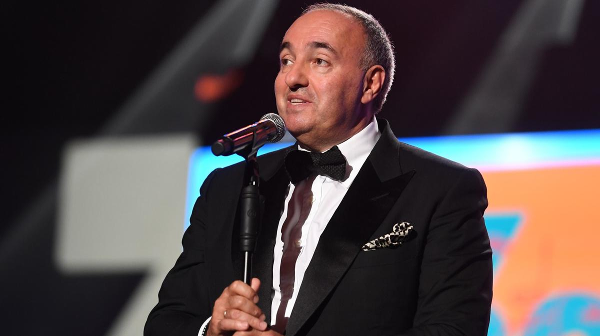

# «Спецоперация» пришла в кинематограф. Министр обороны РФ потребовал запретить в России продюсера Александра Роднянского и фильмы с Владимиром Зеленским

- **URL:** https://novayagazeta.ru/articles/2022/03/17/shoigu-ego-shoigu
- **Дата:** 2022-03-17
- **Автор:** Лариса Малюкова

## «Спецоперация» пришла в кинематограф

## Министр обороны РФ потребовал запретить в России продюсера Александра Роднянского и фильмы с Владимиром Зеленским

Режиссер, продюсер и медиа-менеджер Александр Роднянский. Фото: РИА НовостиФотографию письма Шойгу на имя министра культуры РФ Ольги Любимовой опубликовало издание The Insider (издание внесено Минюстом в реестр СМИ, выполняющих функции иноагента).

В письме министра обороны сказано, что «в рамках проведения специальной военной операции реализуются мероприятия по формированию позитивного общественного мнения в поддержку руководства страны и действий Вооруженных сил РФ. Вместе с тем в культурном секторе российского медиапространства продолжаются показы фильмов и телепередач с участием В.А. Зеленского, а также реализация творческих проектов крупного украинского медиаменеджера А.Е. Роднянского».

Письмо Сергея Шойгу, отправленное на имя министра культуры Ольги Любимовой

«Популяризация указанных лиц в текущих условиях не способствует выполнению решений, принятых руководством страны и Минобороны России», — так завершает свое письмо министр обороны, который в разгар «спецоперации» нашел время для призыва: «проработать вопрос об исключении В.А. Зеленского и А.Е. Роднянского из культурной повестки Российской Федерации».

Как именно будут исключать Роднянского и Зеленского из повестки, не сказано.

Поддержите нашу работу!

1000 500 300 Нажимая кнопку «Стать соучастником», я принимаю условия и подтверждаю свое гражданство РФ

Если у вас есть вопросы, пишите [email protected] или звоните:+7 (929) 612-03-68

Но нетрудно догадаться, что фильмы и сериалы с их участием будут изыматься из репертуара кинотеатров и платформ. Придется изъять любимейший народом сериал «Сваты», произведенный компанией Зеленского.

Александр Роднянский — продюсер с мировым именем. Один из самых известных российских кинематографистов. Известный режиссер документального кино и обладатель множества наград, стал в свое время основателем телеканала «1+1», затем успешно возглавлял корпорацию «СТС Медиа» в ее лучшие годы. Роднянский — четырехкратный номинант на премию «Оскар». Многократный призер Каннского кинофестиваля. Трехкратный лауреат премии Российской академии кинематографических искусств «Ника», четырехкратный лауреат премии российской академии кинематографических искусств «Золотой орел» , лауреат 15 премий Академии российского телевидения «ТЭФИ». В его фильмографии такие яркие и такие разные картины, как «Солнце» Сокурова, «Водитель для Веры» Чухрая, «9 рота», «Обитаемый остров» и «Сталинград» Бондарчука, «Я тебя люблю» Костомарова и Расторгуева, «Левиафан» и «Нелюбовь» Звягинцева, «Питер FM» Бычковой, «Дылда» Балагова, «Разжимая кулаки» Коваленко.

На недавно прошедшем Берлинале Родянский в интервью журналу Variety рассказал о будущих проектах его кинокомпании AR Content. Среди них — международный проект под рабочим названием «Допрос президента» (Debriefing the President) — сериал по книге «Выслушивая президента: допрос Саддама Хусейна» бывшего аналитика ЦРУ Джона Никсона. Режиссер — оскаровский номинант Зиад Дуэри. Начата работа над сериалом «Псоглавцы» по мотивам одноименного романа Алексея Иванова. Главный герой — историк-домосед, предпочитающий стабильность переменам, — вынужден отправиться в отдаленную деревню на поиски своей пропавшей девушки. Ее исчезновение оказывается звеном в череде таинственных событий, начавшихся в XVII веке вокруг загадочной фрески с изображением Псоглавца.

Задуман также фильм «Светлое будущее». Его действие разворачивается в 2050-м. Пока в мире бушует мутирующий вирус, в Санкт-Петербурге проводится масштабный эксперимент — создание пространства абсолютной санитарной безопасности.

Фото: РИА Новости

Александр Роднянский — генеральный продюсер главного национального фестиваля «Кинотавр», у которого реноме открывателя: новых имен, тенденций. Например, возникновение «новых тихих» в начале нулевых: когда появились фильмы Германа-младшего, Хлебникова, Попогребского, Хомерики, Волошина. «Кинотавр» — место сборки российского кино, его кардиограмма. На этой площадке можно встретить всех игроков индустрии, творцов авторского кино и коммерческого, мастеров и дебютантов, делающих первые шаги в профессии. Здесь завязываются профессионально-дружеские связи, замышляются новые проекты, формируются тренды и тенденции.

И вот сейчас жертвой «спецоперации» может стать и этот киносмотр.

Роднянский — уроженец Киева. На своей странице в инстаграме он неоднократно выступает с пацифистскими заявлениями: «Представить, что мой родной город, где живут мои близкие, мои друзья, родственники и знакомые, где похоронены мои родители, дедушки и бабушки, бомбят ракеты страны, в которой я прожил 20 лет, на языке которой я говорю с первого года жизни, где тоже живут мои друзья и близкие, я не мог… Вчера в потрясении я написал, что скорблю и плачу. Сегодня я скажу, что я знаю, что украинцы выстоят. Нежные и мужественные люди выстоят. Потому что они бьются за свою землю».

После публикации письма Шойгу в The Insider Александр Роднянский сказал: «Если эта информация подтвердится, на моей деятельности это никак не отразится. Я ни при каких обстоятельствах не собираюсь пользоваться деньгами российского государства».

Поддержите нашу работу!

1000 500 300 Нажимая кнопку «Стать соучастником», я принимаю условия и подтверждаю свое гражданство РФ

Если у вас есть вопросы, пишите [email protected] или звоните:+7 (929) 612-03-68
