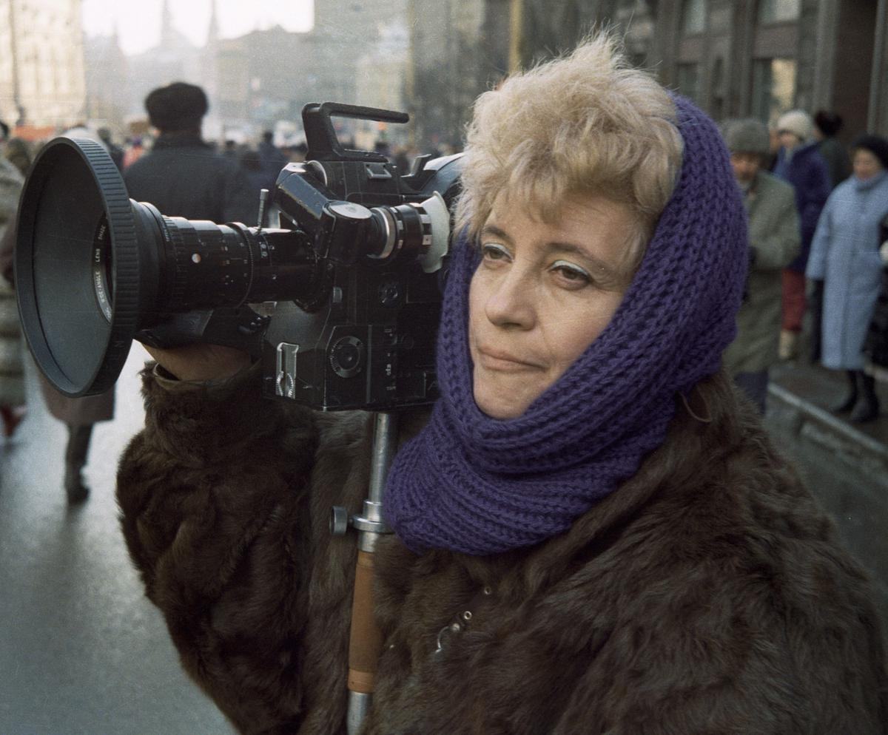

# Горький вкус свободы. Прощание с Мариной Голдовской — легендарным автором документального кино

- **URL:** https://novayagazeta.ru/articles/2022/03/21/gorkii-vkus-svobody
- **Дата:** 2022-03-21
- **Автор:** Лариса Малюкова

## Горький вкус свободы

## Прощание с Мариной Голдовской — легендарным автором документального кино

Марина Голдовская. Фото: РИА Новости

В детстве она видела Вертова, для документалиста примерно то же самое, что для актера увидеть живого Станиславского. Потом сама Марина стала легендой мирового документального кинематографа. Более 90 киноработ. Метод наблюдения» по Голдовской — создание кинодрамы из материала самой жизни, «путешествие в человека». Гигантская фильмография, в которой история страны, ее прозрения и травмы.

В ее картинах — антарктическая экспедиция и Московская Олимпиада. Просыпающееся самосознание человека («Архангельский мужик»), ветер перемен и сами перемены («Вкус свободы», «Повезло родиться в России», «Дети Ивана Кузьмича», «Князь», «Осколки зеркала»), возвращение к подлинной истории («Власть Соловецкая»).

А начинала с революционной для своего времени «Ткачихи», которую сняла с сокурсником Никитой Хубовым в 1968-м. Увидев эту неприкрашенную жизнь, начальство взбесилось. Приказало фильм смыть. Чудом Голдовская сберегла минут тридцать.

Говорила мне, что

за 25 лет при советской власти и 23 года постсоветского времени не сделала ни одной картины, которую не хотела бы делать. Ни одной!

Урок нынешним режиссерам. Начинающим и мастеровитым. В галерее ее замечательных кинопортретов — от стеклодувов, нефтяников до именитых мастеров культуры (Завадского, Ефремова, Ульянова, Аркадия Райкина) есть один отдельный, быть может, самый важный для режиссера. Кино про Анну Политковскую.

Поддержите нашу работу!

1000 500 300 Нажимая кнопку «Стать соучастником», я принимаю условия и подтверждаю свое гражданство РФ

Если у вас есть вопросы, пишите [email protected] или звоните:+7 (929) 612-03-68

Марина Евсеевна говорила мне, что Анна ее «как-то деятельно вдохновила», она впервые ощутила вкус к социальному кино.

В перестроечном 1991-м она решила рассказать о семье так, чтобы в «семейной истории» отразились бы перемены в головах людей. Так она начала снимать кино «Горький вкус свободы». Подружились с Анной. Тогда студенткой журфака, мечтающей о профессии. Главная тайна фильма: как на наших глазах меняется героиня. Как в нее просачивается боль других: беженцев, матерей, потерявших сыновей, — всех, кто пострадал от чеченской кампании. В этой картине Анна Политковская — не ожесточенный борьбой журналист. Напротив — светлая, красивая, женственная, смешливая, кокетливая, миролюбивая, чистосердечная. Такая, какой мы ее знали.

Во «Вкусе свободы» — ток перестроечной эйфории. После Аниной гибели появилась совсем другая интонация, другое настроение. «Горький вкус свободы» — картина о несбывшихся чаяниях.

Марина ее спрашивала: «Аня, вам не страшно ездить в Чечню, вас ведь арестовывали?» — «Когда работаешь — не страшно. Приезжаешь сюда — ой-ой-ой, неужели это было?»

Голдовская рассказала о мирном человеке, оказавшемся на передовой для того, чтобы объяснить нам, что это за война.

А еще режиссер Голдовская нащупала какую-то болезненную точку в нашей истории, которая волчком вертится на одном месте. Она знала, что мрачные репортажи Анны Политковской читать трудно. И постепенно у многих, уставших читать, узнавать про безысходную военную драму, подспудно накапливалась неприязнь к автору, их удручающему: ну сколько можно про одно и то же! «Значит, если ничего не меняется, надо молчать?» — спрашивала нас ее героиня. «Вы не сдвинетесь с этой мертвой точки, если будете молчать, игнорируя боль других», — утверждала автор фильма.

Марина говорила, что судьба каждого из ее героев — кусок ее жизни. Не умела их не любить. Но как бы она ни относилась к своим героям, к историям, рассказанным на экране, на первом плане ее кино была правда.

Сын Марины Голдовской, известный режиссер Сергей Ливнев и продюсер картины «Горький вкус свободы» Малькольм Дикселиус решили отдать права на этот самый важный фильм режиссера «Новой газете».
