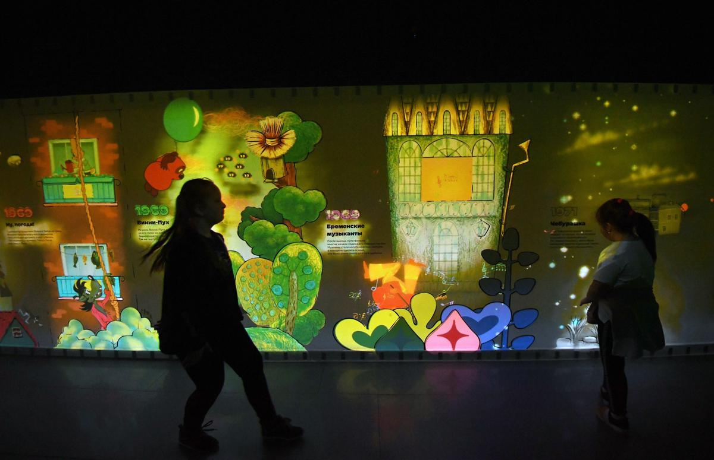

# Как дышать в аквариуме. Вопрос «Легко ли сегодня быть молодым художником в России?» уже не стоит. Ответ ясен. Что сегодня волнует молодых режиссеров в первую очередь

- **URL:** https://novayagazeta.ru/articles/2022/03/23/kak-dyshat-v-akvariume
- **Дата:** 2022-03-23
- **Автор:** Лариса Малюкова

## Как дышать в аквариуме

## Вопрос «Легко ли сегодня быть молодым художником в России?» уже не стоит. Ответ ясен. Что сегодня волнует молодых режиссеров в первую очередь

Единственное крепкое сообщество в нашей разноликой, разорванной, а сегодня еще и израненной киноиндустрии — анимационное. Пожалуй, лишь в нем сохранилось чувство локтя, солидарности, великодушия, взаимопомощи. Письмо против проведения «спецоперации» подписало около 1000 профессионалов. То есть едва ли не все художники, режиссеры, аниматоры, сценаристы, продюсеры. Не без исключений, разумеется, но вот эта сплоченность в каком-то смысле оказалась «охранной грамотой», очень сложно составлять черные списки «национал-предателей», как в игровом кино. Придется отменить мультипликацию вовсе. Цитируя нашего министра обороны, предложившего «изъять из культурного пространства» фильмы Норштейна и Шварцмана, популярнейшие сериалы, изумительное авторское анимакино. Ну начните, например, с Чебурашки. Посмотрим, что скажут дети.

Фото: РИА Новости

Обычно в марте проходит анимационный фестиваль в Суздале. Некогда дружный, веселый. Очень любимый. Под балалайку замечательного белорусского режиссера Михаила Тумели, никак не мешавшего деловым событиям. В этом году смотр оказался тихим, печальным. Многие не приехали. В том числе Тумеля. Сообщество вдруг резко поредело: талантливые аниматоры уезжают целыми отрядами: в Армению, Грузию, Шри-Ланку. А в небывало интересной, обширной программе самой запоминающейся оказалась секция студенческих работ, созданных еще до… Их было так много, что в конкурс взяли лишь часть фильмов, и информационная программа несильно уступала конкурсной. В другое время можно было бы порадоваться, что пришло поколение, за которым будущее. Но когда будущее на глазах схлопывается, как-то не до радости.

Захотелось выслушать молодых авторов уникальных работ. Что они думают? На что надеются?

Лариса Малюкова

### Варя Яковлева

Автор фестивального хита пронзительного анимадока «Жизнь-паскуда» — трагической истории бомжа, домом которого стала скамейка железнодорожной платформы. Люди равнодушно проходят-спешат, а бомж замер под тряпьем… Что с ним случилось? Жив ли? Куда не доехал?

Варя Яковлева. Фото: Марина Сычева

Ни думать, ни читать, ни рисовать — сил нет. Мы будто в коллективном сне оказались.

Если переводить в слова свои ощущения — то это внутренняя катастрофа, личностная, профессиональная, общенациональная. Когда в 2014-м произошли события на Донбассе, помню, как я переживала. Но после 24 февраля просто впала в анабиоз. Раздавили меня даже не трагические новости о «спецоперации», а вот это <…>, насилие <…>. Страшно, что эту позицию искренне разделяют многие образованные люди, люди с духовным саном. Осознание этого не оставляет мне воздуха. Не понимаю, как существовать среди того, что всегда было родным. Вместе с тем я пришла к выводу, что я патриот, потому что мне невыносимо больно за мою страну. Что раскол внутри страны меня уничтожает. Страшно за всех нас. За будущее. Я всем сердцем сочувствую украинцам. И крайне трудно признаться себе, что после этой катастрофической ситуации они пойдут вперед, чувствуя внутреннюю правду. А мы? Разваливаемся на куски. Наше правительство не слышит и не хочет слышать голоса интеллигенции.

В анимацию пришло поколение талантливых авторов. И вот каждый оказался перед сложным выбором.

Я вижу, что у многих осталась собранность, сила продолжать заниматься профессией. Но больше тех, кто рефлексирует и разрушен.

Либо ты остаешься в России и продолжаешь работать так, как работали наши предшественники в Советском Союзе, когда при тотальной цензуре они умудрялись создавать прекрасные произведения. Либо ты уезжаешь. Ныряешь в чужую жизнь, пытаешься стать в ней своей. Прирастить чужую кожу. И нет правильного пути.

Мы существуем на деньги государства, хотя не принимаю эти попреки сверху — мы же платим налоги. Но за границей подобной поддержки ждать не приходится. И в жесткой системе грантов русским художникам будет значительно сложней получить финансирование. Надо набраться духу и сделать ответственный выбор — вдруг Вселенная откликнется.

### Вася Чирков

Его «Белый, белый день» — чудесный живописный фильм об огромности мира во всей его красоте и тишине. Сегодня эту картину, в которой белый свет оставляет след на воде вместе с жуком-водомеркой, дрожит вместе с листьями под дождем, звучит в лягушачьем хоре и крике младенца, — смотреть просто больно.

Вася Чирков. Фото: Марина Сычева

Шесть лет я снимал этот фильм. Мне хотелось рассказать про норму человеческой жизни. Про то, как лист, оторвавшись от ветки, ищет землю, про дождь, про тайну рождения, про необязательные и очень хрупкие вещи, из которых жизнь и состоит. В фильме нет отрицательных персонажей, и это важно для меня. Существуют простые драматургические конструкции, в которых есть злодей и герой, белое побеждает черное, но это не более чем аттракцион. Мне хотелось создать пространство, в котором есть сочувствие ко всему живому. Чтобы ребенок, который смотрит этот фильм, чувствовал, что мир открыт и безопасен, и рос в этом ощущении. Когда автор или общество начинает говорить о великих идеях, теряется что-то самое ценное, и прежде всего — человечность. Возникает иллюзия смысла там, где его нет. С другой стороны, есть вещи, которые кажутся бесполезными. Например, красота. Но дело в том, что красота созидательна сама по себе.

Мы много общаемся с совсем юными ребятами. Им сложно понять, что происходит. Не хватает опыта, какой-то опоры. Поэтому на занятиях стараемся говорить с ними о вещах, которые не меняются. На днях ходил в Пушкинский музей, смотрел на работы Кандинского, и это были минуты нормальности. Думаю, вернуться туда вместе со студентами.

Я до последнего момента не был уверен, стоит ли ехать на фестиваль в этом году. Но приехав, увидел здесь стольких прекрасных, переживающих, думающих людей. И еще были замечательные, честные фильмы, за которые я очень благодарен их авторам.

Искусство вообще помогает справиться с потрясениями — и личными, и социальными.

Я сейчас перечитываю Пастернака. В его ранних стихах сложная архитектура, метафорический язык. А к концу жизни вроде бы про грибы, овраги, снег, солнце, которое разлито по земле. Он был вынужден писать, преодолевая сильнейшие ограничения. При этом он работал над собой, искал смыслы и очищал форму. Это монашеский путь, это путь сильного человека.

Поддержите нашу работу!

1000 500 300 Нажимая кнопку «Стать соучастником», я принимаю условия и подтверждаю свое гражданство РФ

Если у вас есть вопросы, пишите [email protected] или звоните:+7 (929) 612-03-68

### Маша Коган-Лернер

Фильм «За забором» о жительнице ПНИ Ире, спецприз прошлогоднего Суздальского смотра и целая коллекция фестивальных наград. Все в том фильме из проволоки. И сама Ира, и ее кровать, и таблетки, и кем-то изъеденная зубная щетка, и вода для чая из горячего крана. Каждый день из проволоки. Точно выбранная технология как воплощение «зазаборной» жизни пробуждает острую эмпатию.

Маша Коган-Лернер. Фото: Марина Сычева

Я ищу выход, но все так жутко и непонятно, кругом тупик. Выбранная для запуска еще в мирные времена тема — «Дети в карантине» — сейчас требует коренных изменений. Другая жизнь. Карантин уже кажется драматическим, но вместе с тем прекрасным временем, когда можно строить планы, на что-то надеяться. А сейчас мы в воронке непреодолимого кошмара, кризиса, вины.

Недавно меня задержали за участие в мирном протесте, я подошла к полицейским, которые <…>, и сказала, что это проявление насилия и что это незаконно. Меня забрали в УВД. И я вспомнила, как ездила по фестивалям с фильмом «За забором» и повторяла перед показами: «Свободу людям по обе стороны забора!». Уже тогда ко мне подходили люди и говорили: «Маша, какая ты смелая» Что? Я же ничего героического или крамольного не сказала. Но с каждым днем разрастается страх, наращивается давление. Экстремистскими могут назвать самые простые и безобидные вещи. Например, вот это мое синее платье с желтым шарфом.

Первые дни этой начавшейся в феврале беды у меня был ступор: «Что говорить детям, как успокоить?» У меня их трое. Раньше в любой ситуации, когда что-то случалось сложное, страшное, я находила слова. Даже когда совсем недавно у меня умерла мама… В любой ситуации могла сказать им: не бойтесь, ничего, мы справимся. А сейчас искала и не могла найти… И все же я нащупала какую-то точку устойчивости, то единственное, что могу контролировать. И теперь я им все время сообщаю, что я их люблю. Что это неизменно, вне зависимости от того, что со мной происходит или что может произойти. Что моя любовь абсолютна, постоянна, безгранична. И это работает.

Читайте также

Спасти в себе человека

Беседа с Андреем Кураевым о добре и зле в эпоху столкновения с Украиной и миром

### Анна Любимцева

Ее «Мармелад» — вольного дизайна воздушная история абсурдистской любви. Девушка влюбляется в голубой Мармелад, пробирается внутрь него, плачет голубыми слезинками и даже мечтает выйти за него замуж. Сочетание сюра, юмора и нежности.

Анна Любимцева. Фото: Марина Сычева

Мне сложно говорить, приходится себя контролировать. Сейчас совсем непонятно, что можно говорить, а что нельзя, и из-за этого чувствую себя небезопасно. Но контролировать можно слова, сложнее с состоянием.

Пытаюсь нащупать какие-то психологические защитные механизмы. Представить, что нахожусь в аквариуме. И все, что происходит, — это снаружи аквариума. А мои чувства притуплены. Вроде бы понимаю, какие страшные, чудовищные вещи происходят… но как будто ничего не чувствую, срабатывает какая-то анестезия. Это очень совестно, понимаю, скольким людям сейчас плохо, какую боль они испытывают…

Люди, с которыми я работала, улетели в разные уголки мира. Близкие мне режиссеры, аниматоры исчезают из поля зрения. Я физически ощущаю эти пустоты, этот разлом.

Если в одно слово собрать мои эмоции, то это чувство скорби по прошлому, будто в один момент, одной черной ночью все убилось и раскололось. Хочется обратно собрать эту цветную мозаику, в которой просто мир. Друзья. Профессия. Пытаюсь делать это мысленно, обманывать себя, представляя, будто у меня нормальная жизнь.

Дышать и работать в аквариуме временами получается. Проблема в том, что когда я засыпаю, не контролирую свое бессознательное. И весь этот липкий кошмар, от которого прячешься, приходит во сне. Просыпаюсь уставшей, разбитой.

Мой новый фильм, который сейчас снимаю, — об отношениях, привязанности мужчины и женщины, запертых в домике. А снаружи, вокруг этого домика, живут дикие люди. Финал должен был быть трагичным, очень печальным. Недавно я его изменила, решила сделать хэппи-энд. С помощью искусства словно пытаюсь изменить саму траекторию реальности, вывести ее из ночи к светлому концу. Или к светлому началу.

### Катя Алдашина-Филиппова

Анимационное эссе — фильм на стихи Мандельштама «Квартира тиха, как бумага». Панорама по квартире поэта, словно только что вышедшего из комнаты: на минуту ли? или навсегда? За окном снег и мальчишка с санками. И отчего-то ощущение безвыходности, тисков, сжимающих и эту едва живую пишущую машинку, и ходики на стене, и черный телефон, «застывший лягушкой». Весь этот хрупкий живой мир.

Катя Алдашина-Филиппова. Фото: Марина Сычева

Пытаюсь не думать о происходящем. Получается не всегда. У меня ощущение, что мы все едем в поезде без машиниста. Стараюсь даже не смотреть в окно. Сидеть в своем купе и заниматься своим десятимесячным ребенком, преподаванием. Нам советуют не разговаривать на политические темы со студентами, пусть занимаются своими профессиональными делами. Пусть не смотрят в окно.

У меня в суздальском конкурсе маленький фильм на стихи Мандельштама про человека, который при внешней видимой свободе оказывается в тюрьме своей жизни. Заперт внутри домашнего ареста, в котором заперли его страну. Мы все внутри этой комнаты.

Этот фильм про внутреннюю тюрьму. И про возможность свободы внутри купе.

Я выбрала голос Михаила Ефремова, потому что переживаю за него. Представляю, как в один миг жизнь изменилась: свободный человек оказался в камере на долгих 8 лет. В тюрьме строгого режима. И там он микроскопом «забивает гвозди»: вставляет молнии в одежду. Знаю, что он виновен. И очень ему сочувствую. Воспринимаю его как родственника, попавшего в беду. А теперь еще ощущаю какую-то особенную связь с ним. Мы же все теперь под домашним арестом. А он — в двойном плену. Не знаю, что ему можно писать. Письма цензурируются, говорят, что они там слушают радио «Маруся». Я написала ему, чтобы он думал о том, что это все обязательно закончится. Я тоже хочу так думать. Желаю ему, чтобы каждый день он находил какую-нибудь отдушину. Что когда-нибудь он непременно увидит своих детей. Я и сама теперь стараюсь следовать этому совету. Делать маленькие хорошие дела, которые от меня зависят, помогать кому-нибудь. Искать отдушину.

Читайте также

«Спецоперация» пришла в кинематограф

Министр обороны РФ потребовал запретить в России продюсера Александра Роднянского и фильмы с Владимиром Зеленским

Поддержите нашу работу!

1000 500 300 Нажимая кнопку «Стать соучастником», я принимаю условия и подтверждаю свое гражданство РФ

Если у вас есть вопросы, пишите [email protected] или звоните:+7 (929) 612-03-68
